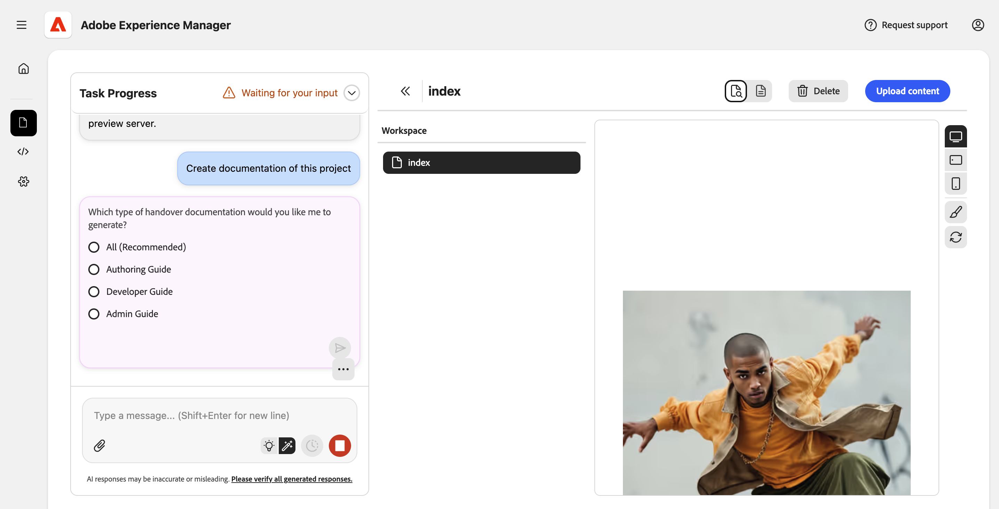
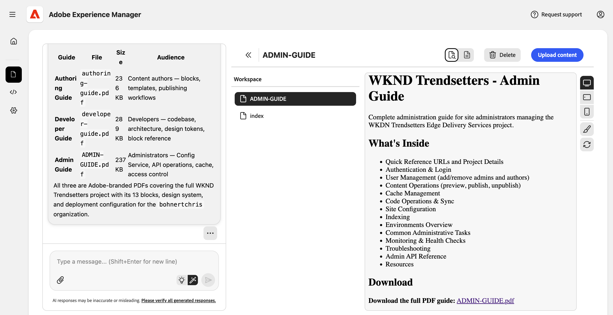
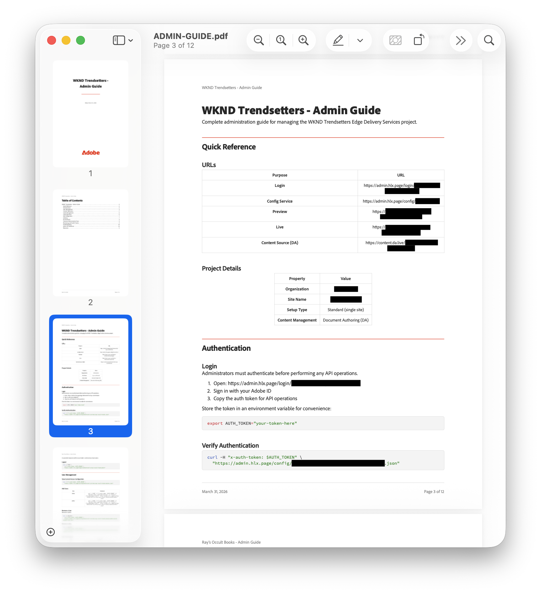

# 项目文档技能 {#project-documentation}

了解Experience现代化代理的文档技能如何帮助您加快项目交付。

## 加速项目移交 {#project-handovers}

[Experience Modernization Agent](/help/ai-in-aem/agents/brand-experience/modernization/overview.md)可以自动为AEM Edge Delivery Services项目生成项目文档指南，其功能：

* **项目演练** — 项目设置、结构和约定的说明，无需手动操作即可生成
* **模块和组件组织** — 清晰地记录块、模块和组件的组织方式以及它们彼此的关系
* **基于角色的指南** — 面向作者、开发人员和管理员的目标文档，因此每个团队成员都能获得所需的内容

这简化了AEM Edge Delivery Services项目的项目交付。

## 先决条件 {#prerequisites}

使用此技能之前请确保满足以下条件。

* 必须将您的项目签出到控制台中的工作区。
* 您必须对要为其创建文档的项目具有管理员权限。
* 控制台中必须允许代理权限。
   * 在控制台设置中选择选项&#x200B;**允许LLM代表我访问admin.hlx.page** [。](/help/ai-in-aem/agents/brand-experience/modernization/console.md#settings-view)
   * 如果未启用此选项，代理将根据可访问的代码库生成文档。

## 创建项目文档 {#creating-documentation}

满足先决条件后，您只需请求代理为项目创建文档即可。

1. 在聊天中，询问“创建此项目的文档”。
1. 如果代理要求提供项目的组织名称，请提供该名称。
1. 代理将询问您要创建哪个文档。 通常，您会选择&#x200B;**全部**。

   

1. 创建指南后，即会放置在您的工作区中。 选择一个可查看说明，然后单击链接以下载完整的PDF。

   已创建

您可以直接保存PDF以提供给您的团队，或将其作为分布式架构其余内容的一部分上传。

>[!NOTE]
>
>如果您无权访问Edge Delivery Services管理API，或者控制台设置中的选项&#x200B;**允许LLM代表我访问admin.hlx.page** [。](/help/ai-in-aem/agents/brand-experience/modernization/console.md#settings-view) 如果未启用，代理将基于其可访问的代码库生成文档。

## 疑难解答 {#troubleshooting}

以下是使用项目文档技能时遇到的常见错误消息以及如何解决它们。

### “访问被拒绝”或“未授权” {#unauthorized}

* **原因：**&#x200B;缺少管理员权限或未启用代理权限
* **解决方案：**
   1. 验证您是否具有项目的管理员访问权限
   1. 在控制台设置中选择选项&#x200B;**允许LLM代表我访问admin.hlx.page** [。](/help/ai-in-aem/agents/brand-experience/modernization/console.md#settings-view)

### “未找到项目” {#not-found}

* **原因：**&#x200B;未在工作区中签出存储库
* **解决方案：**
   1. 签出项目存储库
   1. 确保您在正确的工作区中

### “配置API错误” {#api-error}

* **原因：**&#x200B;无法访问Edge Delivery Services配置服务API
* **解决方案：**
   1. 在控制台设置中选择选项&#x200B;**允许LLM代表我访问admin.hlx.page** [。](/help/ai-in-aem/agents/brand-experience/modernization/console.md#settings-view)
   1. 检查您的网络/VPN连接
   1. 确认管理员对项目的访问权限
