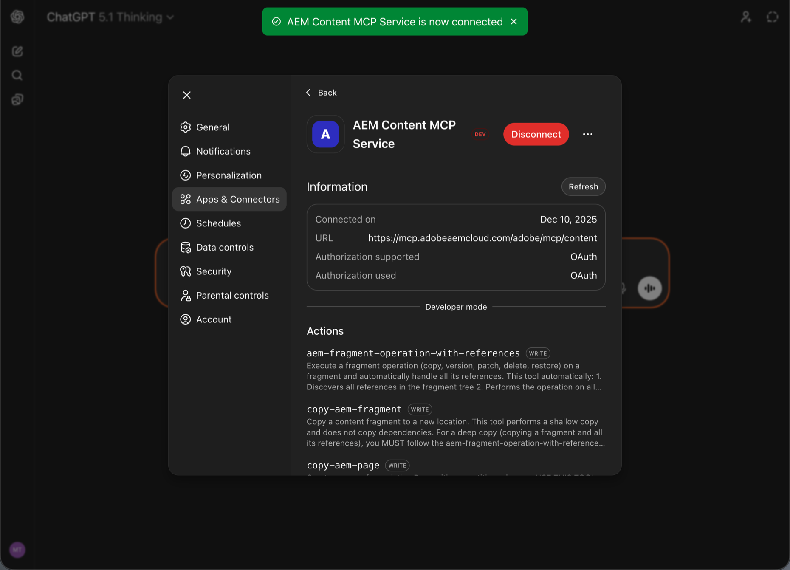
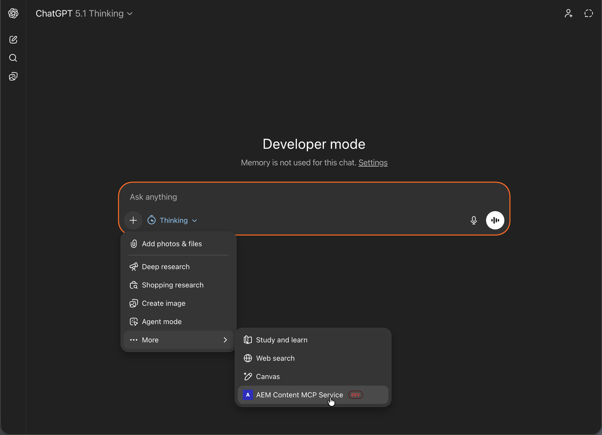

# 使用AEM MCP设置OpenAI ChatGPT {#setup-chatgpt}

按照以下步骤将OpenAI ChatGPT连接到AEM的MCP服务器。

* 在配置了MCP连接或工具的区域中添加一个或多个AEM MCP服务器URL。
* 在重定向时触发连接并使用Adobe ID登录。
* 在聊天中，在提示中引用配置的AEM工具，例如：

  ```
  "Using the configured AEM MCP tools, list all sites in the author environment."
  ```

>[!NOTE]
>
>OpenAI ChatGPT用户界面可能会发生更改，并且不是确定的。 这些说明用于说明目的。

1. 打开&#x200B;**设置**，以便访问配置MCP连接或工具的区域。

   

1. 在&#x200B;**应用和连接器**&#x200B;中，打开&#x200B;**高级设置**&#x200B;以管理连接器和与MCP相关的选项。

   

1. 在&#x200B;**应用和连接器**&#x200B;中启用&#x200B;**开发人员模式**，以便添加和配置自定义应用或连接器。

   

1. 启动&#x200B;**新建应用程序**（或等效控件）以为AEM MCP服务器添加应用程序条目。

   

1. 完成&#x200B;**新建应用程序**&#x200B;表单 — 例如，命名应用程序并输入AEM MCP服务器URL和任何其他必填字段 — 然后&#x200B;**保存**。

   

1. 确认&#x200B;**AEM内容MCP服务**（或您配置的应用程序）出现在&#x200B;**应用和连接器**&#x200B;中，以便ChatGPT能够使用它。

   

1. 在聊天中，编写提示以告知ChatGPT使用配置的&#x200B;**AEM工具**（例如，查询创作内容或网站）。

   
