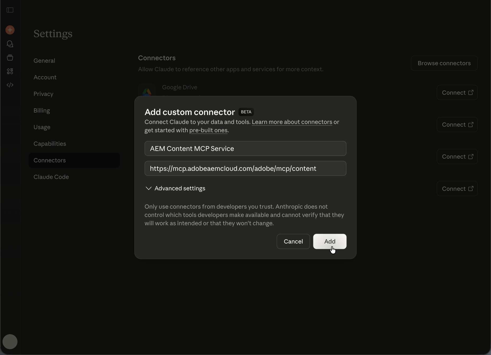
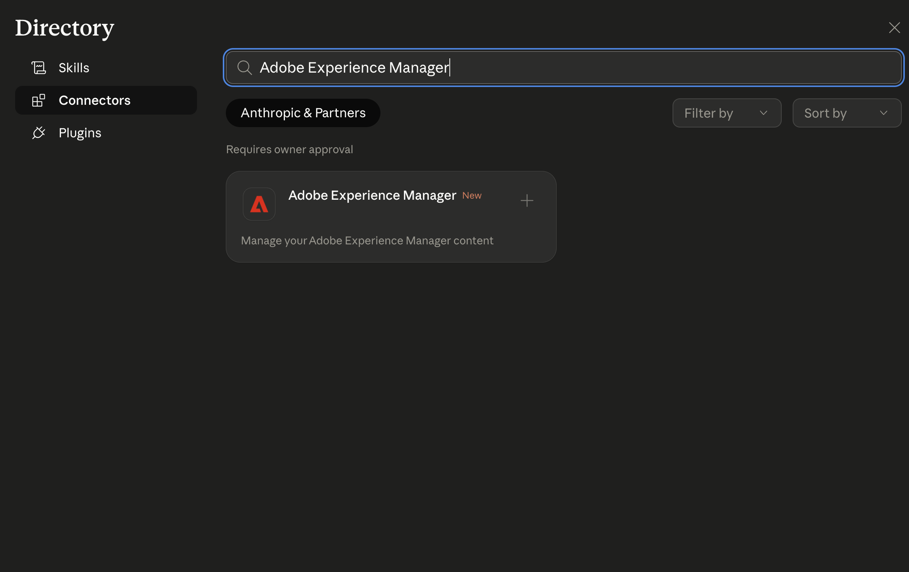

# 使用AEM MCP设置Anthropic Claude {#setup-claude}

按照以下步骤将Anthropic Claude连接到AEM的MCP服务器。

* 在Claude的MCP配置中，注册一个或多个AEM MCP服务器URL。
* 完成Adobe登录流程。
* （可选）在配置区域为某些工具启用自动确认。 建议将此选项用于搜索或只读操作。
* 在开始对话之前，请确保已选择MCP服务器。
* 要求Claude执行与AEM相关的任务。 Claude会根据您的提示选择MCP服务器公开的AEM Tools。

要为AEM MCP配置Claude，请执行以下步骤：

>[!NOTE]
>
>Claude用户界面可能会发生更改，并且不是确定的。 这些说明用于说明目的。

1. 打开Claude Web应用程序左下角的帐户菜单，然后选择&#x200B;**设置**&#x200B;以打开“设置”区域。

   已选择克劳德中的

1. 在设置侧边栏中，选择&#x200B;**连接器**。 在“连接器”页面上，选择&#x200B;**添加自定义连接器**&#x200B;以注册自定义MCP端点。

   在“使用添加自定义连接器的设置”中的

1. 在&#x200B;**添加自定义连接器**&#x200B;对话框中，输入显示名称（例如&#x200B;**AEM Content MCP服务**）和您的AEM MCP服务器URL，然后选择&#x200B;**添加**。 仅在部署需要额外选项时才使用&#x200B;**高级设置**。

   

1. 在连接器列表中，找到您的自定义连接器条目（它显示&#x200B;**CUSTOM**&#x200B;标签），然后选择&#x200B;**连接**&#x200B;以登录并将连接器链接到您的Claude帐户。

   已为AEM内容MCP服务选择Connect的

1. 当连接器及其URL出现在列表中时，选择&#x200B;**AEM内容MCP服务**&#x200B;旁边的&#x200B;**配置**&#x200B;以打开连接器详细信息并继续设置。

   已为AEM内容MCP服务选择配置了

1. 在&#x200B;**工具权限**&#x200B;页面上，查看默认值（例如，**需要审批**），然后将每个AEM工具设置为&#x200B;**始终允许**、**请求权限**&#x200B;或&#x200B;**根据您的安全策略，从不允许**。

   AEM内容MCP服务的

1. 打开对话。 选择消息字段左侧的工具和模型菜单（滑块图标），在Connectors下启用&#x200B;**AEM内容MCP服务**，然后输入提示，以便Claude能够使用该聊天的MCP工具。

   

## Adobe Experience Manager Claude连接器 {#aem-claude-connector}

要安装&#x200B;**Adobe Experience Manager Claude连接器**，请在Claude中打开&#x200B;**设置** > **连接器**。 您还可以直接在[https://claude.ai/settings/connectors](https://claude.ai/settings/connectors)上打开Connectors页面。 连接器注册一个MCP服务器，该服务器会公开一组日益增加的AEM工作流工具。

