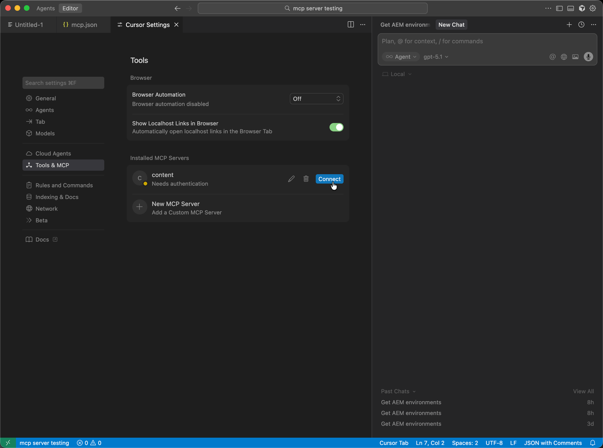

# 使用AEM MCP设置光标 {#setup-cursor}

按照以下步骤将Cursor连接到AEM的MCP服务器。

* 在Cursor的MCP设置中，创建一个新的MCP服务器条目，其中包含一个或多个AEM MCP URL。
* 出现提示时，使用您的Adobe ID进行身份验证。
* （可选）通过单击工具名称启用或禁用单个工具。 默认情况下，所有工具都处于启用状态。
* 使用光标的编辑器或聊天工具在开发或内容工作流中调用AEM工具。

>[!NOTE]
>
>Cursor用户界面可能会发生更改并且不是最终的。 这些说明用于说明目的。

1. 打开&#x200B;**游标设置**，以便您可以配置游标如何连接到MCP服务器。

   

1. 打开&#x200B;**工具和MCP**，然后选择&#x200B;**添加自定义MCP**&#x200B;以启动自定义MCP服务器条目。

   

1. 在自定义MCP服务器窗体上，输入&#x200B;**名称**、您的AEM MCP **URL**（或URL）和任何其他必填字段，然后&#x200B;**保存**。

   

1. 出现连接对话框时，按&#x200B;**连接**&#x200B;完成登录，以便新MCP服务器获得授权。

   

1. 在&#x200B;**聊天**&#x200B;或编辑器中，编写调用&#x200B;**AEM工具**&#x200B;的提示，以便配置的MCP服务器参与您的工作流。

   
