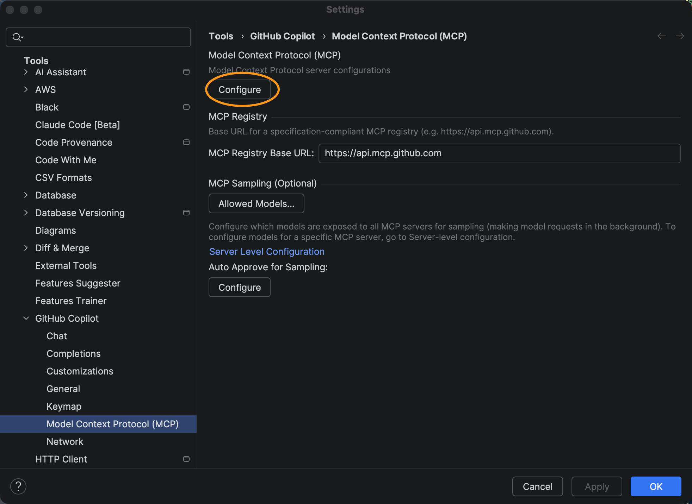
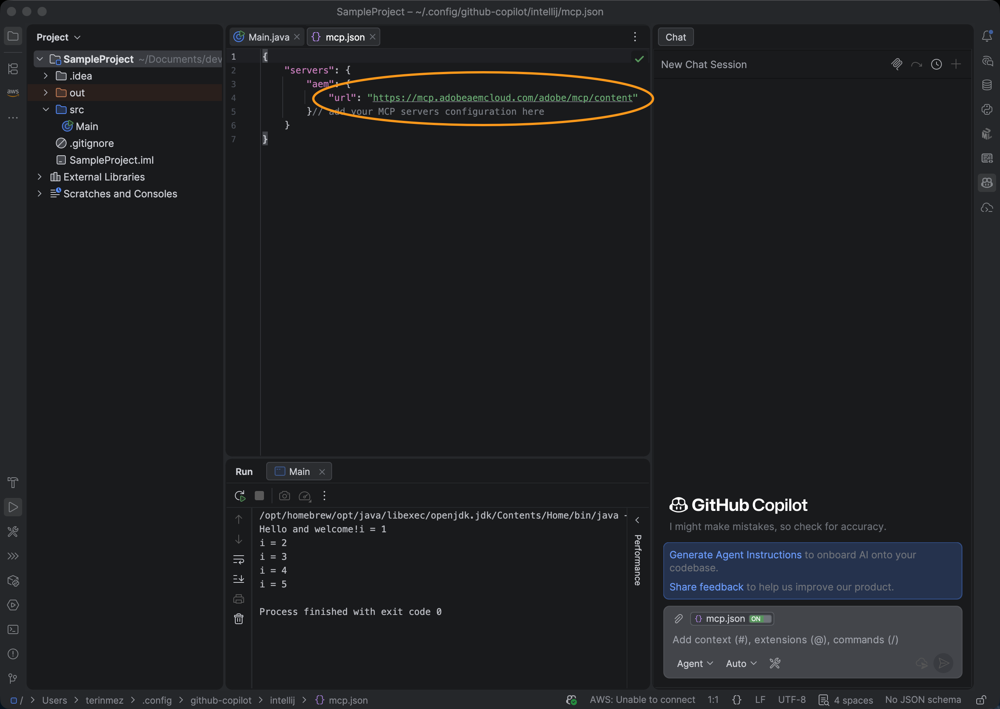

# 使用GitHub Copilot和AEM MCP设置JetBrains {#setup-jetbrains-copilot}

按照以下步骤在JetBrains IDE（例如IntelliJ IDEA、WebStorm或PyCharm）中将GitHub Copilot连接到AEM的MCP服务器。

1. 单击编辑器右侧的&#x200B;**GitHub Copilot Chat**&#x200B;图标，在JetBrains IDE中打开GitHub Copilot Chat。

   

1. 单击Copilot Chat面板中的&#x200B;**设置**&#x200B;图标以打开MCP配置。

   

1. 在&#x200B;**设置**&#x200B;中，导航到&#x200B;**工具> GitHub Copilot >模型上下文协议(MCP)**，然后单击&#x200B;**配置**&#x200B;以打开`mcp.json`配置文件。

   

1. 向`mcp.json`文件添加一个或多个AEM MCP服务器URL。 例如：

   ```json
   {
     "servers": {
       "aem": {
         "url": "https://mcp.adobeaemcloud.com/adobe/mcp/content"
       }
     }
   }
   ```


   


1. 保存该文件。GitHub Copilot自动检测新的服务器配置并显示&#x200B;**启动**&#x200B;操作。

   

1. 单击&#x200B;**开始**&#x200B;操作，然后在出现提示时，使用您的Adobe ID登录以完成身份验证流程。

1. 您可以通过单击Copilot Chat面板中显示的&#x200B;**tools**&#x200B;指示器来查看和管理发现的工具。 （可选）启用或禁用单个工具。


   

1. 使用GitHub Copilot Chat在开发或内容工作流中调用AEM工具。