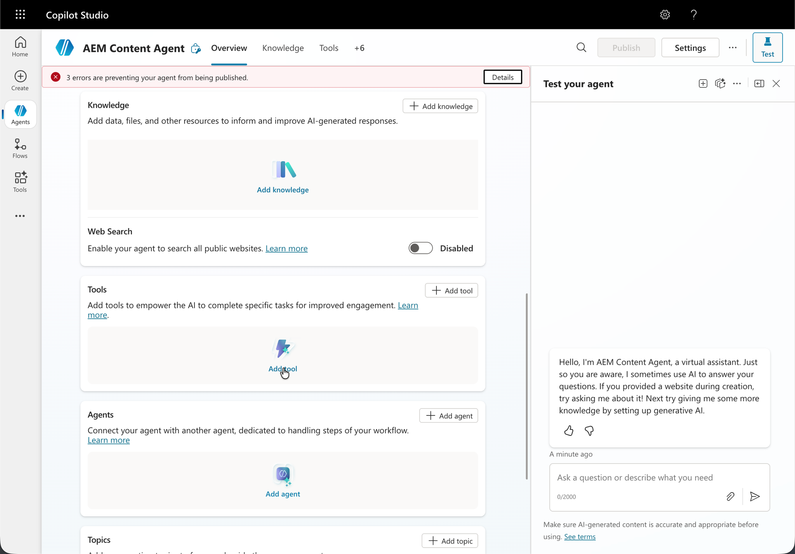
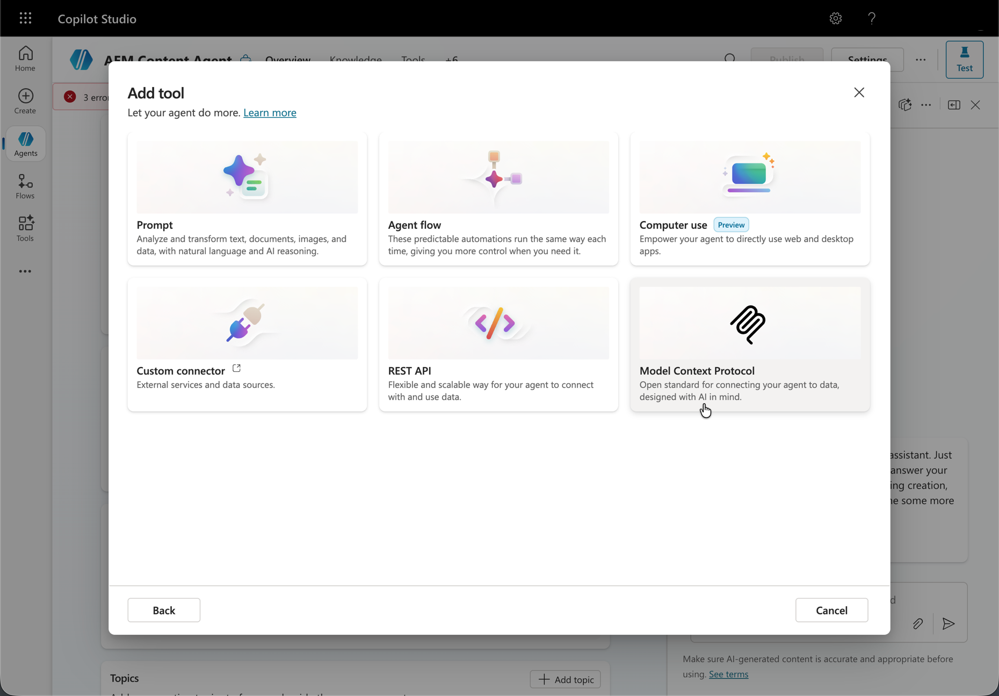
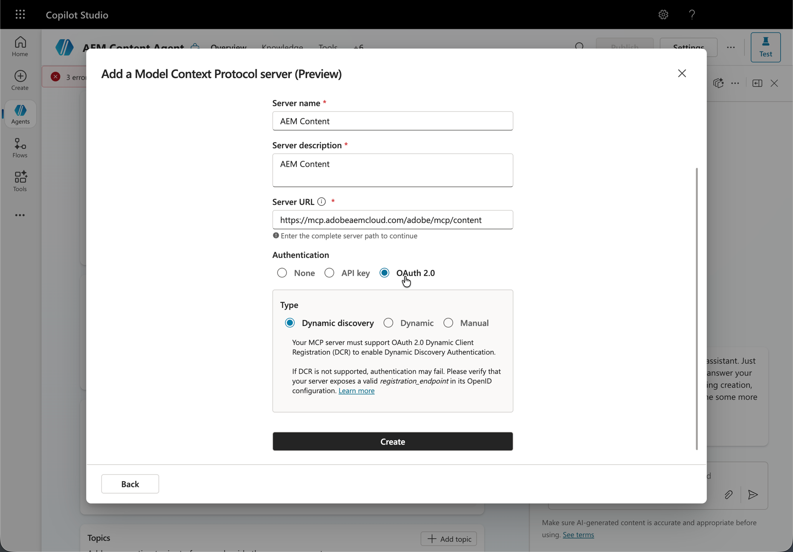
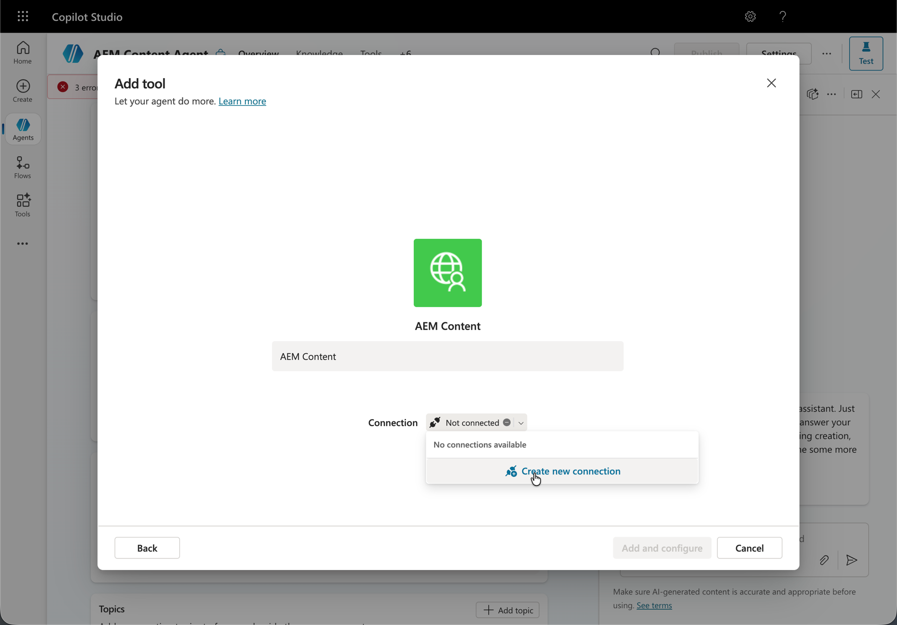
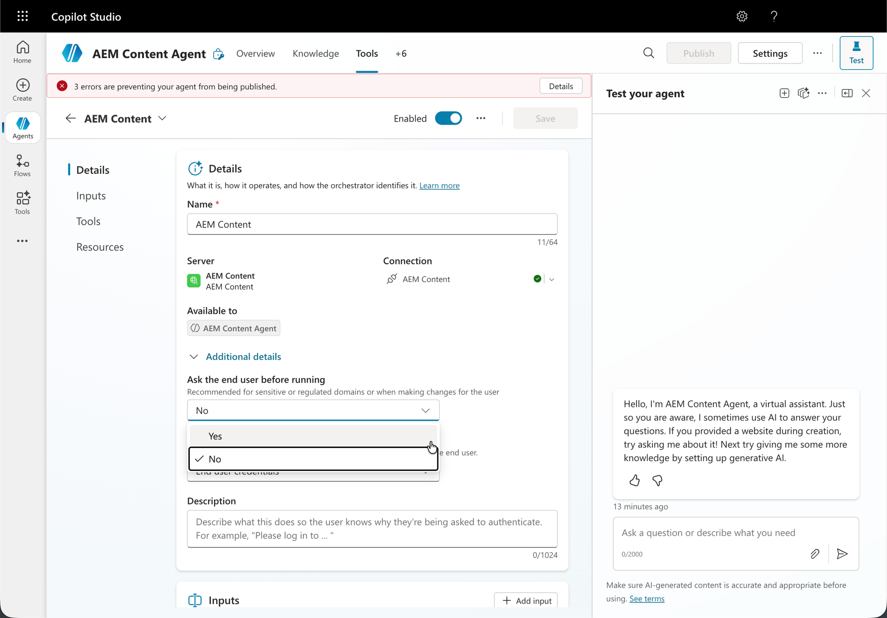
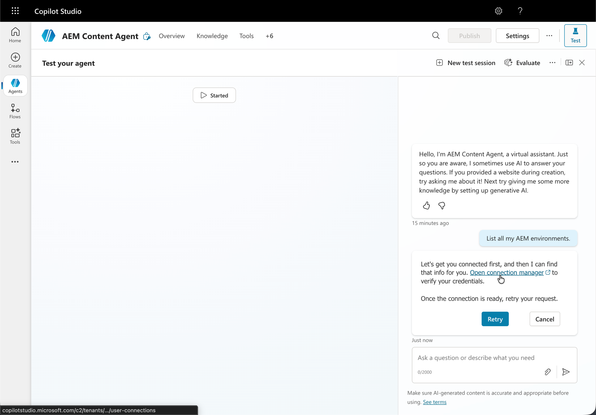
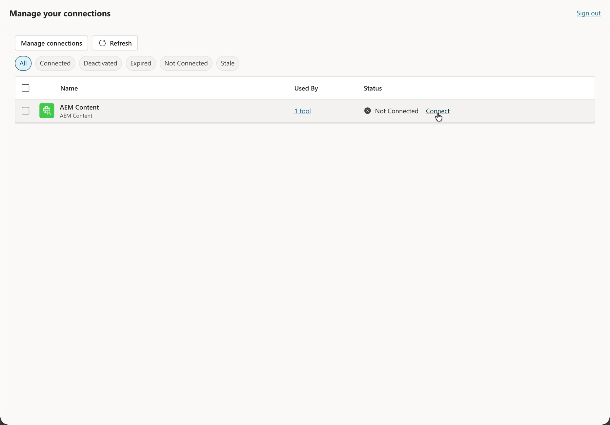
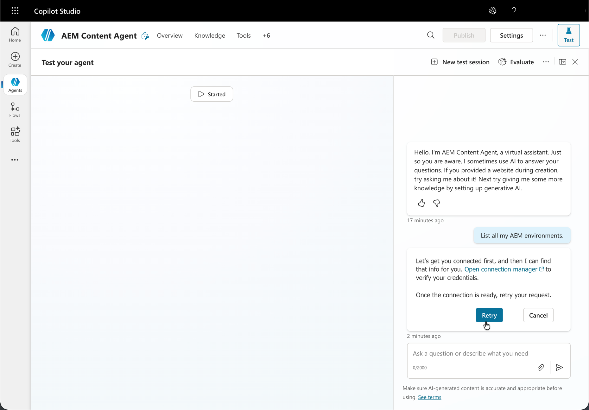

# 使用AEM MCP设置Microsoft Copilot Studio {#setup-microsoft-copilot-studio}

按照以下步骤将Microsoft Copilot Studio连接到AEM的MCP服务器。

>[!NOTE]
>
>Microsoft Copilot Studio用户界面可能会发生更改，并且不是最终版本。 这些说明用于说明目的。

1. 在&#x200B;**代理**&#x200B;中，启动流程以添加将使用AEM MCP工具的代理。

   * 创建新代理。

   

1. 打开该代理的工具区域，以便您可以注册它调用外部功能的方式。

   * 导航到工具部分，然后单击&#x200B;**添加工具**。

   

1. 决定是重新使用现有的集成，还是定义一个新的MCP支持的工具。

   * 选择现有工具或创建新工具。

   

1. 创建新的MCP工具时，请继续执行&#x200B;**模型上下文协议**&#x200B;服务器步骤，包括出现时的预览模式。

   * 配置指向一个或多个AEM MCP服务器&#x200B;**URL**&#x200B;的新MCP工具。

   

1. 定义代理如何访问此MCP端点，包括访问是共享还是专用。

   * 建立连接，该连接可以在代理之间&#x200B;**共享**&#x200B;或&#x200B;**专用**。

   

1. 在&#x200B;**添加和配置**&#x200B;上，提供或确认MCP工具详细信息，以便代理能够访问您的AEM环境。

   

1. 完成MCP工具表单上的字段（例如，服务器&#x200B;**URL**&#x200B;和与身份验证相关的选项）。

   * （可选）启用&#x200B;**自动确认模式**&#x200B;或要求对所有工具交互进行&#x200B;**最终用户确认**。

   

1. 验证与MCP服务器的连接；当Copilot Studio将您重定向时，完成基于浏览器的登录。

   * 重定向后使用您的&#x200B;**Adobe ID**&#x200B;登录。

   

1. 运行测试之前，请打开&#x200B;**管理连接**（或&#x200B;**连接管理器**），并为您的会话分配正确的连接。

   * 测试代理时，请先打开&#x200B;**连接管理器**&#x200B;以向会话分配连接。

   

1. 在测试体验中，针对AEM MCP连接运行代理。

   * 测试代理时，请在&#x200B;**连接管理器**&#x200B;中分配连接后按&#x200B;**重试**。

   
