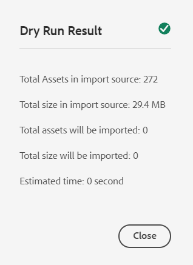
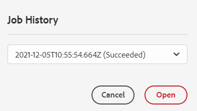

# 将数字资产添加到 [!DNL Adobe Experience Manager] as a [!DNL Cloud Service] [!DNL Assets] {#add-assets-to-experience-manager}

[!DNL Adobe Experience Manager Assets] 接受来自多种来源的多种类型的数字资产。 它可以存储二进制文件和创建的演绎版，并可以使用各种工作流和 [!DNL Adobe Sensei] 服务，允许通过多个渠道在多个表面之间分发。

[!DNL Adobe Experience Manager] 通过丰富的元数据、智能标记、演绎版和其他数字资产管理(DAM)服务，丰富了上传数字文件的二进制内容。 您可以从本地文件夹或网络驱动器将各种类型的文件（如图像、文档和原始图像文件）上载到 [!DNL Experience Manager Assets].

除了最常用的浏览器上传之外，还有其他将资产添加到 [!DNL Experience Manager] 存在存储库，包括桌面客户端，如Adobe资产链接或 [!DNL Experience Manager] 桌面应用程序、上传和摄取脚本，以及自动摄取集成添加为 [!DNL Experience Manager] 扩展。

同时，您可以在 [!DNL Experience Manager]，最常用的文件格式支持其他服务，如元数据提取或预览/呈现版本生成。 请参阅 [支持的文件格式](file-format-support.md) 以了解详细信息。

您还可以选择对上传的资产进行其他处理。 可以在上传资产的文件夹上配置多个资产处理配置文件，以添加特定元数据、演绎版或图像处理服务。 请参阅 [上传后会处理资产](#process-when-uploaded).

[!DNL Assets] 提供了以下上传方法。 Adobe建议您在使用上传选项之前先了解其用例和适用性。

| 上传方法 | 何时使用? | 主要角色 |
|---------------------|----------------|-----------------|
| [资产控制台用户界面](#upload-assets) | 偶尔上传、轻松按下和拖动、查找器上传。 请勿上传大量资产。 | 所有用户 |
| [上传API](#upload-using-apis) | 用于在上传期间进行动态决策。 | 开发人员 |
| [[!DNL Experience Manager] 桌面应用程序](https://experienceleague.adobe.com/docs/experience-manager-desktop-app/using/using.html) | 低容量资产摄取，但不用于迁移。 | 管理员、营销人员 |
| [[!DNL Adobe Asset Link]](https://helpx.adobe.com/enterprise/admin-guide.html/enterprise/using/adobe-asset-link.ug.html) | 当创意人员和营销人员从受支持的 [!DNL Creative Cloud] 桌面应用程序。 | 创意、营销人员 |
| [资产批量摄取](#asset-bulk-ingestor) | 建议进行大规模迁移和偶尔批量摄取。 仅适用于支持的数据存储。 | 管理员、开发人员 |

## 上传资源 {#upload-assets}

<!-- #ENGCHECK do we support pausing? I couldn't get pause to show with 1.5GB upload.... If not, this should be removed#

   You can pause the uploading of large assets (greater than 500 MB) and resume it later from the same page. Tap the **[!UICONTROL Pause]** icon beside progress bar that appears when an upload starts.

   The size above which an asset is considered a large asset is configurable. For example, you can configure the system to consider assets above 1000 MB (instead of 500 MB) as large assets. In this case, **[!UICONTROL Pause]** appears on the progress bar when assets of size greater than 1000 MB are uploaded.

   The [!UICONTROL Pause] option does not show if a file greater than 1000 MB is uploaded with a file less than 1000 MB. However, if you cancel the less than 1000 MB file upload, the **[!UICONTROL Pause]** option appears.

   To modify the size limit, configure the `chunkUploadMinFileSize` property of the `fileupload` node in the CRX repository.

   When you click the **[!UICONTROL Pause]** icon, it toggles to a **[!UICONTROL Play]** icon. To resume uploading, click **[!UICONTROL Play]** option.
-->

<!-- #ENGCHECK do we support pausing? I couldn't get pause to show with 1.5GB upload.... If not, this should be removed#
   The ability to resume uploading is especially helpful in low-bandwidth scenarios and network glitches, where it takes a long time to upload a large asset. You can pause the upload operation and continue later when the situation improves. When you resume, uploading starts from the point where you paused it.
-->

<!-- #ENGCHECK assuming this is not relevant? remove after confirming#
   During the upload operation, [!DNL Experience Manager] saves the portions of the asset being uploaded as chunks of data in the CRX repository. When the upload completes, [!DNL Experience Manager] consolidates these chunks into a single block of data in the repository.

   To configure the cleanup task for the unfinished chunk upload jobs, go to `https://[aem_server]:[port]/system/console/configMgr/org.apache.sling.servlets.post.impl.helper.ChunkCleanUpTask`.
-->

要上传文件（或多个文件），您可以在桌面上选择它们，然后在用户界面（Web浏览器）上将其拖动到目标文件夹。 或者，您也可以从用户界面启动上传。

1. 在 [!DNL Assets] 用户界面中，导航到要添加数字资产的位置。
1. 要上传资产，请执行以下操作之一：

   * 在工具栏中，单击 **[!UICONTROL 创建]** > **[!UICONTROL 文件]**. 如果需要，可以在显示的对话框中重命名文件。
   * 在支持HTML5的浏览器中，将资产直接拖动到 [!DNL Assets] 用户界面。 未显示重命名文件的对话框。

   

   要选择多个文件，请选择 `Ctrl` 或 `Command` 键并在文件选取器对话框中选择资产。 使用iPad时，一次只能选择一个文件。

1. 要取消持续上传，请单击关闭(`X`)。 取消上传操作时， [!DNL Assets] 删除部分上传的资产。
如果在上传文件之前取消上传操作， [!DNL Assets] 停止上传当前文件并刷新内容。 但是，不会删除已上传的文件。

1. 中的上传进度对话框 [!DNL Assets] 显示已成功上载文件的计数以及未能上载的文件。
此外， [!DNL Assets] 用户界面会显示您上传的最新资产或您首先创建的文件夹。

>[!NOTE]
>
>要上载嵌套文件夹层次结构，请参阅 [批量上传资产](#bulk-upload).

<!-- #ENGCHECK I'm assuming this is no longer relevant.... If yes, this should be removed#

### Serial uploads {#serialuploads}

Uploading numerous assets in bulk consumes significant I/O resources, which may adversely impact the performance of [!DNL Assets]. In particular, if you have a slow internet connection, the time to upload drastically increases due to a spike in disk I/O. Moreover, your web browser may introduce additional restrictions to the number of POST requests [!DNL Assets] can handle for concurrent asset uploads. As a result, the upload operation fails or terminate prematurely. In other words, [!DNL Assets] may miss some files while ingesting a bunch of files or altogether fail to ingest any file.

To overcome this situation, [!DNL Assets] ingests one asset at a time (serial upload) during a bulk upload operation, instead of the concurrently ingesting all the assets.

Serial uploading of assets is enabled by default. To disable the feature and allow concurrent uploading, overlay the `fileupload` node in CRX-DE and set the value of the `parallelUploads` property to `true`.

### Streamed uploads {#streamed-uploads}

If you upload many assets to [!DNL Experience Manager], the I/O requests to server increase drastically, which reduces the upload efficiency and can even cause some upload task to time out. [!DNL Assets] supports streamed uploading of assets. Streamed uploading reduces the disk I/O during the upload operation by avoiding asset storage in a temporary folder on the server before copying it to the repository. Instead, the data is transferred directly to the repository. This way, the time to upload large assets and the possibility of timeouts is reduced. Streamed upload is enabled by default in [!DNL Assets].

>[!NOTE]
>
>Streaming upload is disabled for [!DNL Experience Manager] running on JEE server with servlet-api version lower than 3.1.
-->

### 资产已存在时处理上传 {#handling-upload-existing-file}

您可以上传与现有资产路径相同（名称相同，位置相同）的资产。 但是，将显示一个警告对话框，其中包含以下选项：

* 替换现有资产：如果替换现有资产，则资产的元数据以及您对现有资产所做的任何先前修改（例如注释、裁剪等）都将被删除。

   >[!NOTE]
   >
   >如果资产被锁定或签出，则用于替换资产的选项将不可用。

* 创建其他版本：将在存储库中创建现有资产的新版本。 您可以在 [!UICONTROL 时间轴] 和可以根据需要还原到以前现有的版本。
* 同时保留以下两项：如果您选择保留这两个资产，则会重命名新资产。

要在 [!DNL Assets]，单击 **[!UICONTROL 保留]**. 要删除上传的重复资产，请单击 **[!UICONTROL 删除]**.

### 文件名处理和禁止字符 {#filename-handling}

[!DNL Experience Manager Assets] 阻止您上传文件名中包含禁止字符的资产。 如果您尝试上传的资产的文件名中包含不允许使用的字符或更多字符， [!DNL Assets] 将显示一条警告消息并停止上传，直到您删除这些字符或使用允许的名称进行上传。

为了适合贵组织的特定文件命名约定， [!UICONTROL 上传资产] 对话框允许您为上传的文件指定长名称。 不支持以下（以空格分隔的）字符列表：

* 资产名称的字符无效： `* / : [ \\ ] | # % { } ? &`
* 资产文件夹名称的字符无效： `* / : [ \\ ] | # % { } ? \" . ^ ; + & \t`

## 批量上传资产 {#bulk-upload}

批量资产摄取可以高效处理大量资产。 但是，大规模摄取不仅是广泛的文件转储或临时迁移。 要将大规模摄取作为符合您业务目的且高效的有意义项目，请规划迁移并组织资产组织。 所有的摄取都不同，因此在细微的存储库组成和业务需求中，不是一般化的因素。 以下是计划和执行批量摄取的一些主要建议：

* 组织资产：删除DAM中不需要的资产。 请考虑删除未使用、过时或重复的资产。 这会减少传输的数据和摄取的资产，从而加快摄取速度。
* 组织资产：考虑按某种逻辑顺序组织内容，例如按文件大小、文件格式、用例或优先级。 通常，大型复杂文件需要进行更多处理。 您还可以考虑使用文件大小筛选选项（如下所述）单独摄取大文件。
* 交错摄取：考虑将您的摄取划分为多个批量摄取项目。 这样，您就可以更快地查看内容并根据需要更新摄取。 例如，您可以在非高峰时间摄取处理密集型资产，或以多个区块逐渐摄取。 但是，您可以一次摄取较小且更简单的资产，这些资产不需要进行大量处理。

要上传更多文件，请使用以下方法之一。 另外，请参阅 [用例和方法](#upload-methods-comparison)

* [资产上传API](developer-reference-material-apis.md#asset-upload):根据需要，使用自定义上传脚本或工具来利用API添加对资产的其他处理（例如，翻译元数据或重命名文件）。
* [[!DNL Experience Manager] 桌面应用程序](https://experienceleague.adobe.com/docs/experience-manager-desktop-app/using/using.html):对于从本地文件系统上传资产的创意专业人士和营销人员非常有用。 使用它可上载本地可用的嵌套文件夹。
* [批量摄取工具](#asset-bulk-ingestor):在部署时，有时或最初会使用摄取大量资产 [!DNL Experience Manager].

### 资产批量导入工具 {#asset-bulk-ingestor}

该工具仅提供给管理员组，用于从Azure或S3数据存储中大规模摄取资产。 请观看配置和摄取的视频演示。

>[!VIDEO](https://video.tv.adobe.com/v/329680/?quality=12&learn=on)

下图说明了从数据存储中摄取资产以Experience Manager时的各个阶段：


**前提条件**

使用此功能需要Azure或AWS中的外部存储帐户或存储段。

>[!NOTE]
>
>将存储帐户容器或存储段创建为专用容器，并仅接受授权请求中的连接。 但是，不支持对入口网络连接的其他限制。

>[!NOTE]
>
>外部存储帐户的文件/文件夹名称规则可能与批量导入工具不同。 请参阅 [在批量导入期间处理文件名](#filename-handling-bulkimport) 有关不允许/转义名称的更多详细信息。


### 配置批量导入工具 {#configure-bulk-ingestor-tool}

要配置批量导入工具，请执行以下步骤：

1. 导航到 **[!UICONTROL 工具]** > **[!UICONTROL 资产]** > **[!UICONTROL 批量导入]**. 选择 **[!UICONTROL 创建]** 选项。

1. 在 **[!UICONTROL 标题]** 字段。

1. 从 **[!UICONTROL 导入源]** 下拉列表。

1. 提供值以创建与数据源的连接。 例如，如果您选择 **Azure Blob存储** 作为数据源，指定Azure存储帐户、Azure blob容器和Azure访问密钥的值。

1. 提供根文件夹的名称，该根文件夹包含 **[!UICONTROL 源文件夹]** 字段。

1. （可选）提供资产的最小文件大小（以MB为单位），以将其包含在 **[!UICONTROL 按最小大小筛选]** 字段。

1. （可选）提供资产的最大文件大小（以MB为单位），以将其包含在 **[!UICONTROL 按最大大小过滤]** 字段。

1. （可选）指定要从 **[!UICONTROL 排除MIME类型]** 字段。 例如， `image/jpeg, image/.*, video/mp4`. 请参阅 [所有支持的文件格式](/help/assets/file-format-support.md).

1. 指定要从的摄取中包含的MIME类型列表（以逗号分隔） **[!UICONTROL 包括MIME类型]** 字段。 请参阅 [所有支持的文件格式](/help/assets/file-format-support.md).

1. 选择 **[!UICONTROL 导入后删除源文件]** 将原始文件导入到 [!DNL Experience Manager].

1. 选择 **[!UICONTROL 导入模式]**. 选择 **跳过**, **替换**&#x200B;或 **创建版本**. 跳过模式是默认模式，在此模式下，摄取者会跳过以导入资产（如果资产已存在）。 查看 [替换和创建版本选项](#handling-upload-existing-file).

1. 指定一个路径，以在DAM中定义要使用导入资产的位置 **[!UICONTROL Assets Target文件夹]** 字段。 例如， `/content/dam/imported_assets`.

1. （可选）在 **[!UICONTROL 元数据文件]** 字段。 在配置批量导入工具时，在源Blob位置中指定CSV文件并引用路径。 此字段中引用的CSV文件格式与您 [批量导入和导出资产元数据](https://experienceleague.adobe.com/docs/experience-manager-cloud-service/assets/admin/metadata-import-export.html). 如果您选择 **导入后删除源文件** 选项，可使用 **排除** 或 **包含MIME类型** 或 **按路径/文件过滤** 字段。 您可以使用正则表达式在这些字段中过滤CSV文件。

1. 单击 **[!UICONTROL 保存]** 以保存配置。

### 管理批量导入工具配置 {#manage-bulk-import-configuration}

创建批量导入工具配置后，您可以先执行任务以评估配置，然后再将资产批量摄取到Experience Manager实例。 选择 **[!UICONTROL 工具]** > **[!UICONTROL 资产]** > **[!UICONTROL 批量导入]** 查看用于管理批量导入工具配置的可用选项。

### 编辑配置 {#edit-configuration}

选择配置并单击 **[!UICONTROL 编辑]** 修改配置详细信息。 执行编辑操作时，无法编辑配置和导入数据源的标题。

### 删除配置 {#delete-configuration}

选择配置并单击 **[!UICONTROL 删除]** 删除批量导入配置。

### 验证与数据源的连接 {#validate-connection}

选择配置并单击 **[!UICONTROL check]** 验证与数据源的连接。 如果连接成功，Experience Manager将显示以下消息：


### 为批量导入作业调用测试运行 {#invoke-test-run-bulk-import}

选择配置并单击 **[!UICONTROL 干流]** 为批量导入作业调用测试运行。 Experience Manager显示有关批量导入作业的以下详细信息：



### 在批量导入期间处理文件名 {#filename-handling-bulkimport}

批量导入资产或文件夹时， [!DNL Experience Manager Assets] 导入导入源中存在内容的整个结构。 [!DNL Experience Manager] 遵循资产和文件夹名称中特殊字符的内置规则，因此这些文件名需要清理。 对于文件夹名称和资产名称，用户定义的标题将保持不变，并存储在 `jcr:title`.

在批量导入期间， [!DNL Experience Manager] 查找现有文件夹以避免重新导入资产和文件夹，同时还会验证在执行导入的父文件夹中应用的清理规则。 如果清理规则在父文件夹中应用，则相同的规则将应用于导入源。 对于新导入，将应用以下鼠标化规则来管理资产和文件夹的文件名。

**批量导入中不允许的名称**

文件和文件夹名称中不允许使用以下字符：

* 控制和专用字符（0x00到0x1F、\u0081、\uE000）
* 以圆点(.)结尾的文件或文件夹名称

在导入过程中，会跳过名称与这些条件匹配的文件或文件夹，并标记为失败。

**批量导入中处理资产名称**

对于资产文件名，将使用API清理JCR名称和路径： `JcrUtil.escapeIllegalJcrChars`.

* Unicode字符未更改
* 将特殊字符替换为其URL转义代码，例如 `new asset.png` 已更新为 `new%20asset.png`:

   ```
                   URL escape code   
   
   "               %22
   %               %25
   '               %27
   *               %2A
   .               %2E
   /               %2F
   :               %3A
   [               %5B
   \n              %5Cn
   \r              %5Cr
   \t              %5Ct
   ]               %5D
   |               %7C
   space char      %20
   ```

**批量导入中处理文件夹名称**

对于文件夹文件名，将使用API清理JCR名称和路径： `JcrUtil.createValidName`.

* 大写字符将转换为小写字符
* Unicode字符未更改
* 将特殊字符替换为短划线(“ — ”)，例如， `new asset.png` 已更新为 `new-asset.png`:

   ```
   "                           
   #                         
   %                           
   &                          
   *                           
   +                          
   .                           
   :                           
   ;                          
   ?                          
   [                           
   ]                           
   ^                         
   {                         
   }                         
   |                           
   /         It is used for split folder in cloud storage and is pre-handled, no conversion here.
   \         Not allowed in Azure, allowed in AWS.
   \t
   space     It is the space character.
   ```

<!-- 
[!DNL Experience Manager Assets] manages the forbidden characters in the filenames while you upload assets or folders. [!DNL Experience Manager] updates only the node names in the DAM repository. However, the `title` of the asset or folder remains unchanged.

Following are the file naming conventions that are applied while uploading assets or folders in [!DNL Experience Manager Assets]:

| Characters &Dagger; | When occurring in file names | When occurring in folder names | Example |
|---|---|---|---|
| `. / : [ ] | *` | Replaced with `-` (hyphen). | Replaced with `-` (hyphen). A `.` (dot) in the filename extension is retained as is. | Replaced with `-` (hyphen). | `myimage.jpg` remains as is and `my.image.jpg` changes to `my-image.jpg`. |
| `% ; # , + ? ^ { } "` and whitespaces | Whitespaces are retained | Replaced with `-` (hyphen). | `My Folder.` changes to `my-folder-`. |
| `# % { } ? & .` | Replaced with `-` (hyphen). | NA. | `#My New File.` changes to `-My New File-`. |
| Uppercase characters | Casing is retained as is. | Changed to lowercase characters. | `My New Folder` changes to `my-new-folder`. |
| Lppercase characters | Casing is retained as is. | Casing is retained as is. | NA. |

&Dagger; The list of characters is a whitespace-separated list.
-->

#### 计划一次性或定期批量导入 {#schedule-bulk-import}

要计划一次性导入或定期批量导入，请执行以下步骤：

1. 创建批量导入配置。
1. 选择配置并选择 **[!UICONTROL 计划]** 中。
1. 设置一次性摄取或计划每小时、每天或每周计划。 单击 **[!UICONTROL 提交]**.

   


#### 查看Assets目标文件夹 {#view-assets-target-folder}

选择配置并单击 **[!UICONTROL 查看资产]** 以在执行批量导入作业后查看导入资产的Assets目标位置。

#### 运行批量导入工具 {#run-bulk-import-tool}

之后 [配置批量导入工具](#configure-bulk-ingestor-tool) （可选） [管理批量导入工具配置](#manage-bulk-import-configuration)，则可以运行配置作业以开始批量摄取资产。

导航到 **[!UICONTROL 工具]** > **[!UICONTROL 资产]** > **[!UICONTROL 批量导入]**，选择 [批量导入配置](#configure-bulk-ingestor-tool) 单击 **[!UICONTROL 运行]** 启动批量导入过程。 单击 **[!UICONTROL 运行]** 再次确认。

Experience Manager将作业的状态更新为 **处理** 和 **成功** 成功完成作业后。 单击 **查看资产** 查看导入的Experience Manager。

当作业正在进行时，您还可以选择配置并单击 **停止** 以停止批量摄取过程。 单击 **运行** 以继续该过程。 您还可以单击 **干流** 以了解仍在等待导入的资产的详细信息。

#### 执行后管理作业 {#manage-jobs-after-execution}

Experience Manager允许您查看批量导入作业的历史记录。 作业历史记录包括作业的状态、作业创建者、日志，以及其他详细信息（如开始日期和时间、创建日期和时间、完成日期和时间）。

要访问配置的作业历史记录，请选择配置并单击 **[!UICONTROL 作业历史记录]**. 选择作业并单击 **打开**.



Experience Manager显示作业历史记录。 在“批量导入作业历史记录”页上，您还可以单击 **删除** 删除批量导入配置的作业。


## 使用桌面客户端上传资产 {#upload-assets-desktop-clients}

除了Web浏览器用户界面之外， [!DNL Experience Manager] 在桌面上支持其他客户端。 此外，它们还可提供上传体验，而无需转到Web浏览器。

* [[!DNL Adobe Asset Link]](https://helpx.adobe.com/cn/enterprise/using/adobe-asset-link.html) 允许从 [!DNL Experience Manager] 在Adobe Photoshop、Adobe Illustrator和Adobe InDesign桌面应用程序中。 您可以将当前打开的文档上传到 [!DNL Experience Manager] 直接从这些桌面应用程序内的Adobe资产链接用户界面。
* [[!DNL Experience Manager] 桌面应用程序](https://experienceleague.adobe.com/docs/experience-manager-desktop-app/using/using.html) 简化了在桌面上处理资产的过程，这些资产独立于其文件类型或用于处理资产的本机应用程序。 从本地文件系统上传嵌套文件夹层次结构中的文件特别有用，因为浏览器上传仅支持上传平面文件列表。

## 上传后处理资产 {#process-when-uploaded}

要对上传的资产执行其他处理，您可以对上传文件夹应用处理配置文件。 在 **[!UICONTROL 属性]** 文件夹页面 [!DNL Assets]. 不会根据需要处理没有扩展或扩展不正确的数字资产。 例如，在上传此类资产时，可能不会发生任何情况，或者资产可能会应用不正确的处理配置文件。 用户仍可以将二进制文件存储在DAM中。


提供了以下选项卡：

* [元数据配置文件](metadata-profiles.md) 允许您将默认元数据属性应用到已上传到该文件夹的资产。
* [处理用户档案](asset-microservices-configure-and-use.md) 默认情况下，允许您生成比可能的更多演绎版。

此外，如果 [!DNL Dynamic Media] 已在您的部署中启用，则可以使用以下选项卡：

* [[!DNL Dynamic Media] 图像配置文件](dynamic-media/image-profiles.md) 允许应用特定裁剪(**[!UICONTROL 智能裁剪]** 和像素裁剪)和锐化配置。
* [[!DNL Dynamic Media] 视频配置文件](dynamic-media/video-profiles.md) 允许您应用特定视频编码配置文件（分辨率、格式、参数）。

>[!NOTE]
>
>[!DNL Dynamic Media] 对资产进行裁剪和其他操作是无损的，也就是说，这些操作不会更改上传的原始操作。 它而是会提供在传送资产时进行裁剪或转换的参数。

对于分配了处理配置文件的文件夹，卡片视图的缩略图上会显示配置文件名称。 在列表视图中，配置文件名称显示在 **[!UICONTROL 处理配置文件]** 列。

## 使用API上传或摄取资产 {#upload-using-apis}

中提供了有关上传API和协议，以及指向开源SDK和示例客户端的链接的技术详细信息 [资产上传](developer-reference-material-apis.md#asset-upload) 部分。

## 提示、最佳实践和限制 {#tips-limitations}

* 直接二进制上传是上传资产的一种新方法。 默认情况下，产品功能和客户(如 [!DNL Experience Manager] 用户界面， [!DNL Adobe Asset Link]和 [!DNL Experience Manager] 桌面应用程序。 客户技术团队自定义或扩展的任何自定义代码都必须使用新的上传API和协议。

* Adobe建议在 [!DNL Experience Manager Assets]. 虽然您可以向文件夹添加更多资产，但是您可能会遇到性能问题，例如导航到此类文件夹的速度较慢。

* 选择 **[!UICONTROL 替换]** 在 [!UICONTROL 名称冲突] 对话框中，将为新资产重新生成资产ID。 此ID与上一个资产的ID不同。 如果 [资产分析](/help/assets/assets-insights.md) 启用了，可通过 [!DNL Adobe Analytics]，则重新生成的资产ID将使上为资产捕获的数据失效 [!DNL Analytics].

* 某些上传方法不会阻止您通过 [禁止字符](#filename-handling) 在文件名中。 字符将替换为 `-` 符号。

* 使用浏览器上传资产仅支持平面文件列表，而不支持嵌套文件夹层次结构。 要上传嵌套文件夹中的所有资产，请考虑使用 [桌面应用程序](#upload-assets-desktop-clients).

* 批量导入方法会导入数据源上存在的整个文件夹结构。 但是，在中仅创建非空文件夹 [!DNL Experience Manager].


<!-- TBD: Link to file name handling in DA docs when it is documented. 
-->

>[!MORELIKETHIS]
>
>* [[!DNL Adobe Experience Manager] 桌面应用程序](https://experienceleague.adobe.com/docs/experience-manager-desktop-app/using/introduction.html)
>* [关于 [!DNL Adobe Asset Link]](https://www.adobe.com/cn/creativecloud/business/enterprise/adobe-asset-link.html)
>* [[!DNL Adobe Asset Link] 文档](https://helpx.adobe.com/enterprise/using/adobe-asset-link.html)
>* [资产上传技术参考](developer-reference-material-apis.md#asset-upload)

