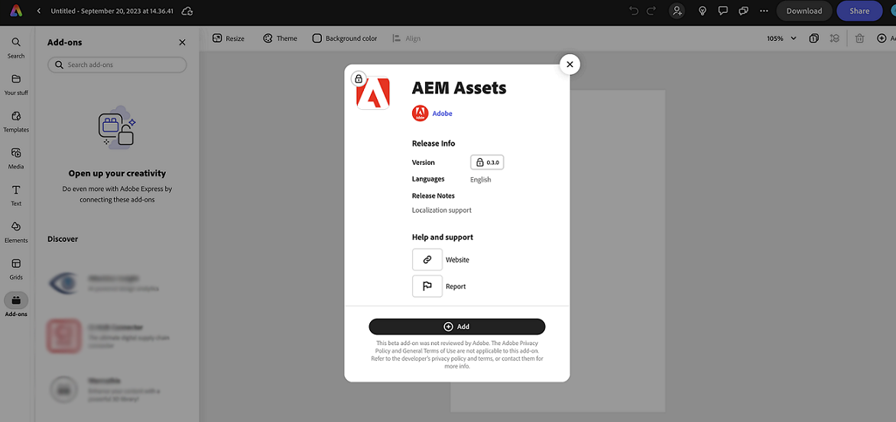

# 适用于 Adobe Express 的 AEM Assets 加载项 {#assets-addon-adobe-express}

通过适用于 Adobe Express 的 AEM Assets 加载项，可直接从 Adobe Express 用户界面访问存储在 AEM Assets 中的资源。可将在 AEM Assets 中管理的内容放入 Express 画布，然后将新内容或经过编辑的内容保存在 AEM Assets 存储库中。该加载项主要有以下几项优势：

* 通过在 AEM 中编辑和保存新资源，提高了内容重用程度

* 减少了创建新资源或创建现有资源的新版本所需的总体时间和工作量

## 前提条件 {#prerequisites}

有权访问 Adobe Express 和 AEM Assets 中的至少一个环境。该环境可以是 Assets as a Cloud Service 或 Assets Essentials 中的任何存储库。

## 将 AEM Assets 加载项添加到 Adobe Express {#access-assets-addon}

执行以下步骤以将 AEM Assets 加载项添加到 Adobe Express：

1. 打开 Adobe Express Web 应用程序。

1. 通过加载新模板或项目或创建资源来打开新的空白画布。

1. 单击可在左侧导航窗格中找到的&#x200B;**[!UICONTROL 加载项]**。

1. 在可在[!UICONTROL 加载项]部分的顶部找到的搜索栏中指定 **[!UICONTROL AEM Assets]**，然后单击该 AEM Assets 加载项。

   

1. 单击&#x200B;**[!UICONTROL 添加]**。随后在&#x200B;**[!UICONTROL 您的加载项]**&#x200B;部分的列表中显示该加载项。再次单击该加载项以在右侧导航窗格中显示内容。该加载项显示您有权访问的存储库的列表以及可在根级别找到的资源和文件夹的列表。

   使用搜索栏搜索需要在画布中使用的资源。

   

   A. 选择您的 AEM Assets 存储库 B. 使用搜索栏搜索资源 C. 按升序或降序为资源排序 D. 可在所选位置找到这些资源和文件夹。E. 在 AEM Assets 中保存您的更改

## 在 Adobe Express 编辑器中使用 AEM Assets {#use-aem-assets-in-express}

将 AEM Assets 加载项添加到 Adobe Express 后，即可开始在 Express 画布内使用存储在 AEM Assets 存储库中的 PNG 和 JPEG 图像。导航到相应的文件夹并单击资源以将它纳入画布。

## 将 Adobe Express 项目保存在 AEM Assets 中 {#save-express-projects-in-assets}

在 Express 画布中纳入适当的修改后，即可将该画布保存在 AEM Assets 存储库中。

1. 单击&#x200B;**[!UICONTROL 保存]**&#x200B;以打开&#x200B;**[!UICONTROL 上传]**&#x200B;对话框。
1. 指定资源的名称和格式。可将画布的内容保存为 PNG 或 JPEG 格式类型。

1. 单击&#x200B;**[!UICONTROL 位置]**&#x200B;字段旁的文件夹图标，导航到要保存资源的位置，然后单击&#x200B;**[!UICONTROL 选择]**。随后在&#x200B;**[!UICONTROL 位置]**&#x200B;字段中显示该文件夹的名称。

1. 单击&#x200B;**[!UICONTROL 上传]**&#x200B;以将资源上传到 AEM Assets。

   
