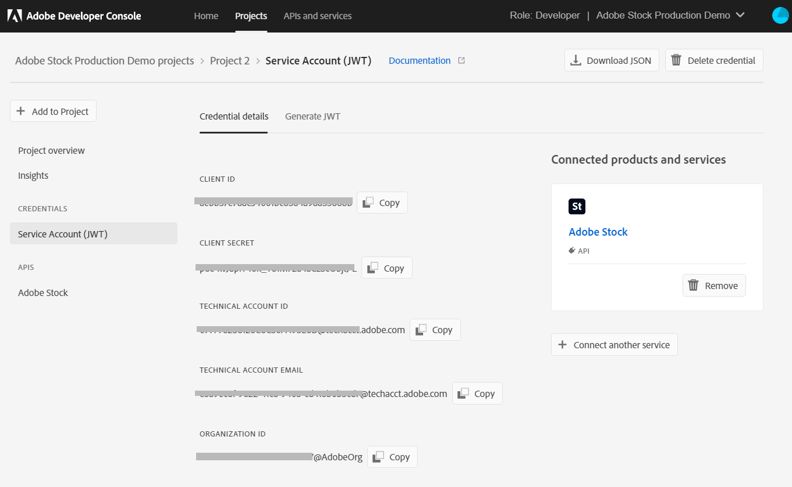
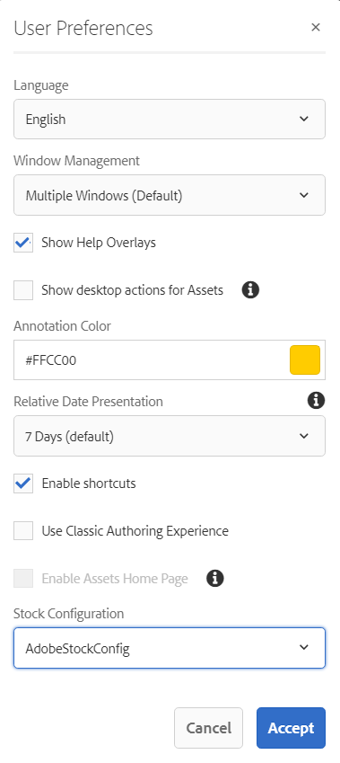

# 在[!DNL Adobe Experience Manager Assets]中使用[!DNL Adobe Stock]资源 {#use-adobe-stock-assets-in-aem-assets}

| [搜索最佳实践](/help/assets/search-best-practices.md) | [元数据最佳实践](/help/assets/metadata-best-practices.md) | [Content Hub](/help/assets/product-overview.md) | 具有OpenAPI功能的[Dynamic Media](/help/assets/dynamic-media-open-apis-overview.md) | [AEM Assets开发人员文档](https://developer.adobe.com/experience-cloud/experience-manager-apis/) |
| ------------- | --------------------------- |---------|----|-----|

| 版本 | 文章链接 |
| -------- | ---------------------------- |
| AEM 6.5 | [单击此处](https://experienceleague.adobe.com/docs/experience-manager-65/assets/using/aem-assets-adobe-stock.html?lang=en) |
| AEM as a Cloud Service | 本文 |

[!DNL Adobe Stock]服务允许设计人员和企业访问其所有创意项目中的数百万张高质量、精选的、免版税的照片、矢量、插图、视频、模板和3D资产。

默认情况下，企业产品的[!DNL Adobe Stock]包含跨组织的共享权限。 资产获得组织用户的许可后，组织的其他用户便可以识别、下载和使用此资产，而无需再次许可。 一旦您的组织对资产进行了许可，该资产的使用权即永久有效。

组织可以将其企业[!DNL Adobe Stock]计划与[!DNL Experience Manager Assets]集成，以确保许可资产可广泛用于其创意和营销项目，并具有[!DNL Experience Manager]的强大资产管理功能。 [!DNL Experience Manager]用户无需离开[!DNL Experience Manager]界面，即可快速查找、预览和许可[!DNL Experience Manager]中保存的Adobe Stock资源。

## 集成[!DNL Experience Manager]和[!DNL Adobe Stock] {#integrate-aem-and-adobe-stock}

[!DNL Experience Manager Assets]允许用户直接从[!DNL Experience Manager]搜索、预览、保存和许可[!DNL Adobe Stock]资源。

**前提条件**

集成需要：

* 已启动并作为[!DNL Cloud Service]实例运行的[!DNL Experience Manager Assets]
* [企业 [!DNL Adobe Stock] 计划](https://stockenterprise.adobe.com/)
* 具有默认Stock产品配置文件Admin Console权限的用户
* 具有在Adobe Developer Console中创建集成的开发人员访问配置文件权限的用户

企业[!DNL Adobe Stock]计划，

* 提供[!DNL Adobe Stock]的产品权利(与Experience Manager相关的库存)
* 为[!DNL Adobe Admin Console]购买的股票权利积分
* 在[!DNL Adobe Developer Console]内为您的股票权利启用服务帐户(JWT)身份验证
* 允许在[!DNL Adobe Admin Console]内全局管理信用和许可

在权利中，[!DNL Admin Console]中存在[!DNL Adobe Stock]的默认产品配置文件。 可以创建多个配置文件，这些配置文件确定谁可以许可Stock资产。 直接访问产品配置文件的用户可以访问[https://stock.adobe.com/](https://stock.adobe.com/)并许可Stock资产。 而则可以使用开发人员访问权限创建集成(API)的其他方法。 此集成验证[!DNL Experience Manager Assets]与[!DNL Adobe Stock]之间的通信。

>[!NOTE]
>
>Stock服务帐户(JWT)身份验证随企业Stock权利提供。
>
>该集成不支持企业股票权利的Oauth身份验证。

<!--
### Create an IMS configuration {#create-an-ims-configuration}

1. In the [!DNL Experience Manager] user interface, navigate to **[!UICONTROL Tools]** > **[!UICONTROL Security]** > **[!UICONTROL Adobe IMS Configurations]**. Click **[!UICONTROL Create]** and select **[!UICONTROL Cloud Solution]** > **[!UICONTROL Adobe Stock]**.
1. Either reuse an existing certificate or select **[!UICONTROL Create new certificate]**.
1. Click **[!UICONTROL Create certificate]**. Once created, download the public key. Click **[!UICONTROL Next]**. Leave the [!UICONTROL Adobe IMS Technical Account Configuration] screen open to provide the required values shortly.
1. Access [Adobe Developer Console](https://console.adobe.io). Ensure that your account has administrator permissions for the organization for which the integration is required.
1. Click **[!UICONTROL Create new project]** and click **[!UICONTROL Add API]**. Select **[!UICONTROL Adobe Stock]** from the list of APIs that are available to you. Select [!UICONTROL OAUTH 2.0 Web].
1. Provide **[!UICONTROL Default redirect URI]** and **[!UICONTROL Redirect URI pattern]** values. Click **[!UICONTROL Save configured API]**. Copy the generated ID and secret.
1. In [!UICONTROL Adobe IMS Technical Account Configuration] screen, provide the values in the boxes titled **[!UICONTROL Title]**, **[!UICONTROL Authorization Server]**, **[!UICONTROL API Key]**, **[!UICONTROL Client Secret]**, and **[!UICONTROL Payload]**. For detailed information about these values, see [JWT authentication quick start](https://www.adobe.io/authentication/auth-methods.html#!AdobeDocs/adobeio-auth/master/JWT/JWT.md).

-->
<!-- TBD: Update the URL to update the terminology when AIO team updates their documentation URL. Logged issue github.com/AdobeDocs/adobeio-auth/issues/63.
-->

<!--
### Create [!DNL Adobe Stock] configuration in [!DNL Experience Manager] {#create-adobe-stock-configuration-in-aem}

1. In the [!DNL Experience Manager], navigate to **[!UICONTROL Tools]** > **[!UICONTROL Cloud Services]** > **[!UICONTROL Adobe Stock]**.
1. Click **[!UICONTROL Create]** to create a configuration and associate it with your existing IMS Configuration. Select `PROD` as the environment parameter.
1. In **[!UICONTROL Licensed Assets Path]** field, leave a location as is. Do not change the location where you want to store the [!DNL Adobe Stock] assets.
1. Complete creation by adding all the required properties. Click **[!UICONTROL Save & Close]**.
1. Add [!DNL Experience Manager] users or groups, who can license the assets.

>[!NOTE]
>
>If there are multiple [!DNL Adobe Stock] configurations, select the desired configuration in User Preferences panel. To access the panel from Experience Manager home page, click the user icon and then click **[!UICONTROL User Preferences]** > **[!UICONTROL Stock Configuration]**.

-->

## 集成[!DNL Experience Manager]和[!DNL Adobe Stock]的步骤 {#integration-steps}

要集成[!DNL Experience Manager]和[!DNL Adobe Stock]，请按列出的顺序执行以下步骤：

1. [获取公共证书](#public-certificate)

   在[!DNL Experience Manager]中，创建IMS帐户并生成公共证书（公共密钥）。

1. [创建服务帐户(JWT)连接](#createnewintegration)

   在[!DNL Adobe Developer Console]中，为您的[!DNL Adobe Stock]组织创建一个项目。 在项目下，使用公钥配置API以创建服务帐户(JWT)连接。 获取服务帐户凭据和JWT有效负载信息。

1. [配置IMS帐户](#create-ims-account-configuration)

   在[!DNL Experience Manager]中，使用服务帐户凭据和JWT有效负载配置IMS帐户。

1. [配置云服务](#configure-the-cloud-service)

   在[!DNL Experience Manager]中，使用IMS帐户配置[!DNL Adobe Stock]云服务。

### 创建IMS配置 {#create-an-ims-configuration}

IMS配置使用[!DNL Adobe Stock]权利对您的[!DNL Experience Manager Assets]创作实例进行身份验证。

IMS 配置包括两个步骤：

* [获取公共证书](#public-certificate)
* [配置IMS帐户](#create-ims-account-configuration)

### 获取公共证书 {#public-certificate}

公钥（证书）用于在Adobe Developer Console中验证您的产品配置文件。

1. 登录到您的[!DNL Experience Manager Assets]云实例。

1. 从&#x200B;**[!UICONTROL 工具]**&#x200B;面板，导航到&#x200B;**[!UICONTROL 安全]** > **[!UICONTROL Adobe IMS配置]**。

1. 在“Adobe IMS配置”页面中，单击&#x200B;**[!UICONTROL 创建]**。 将打开&#x200B;**[!UICONTROL Adobe IMS技术帐户配置]**&#x200B;页面。

1. 在&#x200B;**[!UICONTROL 证书]**&#x200B;选项卡中，从&#x200B;**[!UICONTROL 云解决方案]**&#x200B;下拉列表中选择&#x200B;**[!UICONTROL Adobe Stock]**。

1. 您可以创建证书或为配置重用现有证书。

   要创建证书，请选中&#x200B;**[!UICONTROL 新建证书]**&#x200B;复选框，并为公钥指定&#x200B;**别名**。 别名将用作公钥的名称。

1. 单击&#x200B;**[!UICONTROL 创建证书]**。然后，单击&#x200B;**[!UICONTROL 确定]**&#x200B;以生成公钥。

1. 单击&#x200B;**[!UICONTROL 下载公钥]**&#x200B;图标，然后将公钥(.crt)文件保存到您的计算机上。 公钥稍后用于为Brand Portal租户配置API并在Adobe Developer Console中生成服务帐户凭据。

   单击&#x200B;**[!UICONTROL 下一步]**。

   

1. 在&#x200B;**帐户**&#x200B;选项卡中，创建了需要服务帐户凭据的Adobe IMS帐户。

   打开新选项卡并[在Adobe Developer Console](#createnewintegration)中创建服务帐户(JWT)连接。

### 创建服务帐户(JWT)连接 {#createnewintegration}

在Adobe Developer Console中，项目和API在组织级别配置。 配置API将创建服务帐户(JWT)连接。 配置API的方法有两种：生成密钥对（私钥和公钥）或上传公钥。 在此示例中，服务帐户凭据是通过上传公钥生成的。

要生成服务帐户凭据和JWT有效负载，请执行以下操作：

1. 使用系统管理员权限登录Adobe Developer Console。 默认URL为[https://www.adobe.com/go/devs_console_ui](https://www.adobe.com/go/devs_console_ui)。

   确保您从下拉列表（组织）中选择了正确的IMS组织（库存权利）。

1. 单击&#x200B;**[!UICONTROL 新建项目]**。 系统会为您的组织创建一个名称由系统生成的空白项目。

   单击&#x200B;**[!UICONTROL 编辑项目]**。 更新&#x200B;**[!UICONTROL 项目标题]**&#x200B;和&#x200B;**[!UICONTROL 描述]**，然后单击&#x200B;**[!UICONTROL 保存]**。

1. 在&#x200B;**[!UICONTROL 项目概述]**&#x200B;选项卡中，单击&#x200B;**[!UICONTROL 添加API]**。

1. 在&#x200B;**[!UICONTROL 添加API窗口]**&#x200B;中，选择&#x200B;**[!UICONTROL Adobe Stock]**。 单击&#x200B;**[!UICONTROL 下一步]**。

1. 在&#x200B;**[!UICONTROL 配置API]**&#x200B;窗口中，选择&#x200B;**[!UICONTROL 服务帐户(JWT)]**&#x200B;身份验证。 单击&#x200B;**[!UICONTROL 下一步]**。

   

1. 单击&#x200B;**[!UICONTROL 上传公钥]**。 单击&#x200B;**[!UICONTROL 选择文件]**&#x200B;并上传您在[获取公共证书](#public-certificate)部分中下载的公共密钥（.crt文件）。 单击&#x200B;**[!UICONTROL 下一步]**。

1. 验证公钥并单击&#x200B;**[!UICONTROL 下一步]**。

1. 选择默认的&#x200B;**[!UICONTROL Adobe Stock]**&#x200B;产品配置文件，然后单击&#x200B;**[!UICONTROL 保存配置的API]**。

1. 配置API后，您将被重定向到API概述页面。 从&#x200B;**[!UICONTROL 凭据]**&#x200B;下的左侧导航中，单击&#x200B;**[!UICONTROL 服务帐户(JWT)]**&#x200B;选项。 在这里，您可以查看凭据并执行操作，如生成JWT令牌、复制凭据详细信息和检索客户端密码。

1. 从&#x200B;**[!UICONTROL 客户端凭据]**&#x200B;选项卡，复制&#x200B;**[!UICONTROL 客户端ID]**。

   单击&#x200B;**[!UICONTROL 检索客户端密钥]**&#x200B;并复制&#x200B;**[!UICONTROL 客户端密钥]**。

   

1. 导航到&#x200B;**[!UICONTROL 生成JWT]**&#x200B;选项卡并复制&#x200B;**[!UICONTROL JWT有效负荷]**&#x200B;信息。

您现在可以使用客户端ID（API密钥）、客户端密钥和JWT有效负载在[!DNL Experience Manager Assets]中[配置IMS帐户](#create-ims-account-configuration)。

### 配置IMS帐户 {#create-ims-account-configuration}

您必须具有[证书](#public-certificate)和[服务帐户(JWT)凭据](#createnewintegration)才能配置IMS帐户。

配置IMS帐户：

1. 打开IMS配置并导航到&#x200B;**[!UICONTROL 帐户]**&#x200B;选项卡。 在[获取公共证书](#public-certificate)时，你保持页面打开。

1. 为 IMS 帐户指定&#x200B;**[!UICONTROL 标题]**。

   在&#x200B;**[!UICONTROL 授权服务器]**&#x200B;字段中，输入URL： [https://ims-na1.adobelogin.com/](https://ims-na1.adobelogin.com/)。

   在[创建服务帐户(JWT)连接](#createnewintegration)时复制的&#x200B;**[!UICONTROL API密钥]**&#x200B;字段、**[!UICONTROL 客户端密钥]**&#x200B;和&#x200B;**[!UICONTROL 有效负荷]** （JWT有效负荷）中输入客户端ID。

1. 单击&#x200B;**[!UICONTROL 创建]**。将创建IMS帐户配置。

   

1. 选择IMS帐户配置并单击&#x200B;**[!UICONTROL 检查运行状况]**。

   在对话框中单击&#x200B;**[!UICONTROL 选中]**。 成功配置时，将显示一条消息，显示&#x200B;*令牌已成功检索*。

   

### 配置云服务 {#configure-the-cloud-service}

要配置[!DNL Adobe Stock]云服务：

1. 在[!DNL Experience Manager]用户界面中，导航到&#x200B;**[!UICONTROL 工具]** > **[!UICONTROL Cloud Service]** > **[!UICONTROL Adobe Stock]**。

1. 在[!DNL Adobe Stock Configurations]页面中，单击&#x200B;**[!UICONTROL 创建]**。

1. 为云配置指定&#x200B;**[!UICONTROL 标题]**。

   选择您在[配置IMS帐户](#create-ims-account-configuration)时创建的IMS配置。

   从下拉列表中选择您的区域设置。

   

1. 单击“**[!UICONTROL 保存并关闭]**”。

   您的[!DNL Experience Manager Assets]创作实例现已与[!DNL Adobe Stock]集成。 您可以创建多个[!DNL Adobe Stock]配置（例如，基于区域设置的配置）。 您现在可以从[!DNL Experience Manager]用户界面中访问、搜索和许可[!DNL Adobe Stock]资源。

   

   >[!NOTE]
   >
   >在此集成阶段，只有管理员才能访问[!DNL Adobe Stock]资产、搜索Stock资产（使用Omnisearch）并许可[!DNL Adobe Stock]资产。
   >
   >管理员可以将用户或组进一步添加到[!DNL Adobe Stock]云服务，并在[!DNL Experience Manager]中授予这些非管理员用户访问Stock配置的权限。

1. 要添加用户或组，请选择[!DNL Adobe Stock]云配置并单击&#x200B;**[!UICONTROL 属性]**。

1. 搜索以添加您为其分配了访问Adobe Stock配置的权限的用户或组。 请参阅[向用户组](#assign-permissions-to-group)分配权限。

## 向用户组分配权限 {#assign-permissions-to-group}

管理员可以创建用户组，并为特定用户或组授予访问[!DNL Adobe Stock]云服务的权限。

以下是用户搜索和许可Adobe Stock资源所需的权限：

* 配置路径： `/conf/global/settings/stock`
* 权限： `jcr:read`
* 权限类型： `Allow`

您可以创建用户组或向现有用户组分配权限。 可从[!DNL Experience Manager Assets]界面或[!DNL User Admin]控制台分配权限。

**为来自[!DNL Experience Manager]的用户组提供访问权限：**

1. 在[!DNL Experience Manager]用户界面中，导航到&#x200B;**[!UICONTROL 工具]** > **[!UICONTROL 安全]** > **[!UICONTROL 组]**。 为[!DNL Adobe Stock]创建用户组。

1. 导航到&#x200B;**[!UICONTROL 工具]** > **[!UICONTROL 安全性]** > **[!UICONTROL 权限]**。

1. 在左侧面板中搜索用户组，并为Adobe Stock添加新的&#x200B;**[!UICONTROL 访问控制条目(ACE)]**。

   * 配置路径： `/conf/global/settings/stock`
   * 权限： `jcr:read`
   * 权限类型： `Allow`

   单击&#x200B;**[!UICONTROL 添加]**。

   

1. 导航到&#x200B;**[!UICONTROL 工具]** > **[!UICONTROL Cloud Service]** > **[!UICONTROL Adobe Stock]**。 选择[!DNL Adobe Stock]云配置并单击&#x200B;**[!UICONTROL 属性]**。

1. 将已创建的用户组添加到[!DNL Adobe Stock]配置。 单击“**[!UICONTROL 保存并关闭]**”。

   

**为来自[!DNL User Admin Console]的用户提供访问权限：**

1. 打开[!DNL Experience Manager]用户Admin Console。 默认URL为`http://localhost:4502/userdamin`。

1. 在左侧面板中，通过输入`user_id`或`name`搜索用户。 双击以打开用户属性。

1. 导航到&#x200B;**[!UICONTROL 权限]**&#x200B;选项卡，并允许[!DNL Adobe Stock]云配置`/conf/global/settings/stock`的`read`权限。

   >[!CAUTION]
   >
   >如果不允许云配置，则用户只能在[!DNL Experience Manager]界面中访问&#x200B;**[!UICONTROL Assets]**。
   >
   >要允许访问[!UICONTROL Assets]和[!DNL Adobe Stock]资源，请确保该用户允许云配置。

1. 单击&#x200B;**[!UICONTROL 保存]**&#x200B;以更新权限。

   

1. 将用户或组添加到[!DNL Adobe Stock]云配置。

## 访问Adobe Stock资源 {#access-stock-assets}

具有[!DNL Adobe Stock]云配置权限的非管理员用户可从[!DNL Experience Manager]界面搜索和许可[!DNL Adobe Stock]资产。

用户在访问[!DNL Adobe Stock]资产之前，必须执行激活[!DNL Adobe Stock]云配置的额外步骤。 这是一次性活动。 如果用户被分配了多个[!DNL Adobe Stock]云配置的权限，则用户可以从&#x200B;**[!UICONTROL 用户首选项]**&#x200B;中选择所需的配置。

要激活[!DNL Adobe Stock]云配置，请执行以下操作：

1. 登录到[!DNL Experience Manager]。

1. 单击右上角的用户图标，然后单击&#x200B;**[!UICONTROL 我的首选项]**。 将打开&#x200B;**[!UICONTROL 用户首选项]**&#x200B;窗口。

1. 从下拉列表中选择所需的&#x200B;**[!UICONTROL Stock配置]**，然后单击&#x200B;**[!UICONTROL 接受]**&#x200B;以激活配置。

   

1. 导航到&#x200B;**[!UICONTROL Assets]** > **[!UICONTROL Adobe Stock]**。 您现在可以查看、搜索和许可[!DNL Adobe Stock]资产。

下表说明了访问[!DNL Adobe Stock]资源时用户权限的工作方式：

| 用户 | 组 | 权限 | 在用户首选项中接受Stock配置 | 访问Assets | 访问Adobe Stock |
| --- | --- | --- | --- | --- | --- |
| 管理员 | 不适用 | 所有 | 不适用 | 是 | 是 |
| test-doc1 | DAM 用户 | /conf/global/settings/stock/cloud-config | 是 | 是 | 是 |
| test-doc1 | DAM 用户 | /conf/global/settings/stock/cloud-config | 否 | 错误：无法加载数据 | 否 |
| test-doc1 | DAM 用户 | **允许**： /conf/global/settings/stock **拒绝**： /cloud-config | Stock配置不可见 | 是 | 否 |

## 在[!DNL Experience Manager]中使用和管理[!DNL Adobe Stock]资源 {#usemanage}

使用此功能，组织可以允许其用户使用[!DNL Experience Manager Assets]中的[!DNL Adobe Stock]资源工作。 在[!DNL Experience Manager]用户界面中，用户可以搜索[!DNL Adobe Stock]资源并许可所需的资源。

在[!DNL Experience Manager]中许可[!DNL Adobe Stock]资源后，便可以像普通资源一样对其进行使用和管理。 在[!DNL Experience Manager]中，用户可以搜索和预览资产；复制和发布资产；在[!DNL Brand Portal]上共享资产；通过[!DNL Experience Manager]桌面应用程序访问和使用资产；等等。

![从您的[!DNL Adobe Experience Manager]工作区中搜索[!DNL Adobe Stock]资源并筛选结果](assets/adobe-stock-search-results-workspace.png)

**A.**&#x200B;搜索与提供[!DNL Adobe Stock] ID的资产类似的资产。 **B.** 搜索与您选择的形状或方向匹配的资产。**C.**&#x200B;搜索一种或多种受支持的资产类型&#x200B;**D.**&#x200B;打开或折叠筛选器窗格&#x200B;**E.**&#x200B;许可并将所选资产保存在[!DNL Experience Manager] **F.**&#x200B;使用水印&#x200B;**G.**&#x200B;在[!DNL Adobe Stock]网站上浏览与所选资产类似的资产&#x200B;**H.**&#x200B;在[!DNL Adobe Stock]网站&#x200B;**I.**&#x200B;上查看所选资产从搜索结果&#x200B;**J中选定的资产数。 19}在卡片视图和列表视图之间切换[!DNL Experience Manager]**

### 查找资源 {#find-assets}

您的[!DNL Experience Manager]用户可以在[!DNL Experience Manager]和[!DNL Adobe Stock]中搜索资源。 当搜索位置不限于[!DNL Adobe Stock]时，将显示来自[!DNL Experience Manager]和[!DNL Adobe Stock]的搜索结果。

* 要搜索[!DNL Adobe Stock]资源，请单击&#x200B;**[!UICONTROL 导航]** > **[!UICONTROL Assets]** > **[!UICONTROL 搜索Adobe Stock]**。

* 要在[!DNL Adobe Stock]和[!DNL Experience Manager Assets]中搜索资产，请单击搜索。

或者，开始在搜索栏中键入`Location: Adobe Stock`以选择[!DNL Adobe Stock]资源。 [!DNL Experience Manager]对搜索到的资源提供高级筛选功能，允许用户使用筛选器快速聚焦于所需的资源，如支持的资源类型、图像方向和许可状态。

>[!NOTE]
>
>从[!DNL Adobe Stock]搜索的Assets显示在[!DNL Experience Manager]中。 只有在用户[保存资产](/help/assets/aem-assets-adobe-stock.md#saveassets)或[许可证并保存资产](/help/assets/aem-assets-adobe-stock.md#licenseassets)之后，才会获取[!DNL Adobe Stock]资产并将其存储在[!DNL Experience Manager]存储库中。 为便于引用和访问，将显示和高亮显示已存储在[!DNL Experience Manager]中的Assets。 此外，[!DNL Stock]资源与一些其他元数据一起保存，以将源指示为[!DNL Stock]。

![在[!DNL Experience Manager]中搜索筛选器并在搜索结果中突出显示[!DNL Adobe Stock]个资源](assets/aem-search-filters2.jpg)

### 保存并查看所需的资产 {#saveassets}

选择要保存在[!DNL Experience Manager]中的资源。 单击顶部工具栏中的[!UICONTROL 保存]，并提供资源的名称和位置。 未授权的资产将带有水印保存在本地。

下次搜索资源时，保存的资源将带徽章突出显示，以表示此类资源在[!DNL Experience Manager Assets]中可用。

>[!NOTE]
>
>最近添加的资产显示“新”徽章，而不是“已许可”徽章。

### 许可资产 {#licenseassets}

用户可以使用其[!DNL Adobe Stock]企业计划的配额来许可[!DNL Adobe Stock]资源。 当您许可某个资产时，该资产将无水印保存，并且可用于在[!DNL Experience Manager Assets]中搜索和使用。

![用于在[!DNL Experience Manager Assets]](assets/aem-stock_licenseandsave.jpg)中许可和保存[!DNL Adobe Stock]资源的对话框

### 访问元数据和资源属性 {#access-metadata-and-asset-properties}

用户可以访问和预览元数据，包括保存在[!DNL Experience Manager]中的资源的[!DNL Adobe Stock]元数据属性，并为资源添加&#x200B;**[!UICONTROL 许可证引用]**。 但是，许可证引用的更新未在[!DNL Experience Manager]和[!DNL Adobe Stock]网站之间同步。

用户可以查看已许可和未许可资产的属性。

## 已知限制 {#known-limitations}

* **限制用户进行许可的功能无法正常工作**：允许所有对Stock配置具有`read`权限的用户搜索和许可[!DNL Adobe Stock]资产。

* **非管理员用户必须手动激活[!DNL Adobe Stock]云配置**：在&#x200B;**[!UICONTROL 用户首选项]**&#x200B;窗口中，**[!UICONTROL Stock配置]**&#x200B;将[!DNL Adobe Stock]云配置显示为已启用，但该配置不适用于非管理员用户。 用户必须单击&#x200B;**[!UICONTROL 接受]**&#x200B;按钮才能激活Stock配置。 如果没有此步骤，则系统在访问&#x200B;**[!UICONTROL Assets]**&#x200B;时反映错误消息。

* **不显示编辑图像警告**：在许可图像时，用户无法检查图像是否仅用于编辑。 为防止可能的滥用，管理员可以从Admin Console中关闭对编辑资源的访问权限。

* **显示的许可证类型错误**：资产的[!DNL Experience Manager]中可能显示不正确的许可证类型。 用户可以登录[!DNL Adobe Stock]网站以查看许可证类型。

* **引用字段和元数据未同步**：当用户更新许可证引用字段时，将在[!DNL Experience Manager]中更新许可证引用信息，但不会在[!DNL Adobe Stock]网站上更新。 同样，如果用户更新[!DNL Adobe Stock]网站上的引用字段，则更新不会在[!DNL Experience Manager]中同步。

<!--
## Use and manage [!DNL Adobe Stock] assets in [!DNL Experience Manager] {#usemanage}

Using this capability, organizations users can work using [!DNL Adobe Stock] assets in [!DNL Experience Manager Assets]. From within the [!DNL Experience Manager] user interface, users can search [!DNL Adobe Stock] assets and license the required assets.

Once an [!DNL Adobe Stock] asset is licensed in [!DNL Experience Manager], it can be used and managed like a typical asset. In [!DNL Experience Manager], the users can search and preview the assets; copy and publish the assets; share the assets on [!DNL Brand Portal]; access and use the assets via [!DNL Experience Manager] desktop app; and so on.
-->

<!--  

*Figure: Search for [!DNL Adobe Stock] assets and filter results from your [!DNL Experience Manager] interface.*

**A.** Search assets similar to the assets whose [!DNL Adobe Stock] ID is provided. **B.** Search assets that match your selection of shape or orientation. **C.** Search for one of more supported asset types **D.** Open or collapse the filters pane **E.** License and save the selected asset in [!DNL Experience Manager] **F.** Save the asset in [!DNL Experience Manager] with watermark **G.** Explore assets on [!DNL Adobe Stock] website that are similar to the selected asset **H.** View the selected assets on [!DNL Adobe Stock] website **I.** Number of selected assets from the search results **J.** Switch between Card view and List view -->

<!--
### Find assets {#find-assets}

Your [!DNL Experience Manager] users, can search for assets in both, [!DNL Experience Manager] and [!DNL Adobe Stock]. When the search location is not limited to [!DNL Adobe Stock], the search results from [!DNL Experience Manager] and [!DNL Adobe Stock] are displayed.

* To search for [!DNL Adobe Stock] assets, click **[!UICONTROL Navigation]** > **[!UICONTROL Assets]** > **[!UICONTROL Search Adobe Stock]**.

* To search for assets across [!DNL Adobe Stock] and [!DNL Experience Manager Assets], click search .

Alternatively, start typing `Location: Adobe Stock` in the search bar to select [!DNL Adobe Stock] assets. [!DNL Experience Manager] offers advanced filtering capabilities on the searched assets, allowing users to quickly zero-in on the required assets using filters, such as types of supported assets, image orientation, and licensed state.

>[!NOTE]
>
>Assets searched from [!DNL Adobe Stock] are just displayed in [!DNL Experience Manager]. [!DNL Adobe Stock] assets are fetched and stored in [!DNL Experience Manager] repository only after a user either [saves an asset](/help/assets/aem-assets-adobe-stock.md#saveassets) or [licenses and saves an asset](/help/assets/aem-assets-adobe-stock.md#licenseassets). Assets that are already stored in [!DNL Experience Manager] are displayed and highlighted for ease of reference and access. Also, the [!DNL Stock] assets are saved with some additional metadata to indicate the source as [!DNL Stock].

*Figure: Search filters in [!DNL Experience Manager] and highlighted [!DNL Adobe Stock] assets in search results.*

### Save and view the required assets {#saveassets}

Select an asset that you want to save in [!DNL Experience Manager]. Click [!UICONTROL Save] in the toolbar at the top and provide the name and location of the asset. The unlicensed assets are saved locally with a watermark.

Next time when you search for assets, the saved assets are highlighted with a badge, to indicate that such assets are available in [!DNL Experience Manager Assets].

>[!NOTE]
>
>The recently added assets display a New badge instead of Licensed badge.

### License assets {#licenseassets}

Users can license [!DNL Adobe Stock] assets by using the quota of their [!DNL Adobe Stock] enterprise plan. When you license an asset, it is saved without a watermark and is available for searching and using in [!DNL Experience Manager Assets].

*Figure: Dialog to license and save [!DNL Adobe Stock] assets in [!DNL Experience Manager Assets].*

### Access metadata and asset properties {#access-metadata-and-asset-properties}

Users can access and preview the metadata, including the [!DNL Adobe Stock] metadata properties for the assets saved in [!DNL Experience Manager], and add **[!UICONTROL License References]** for an asset. However, the updates to license reference are not synced between [!DNL Experience Manager] and [!DNL Adobe Stock] website.

Users can see the properties for both, licensed and unlicensed assets.

*Figure: View and access metadata and license references of saved assets.*

## Known limitations {#known-limitations}

* **Editorial image warning is not displayed**: When licensing an image, users cannot check if an image is Editorial Use Only. To prevent possible misuse, the administrators can turn off the access to editorial assets from the Admin Console.

* **Wrong license type is displayed**: It is possible that an incorrect license type is displayed in [!DNL Experience Manager] for an asset. Users can log into the [!DNL Adobe Stock] website to see the license type.

* **Reference fields and metadata are not synced**: When a user updates a license reference field, the license reference information is updated in [!DNL Experience Manager] but not on the [!DNL Adobe Stock] website. Similarly, if the user updates the reference fields on the [!DNL Adobe Stock] website, the updates are not synchronized in [!DNL Experience Manager].
-->

**另请参阅**

* [翻译资源](translate-assets.md)
* [Assets HTTP API](mac-api-assets.md)
* [资源支持的文件格式](file-format-support.md)
* [搜索资源](search-assets.md)
* [连接的资源](use-assets-across-connected-assets-instances.md)
* [资源报告](asset-reports.md)
* [元数据架构](metadata-schemas.md)
* [下载资源](download-assets-from-aem.md)
* [管理元数据](manage-metadata.md)
* [搜索 Facet](search-facets.md)
* [管理收藏集](manage-collections.md)
* [批量元数据导入](metadata-import-export.md)
* [发布资源到 AEM 和 Dynamic Media](/help/assets/publish-assets-to-aem-and-dm.md)

>[!MORELIKETHIS]
>
>* [有关将Adobe Stock资源与Experience Manager Assets结合使用的视频教程](https://experienceleague.adobe.com/docs/experience-manager-learn/assets/creative-workflows/adobe-stock.html)
>* [Adobe Stock企业计划帮助](https://helpx.adobe.com/enterprise/using/adobe-stock-enterprise.html)
>* [Adobe Stock常见问题解答](https://helpx.adobe.com/stock/faq.html)
