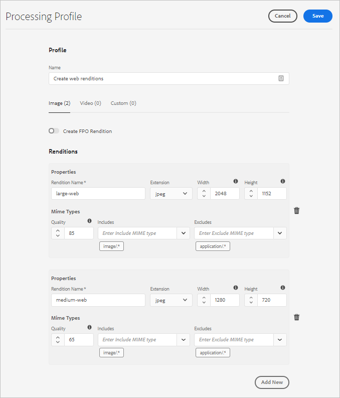

# 使用资产微服务和处理配置文件 {#get-started-using-asset-microservices}

资产微服务使用云原生应用程序（也称为工作程序）提供资产的可扩展且可复原的处理。 Adobe可管理各种服务，以优化不同资产类型和处理选项。

资产微服务允许您处理各种[文件类型](/help/assets/file-format-support.md)，这些文件类型的开箱即用格式比以前版本的[!DNL Experience Manager]所能提供的格式多。 例如，现在可以提取PSD和PSB格式的缩略图，但之前需要的第三方解决方案，如[!DNL ImageMagick]。

资产处理取决于&#x200B;**[!UICONTROL 处理配置文件]**&#x200B;中的配置。 Experience Manager提供了基本的默认设置，允许管理员添加更具体的资产处理配置。 管理员创建、维护和修改后处理工作流的配置，包括可选自定义。 自定义工作流允许开发人员扩展默认产品。

<!-- Proposed DRAFT diagram for asset microservices flow - see section "asset-microservices-flow.png (asset-microservices-configure-and-use.md)" in the PPTX deck

https://adobe-my.sharepoint.com/personal/gklebus_adobe_com/_layouts/15/guestaccess.aspx?guestaccesstoken=jexDC5ZnepXSt6dTPciH66TzckS1BPEfdaZuSgHugL8%3D&docid=2_1ec37f0bd4cc74354b4f481cd420e07fc&rev=1&e=CdgElS
-->

>[!NOTE]
>
>此处介绍的资产处理功能取代了[!DNL Experience Manager]早期版本中存在的`DAM Update Asset`工作流模型。 大多数标准呈现版本生成和与元数据相关的步骤会被资产微服务处理所取代，其余步骤（如果有）可以被后处理工作流配置替换。

## 了解资产处理选项 {#get-started}

[!DNL Experience Manager] 可进行以下级别的处理。

| 选项 | 描述 | 涵盖的用例 |
|---|---|---|
| [默认配置](#default-config) | 它可以按原样使用，且无法修改。 此配置提供了非常基本的再现生成功能。 | <ul> <li>[!DNL Assets]用户界面使用的标准缩略图（48、140和319像素） </li> <li> 大型预览（Web呈现 — 1280像素） </li><li> 元数据和文本提取。</li></ul> |
| [自定义配置](#standard-config) | 由管理员通过用户界面进行配置。 通过扩展默认选项，为演绎版生成提供更多选项。 扩展现成选项，以提供不同的格式和演绎版。 | <ul><li>FPO再现。 </li> <li>更改图像的文件格式和分辨率</li> <li> 有条件地应用于已配置的文件类型。 </li> </ul> |
| [自定义用户档案](#custom-config) | 管理员通过用户界面配置为通过自定义应用程序使用自定义代码来调用[Asset compute服务](https://experienceleague.adobe.com/docs/asset-compute/using/introduction.html)。 支持云原生和可扩展方法中更为复杂的要求。 | 请参阅[允许的用例](#custom-config)。 |

<!-- To create custom processing profiles specific to your custom requirements, say to integrate with other systems, see [post-processing workflows](#post-processing-workflows).
-->

## 支持的文件格式 {#supported-file-formats}

资产微服务支持多种文件格式，用于处理、生成演绎版或提取元数据。 有关MIME类型的完整列表以及每种类型支持的功能，请参阅[支持的文件格式](file-format-support.md)。

## 默认配置 {#default-config}

已预配置一些默认设置，以确保提供Experience Manager中所需的默认演绎版。 默认配置还可确保提供元数据提取和文本提取操作。 用户可以立即开始上传或更新资产，并且默认情况下会提供基本处理。

使用默认配置，只配置了最基本的处理配置文件。 此类处理配置文件在用户界面上不可见，您无法对其进行修改。 系统始终会执行以处理上传的资产。 此默认处理配置文件可确保[!DNL Experience Manager]所需的基本处理在所有资产上均已完成。

<!-- 
-->

## 标准配置 {#standard-config}

[!DNL Experience Manager] 根据用户的需要，提供为常用格式生成更具体演绎版的功能。管理员可以创建其他[!UICONTROL 处理配置文件]，以便于创建此类演绎版。 然后，用户将一个或多个可用配置文件分配给特定文件夹，以完成附加处理。 例如，额外处理可以为Web、移动设备和平板电脑生成演绎版。 以下视频演示了如何创建和应用[!UICONTROL 处理配置文件]，以及如何访问创建的演绎版。

* **演绎版宽度和高度**:演绎版宽度和高度规范提供了生成的输出图像的最大大小。资产微服务会尝试生成最大可能的演绎版，其宽度和高度分别不大于指定的宽度和高度。 保留宽高比，即与原始宽高比相同。 空值表示资产处理假定原始资产的像素尺寸。

* **MIME类型包含规则**:处理具有特定MIME类型的资产时，首先会根据演绎版规范的排除的MIME类型值检查MIME类型。如果它与该列表匹配，则不会为资产(阻止列表)生成此特定演绎版。 否则，将针对包含的MIME类型检查MIME类型，如果它与列表匹配，则会生成演绎版(允许列表)。

* **特殊FPO呈现**:将大型资产从放置到文 [!DNL Experience Manager] 档 [!DNL Adobe InDesign] 中时，创意专业人士会在放置资产后等待 [一段时间](https://helpx.adobe.com/indesign/using/placing-graphics.html)。同时，阻止用户使用[!DNL InDesign]。 这会中断创作流程，并对用户体验造成负面影响。 Adobe允许在[!DNL InDesign]文档中临时放置小型演绎版，以开始放置，稍后可以根据需要替换为全分辨率资产。 [!DNL Experience Manager] 提供仅用于放置(FPO)的演绎版。这些FPO呈现文件大小较小，但纵横比相同。

处理配置文件可以包含FPO（仅用于放置）演绎版。 请参阅[!DNL Adobe Asset Link] [文档](https://helpx.adobe.com/cn/enterprise/using/manage-assets-using-adobe-asset-link.html)以了解您是否需要为处理配置文件打开它。 有关更多信息，请参阅[Adobe资产链接完成文档](https://helpx.adobe.com/cn/enterprise/using/adobe-asset-link.html)。

### 创建标准用户档案 {#create-standard-profile}

要创建标准处理配置文件，请执行以下步骤：

1. 管理员可以访问&#x200B;**[!UICONTROL 工具]** > **[!UICONTROL 资产]** > **[!UICONTROL 处理配置文件]**。 单击&#x200B;**[!UICONTROL 创建]**。
1. 提供一个名称，帮助您在应用到文件夹时唯一标识配置文件。
1. 要生成FPO呈现，请在&#x200B;**[!UICONTROL Image]**&#x200B;选项卡上，启用&#x200B;**[!UICONTROL 创建FPO呈现]**。 输入介于1和100之间的&#x200B;**[!UICONTROL 质量]**&#x200B;值。
1. 要生成其他演绎版，请单击&#x200B;**[!UICONTROL Add New]** ，并提供以下信息：

   * 每个演绎版的文件名。
   * 每个呈现版本的文件格式（PNG、JPEG、GIF或WebP）。
   * 每个演绎版的宽度和高度（以像素为单位）。 如果未指定值，则使用原始图像的全像素大小。
   * 每个JPEG和WebP呈现的质量百分比。
   * 包含和排除的MIME类型，用于定义用户档案的适用性。

   

1. 单击&#x200B;**[!UICONTROL 保存]**。

<!-- TBD: Update the video link when a new video is available from Tech Marketing.

The following video demonstrates the usefulness and usage of standard profile.

>[!VIDEO](https://video.tv.adobe.com/v/29832?quality=9)
-->

<!-- This image was removed per cqdoc-15624, as requested by engineering.
  
 -->

## 自定义用户档案和用例 {#custom-config}

[!DNL Asset Compute Service]支持各种用例，如默认处理、处理特定于Adobe的格式(如Photoshop文件)，以及实施自定义或特定于组织的处理。 过去需要的DAM更新资产工作流自定义，可以自动处理，也可以通过处理配置文件配置进行处理。 如果这些处理选项无法满足业务需求，Adobe建议开发并使用[!DNL Asset Compute Service]来扩展默认功能。 有关概述，请参阅[了解可扩展性以及何时使用它](https://experienceleague.adobe.com/docs/asset-compute/using/extend/understand-extensibility.html)。

>[!NOTE]
>
>Adobe建议，仅当使用默认配置或标准配置文件无法完成业务需求时，才应使用自定义应用程序。

它可以将图像、视频、文档和其他文件格式转换为不同的演绎版，包括缩略图、提取的文本和元数据，以及存档。

开发人员可以使用[!DNL Asset Compute Service]为支持的用例创建自定义应用程序](https://experienceleague.adobe.com/docs/asset-compute/using/extend/develop-custom-application.html)。 [[!DNL Experience Manager] 可以使用管理员配置的自定义配置文件从用户界面调用这些自定义应用程序。[!DNL Asset Compute Service] 支持以下调用外部服务的用例：

* 使用[!DNL Adobe Photoshop]的[ImageCutout API](https://github.com/AdobeDocs/photoshop-api-docs-pre-release#imagecutout)并将结果保存为呈现版本。
* 调用第三方系统以更新数据，例如PIM系统。
* 使用[!DNL Photoshop] API根据Photoshop模板生成各种演绎版。
* 使用[AdobeLightroom API](https://github.com/AdobeDocs/lightroom-api-docs#supported-features)来优化摄取的资产并将这些资产另存为演绎版。

>[!NOTE]
>
>您无法使用自定义应用程序编辑标准元数据。 您只能修改自定义元数据。

### 创建自定义用户档案 {#create-custom-profile}

要创建自定义用户档案，请执行以下步骤：

1. 管理员可以访问&#x200B;**[!UICONTROL 工具]** > **[!UICONTROL 资产]** > **[!UICONTROL 处理配置文件]**。 单击&#x200B;**[!UICONTROL 创建]**。
1. 单击&#x200B;**[!UICONTROL Custom]**&#x200B;选项卡。 单击&#x200B;**[!UICONTROL Add New]**。 提供所需的演绎版文件名。
1. 提供以下信息。

   * 每个演绎版的文件名和支持的文件扩展名。
   * [Firefly自定义应用程序的端点URL](https://experienceleague.adobe.com/docs/asset-compute/using/extend/deploy-custom-application.html)。应用程序必须来自与Experience Manager帐户相同的组织。
   * 将服务参数添加到[，将其他信息或参数传递到自定义应用程序](https://experienceleague.adobe.com/docs/asset-compute/using/extend/develop-custom-application.html#extend)。
   * 包含和排除的MIME类型，可将处理限制为几种特定的文件格式。

   单击&#x200B;**[!UICONTROL 保存]**。

自定义应用程序是无标题的[项目Firefly](https://github.com/AdobeDocs/project-firefly)应用程序。 如果自定义应用程序使用处理配置文件进行设置，则会获取提供的所有文件。 应用程序必须筛选文件。

>[!CAUTION]
>
>如果Firefly应用程序和[!DNL Experience Manager]帐户不来自同一组织，则集成将不起作用。

### 自定义用户档案的示例 {#custom-profile-example}

为了说明自定义用户档案的用法，我们考虑使用一个用例将一些自定义文本应用到营销活动图像。 您可以创建利用Photoshop API编辑图像的处理配置文件。

asset compute服务集成允许Experience Manager使用[!UICONTROL 服务参数]字段将这些参数传递到自定义应用程序。 然后，自定义应用程序调用Photoshop API，并将这些值传递到API。 例如，您可以传递字体名称、文本颜色、文本粗细和文本大小，以将自定义文本添加到营销活动图像。

<!-- TBD: Check screenshot against the interface. -->

*图：使用 [!UICONTROL Service ] Parametersfield将添加的信息传递到自定义应用程序中的预定义参数内部版本。在此示例中，上传营销活动图像后，图像会更新为`Arial-BoldMT`字体的`Jumanji`文本。*

## 使用处理配置文件处理资产 {#use-profiles}

创建附加的自定义处理配置文件并将其应用到特定文件夹，以便Experience Manager处理上传到这些文件夹或在这些文件夹中更新的资产。 始终执行默认的内置标准处理配置文件，但用户界面上不可见。 如果您添加了自定义配置文件，则这两个配置文件都将用于处理上传的资产。

使用以下方法之一将处理配置文件应用到文件夹：

* 管理员可以在&#x200B;**[!UICONTROL 工具]** > **[!UICONTROL 资产]** > **[!UICONTROL 处理配置文件]**&#x200B;中选择处理配置文件定义，然后使用&#x200B;**[!UICONTROL 将配置文件应用到文件夹]**&#x200B;操作。 此时将打开一个内容浏览器，通过该浏览器可导航到特定文件夹，选择它们并确认配置文件的应用程序。
* 用户可以在Assets用户界面中选择文件夹，使用&#x200B;**[!UICONTROL 属性]**&#x200B;操作打开文件夹属性屏幕，单击&#x200B;**[!UICONTROL 处理配置文件]**&#x200B;选项卡，然后在弹出列表中，为该文件夹选择相应的处理配置文件。 要保存更改，请单击&#x200B;**[!UICONTROL 保存并关闭]**。
   

>[!TIP]
>
>一个文件夹只能应用一个处理配置文件。 要生成更多演绎版，请向现有处理配置文件中添加更多演绎版定义。

将处理配置文件应用到文件夹后，该文件夹或其任何子文件夹中上传（或更新）的所有新资产都会使用配置的附加处理配置文件进行处理。 此处理过程除了标准默认配置文件之外，还包含其他内容。

>[!NOTE]
>
>应用到文件夹的处理配置文件适用于整个树，但可能会与应用到子文件夹的其他配置文件发生重叠。 将资产上传到文件夹后，Experience Manager会检查容器文件夹的属性以获取处理配置文件。 如果未应用任何文件夹，则会检查层次结构中的父文件夹以应用处理配置文件。

要验证是否处理了资产，请在左边栏的[!UICONTROL 演绎版]视图中预览生成的演绎版。 打开资产预览并打开左边栏以访问&#x200B;**[!UICONTROL 演绎版]**&#x200B;视图。 处理配置文件中的特定演绎版（其特定资产类型与MIME类型包含规则匹配）应当可见且可访问。

*图：由应用于父文件夹的处理配置文件生成的两个其他演绎版的示例。*

## 后处理工作流 {#post-processing-workflows}

对于需要使用处理用户档案无法实现的资产需要进行额外处理的情况，可以向配置添加其他后处理工作流。 后处理允许您使用资产微服务在可配置处理的基础上添加完全自定义的处理。

微服务处理完成后，后处理工作流（如果已配置）将由[!DNL Experience Manager]自动执行。 无需手动添加工作流启动器即可触发工作流。 示例包括：

* 处理资产的自定义工作流步骤。
* 集成，以从外部系统（例如，产品或流程信息）将元数据或属性添加到资产。
* 外部服务完成的其他处理。

要向[!DNL Experience Manager]添加后处理工作流配置，请执行以下步骤：

* 创建一个或多个工作流模型。 这些自定义模型在本文档中称为&#x200B;*后处理工作流模型*。 这些是常规的[!DNL Experience Manager]工作流模型。
* 向这些模型添加所需的工作流步骤。 查看默认工作流中的步骤，并将所有必需的默认步骤添加到自定义工作流。 这些步骤基于工作流模型配置对资产执行。 例如，如果您希望在资产上传时自动进行智能标记，请将该步骤添加到自定义后处理工作流模型中。
* 在末尾添加[!UICONTROL DAM更新资产工作流已完成进程]步骤。 添加此步骤可确保Experience Manager知道处理何时结束，并且资产可标记为已处理，即资产上会显示&#x200B;*New*。
* 为自定义工作流运行程序服务创建配置，以便通过路径（文件夹位置）或正则表达式配置后处理工作流模型的执行。

有关在后处理工作流中可以使用哪个标准工作流步骤的详细信息，请参阅开发人员参考中的后处理工作流](developer-reference-material-apis.md#post-processing-workflows-steps)中的[工作流步骤。

### 创建后处理工作流模型 {#create-post-processing-workflow-models}

后处理工作流模型是常规的[!DNL Experience Manager]工作流模型。 如果您需要对不同存储库位置或资产类型进行不同的处理，请创建不同的模型。

将根据需要添加处理步骤。 您可以同时使用支持的可用步骤以及任何自定义实施的工作流步骤。

确保每个后处理工作流的最后一步是`DAM Update Asset Workflow Completed Process`。 最后一步有助于确保Experience Manager知道资产处理何时完成。

### 配置后处理工作流执行 {#configure-post-processing-workflow-execution}

资产微服务完成对上传资产的处理后，您可以定义后处理工作流以进一步处理资产。 要使用工作流模型配置后处理，您可以执行以下操作之一：

* [在文件夹属性中应用工作流模型](#apply-workflow-model-to-folder)。
* [配置自定义工作流运行程序服务](#configure-custom-workflow-runner-service)。

#### 将工作流模型应用到文件夹 {#apply-workflow-model-to-folder}

对于典型的后处理用例，请考虑使用方法将工作流应用到文件夹。 要在文件夹[!UICONTROL 属性]中应用工作流模型，请执行以下步骤：

1. 创建工作流模型。
1. 选择文件夹，单击工具栏中的&#x200B;**[!UICONTROL 属性]** ，然后单击&#x200B;**[!UICONTROL 资产处理]**&#x200B;选项卡。
1. 在&#x200B;**[!UICONTROL 自动启动工作流]**&#x200B;下，选择所需的工作流，提供工作流的标题，然后保存更改。

   

#### 配置自定义工作流运行程序服务 {#configure-custom-workflow-runner-service}

您可以为无法通过将工作流应用到文件夹轻松完成的高级配置配置配置自定义工作流运行器服务。 例如，使用正则表达式的工作流。 Adobe CQ DAM自定义工作流运行程序(`com.adobe.cq.dam.processor.nui.impl.workflow.CustomDamWorkflowRunnerImpl`)是OSGi服务。 它提供了以下两个配置选项：

* 按路径(`postProcWorkflowsByPath`)划分的后处理工作流：可以根据不同的存储库路径列出多个工作流模型。 使用冒号分隔路径和模型。 支持简单的存储库路径。 将这些值映射到`/var`路径中的工作流模型。 例如：`/content/dam/my-brand:/var/workflow/models/my-workflow`。
* 按表达式(`postProcWorkflowsByExpression`)划分的后处理工作流：可以根据不同的正则表达式列出多个工作流模型。 表达式和模型应使用冒号分隔。 正则表达式应直接指向“资产”节点，而不是任何演绎版或文件。 例如：`/content/dam(/.*/)(marketing/seasonal)(/.*):/var/workflow/models/my-workflow`。

要了解如何部署OSGi配置，请参阅[部署到 [!DNL Experience Manager]](/help/implementing/deploying/overview.md)。

## 最佳实践和限制 {#best-practices-limitations-tips}

* 在设计工作流时，请考虑您对所有类型的演绎版的需求。 如果您预计将来不会需要演绎版，请从工作流中删除其创建步骤。 之后无法批量删除演绎版。 长时间使用[!DNL Experience Manager]后，不需要的演绎版可能会占用大量存储空间。 对于单个资产，您可以从用户界面手动删除演绎版。 对于多个资产，您可以自定义[!DNL Experience Manager]以删除特定演绎版，或删除资产并再次上传这些资产。
* 目前，仅支持生成演绎版。 不支持生成新资产。
* 目前，元数据提取的文件大小限制约为10 GB。 上传超大型资产时，有时元数据提取操作会失败。

>[!MORELIKETHIS]
>
>* [asset compute服务简介](https://experienceleague.adobe.com/docs/asset-compute/using/introduction.html)。
>* [了解可扩展性以及何时使用它](https://experienceleague.adobe.com/docs/asset-compute/using/extend/understand-extensibility.html)。
>* [如何创建自定义应用程序](https://experienceleague.adobe.com/docs/asset-compute/using/extend/develop-custom-application.html)。
>* [支持各种用例的MIME类型](/help/assets/file-format-support.md)。

<!-- TBD: 
* How/where can admins check what's already configured and provisioned.
* How/where to request for new provisioning/purchase.
-->
