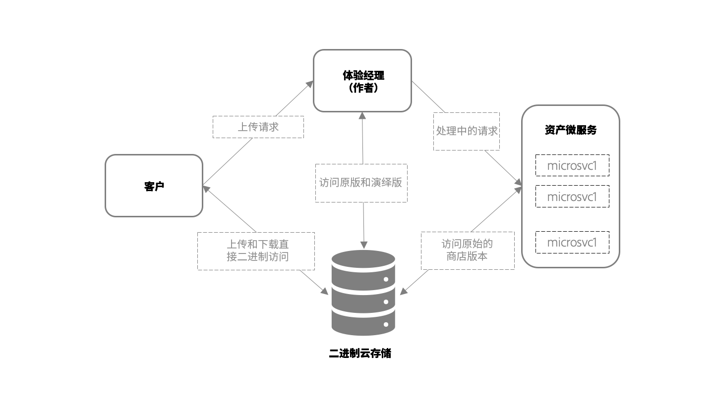

# 使用资产微服务获取和处理资产的概述 {#asset-microservices-overview}

Adobe Experience Manager as a [!DNL Cloud Service]提供了云原生方法来利用Experience Manager应用程序和功能。 此新架构的一个关键元素是由资产微服务提供支持的资产摄取和处理。 资产微服务使用云服务提供资产的可扩展且可复原的处理。 Adobe可管理云服务，以优化处理不同资产类型和处理选项。 云原生资产微服务的主要优势包括：

* 可扩展的体系结构，允许对资源密集型操作进行无缝处理。
* 高效的索引和文本提取，不会影响Experience Manager环境的性能。
* 在Experience Manager环境中最大限度地减少工作流处理资产处理的需要。 这样可释放资源，最大限度地减少Experience Manager负载，并提供可扩展性。
* 提高了资产处理的可复原性。 处理非典型文件（如损坏的文件或超大的文件）时的潜在问题不再影响部署的性能。
* 为管理员简化了资产处理配置。
* 资产处理设置由Adobe进行管理和维护，以提供最已知的配置，用于处理各种文件类型的演绎版、元数据和文本提取
* 在适用的情况下，使用本机Adobe文件处理服务，提供高保真输出和[高效处理Adobe专有格式](file-format-support.md)。
* 能够配置后处理工作流以添加用户特定的操作和集成。

资产微服务有助于避免使用第三方渲染工具和方法（如[!DNL ImageMagick]和FFmpeg转码）并简化配置，同时在默认情况下为常用文件格式提供基本功能。

## 高级架构 {#asset-microservices-architecture}

高级架构图描述了资产获取和处理以及整个系统中资产流的关键元素。

<!-- Proposed DRAFT diagram for asset microservices overview - see section "Asset processing - high-level diagram" in the PPTX deck

https://adobe-my.sharepoint.com/personal/gklebus_adobe_com/_layouts/15/guestaccess.aspx?guestaccesstoken=jexDC5ZnepXSt6dTPciH66TzckS1BPEfdaZuSgHugL8%3D&docid=2_1ec37f0bd4cc74354b4f481cd420e07fc&rev=1&e=CdgElS
-->

使用资产微服务获取和处理的关键步骤包括：

* 客户端(如Web浏览器或Adobe资产链接)会向[!DNL Experience Manager]发送上传请求，然后开始将二进制文件直接上传到二进制云存储。
* 当直接二进制上传完成时，客户端会通知[!DNL Experience Manager]。
* [!DNL Experience Manager] 向资产微服务发送处理请求。请求内容取决于[!DNL Experience Manager]中指定的处理配置文件配置，以及要生成的演绎版。
* 资产微服务后端接收请求，并根据请求将其调度到一个或多个微服务。 每个微服务都直接从二进制云存储中访问原始二进制文件。
* 处理结果（如演绎版）存储在二进制云存储中。
* Experience Manager会收到处理已完成，并且有指向所生成二进制文件（演绎版）的直接指针。 生成的演绎版可在[!DNL Experience Manager]中用于上传的资产。

这是资产获取和处理的基本流程。 如果已配置，Experience Manager还可以启动自定义工作流模型以对资产进行后处理。 例如，执行特定于您环境的自定义步骤，例如从企业系统获取信息并添加到资产属性。

摄取和处理流程是资产微服务架构的关键概念，用于Experience Manager。

* **直接二进制访问**:在为Experience Manager环境配置资产后，资产会被传输（并上传）到云二进制存储，然后 [!DNL Experience Manager]再传输资产微服务，最终客户可以直接访问资产以执行其工作。这样可最大程度地减少网络负载和存储的二进制文件的重复
* **外部化处理**:资产处理在环境之外完 [!DNL Experience Manager] 成，并节省其资源（CPU、内存），以便为最终用户提供关键数字资产管理(DAM)功能并支持与系统进行交互式工作

## 通过直接二进制访问上传资产 {#asset-upload-with-direct-binary-access}

Experience Manager客户端是产品服务的一部分，默认情况下，所有支持通过直接二进制访问上传。 这些功能包括使用Web界面上传、Adobe资产链接和[!DNL Experience Manager]桌面应用程序。

您可以使用自定义上传工具，这些工具可直接与[!DNL Experience Manager] HTTP API配合使用。 您可以直接使用这些API，或者使用和扩展以下实施上传协议的开源项目：

* [开源上载库](https://github.com/adobe/aem-upload)
* [开源命令行工具](https://github.com/adobe/aio-cli-plugin-aem)

有关更多信息，请参阅[上传资产](add-assets.md)。

## 添加自定义资产后处理 {#add-custom-asset-post-processing}

虽然大多数客户应该通过可配置的资产微服务来满足其所有资产处理需求，但有些客户可能需要额外的资产处理。 如果需要根据来自其他系统（通过集成）的信息来处理资产，则尤为如此。 在这种情况下，可以使用自定义的后处理工作流。

后处理工作流是常规的[!DNL Experience Manager]工作流模型，在[!DNL Experience Manager]工作流编辑器中创建和管理。 客户可以配置工作流以对资产执行其他处理步骤，包括使用可用的现成工作流步骤和自定义工作流。

Adobe Experience Manager可配置为在资产处理完成后自动触发后处理工作流。

<!-- TBD asgupta, Engg: Create some asset-microservices-data-flow-diagram.
-->

>[!MORELIKETHIS]
>
>* [开始使用资产微服务](asset-microservices-configure-and-use.md)
* [支持的文件格式](file-format-support.md)
* [Adobe Asset Link](https://helpx.adobe.com/cn/enterprise/using/adobe-asset-link.html)
* [[!DNL Experience Manager] 桌面应用程序](https://experienceleague.adobe.com/docs/experience-manager-desktop-app/using/introduction.html)
* [关于直接二进制访问的Apache Oak文档](https://jackrabbit.apache.org/oak/docs/features/direct-binary-access.html)

