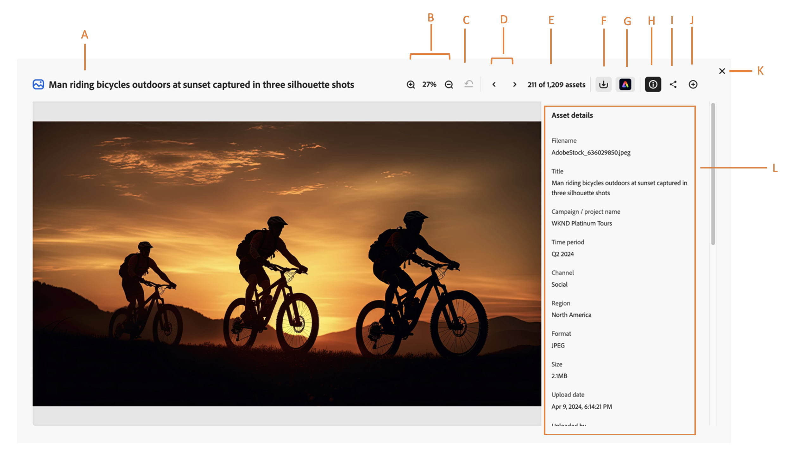

# 在Content Hub中管理资源属性 {#asset-properties}

| [搜索最佳实践](/help/assets/search-best-practices.md) | [元数据最佳实践](/help/assets/metadata-best-practices.md) | [Content Hub](/help/assets/product-overview.md) | 具有OpenAPI功能的[Dynamic Media](/help/assets/dynamic-media-open-apis-overview.md) | [AEM Assets开发人员文档](https://developer.adobe.com/experience-cloud/experience-manager-apis/) |
| ------------- | --------------------------- |---------|----|-----|

[!DNL The Content Hub]允许您查看对有效分配资产至关重要的资产的相关信息。 它是资产所有可用数据的集合。

查看资源属性可帮助您进一步对资源进行分类，在数字信息量增长时非常有用。 它可以基于文件名、缩略图和内存管理数百个文件。但是，当涉及的人数以及托管资源数量增加时，此方法不可扩展。 此外，数字资源的价值会随着资源的变化而增长：

* 更易于访问 - 系统和用户可以轻松地找到它。
* 更易于管理 — 您可以轻松地找到具有一组相同属性的资源并对其应用更改。
* 完整 — 资产包含更多信息和上下文。

## 先决条件 {#prerequisites}

[Content Hub用户](deploy-content-hub.md#onboard-content-hub-users)可以执行本文中提到的操作。

## 查看资源的属性 {#properties-ui}

在使用、共享或下载资源之前，您可以更细致地查看该资源。使用预览功能，您不仅可以查看图像，还可以查看一些其他支持的资源类型。 您不仅可以查看资源，还可以查看其详细信息并采取其他操作。 要查看某个资产的信息，请导航到该资产或[搜索](search-assets.md)该资产，然后单击该资产以打开其属性。 下图演示了资源属性页面上可用的字段：

* **A：**&#x200B;资源的标题
* **B：**&#x200B;通过放大或缩小更细致地缩放或预览资源的百分比
* **C：**&#x200B;撤消缩放到以前选择的百分比
* **D：**&#x200B;继续上一个或下一个资源
* **E：** Assets计数
* **F：**&#x200B;下载资源
* **G：**&#x200B;使用[!DNL Adobe Express]编辑资源
* **小时：**&#x200B;折叠或预览资源信息
* **I：**&#x200B;共享资源
* **J：**&#x200B;将资源添加到[!DNL Collection]
* **K：**&#x200B;关闭预览屏幕
* **L：**&#x200B;资产的信息，包括标题、格式、大小、分辨率、标记、颜色标记和智能标记。

## 支持的格式 {#supported-formats}

下表演示了[!DNL the Content Hub]中支持的文件格式：

<table> 
    <tbody>
     <tr>
      <th><strong>文件类型</strong></th>
      <th><strong>支持的格式</strong></th>
     </tr>
     <tr>
      <td>图像</td>
      <td>
        <ul>
            <li>[！UICONTROLJPEG]</li> 
            <li>[！UICONTROL PNG]</li> 
            <li>[！UICONTROLSVG]</li>
        </ul>
      </td>
     </tr>
     <tr>
      <td>视频</td>
      <td>
        <ul>
            <li>[！UICONTROL Quicktime]</li>  
            <li>[！UICONTROL MP4]</li> 
        </ul>
      </td>
     </tr>
      <tr>
      <td>文档</td>
      <td>
        <ul>
            <li>[！UICONTROL txt]（纯）</li>  
            <li>[！UICONTROL Doc/Docx]</li> 
            <li>[！UICONTROL XML]</li>
        </ul>
      </td>
     </tr>
     <tr>
      <td>打印介质</td>
      <td>
        <ul>
            <li>[！UICONTROLPDF]</li>  
        </ul>
      </td>
     </tr>  
    </tbody>
   </table>

### 上传资产后的派生属性 {#derived-properties}

上传资源后，Content Hub会派生出一些自动生成的资产。 以下是其中一些规则列表：

* **大小：**&#x200B;大小根据资产的维度演示资产的逻辑值。 它可阐明资产在存储库中占用的空间。 [!DNL The Content Hub]支持高达2GB的资源。

<!--* **Tags:** Tags help you categorize assets that can be browsed and searched more efficiently. Tagging helps in propagating the appropriate taxonomy to other users and workflows. -->

* **智能标记：** [!DNL The Content Hub]使用Adobe Sensei的智能内容服务，在基于标记的结构上使用识别算法来培训资源。 然后，此内容智能可用于将相关标记应用到其他资产集。 智能标记可帮助您快速查找相关资产，从而提高项目的内容速度。 智能标记是未包含在图像中的资产信息示例。 默认情况下，[!DNL The Content Hub]会自动将智能标记应用于资源。

* **颜色标记：** [颜色标记](#https://experienceleague.adobe.com/docs/experience-manager-cloud-service/content/assets/manage/color-tag-images.html?lang=en)可帮助您使用通过Adobe的Sensei AI功能在资源中自动识别的颜色识别资源。

* 上传日期

* 上传者

* 上次修改时间

* 上次修改人

向Content Hub添加资源时，还会指定一些资产。 有关详细信息，请参阅[将品牌批准的资源添加到Content Hub](upload-brand-approved-assets.md)。 这些属性也会显示在资产属性页面上。

管理员还可以配置为每个资源显示的属性。 有关详细信息，请参阅[配置Content Hub用户界面](configure-content-hub-ui-options.md#configure-asset-details-content-hub)。

<!--

### Date range {#date-range} 

The date range allows you to select dates you want to see the assets. You can customize date range by choosing the start and end dates. 

-->
