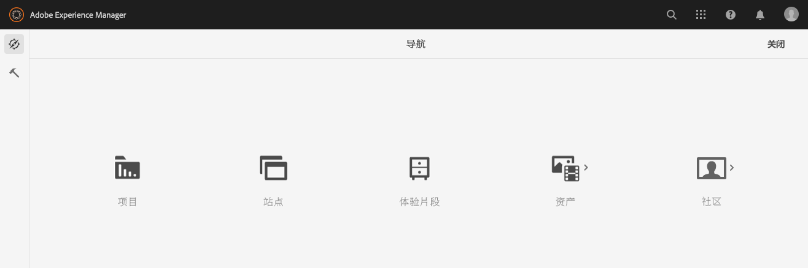

# 资源报表 {#asset-reports}

资产报表允许您评估 [!DNL Adobe Experience Manager Assets] 部署。 使用 [!DNL Assets]，则可以为数字资产生成各种报表。 这些报表提供有关您的系统使用情况、用户与资产的交互方式以及哪些资产的有用信息 <!-- downloaded and --> 共享。

使用报表中的信息获取关键成功量度，以衡量 [!DNL Assets] 企业内部和客户。

的 [!DNL Assets] 报告框架使用 [!DNL Sling] 以异步方式处理报表请求的作业。 它可用于大型存储库。 异步报表处理提高了生成报表的效率和速度。

报表管理界面是直观的，包括用于访问已存档报表和查看报表运行状态（成功、失败和已排队）的细粒度选项和控件。

生成报告后，系统会通过 <!-- through an email (optional) and --> 收件箱通知。 您可以从报表列表页面查看、下载或删除报表，其中显示了所有以前生成的报表。

## 生成报表 {#generate-reports}

[!DNL Experience Manager Assets] 会为您生成以下标准报表：

* 上传
* 到期时间
* 修改
* 发布
* [!DNL Brand Portal] 发布
* 磁盘使用情况
* 文件
* 链接共享

<!-- Removed download report.
* Upload
* Download
* Expiration
* Modification
* Publish
* [!DNL Brand Portal] publish
* Disk Usage
* Files
* Link Share
-->

[!DNL Adobe Experience Manager] 管理员可以轻松地为您的实施生成和自定义这些报表。 管理员可以按照以下步骤生成报表：

1. 在 [!DNL Experience Manager] 界面，单击 **[!UICONTROL 工具]** > **[!UICONTROL 资产]** > **[!UICONTROL 报表]**.

   

1. 在 [!UICONTROL 资产报表] 页面，单击 **[!UICONTROL 创建]** 中。
1. 从 **[!UICONTROL 创建报表]** 页面，选择要创建的报表并单击 **[!UICONTROL 下一个]**.

   

1. 在存储报表的CRX存储库中配置报表详细信息，如标题、描述、缩略图和文件夹路径。 默认情况下，文件夹路径为 `/content/dam`. 您可以指定其他路径。

   

   选择报表的日期范围。 您可以选择立即生成报表，也可以选择在将来的日期和时间生成报表。

   >[!NOTE]
   >
   >如果您选择稍后计划报表，请确保在“日期”和“时间”字段中指定日期和时间。 如果您没有指定任何值，报表引擎会将其视为即时生成的报表。

   配置字段可能因您创建的报表类型而异。 例如， **[!UICONTROL 磁盘使用情况]** 报表提供了一些选项，用于在计算资产使用的磁盘空间时包含资产演绎版。 您可以选择在子文件夹中包含或排除资产，以便计算磁盘使用情况。

   >[!NOTE]
   >
   >**[!UICONTROL 磁盘使用情况]**&#x200B;报表不包含日期范围字段，因为它仅指示当前磁盘空间使用情况。

   

   创建 **[!UICONTROL 文件]** 报表中，您可以包含/排除子文件夹。 但是，您不能为此报表包含资产演绎版。

   

   的 **[!UICONTROL 链接共享]** 报表显示与内部外部用户共享的资产的URL [!DNL Assets]. <!-- It includes email ids of the user who shared the assets, emails ids of users with which the assets are shared, share date, and expiration date for the link. -->列不可自定义。

   的 **[!UICONTROL 链接共享]** ，不包括子文件夹和演绎版的选项，因为它仅发布下面显示的共享URL `/var/dam/share`.

   

1. 单击 **[!UICONTROL 下一个]** 中。

1. 在 **[!UICONTROL 配置列]** 页面，默认情况下会选择某些列以在报表中显示。 您可以选择更多列。 取消所选列以将其排除在报表中。

   

   要显示自定义列名称或属性路径，请在 `jcr:content` 节点。 或者，通过属性路径选取器添加。

   

1. 单击 **[!UICONTROL 创建]** 中。 系统会显示一条消息，通知已开始生成报告。
1. 在 [!UICONTROL 资产报表] 页面，则报表生成状态基于报表作业的当前状态，例如 [!UICONTROL 成功], [!UICONTROL 失败], [!UICONTROL 已排队]或 [!UICONTROL 已计划]. 通知收件箱中会显示相同的状态。要查看报表页面，请单击报表链接。 或者，选择报表，然后单击 **[!UICONTROL 查看]** 中。

   

   单击 **[!UICONTROL 下载]** 从工具栏下载CSV格式的报表。

## 向报表添加自定义列 {#add-custom-columns}

您可以向以下报表添加自定义列，以显示符合您自定义要求的更多数据：

<!-- Remove download report.
* Upload
* Download
* Expiration
* Modification
* Publish
* [!DNL Brand Portal] publish
* Files
-->

* 上传
* 到期时间
* 修改
* 发布
* [!DNL Brand Portal] 发布
* 文件

要向这些报表添加自定义列，请执行以下步骤：

1. 在 [!DNL Manager interface]，单击 **[!UICONTROL 工具]** > **[!UICONTROL 资产]** > **[!UICONTROL 报表]**.
1. 在 [!UICONTROL 资产报表] 页面，单击 **[!UICONTROL 创建]** 中。

1. 从 **[!UICONTROL 创建报表]** ，请选择要创建的报表。 单击&#x200B;**[!UICONTROL 下一步]**。

1. 根据需要配置报表详细信息，如标题、描述、缩略图、文件夹路径和日期范围。 单击&#x200B;**[!UICONTROL 下一步]**。

1. 从 **[!UICONTROL 默认列]**. 要显示自定义列，请在 **[!UICONTROL 自定义列]**.

   

1. 在 `jcr:content` 节点。 或者，在属性路径字段中键入路径。

   

   要添加更多自定义列，请单击 **[!UICONTROL 添加]** 并重复上述步骤。

1. 单击 **[!UICONTROL 创建]** 中。 系统会显示一条消息，通知已开始生成报告。

<!-- TBD: How to configure purge now? Is it using OSGi configurations?

## Configure purging service {#configure-purging-service}

To remove reports that you no longer require, configure the DAM Report Purge service from the web console to purge existing reports based on their quantity and age.

1. Access the web console (configuration manager) from `https://[aem_server]:[port]/system/console/configMgr`.
1. Open the **[!UICONTROL DAM Report Purge Service]** configuration.
1. Specify the frequency (time interval) for the purging service in the `scheduler.expression.name` field. You can also configure the age and the quantity threshold for reports.
1. Save the changes.
-->

## 故障诊断信息 {#tips-troubleshoot}

* 如果 [!UICONTROL 磁盘使用情况报表] 不生成，如果您使用 [!DNL Dynamic Media]，请确保所有资产均正确继续。 要解析，请重新处理资产并再次生成报表。

<!-- These notes were present in generate report section above. Removing commented text from in between the instructions to preserve the numbering of the ordered list.

TBD: How do enable this in CS now? Is it done using some OSGi config now?
   >[!NOTE]
   >
   >Before you can generate an **[!UICONTROL Asset Downloaded]** report, ensure that the Asset Download service is enabled. From the web console (`https://[aem_server]:[port]/system/console/configMgr`), open the **[!UICONTROL Day CQ DAM Event Recorder]** configuration, and select the **[!UICONTROL Asset Downloaded (DOWNLOADED)]** option in Event Types if not already selected.
-->

<!-- Removed download report.
   >[!NOTE]
   >
   >By default, the Content Fragments and link shares are included in the asset [!UICONTROL Download] report. Select the appropriate option to create a report of link shares or to exclude Content Fragments from the download report.

   >[!NOTE]
   >
   >The [!UICONTROL Download] report displays details of only those assets which are downloaded after selecting individually or are downloaded using Quick Action. However, it does not include the details of the assets that are inside a downloaded folder.
-->
