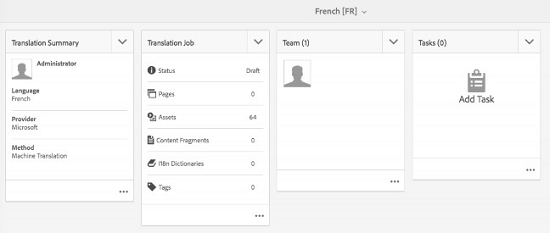

# 资产分析 {#asset-insights}

Asset Insights跟踪第三方网站、营销活动和Adobe创意解决方案中使用的图像的用户评级和使用情况统计。 它有助于提供有关图像性能和受欢迎程度的洞察。

资产分析可捕获用户活动详细信息，如对图像进行评级、点击次数和展示次数（在网站上加载图像的次数）。 它根据这些统计信息为图像分配分数。 您可以使用分数和性能统计信息选择热门图像，以将其纳入目录、营销活动等。 您甚至可以根据这些统计信息制定存档和许可证续订策略。

要使用资产分析从网站捕获图像的使用情况统计信息，您必须在网站代码中包含图像的嵌入代码。

要让资产分析显示资产的使用情况统计信息，请首先配置该功能，以从Adobe Analytics获取报告数据。 有关详细信息，请 [参阅配置资产分析](#configure-asset-insights)。

>[!NOTE]
>
>只支持并提供图像洞察。

## 图像的视图统计 {#viewing-statistics-for-an-image}

您可以从元数据页面视图资产分析得分。

1. 从资产用户界面(UI)中，选择图像，然后点按工 **[!UICONTROL 具栏]** 中的属性。
1. 在属性页面中，点按 **[!UICONTROL 分析]**。
1. 在“洞察”选项卡中查看资产的使用 **[!UICONTROL 情况]** 详细信息。 分数 **[!UICONTROL 部分]** ，描述资产的资产使用总数和性能存储。

   使用情况分数描述资产在各种解决方案中的使用次数。

   展示 **[!UICONTROL 次数]** (Impessions)得分是资产在网站上加载的次数。 单击次数 **[!UICONTROL 下显]** 示的数量是单击资产的次数。

1. 查看“ **[!UICONTROL 使用统计]** ”部分，了解资产所属的实体以及最近使用的创意解决方案。 使用率越高，资产在用户中受欢迎的可能性就越大。 使用情况数据显示在以下标题下：

   * **[!UICONTROL 资产]**: 资产加入集合或复合资产的次数。
   * **[!UICONTROL Web和移动]**: 资产加入网站和应用程序的次数。
   * **[!UICONTROL 社交]**: 资产在解决方案(如Adobe Social和Adobe Campaign)中的使用次数。
   * **[!UICONTROL 电子邮件]**: 资产在电子邮件活动中的使用次数。
   

   >[!NOTE]
   >
   >由于资产分析功能通常会定期从Adobe Analytics中获取解决方案数据，因此解决方案部分可能不会显示最新数据。 显示数据的时间段取决于资产分析运行以检索Analytics数据的提取操作的计划。

1. 要以图形方式查看一段时间内资产的性能统计信息，请在&#x200B;**[!UICONTROL 性能统计信息]**&#x200B;部分中选择时间段。包括点击次数和印象在内的详细信息将显示为图形的趋势线。

   

   >[!NOTE]
   >
   >与“解决方案”部分中的数据不同，“性能统计”部分显示最新数据。

1. 要获取包含在网站中的资产的嵌入代码以获取性能数据，请点按／单击资产 **[!UICONTROL 缩略图下方的获]** 取嵌入代码。 <!-- For more information on how to include your Embed code in third-party web pages, see [Using Page Tracker and Embed code in web pages](/help/assets/use-page-tracker.md). -->

   

## 视图聚合图像统计 {#viewing-aggregate-statistics-for-images}

您可以使用&#x200B;**[!UICONTROL 分析视图]**&#x200B;同时查看文件夹中所有资产的分数。

1. 在资产UI中，导航到包含要视图洞察的资产的文件夹。
1. 点按／单击工具栏中的布局图标，然后选择 **[!UICONTROL 分析视图]**。
1. 该页面显示资产的使用分数。 比较各个资产的评级并进行分析。

## 计划背景作业 {#scheduling-background-job}

资产分析会定期从Adobe Analytics报表包获取资产的使用数据。 默认情况下，资产分析每24小时在凌晨2点运行一次后台作业以获取数据。 但是，您可以通过从Web控制台配置Adobe CQ DAM资产性能 **[!UICONTROL 报表同步作业服务来修改频率]** 和时间。

1. 点按 AEM 徽标，然后转到&#x200B;**[!UICONTROL 工具]** > **[!UICONTROL 操作]** > **[!UICONTROL Web Console]**。
1. 打开 **[!UICONTROL Adobe CQ DAM资产性能报表同步作业服务配置]** 。

   

1. 在属性调度程序表达式中指定作业的所需开始频率和调度程序时间。 保存更改。

## 配置资产分析 {#configure-asset-insights}

Adobe Experience Manager(AEM)资产可从Adobe Analytics获取第三方网站所使用的AEM资产的使用数据。 要使资产分析能够检索此数据并生成洞察，请首先配置该功能以与Adobe Analytics集成。

>[!NOTE]
>
>只支持并提供图像洞察。

1. 在 AEM 中，单击&#x200B;**[!UICONTROL 工具]** > **[!UICONTROL Assets]**。

   

1. 单击&#x200B;**[!UICONTROL 分析配置]**&#x200B;卡。
1. 在向导中，选择一个数据中心并提供您的凭据，包括您的组织名称、用户名和共享机密。

   

   *图： 在AEM中为资产分析配置Adobe Analytics*

1. 单击／点按 **[!UICONTROL 身份验证]**。在AEM验证您的凭据后，从报 **[!UICONTROL 表包列表]** ，选择您希望资产分析从中获取数据的Adobe Analytics报表包。 单击&#x200B;**[!UICONTROL 添加]**。
1. AEM设置报表包后，点按完 **[!UICONTROL 成]**。

### 页面跟踪器 {#page-tracker}

配置Adobe Analytics帐户后，将为您生成页面跟踪器代码。 要使资产分析能够跟踪第三方网站中使用的AEM资产，请在网站代码中包含页面跟踪器代码。 在AEM资产中使用页面跟踪器实用程序生成页面跟踪器代码。 <!--  For more information on how to include your Page Tracker code in third-party web pages, see [Using Page Tracker and Embed code in web pages](/help/assets/use-page-tracker.md). -->

1. 在 AEM 中，单击&#x200B;**[!UICONTROL 工具]** > **[!UICONTROL Assets]**。

   

1. 从&#x200B;**[!UICONTROL 导航]**&#x200B;页面中，单击&#x200B;**[!UICONTROL 分析页面跟踪器]**&#x200B;卡。
1. 单击 **[!UICONTROL “下载]** ”以下载页面跟踪器代码。

<!--

## Using demo package for Asset Insights {#using-demo-package-for-asset-insights}

Using the demo package, you can enable Adobe Asset Insights to capture data from and generate insights for a sample web page.

1. Configure Asset Insights using the instructions in [Configure Asset Insights](#configure-asset-insights).
1. Download the sample AEM Assets package from below and install the package from CRXDE package manager.

   [Get File](assets/insightsdemo.zip)

1. Download the ZIP file containing the sample web page from below and extract on your local file system.

   [Get File](assets/demosite.zip)

1. Click the web page to open it in the web browser.

   >[!CAUTION]
   >
   >Web Page is configured to load asset from the localhost server . In case your server is running somewhere else change server address from localhost to server address in the HTML content of the web page.

   >[!NOTE]
   >
   >The external web page can be in AEM itself.

-->
