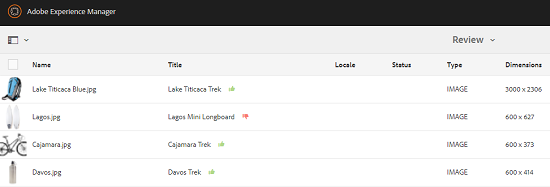

# 查看文件夹和收藏集中的资源 {#review-folder-assets-and-collections}

| 版本 | 文章链接 |
| -------- | ---------------------------- |
| AEM 6.5 | [单击此处](https://experienceleague.adobe.com/docs/experience-manager-65/assets/using/bulk-approval.html?lang=en) |
| AEM as a Cloud Service | 本文 |

使用Adobe Experience Manager Assets，您可以为文件夹或收藏集中的资源设置临时审核工作流。 您可以与审阅人或创意合作伙伴共享此内容，以征求他们的反馈。 您可以将审阅工作流与项目关联或创建独立审阅任务。

共享资源后，审核者可以批准或拒绝这些资源。 通知会在工作流的各个阶段发送，以通知目标收件人各个任务的完成。 例如，当您共享文件夹或收藏集时，审阅人会收到一则通知，指出已共享文件夹/收藏集以供审阅。

在审核者完成审核（批准或拒绝资产）后，您将收到审核完成通知。

## 创建文件夹审阅任务 {#creating-a-review-task-for-folders}

1. 从Assets用户界面中，选择要为其创建审阅任务的文件夹。
1. 从工具栏中，选择 **[!UICONTROL 创建审阅任务]** 图标以打开 **[!UICONTROL 审核任务]** 页面。 如果工具栏中看不到该图标，请选择 **[!UICONTROL 更多]** 然后选择图标。

   

1. （可选）从 **[!UICONTROL 项目]** 列表，选择要与审阅任务关联的项目。 默认情况下， **[!UICONTROL 无]** 已选中选项。 如果不希望将任何项目与审阅任务相关联，请保留此选择。

   >[!NOTE]
   >
   >只有您具有编辑器级别权限（或更高版本）的项目才会显示在 **[!UICONTROL 项目]** 列表。

1. 输入审核任务的名称，然后从中选择一个批准者 **[!UICONTROL 分配给]** 列表。

   >[!NOTE]
   >
   >所选项目的成员/组可作为批准者出现在 **[!UICONTROL 分配给]** 列表。

1. 输入审阅任务的描述、任务优先级和到期日。

   

1. 在高级选项卡中，输入要用于创建URI的标签。

   

1. 选择 **[!UICONTROL 提交]**，然后选择 **[!UICONTROL 完成]** 以关闭确认消息。 新任务的通知将发送给审批者。
1. 登录 [!DNL Experience Manager Assets] 以审批者身份导航到资产UI。 要批准资产，请选择 **[!UICONTROL 通知]** 图标，然后从列表中选择审阅任务。

   

1. 在 **[!UICONTROL 审核任务]** 页，检查复查任务的详细资料，然后选择 **[!UICONTROL 审核]**.
1. 在 **[!UICONTROL 审核任务]** 页面中，选择资源，然后选择 **[!UICONTROL 批准/拒绝]** 图标以批准或拒绝（根据需要）。

   

1. 选择 **[!UICONTROL 完成]** 图标。 在对话框中，输入注释并选择  **[!UICONTROL 完成]** 以确认。
1. 导航到资产UI，然后打开文件夹。 资产的审批状态图标会同时显示在卡片视图和列表视图中。

   **信息卡视图**

   

   **列表视图**

   

## 创建收藏集的审核任务 {#creating-a-review-task-for-collections}

1. 从“收藏集”页面中，选择要为其创建审阅任务的收藏集。
1. 从工具栏中，选择 **[!UICONTROL 创建审阅任务]** 图标以打开 **[!UICONTROL 审核任务]** 页面。 如果工具栏中看不到该图标，请选择 **[!UICONTROL 更多]** 然后选择图标。

   

1. （可选）从 **[!UICONTROL 项目]** 列表，选择要与审阅任务关联的项目。 默认情况下， **[!UICONTROL 无]** 已选中选项。 如果不希望将任何项目与审阅任务相关联，请保留此选择。

   >[!NOTE]
   >
   >只有您具有编辑器级别权限（或更高版本）的项目才会显示在 **[!UICONTROL 项目]** 列表。

1. 输入审核任务的名称，然后从中选择一个批准者 **[!UICONTROL 分配给]** 列表。

   >[!NOTE]
   >
   >所选项目的成员/组可作为批准者出现在 **[!UICONTROL 分配给]** 列表。

1. 输入审阅任务的描述、任务优先级和到期日。

   

1. 选择 **[!UICONTROL 提交]**，然后选择 **[!UICONTROL 完成]** 以关闭确认消息。 新任务的通知将发送给审批者。
1. 登录 [!DNL Experience Manager Assets] 以审批者身份导航到资产控制台。 要批准资产，请选择 **[!UICONTROL 通知]** 图标，然后从列表中选择审阅任务。
1. 在 **[!UICONTROL 审核任务]** 页，检查复查任务的详细资料，然后选择 **[!UICONTROL 审核]**.
1. 收藏集中的所有资产均显示在审核页面上。 选择资源并选择 **[!UICONTROL 批准/拒绝]** 图标以批准或拒绝资产（根据需要）。

   

1. 选择 **[!UICONTROL 完成]** 图标。 在对话框中，输入注释并选择 **[!UICONTROL 完成]** 以确认。
1. 导航到收藏集控制台并打开收藏集。 资产的审批状态图标会同时显示在卡片视图和列表视图中。

   **信息卡视图**

   

   **列表视图**

   

**另请参阅**

* [翻译资源](translate-assets.md)
* [Assets HTTP API](mac-api-assets.md)
* [资源支持的文件格式](file-format-support.md)
* [搜索资源](search-assets.md)
* [连接的资源](use-assets-across-connected-assets-instances.md)
* [资源报告](asset-reports.md)
* [元数据架构](metadata-schemas.md)
* [下载资源](download-assets-from-aem.md)
* [管理元数据](manage-metadata.md)
* [搜索 Facet](search-facets.md)
* [管理收藏集](manage-collections.md)
* [批量元数据导入](metadata-import-export.md)
