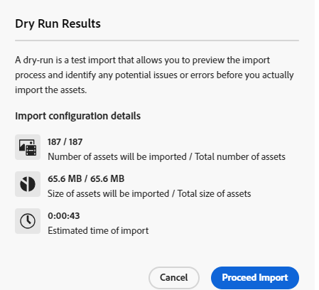

# 使用资源视图批量导入资源  {#bulk-import-assets-view}

通过AEM Assets视图中的批量导入，管理员能够将大量资源从数据源导入到AEM Assets。 管理员不再需要将单个资源或文件夹上传到AEM Assets。

>[!NOTE]
>
>资产视图批量导入程序使用与管理员视图批量导入程序相同的后端。 但是，它提供了更多可从中导入的数据源，并提供了更简化的用户体验。

您可以从以下数据源导入资源：

* Azure
* AWS
* Google Cloud
* Dropbox

## 前提条件 {#prerequisites}

| 数据源 | 前提条件 |
|-----|------|
| Azure | <ul> <li>Azure 存储帐户 </li> <li> Azure Blob 容器 <li> 基于身份验证模式的Azure访问密钥或SAS令牌 </li></ul> |
| AWS | <ul> <li>AWS地区 </li> <li> AWS 分段 <li> AWS 访问密钥 </li><li> AWS 访问私钥 </li></ul> |
| Google Cloud | <ul> <li>GCP 桶 </li> <li> GCP 服务帐户电子邮件 <li> GCP 服务帐户私钥</li></ul> |
| Dropbox | <ul> <li>客户端IDDropbox </li> <li> 客户端密码Dropbox</li></ul> |

除了基于数据源的这些先决条件外，您还必须了解数据源中可用的源文件夹名称，该名称包含需要导入到AEM Assets的所有资源。

## 创建批量导入配置 {#create-bulk-import-configuration}

执行以下步骤以创建批量导入配置：

1. 导航到 **[!UICONTROL 设置]** > **[!UICONTROL 批量导入]** 并单击 **[!UICONTROL 创建导入]**.
1. 选择数据源。 可用选项包括Azure、AWS、Google Cloud和Dropbox。
1. 在中指定批量导入配置的名称 **[!UICONTROL 名称]** 字段。
1. 指定数据源特定的凭据，如中所述 [先决条件](#prerequisites).
1. 提供在数据源中包含资产的根文件夹的名称 **[!UICONTROL 源文件夹]** 字段。
1. （可选）选择 **[!UICONTROL 导入后删除源文件]** 选项，用于在文件导入Experience Manager Assets后从源数据存储中删除原始文件。
1. 选择 **[!UICONTROL 导入模式]**. 选择 **[!UICONTROL 跳过]**， **[!UICONTROL 替换]**，或 **[!UICONTROL 创建版本]**. 跳过模式是默认模式，在此模式下，引入器会跳过以导入已存在的资产。
   

1. （可选）在元数据文件字段中指定要导入的元数据文件（以CSV格式提供），然后单击 **[!UICONTROL 下一个]** 导航到 **[!UICONTROL 位置和过滤器]**.
1. 在DAM中定义要使用导入资产的位置 **[!UICONTROL 资产目标文件夹]** 字段，指定路径。 例如：`/content/dam/imported_assets`。
1. （可选）在 **[!UICONTROL 选择筛选器]** 部分，提供以MB为单位的资源的最小文件大小，以将其包含在的摄取进程中 **[!UICONTROL 按最小大小筛选]** 字段。
1. （可选）提供资产的最大文件大小（以MB为单位），以将其包含在的摄取流程中 **[!UICONTROL 按最大大小筛选]** 字段。
1. （可选）使用以下方式选择要包含在摄取流程中的MIME类型 **[!UICONTROL 包括MIME类型]** 字段。 您可以在此字段中选择多个MIME类型。 如果未定义值，则所有MIME类型都将包含在摄取流程中。

1. （可选）使用以下方式选择要在摄取流程中排除的MIME类型 **[!UICONTROL 排除MIME类型]** 字段。 您可以在此字段中选择多个MIME类型。 如果未定义值，则所有MIME类型都将包含在摄取流程中。

   

1. 单击&#x200B;**[!UICONTROL 下一步]**。选择 **[!UICONTROL 保存并运行导入]** 以保存配置并运行批量导入。 选择 **[!UICONTROL 保存导入]** 暂时保存配置，以便稍后运行。

   

1. 单击 **[!UICONTROL 保存]** 执行选定的选项。

### 在批量导入期间处理文件名 {#filename-handling-bulkimport-assets-view}

批量导入资源或文件夹时， [!DNL Experience Manager Assets] 导入导入源中存在的全部结构。 [!DNL Experience Manager] 遵循资产和文件夹名称中特殊字符的内置规则，因此需要清理这些文件名。 对于文件夹名称和资产名称，用户定义的标题保持不变，并存储在中 `jcr:title`.

在批量导入期间， [!DNL Experience Manager] 查找现有文件夹以避免重新导入资产和文件夹，还可验证在导入发生的父文件夹中应用的清理规则。 如果在父文件夹中应用了清理规则，则相同的规则将应用于导入源。 对于新导入，将应用以下清理规则来管理资源和文件夹的文件名。

有关在批量导入期间不允许使用的名称、处理资产名称和处理文件夹名称的详细信息，请参阅 [在管理员视图中批量导入期间处理文件名](add-assets.md##filename-handling-bulkimport).

## 查看现有批量导入配置 {#view-import-configuration}

如果您选择在创建配置后保存配置，则该配置将显示在 **[!UICONTROL 保存的导入]** 选项卡。

如果选择保存并运行导入，则导入配置将显示在 **[!UICONTROL 执行的导入]** 选项卡。

如果您计划了导入，它将显示在 **[!UICONTROL 计划的导入]** 选项卡。

## 编辑批量导入配置 {#edit-import-configuration}

要编辑配置详细信息，请单击……对应于配置名称，然后单击 **[!UICONTROL 编辑]**. 执行编辑操作时，无法编辑配置和导入数据源的标题。 您可以使用“已执行”、“已计划”或“已保存的导入”选项卡编辑配置。

## 计划一次性或定期导入 {#schedule-imports}

要计划一次性或循环批量导入，请执行以下步骤：

1. 单击与中可用的配置名称对应的…… **[!UICONTROL 执行的导入]** 或 **[!UICONTROL 保存的导入]** 选项卡，然后单击 **[!UICONTROL 计划]**. 您还可以导航到，重新计划现有的计划导入 **[!UICONTROL 计划的导入]** 选项卡，然后单击 **[!UICONTROL 计划]**.

1. 设置一次性摄取，或安排每小时、每天或每周一次的时间表。 单击 **[!UICONTROL 提交]**.

   

## 执行导入运行状况检查 {#import-health-check}

要验证与数据源的连接，请单击……对应于配置名称，然后单击 **[!UICONTROL Check]**. 如果连接成功，Experience Manager Assets会显示以下消息：

## 在执行导入之前执行试运行 {#dry-run-bulk-import}

单击与配置名称对应的……并单击 **[!UICONTROL 练习]** 以调用批量导入作业的测试运行。 Experience Manager Assets显示有关批量导入作业的以下详细信息：

## 运行批量导入 {#run-bulk-import}

如果在创建配置时保存了导入，则可以导航到保存的导入选项卡，单击与配置对应的……并单击 **[!UICONTROL 运行]**.

同样，如果您需要执行已执行的导入，请导航到已执行的导入选项卡，单击与配置名称对应的……并单击 **[!UICONTROL 运行]**.

## 停止或计划正在进行的导入 {#schedule-stop-ongoing-report}

在导入过程中，可以使用“批量导入”主页中显示的批量导入状态对话框来计划或停止正在进行的批量导入。

您还可以通过单击来查看已在目标文件夹中导入的资产 **[!UICONTROL 查看资源]**.

## 删除批量导入配置 {#delete-bulk-import-configuration}

单击与中存在的配置名称对应的…… **[!UICONTROL 执行的导入]**， **[!UICONTROL 计划的导入]**，或 **[!UICONTROL 保存的导入]** 选项卡，然后单击 **[!UICONTROL 删除]** 以删除批量导入配置。

## 执行批量导入后导航到资源 {#view-assets-after-bulk-import}

要查看运行批量导入作业后导入资产的Assets目标位置，请单击……对应于配置名称，然后单击 **[!UICONTROL 查看资源]**.

