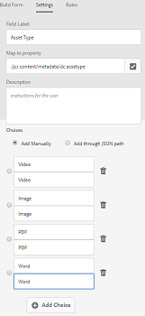

# 串联元数据 {#cascading-metadata}

在捕获资产的元数据信息时，用户会在各种可用字段中提供信息。 您可以显示特定的元数据字段或字段值，这些字段值取决于在其他字段中选择的选项。 此类元数据的条件显示称为级联元数据。 换言之，您可以在特定元数据字段/值与一个或多个字段和/或其值之间创建依赖项。

使用元数据架构定义用于显示级联元数据的规则。 例如，如果您的元数据架构包含资产类型字段，则可以根据用户选择的资产类型定义要显示的相关字段集。

以下是可为其定义级联元数据的一些用例：

* 如果需要用户位置，则根据用户对国家/地区和州的选择显示相关的城市名称。
* 根据用户对产品类别的选择，在列表中加载相关的品牌名称。
* 根据其他字段中指定的值切换特定字段的可见性。 例如，如果用户希望以不同的地址交付发运，则显示单独的发运地址字段。
* 根据其他字段中指定的值，将字段指定为必填字段。
* 根据其他字段中指定的值更改特定字段显示的选项。
* 根据其他字段中指定的值，在特定字段中设置默认元数据值。

## 在[!DNL Experience Manager]中配置级联元数据 {#configure-cascading-metadata-in-aem}

假设您想要根据所选资产类型显示级联元数据。 一些示例

* 对于视频，显示适用的字段，如格式、编解码器、持续时间等。
* 对于Word或PDF文档，显示字段，如页面计数、作者等。

无论选择何种资产类型，都会将版权信息显示为必填字段。

1. 点按/单击[!DNL Experience Manager]徽标，然后转到&#x200B;**[!UICONTROL 工具]** > **[!UICONTROL Assets]** > **[!UICONTROL 元数据架构]**。
1. 在&#x200B;**[!UICONTROL 架构表单]**&#x200B;页面中，选择一个架构表单，然后点按/单击工具栏中的&#x200B;**[!UICONTROL 编辑]**，以编辑架构。

   

1. （可选）在元数据架构编辑器中，创建要条件化的新字段。 在&#x200B;**[!UICONTROL 设置]**&#x200B;选项卡中指定名称和属性路径。

   要创建新选项卡，请点按/单击`+`以添加选项卡，然后添加元数据字段。

   

1. 为资产类型添加下拉字段。 在&#x200B;**[!UICONTROL 设置]**&#x200B;选项卡中指定名称和属性路径。 添加可选描述。

   

1. 键值对是提供给表单用户的选项。 您可以手动或从JSON文件提供键值对。

   * 要手动指定值，请选择&#x200B;**[!UICONTROL 手动添加]**，然后点按/单击&#x200B;**[!UICONTROL 添加选择]**&#x200B;并指定选项文本和值。 例如，指定视频、PDF、Word和图像资产类型。

   * 要动态获取JSON文件中的值，请选择&#x200B;**[!UICONTROL 通过JSON路径添加]**&#x200B;并提供JSON文件的路径。 [!DNL Experience Manager] 向用户显示表单时，会实时获取键值对。

   两个选项是互斥的。 您无法从JSON文件导入选项并手动编辑。

   

   >[!NOTE]
   >
   >添加JSON文件时，键值对不会显示在元数据架构编辑器中，但可在已发布的表单中使用。

   >[!NOTE]
   >
   >添加选项时，如果单击弹出字段，则界面会扭曲，选项的删除图标会停止工作。 在保存更改之前，请勿单击下拉菜单。 如果遇到此问题，请保存架构并再次将其打开以继续编辑。

1. （可选）添加其他必填字段。 例如，资产类型视频的格式、编解码器和持续时间。

   同样，为其他资产类型添加从属字段。 例如，为文档资产（如PDF和Word文件）添加字段页面计数和作者。

   

1. 要在资产类型字段和其他字段之间创建依赖关系，请选择相关字段，然后打开&#x200B;**[!UICONTROL Rules]**&#x200B;选项卡。

   

1. 在&#x200B;**[!UICONTROL Requirement]**&#x200B;下，根据新规则&#x200B;]**选项选择**[!UICONTROL  Required。
1. 点按／单 **[!UICONTROL 击添加规则]** ，然后选择“资 **[!UICONTROL 产类型]** ”字段以创建依赖关系。 还可以选择创建依赖关系时所依据的字段值。 在这种情况下，请选择“ **[!UICONTROL 视频]**”。 点按／单击 **[!UICONTROL 完成]** ，以保存更改。

   

   >[!NOTE]
   >
   >包含手动预定义值的下拉列表可与规则一起使用。 配置了JSON路径的下拉菜单不能与使用预定义值来应用条件的规则一起使用。 如果在运行时从JSON加载值，则无法应用预定义规则。

1. 在“可 **[!UICONTROL 见性]**”下，根据新 **[!UICONTROL 规则选项选择“可见]** ”。

1. 点按／单 **[!UICONTROL 击添加规则]** ，然后选择“资 **[!UICONTROL 产类型]** ”字段以创建依赖关系。 还可以选择创建依赖关系时所依据的字段值。 在这种情况下，请选择“ **[!UICONTROL 视频]**”。 点按／单击 **[!UICONTROL 完成]** ，以保存更改。

   

   >[!CAUTION]
   >
   >要重置这些值，请单击或点按界面上除这些值以外的任何位置的空白。 如果重置了值，请再次选择值。

   >[!NOTE]
   >
   >您可以应用&#x200B;**[!UICONTROL 要求]**&#x200B;条件和&#x200B;**[!UICONTROL 可见性]**&#x200B;条件，二者相互独立。

1. 同样，在资产类型字段中的值视频与其他字段（如编解码器和持续时间）之间创建依赖关系。
1. 重复以下步骤，在[!UICONTROL 资产类型]字段和[!UICONTROL 页面计数]和[!UICONTROL 作者]等字段中，在文档资产（PDF和Word）之间创建依赖项。
1. 单击&#x200B;**[!UICONTROL 保存]**。将元数据架构应用到文件夹。

1. 导航到应用元数据架构的文件夹，然后打开资产的属性页面。 根据您在资产类型字段中的选择，将显示相关的级联元数据字段。

   
   *图：视频资产的级联元数据*

   
   *图：文档资产的级联元数据*
