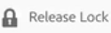

# 资产中的签入和签出文件 {#check-in-and-check-out-files-in-assets}

通过Adobe Experience Manager(AEM)资产，您可以签出资产进行编辑，并在完成更改后重新签入。 注销资产后，只有您才能编辑、批注、发布、移动或删除资产。 签出资产会锁定资产。 其他用户无法对资产执行任何这些操作，除非您将资产签回AEM资产。 但是，他们仍可以更改锁定资产的元数据。

要能够签出／登录资产，您需要对资产具有写入权限。

此功能有助于防止其他用户覆盖作者所做的更改，在创作中，多个用户跨团队协作编辑工作流。

## 注销资产 {#checking-out-assets}

1. 从资产UI中，选择要签出的资产。 您还可以选择多个资产进行注销。

   

1. From the toolbar, click/tap the **[!UICONTROL Checkout]** icon.

   

   观察“检 **[!UICONTROL 出]** ”图标在锁 **[!UICONTROL 定打开时]** 切换为“检入”图标。

   

   要验证其他用户是否可以编辑您注销的资产，请以其他用户身份登录。 您签出的资产的缩略图上会显示一个锁图标。

   

   选择资产。 请注意，工具栏不会显示任何允许您编辑、批注、发布或删除资产的选项。

   

   但是，您可以单击／点按 **[!UICONTROL 视图属性]** 图标，以编辑锁定资产的元数据。

1. 单击／点按编辑图标以在编辑模式下打开资产。

   

1. 编辑资产并保存更改。 例如，裁剪图像并保存。

   

   您还可以选择对资产添加注释或发布。

1. 从 Assets UI 中选择已编辑资产，然后单击/点按工具栏中的&#x200B;**[!UICONTROL 签入]**&#x200B;图标。

   

   修改后的资产会检入到AEM资产，可供其他用户编辑。

## 强制签入 {#forced-check-in}

管理员可以签入其他用户签出的资产。

1. 以管理员身份登录到AEM资产。
1. 在资产UI中，选择已由其他用户签出的一个或多个资产。

   

1. 在工具栏中，单击／点按 **[!UICONTROL 释放锁]** 图标。 资产将签回，可供其他用户编辑。

   