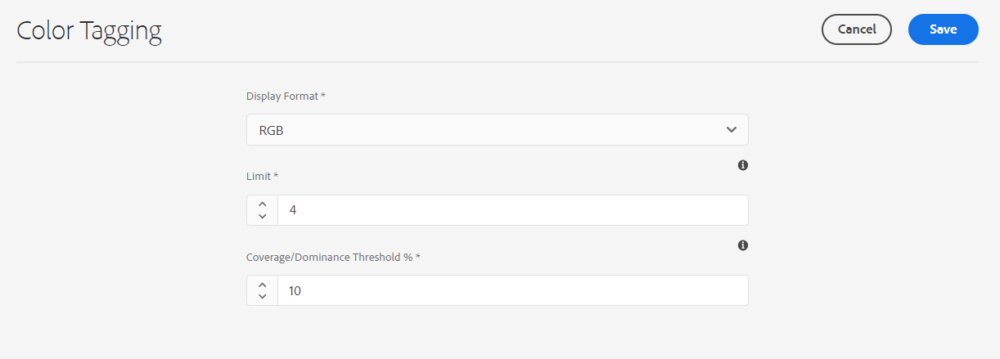
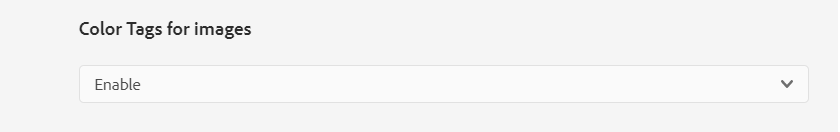

# 图像的颜色标记 {#color-tag-images}

Experience Manager Assets使用Adobe Sensei AI功能区分图像中的颜色，并在摄取时自动将这些颜色作为标记应用。 这些标记可根据图像颜色组合来增强搜索体验。

您可以配置标记为图像的颜色数量（在1到40之间），以便以后可以根据这些颜色搜索图像。 Experience Manager Assets根据图像中的颜色覆盖范围应用标记。 您还可以配置颜色标记的显示格式。

>[!NOTE]
>
>此功能在预发行渠道中提供。 请参阅 [预发行渠道文档](https://experienceleague.adobe.com/docs/experience-manager-cloud-service/content/release-notes/prerelease.html?lang=en#enable-prerelease) 以了解为环境启用该功能的信息。

下图说明了在Experience Manager Assets中为图像配置和管理颜色标记所执行的一系列任务：

## 支持的文件格式 {#supported-file-formats-color-tags}

| 文件格式 | 扩展名 | MIME类型 | 输入色彩空间 | 支持的源文件最大大小 | 支持的最大文件大小分辨率 |
|---|---|---|---|---|---|
| JPEG | .jpg， .jpeg | image/jpeg | sRGB | 15GB | 20000px X 20000px |
| PNG | .png | image/png | sRGB | 15GB | 20000px X 20000px |
| TIFF | .tif， .tiff | image/tiff | sRGB | 4 GB(受格式规范限制 | 20000px X 20000px |
| PSD | .psd | image/vnd.adobe.photoshop | sRGB | 2GB（受格式规范限制） | 20000px X 20000px |
| GIF | .gif | image/gif | sRGB | 15GB | 20000px X 20000px |
| BMP | .bmp | image/bmp | sRGB | 4 GB（受格式规范限制） | 20000px X 20000px |

## 管理颜色标记属性 {#manage-color-tagging-properties}

要管理图像的颜色标记属性，请执行以下操作：

1. 导航到 **[!UICONTROL 工具>资产>颜色标记]**.

   

1. 在 **[!UICONTROL 显示格式]** 字段。 可能的选项包括颜色名称、RGB或十六进制格式。

1. 为中的图像指定要标记的颜色数 **[!UICONTROL 限制]** 字段。 当您查看图像的属性时，这些颜色会显示。  您可以在此字段中定义一个介于1到40之间的数字。 此字段的默认值为十种颜色。

1. 指定最小颜色覆盖率百分比，以在 **[!UICONTROL 覆盖/优势阈值%]** 字段。 例如，如果图像中红色的覆盖率为10%，而您在此字段中定义的覆盖率为9%，则在搜索具有红色的图像时，将包含该图像。 但是，如果图像中红色的覆盖率为10%，并且您在此字段中定义了11%，则在搜索具有红色的图像时，不会包含该图像。

   您可以在此字段中指定介于5和00之间的任意数字。 默认值为11。

   >[!NOTE]
   >
   >Adobe建议在此字段中使用与默认值接近的值。 为此字段设置的高数值（例如，大于25）可能返回的搜索结果很少。 同样，设置低数值（例如，小于6）可能会返回过多的搜索结果，这可能没什么用处。

1. 单击&#x200B;**[!UICONTROL 保存]**。

   >[!VIDEO](https://video.tv.adobe.com/v/340108)

### 禁用颜色标记 {#disable-color-tagging}

默认情况下，会启用图像的颜色标记。 您可以在文件夹级别禁用颜色标记。 所有子文件夹都会从父文件夹继承颜色标记属性。

要在文件夹级别禁用颜色标记，请执行以下操作：

1. 导航到 **[!UICONTROL Adobe Experience Manager > Assets >文件]**.

1. 选择文件夹并单击 **[!UICONTROL 属性]**.

1. 在 **[!UICONTROL 资产处理]** 选项卡，导航到 **[!UICONTROL 图像的颜色标记]** 文件夹。 从下拉列表中选择以下值之一：

   * 继承 — 文件夹会继承父文件夹的启用或禁用选项。

   * 启用 — 为选定的文件夹启用颜色标记。

   * 禁用 — 禁用选定文件夹的颜色标记。

   

## 配置元数据架构以添加智能颜色标记组件 {#configure-metadata-schema}

元数据架构包含要填写的特定信息的特定字段。 它还包含布局信息，以用户友好的方式显示元数据字段。 元数据属性包括标题、描述、MIME类型、标记等。 您可以使用 [!UICONTROL 元数据架构Forms] 编辑器以修改现有架构或添加自定义元数据架构。

>[!NOTE]
>
>默认元数据架构中提供了智能颜色标记字段。 如果您使用自定义元数据架构，请配置您的架构以添加智能颜色标记字段。

要将智能颜色标记组件添加到元数据架构表单编辑器，请执行以下操作：

1. 导航到 **[!UICONTROL 工具> Assets >元数据架构]**.

1. 选择架构名称并单击 **[!UICONTROL 编辑]**.

1. 拖动 **[!UICONTROL 智能颜色标记]** 从 **[!UICONTROL 构建表单]** 选项卡 **[!UICONTROL 元数据架构表单编辑器]**.

1. 单击 **[!UICONTROL 智能颜色标记字段]** 在 **[!UICONTROL 元数据架构表单编辑器]**.

1. 在 **[!UICONTROL 字段标签]** 字段 **[!UICONTROL 设置]**  选项卡。

1. 单击&#x200B;**[!UICONTROL 保存]**。

   >[!VIDEO](https://video.tv.adobe.com/v/340124)

## 查看图像的智能颜色标记 {#view-color-tags}

要查看图像的智能颜色标记，请执行以下操作：

1. 导航到 **[!UICONTROL Adobe Experience Manager > Assets >文件]**.

1. 单击相应的文件夹并选择图像。

1. 选择 **[!UICONTROL 属性]** 并在 **[!UICONTROL 智能颜色标记]** 字段。

   

   将鼠标悬停在颜色标记上可查看 **[!UICONTROL 覆盖/优势阈值%]** 图像中的颜色。

## 配置AEM Assets颜色谓词 {#configure-search-predicate}

您可以配置图像的搜索过滤器。 然后，您可以根据特定颜色来筛选结果。

>[!NOTE]
>
>仅当您未使用默认搜索表单时，才配置AEM Assets颜色谓词。

要配置搜索筛选器，请使用“资产管理员搜索”边栏创建资产颜色谓词。

要配置搜索过滤器，请执行以下操作：

1. 导航到 **[!UICONTROL 工具>常规>搜索Forms]**.

1. 选择 **[!UICONTROL 资产管理搜索边栏]** 单击 **[!UICONTROL 编辑]**.

1. 拖动 **[!UICONTROL 资产颜色谓词]** 从 **[!UICONTROL 选择谓词]** 选项卡 **[!UICONTROL 搜索表单编辑器]**.

1. 在 **[!UICONTROL 字段标签]** 字段 **[!UICONTROL 设置]**  选项卡。

1. 单击&#x200B;**[!UICONTROL 完成]**&#x200B;以保存设置。

   >[!VIDEO](https://video.tv.adobe.com/v/340110)

## 根据颜色搜索图像 {#search-images-based-on-colors}

>[!VIDEO](https://video.tv.adobe.com/v/340761)

在配置所有颜色标记属性和 [配置资产颜色谓词](#search-images-based-on-colors)，则可以根据颜色作为滤镜来搜索图像。

要根据颜色搜索图像，请执行以下操作：

1. 导航到 **[!UICONTROL 资产>文件]**.

1. 选择 **[!UICONTROL 过滤器]** 从下拉列表中。
   

1. 选择 [AEM Assets颜色谓词](#configure-search-predicate).

1. 拖动拾色器以选择相应的颜色。 所选颜色显示在拾色器下方的只读字段中。 您可以选择RGB或十六进制作为颜色的显示格式。

   

   您可以根据一种颜色的选择来过滤图像。 将选定颜色作为智能颜色标记之一且位于 [覆盖/优势阈值%](#manage-color-tagging-settings) 显示在右侧窗格中。

1. 单击搜索栏中的x可清除过滤器。

