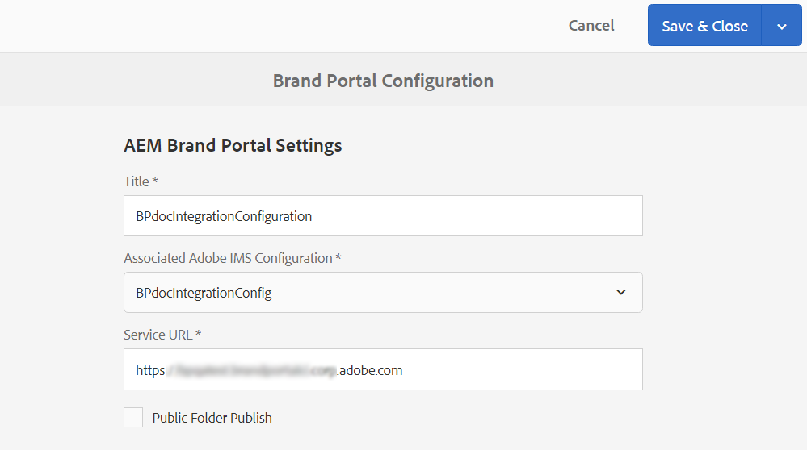

# Configure AEM Assets as a Cloud Service with Brand Portal {#configure-aem-assets-with-brand-portal}

通过配置Adobe Experience Manager资产品牌门户，您可以将Adobe Experience Manager资产的已批准品牌资产作为Cloud Service实例发布到Brand Portal，并将其分发给Brand Portal用户。

**配置工作流**

AEM Assets作为Cloud Service，通过Adobe开发者控制台配置了品牌门户，该控制台为品牌门户租户购买AdobeIdentity Management服务(IMS)帐户令牌以进行授权。 它要求在AEM Assets和Adobe开发者控制台中进行配置。

1. 在AEM Assets，创建IMS帐户并生成公钥（证书）。
1. 在Adobe开发人员控制台中，为您的Brand Portal租户（组织）创建一个项目。
1. 在项目下，使用公钥配置API以创建服务帐户连接。
1. 获取服务帐户凭据和JSON Web Token(JWT)有效负荷信息。
1. 在AEM Assets，使用服务帐户凭据和JWT有效负荷配置IMS帐户。
1. 在AEM Assets，使用IMS帐户和Brand Portal端点（组织URL）配置Brand Portal云服务。
1. 通过将资产从AEM Assets发布到Brand Portal来测试配置。

>[!NOTE]
>
>作为Cloud Service实例的AEM Assets仅应配置一个Brand Portal租户。

## 前提条件 {#prerequisites}

您需要以下各项才能使用 Brand Portal 配置 AEM Assets：

* 以AEM Assets为Cloud Service实例
* 品牌门户租户URL
* 对Brand Portal租户的IMS组织具有系统管理员权限的用户

## 创建配置 {#create-new-configuration}

在指定序列中执行以下步骤以通过Brand Portal配置AEM Assets。

1. [获取公共证书](#public-certificate)
1. [创建服务帐户(JWT)连接](#createnewintegration)
1. [配置IMS帐户](#create-ims-account-configuration)
1. [配置云服务](#configure-the-cloud-service)
1. [测试配置](#test-configuration)

### 创建 IMS 配置 {#create-ims-configuration}

IMS配置将您的AEM Assets作为Cloud Service实例与Brand Portal租户进行身份验证。

IMS 配置包括两个步骤：

* [获取公共证书](#public-certificate)
* [配置IMS帐户](#create-ims-account-configuration)

### 获取公共证书 {#public-certificate}

公钥（证书）在Adobe开发者控制台上验证您的用户档案。

1. 登录 AEM 资产。
1. From the **Tools** panel, navigate to **[!UICONTROL Security]** > **[!UICONTROL Adobe IMS Configurations]**.
1. 在“AdobeIMS配置”页中，单击 **[!UICONTROL 创建]**。 It will redirect to the **[!UICONTROL Adobe IMS Technical Account Configuration]** page. By default, the **Certificate** tab opens.
1. 在“ **[!UICONTROL 云解决方案]** ”下拉 **[!UICONTROL 列表中选]** 择AdobeBrand Portal。
1. 选中“ **[!UICONTROL 创建新证书]** ”复选框，并指 **定公钥的** 别名。 别名用作公钥的名称。
1. 单击&#x200B;**[!UICONTROL 创建证书]**。Then, click **[!UICONTROL OK]** to generate the public key.

   

1. 单击“ **[!UICONTROL 下载公钥]** ”图标，并将公钥(.crt)文件保存到您的计算机上。

   公钥稍后将用于为您的Brand Portal租户配置API并在Adobe开发人员控制台中生成服务帐户凭据。

   

1. 单击&#x200B;**[!UICONTROL 下一步]**。

   在“帐 **户** ”选项卡中，将创建AdobeIMS帐户，该帐户需要在Adobe开发者控制台中生成的服务帐户凭据。 暂时保持此页面打开。

   在Adobe开发者控 [制台中打开一个新选项卡并创建服务帐户(JWT)连接](#createnewintegration) ，以获取用于配置IMS帐户的凭据和JWT有效负荷。

### 创建服务帐户(JWT)连接 {#createnewintegration}

在Adobe开发人员控制台中，项目和API在Brand Portal租户（组织）级别进行配置。 配置API可创建服务帐户(JWT)连接。 可通过生成密钥对（私钥和公钥）或上传公钥来配置API的方法有两种。 要通过Brand Portal配置AEM Assets，您必须在AEM Assets生成公钥（证书），并通过上传公钥在Adobe开发者控制台中创建凭据。 在AEM Assets配置IMS帐户时需要这些凭据。 配置IMS帐户后，即可在AEM Assets配置Brand Portal云服务。

执行以下步骤以生成服务帐户凭据和JWT有效负荷：

1. 使用IMS组织（Brand Portal租户）的系统管理员权限登录Adobe开发人员控制台。 默认URL为 [https://www.adobe.com/go/devs_console_ui](https://www.adobe.com/go/devs_console_ui)。

   >[!NOTE]
   >
   >确保您已从右上角的下拉（组织）列表中选择了正确的IMS组织（Brand Portal租户）。

1. Click **[!UICONTROL Create new project]**. 将为您的组织创建一个空白项目，其名称由系统生成。

   单击 **[!UICONTROL “编辑]** ”项目以更新 **[!UICONTROL 项目标题]** 和 **[!UICONTROL 说明]**，然 **[!UICONTROL 后单击“]**&#x200B;保存”。

1. 在“项 **[!UICONTROL 目概述]** ”选项卡中， **[!UICONTROL 单击添加API]**。

1. 在“添 **[!UICONTROL 加API”窗口中]**，选 **[!UICONTROL 择AEM Brand Portal]** ，然后单 **[!UICONTROL 击“下一步]**”。

   确保您有权访问AEM Brand Portal服务。

1. 在“配 **[!UICONTROL 置API]** ”窗口中， **[!UICONTROL 单击“上传公钥”]**。 然后，单 **[!UICONTROL 击“Select a File]** （选择文件）”并上传您在“Obtain public certificate（获取公共证书）”部分下 [载的公钥(.crt](#public-certificate) 文件)。

   单击&#x200B;**[!UICONTROL 下一步]**。

   

1. 验证公钥，然后单击“下 **[!UICONTROL 一步]**”。

1. 选择 **[!UICONTROL Assets Brand Portal]** 作为默认产品用户档案，然后单 **[!UICONTROL 击保存配置的API]**。

   <!-- 
   In Brand Portal, a default profile is created for each organization. The Product Profiles are created in admin console for assigning users to groups (based on the roles and permissions). For configuration with Brand Portal, the OAuth token is created at organization level. Therefore, you must configure the default Product Profile for your organization. 
   -->

   

1. 配置API后，您将被重定向到API概述页面。 在左侧导航的“凭 **[!UICONTROL 据]**”下，单 **[!UICONTROL 击“服务帐户(JWT)]** ”选项。

   >[!NOTE]
   >
   >您可以视图凭据并执行诸如生成JWT令牌、复制凭据详细信息、检索客户端机密等操作。

1. 从“客 **[!UICONTROL 户端凭据]** ”选项卡中，复 **[!UICONTROL 制客户端ID]**。

   Click **[!UICONTROL Retrieve Client Secret]** and copy the **[!UICONTROL client secret]**.

   

1. Navigate to the **[!UICONTROL Generate JWT]** tab and copy the **[!UICONTROL JWT Payload]** information.

您现在可以使用客户端ID（API密钥）、客户端机密和JWT负载 [配置AEM Assets的IMS帐户](#create-ims-account-configuration) 。

<!--
1. Click **[!UICONTROL Create Integration]**.

1. Select **[!UICONTROL Access an API]**, and click **[!UICONTROL Continue]**.

   

1. Create a new integration page opens. 
   
   Select your organization from the drop-down list.

   In **[!UICONTROL Experience Cloud]**, Select **[!UICONTROL AEM Brand Portal]** and click **[!UICONTROL Continue]**. 

   If the Brand Portal option is disabled for you, ensure that you have selected correct organization from the drop-down box above the **[!UICONTROL Adobe Services]** option. If you do not know your organization, contact your administrator.

   

1. Specify a name and description for the integration. Click **[!UICONTROL Select a File from your computer]** and upload the `AEM-Adobe-IMS.crt` file downloaded in the [obtain public certificates](#public-certificate) section.

1. Select the profile of your organization. 

   Or, select the default profile **[!UICONTROL Assets Brand Portal]** and click **[!UICONTROL Create Integration]**. The integration is created.

1. Click **[!UICONTROL Continue to integration details]** to view the integration information. 

   Copy the **[!UICONTROL API Key]** 
   
   Click **[!UICONTROL Retrieve Client Secret]** and copy the Client Secret key.

   

1. Navigate to **[!UICONTROL JWT]** tab, and copy the **[!UICONTROL JWT payload]**.

   The API Key, Client Secret key, and JWT payload information will be used to create IMS account configuration.

-->

### 配置IMS帐户 {#create-ims-account-configuration}

确保您已执行以下步骤：

* [获取公共证书](#public-certificate)
* [创建服务帐户(JWT)连接](#createnewintegration)

请执行以下步骤配置IMS帐户。

1. 打开IMS配置并导航到“帐 **[!UICONTROL 户]** ”选项卡。 您在获取公共证书时使 [页面保持打开状态](#public-certificate)。

1. 为 IMS 帐户指定&#x200B;**[!UICONTROL 标题]**。

   In the **[!UICONTROL Authorization Server]** field, specify the URL: [https://ims-na1.adobelogin.com/](https://ims-na1.adobelogin.com/)

   在创建服务帐户( **[!UICONTROL JWT)连接时]** ，在您复制的API密钥字段 **[!UICONTROL 、客户端机密和]**&#x200B;有效负荷 **[!UICONTROL （JWT有效负荷）中]**指定客户端ID。

   单击&#x200B;**[!UICONTROL 创建]**。

   已配置IMS帐户。

   

1. Select the IMS account configuration and click **[!UICONTROL Check Health]**.

   在对 **[!UICONTROL 话框]** 中单击“检查”。 成功配置时，将显示一条消息，告 *示标记已成功检索*。

   

>[!CAUTION]
>
>您只能有一个IMS配置。
>
>确保IMS配置通过运行状况检查。 如果配置未通过运行状况检查，则无效。 您必须删除它并创建新的有效配置。

### 配置云服务 {#configure-the-cloud-service}

请执行以下步骤来配置Brand Portal云服务：

1. 登录 AEM 资产。

1. From the **Tools** panel, navigate to **[!UICONTROL Cloud Services]** > **[!UICONTROL AEM Brand Portal]**.

1. 在Brand Portal的“配置”页中，单击“ **[!UICONTROL 创建]**”。

1. 指定配置的&#x200B;**[!UICONTROL 标题]**。

   选择配置IMS帐户时 [创建的IMS配置](#create-ims-account-configuration)。

   在“服 **[!UICONTROL 务URL]** ”字段中，指定您的Brand Portal租户（组织）URL。

   

1. 单击&#x200B;**[!UICONTROL 保存并关闭]**。将创建云配置。

   您的AEM Assets作为Cloud Service实例现在已配置Brand Portal租户。

### 测试配置{#test-configuration}

请执行以下步骤以验证配置：

1. 登录 AEM 资产。

1. From the **Tools** panel, navigate to **[!UICONTROL Deployment]** > **[!UICONTROL Distribution]**.

   

   A Brand Portal distribution agent (**[!UICONTROL bpdistributionagent0]**) is created under **[!UICONTROL Publish to Brand Portal]**.

   

1. 单击 **[!UICONTROL 发布到品牌门户]** ，以打开分发代理。

   您可以在状态选项卡下看到 **[!UICONTROL 分发]** 队列。

   分发代理包含两个队列：
   * **processing-queue**:用于将资产分发到Brand Portal。

   * **error-queue**:对于分发失败的资产。
   >[!NOTE]
   >
   >建议定期检查故障并清 **除错误队列** 。

   

1. 要验证作为Cloud Service的AEM Assets与Brand Portal之间的连接，请单击“测 **[!UICONTROL 试连接]** ”图标。

   

   将显示一条消息， *表明测试包已成功交付*。

   >[!NOTE]
   >
   >请避免禁用分发代理，因为这可能导致资产分发（在队列中运行）失败。

您现在可以：

* [将资产从 AEM Assets 发布到 Brand Portal](publish-to-brand-portal.md)
* [将文件夹从 AEM Assets 发布到 Brand Portal](publish-to-brand-portal.md#publish-folders-to-brand-portal)
* [将收藏集从 AEM Assets 发布到 Brand Portal](publish-to-brand-portal.md#publish-collections-to-brand-portal)
* [将预设、架构和 Facet 发布到 Brand Portal](https://docs.adobe.com/content/help/zh-Hans/experience-manager-brand-portal/using/publish/publish-schema-search-facets-presets.html)
* [将标记发布到 Brand Portal](https://docs.adobe.com/content/help/zh-Hans/experience-manager-brand-portal/using/publish/brand-portal-publish-tags.html)

See [Brand Portal documentation](https://docs.adobe.com/content/help/zh-Hans/experience-manager-brand-portal/using/home.html) for more information.

## 分发日志 {#distribution-logs}

您可以监视资产发布工作流的分发代理日志。

例如，我们已将资产从AEM Assets发布到Brand Portal以验证配置。

1. Follow the steps (from 1 to 4) as shown in the [Test Configuration](#test-configuration) section and navigate to the distribution agent page.
1. 单击 **[!UICONTROL “日志]** ”以视图处理日志和错误日志。

   

分发代理已生成以下日志：

* 信息：这是系统生成的日志，在成功配置分发代理时触发。
* DSTRQ1（请求1）:测试连接时的触发器。

发布资产时，会生成以下请求和响应日志：

**分发代理请求**：

* DSTRQ2（请求 2）：触发资产发布请求。
* DSTRQ3（请求3）:系统会触发另一个请求，以发布AEM Assets文件夹（该资产存在），并在Brand Portal中复制该文件夹。

**分发代理响应**：

* queue-bpdistributionagent0(DSTRQ2)：将资产发布到 Brand Portal。
* queue-bpdistributionagent0(DSTRQ3):系统将复制Brand Portal中的AEM Assets文件夹（包含资产）。

在上述示例中，还会触发其他请求和响应。由于资产是首次发布的，因此系统无法在Brand Portal中找到父文件夹（添加路径），因此，系统会在发布资产的Brand Portal中触发另一个请求，要求创建具有相同名称的父文件夹。

>[!NOTE]
>
>如果父级文件夹在Brand Portal中不存在或在AEM Assets修改过，则会生成其他请求。

<!--

## Additional information {#additional-information}

Go to `/system/console/slingmetrics` for statistics related to the distributed content:

1. **Counter metrics**
   * sling: `mac_sync_request_failure`
   * sling: `mac_sync_request_received`
   * sling: `mac_sync_request_success`

1. **Time metrics**
   * sling: `mac_sync_distribution_duration`
   * sling: `mac_sync_enqueue_package_duration`
   * sling: `mac_sync_setup_request_duration`

-->

<!--
   Comment Type: draft

   <li> </li>
   -->

<!--
   Comment Type: draft

   <li>Step text</li>
-->
