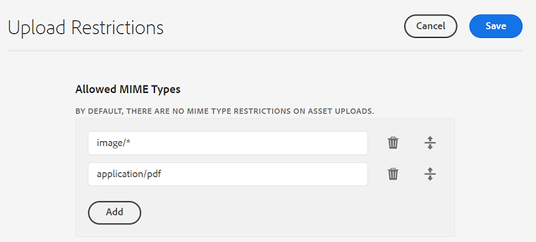

# 配置资产上传限制 {#configure-asset-upload-restrictions}

您可以配置Adobe Experience Manager Assets，以根据MIME类型限制用户可上传的资产类型。

>[!IMPORTANT]
>
>默认情况下，Experience Manager Assets允许用户上传所有MIME类型的资产。 但是，您可以配置设置，以限制用户仅上传特定MIME类型的文件。

## 前提条件 {#prerequisites-asset-upload-restrictions}

您必须拥有管理员权限才能配置资产上传限制。

## 对资产上传应用限制 {#apply-restrictions-asset-uploadsssssss}

配置 [!DNL Experience Manager] 要限制用户上传特定MIME类型的文件，请执行以下操作：

1. 导航到 **[!UICONTROL 工具>资产>资产配置]**.

1. 单击 **[!UICONTROL 上载限制]**.

1. 单击 **[!UICONTROL 添加]** 以定义允许的MIME类型。

1. 在文本框中指定MIME类型。 您可以单击 **[!UICONTROL 添加]** 再次指定更多允许的MIME类型。 您还可以单击  从列表中删除任何MIME类型。

1. 单击&#x200B;**[!UICONTROL 保存]**。

**示例1:允许将所有图像和PDF文件上传到Experience Manager Assets**

要允许将所有格式的图像和PDF文件上传到Experience Manager Assets，请执行以下设置：

`image/*` 因为MIME类型允许上传所有格式的图像。 `application/pdf` 因为使用MIME类型，可将PDF文件上传到Experience Manager Assets。

**示例2:允许将特定图像格式上传到Experience Manager Assets**

要向允许的MIME类型添加特定图像格式并限制上传所有其他资产格式，请执行以下设置：

根据图像中描述的设置，您可以将。JPG、 .PNG和。GIF格式的图像上传到Experience Manager Assets。

