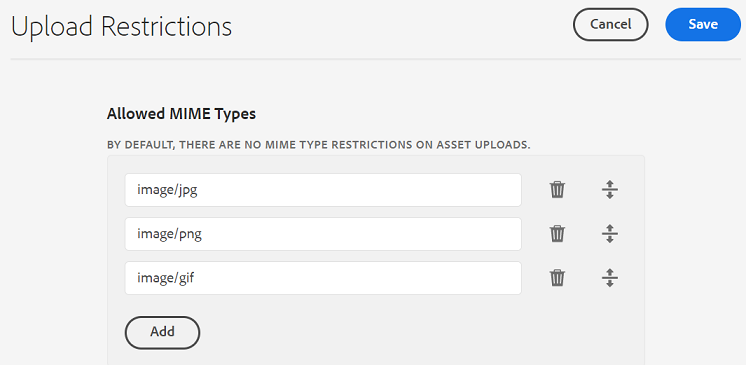

# 配置资源上传限制 {#configure-asset-upload-restrictions}

您可以将Adobe Experience Manager资源配置为根据MIME类型限制用户可以上传的资源类型。

>[!IMPORTANT]
>
>默认情况下，Experience Manager Assets允许用户上传所有MIME类型的资产。 但是，您可以配置设置以限制用户仅上传特定MIME类型的文件。

## 前提条件 {#prerequisites-asset-upload-restrictions}

您必须具有管理员权限才能配置资源上传限制。

## 对资源上传应用限制 {#apply-restrictions-asset-uploadsssssss}

配置 [!DNL Experience Manager] 限制用户上传特定MIME类型的文件：

1. 导航到 **[!UICONTROL 工具>资产>资产配置]**.

1. 单击 **[!UICONTROL 上传限制]**.

1. 单击 **[!UICONTROL 添加]** 以定义允许的MIME类型。

1. 在文本框中指定MIME类型。 您可以单击 **[!UICONTROL 添加]** 再次指定更多允许的MIME类型。 您还可以单击  从列表中删除任何MIME类型。

1. 单击“**[!UICONTROL 保存]**”。

**示例1：允许将所有图像和PDF文件上传到Experience Manager Assets**

要允许将所有格式的图像和PDF文件上传到Experience Manager Assets，请执行以下设置：

`image/*` 因为MIME类型允许上传所有格式的图像。 `application/pdf` 因为MIME类型允许将PDF文件上传到Experience Manager Assets。

如果您尝试上传的文件未包含在允许的MIME类型列表中，Experience Manager Assets会显示以下错误消息：

`Screen Recording 2022-08-31 at 3.36.09 PM.mov` 是指未包含在允许的MIME类型中的文件名。

**示例2：允许将特定图像格式上传到Experience Manager Assets**

要将特定图像格式添加到允许的MIME类型并限制上传所有其他资源格式，请执行以下操作：

根据映像中描述的设置，您可以将。JPG、.PNG和。GIF格式的图像上传到Experience Manager Assets。

**另请参阅**

* [翻译资源](translate-assets.md)
* [Assets HTTP API](mac-api-assets.md)
* [资源支持的文件格式](file-format-support.md)
* [搜索资源](search-assets.md)
* [连接的资源](use-assets-across-connected-assets-instances.md)
* [资源报告](asset-reports.md)
* [元数据架构](metadata-schemas.md)
* [下载资源](download-assets-from-aem.md)
* [管理元数据](manage-metadata.md)
* [搜索 Facet](search-facets.md)
* [管理收藏集](manage-collections.md)
* [批量元数据导入](metadata-import-export.md)
