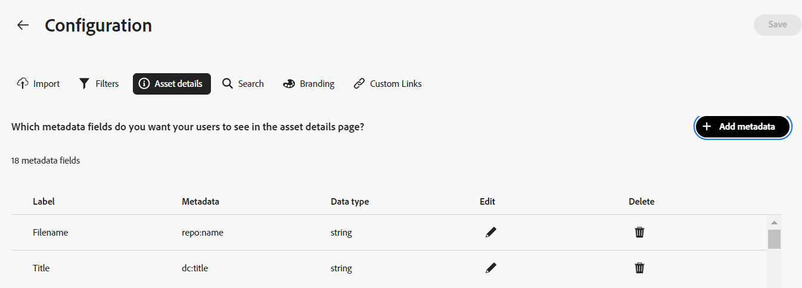

# 配置 Content Hub 用户界面 {#configure-content-hub-user-interface}

>[!CONTEXTUALHELP]
>id="configure_content_hub"
>title="配置 Content Hub 用户界面"
>abstract="管理员使用 Experience Manager Assets 可以配置 Content Hub 用户界面上可用的选项。根据管理员选择的配置选项，Content Hub 用户可以查看 Content Hub 上的字段。配置选项包括导入资产时的元数据、过滤器、资产属性、搜索资产时的元数据、个性化品牌以及任何自定义链接。"

<!--  -->

管理员使用 Experience Manager Assets 可以配置 Content Hub 用户界面上可用的选项。根据管理员选择的配置选项，Content Hub 用户可以查看 Content Hub 上的字段。配置选项包括：

* 用户在搜索资产时可用的筛选器。

* 每个资源的可用资源详细信息或属性。

* 向Content Hub添加资源时，用户可以使用的元数据字段。

* 可在Content Hub上搜索的资源元数据字段。

* 您需要为组织显示的品牌推广内容。

* 除了资源、收藏集和分析之外，您需要在Content Hub中包含的任何自定义链接。

## 先决条件 {#prerequisites-configuration-ui}

[Content Hub管理员](/help/assets/deploy-content-hub.md#step-3-onboard-content-hub-administrator)可以为组织内的其他用户设置配置选项。

## 访问Content Hub上的配置选项 {#access-configuration-options-content-hub}

要在Content Hub上访问配置选项，请执行以下操作：

1. 单击右窗格中的用户图标。

1. 在&#x200B;**[!UICONTROL 产品设置]**&#x200B;部分中，选择&#x200B;**[!UICONTROL 配置]**。

   

## 在Content Hub上管理配置选项 {#manage-configuration-options}

作为管理员，为您的用户管理以下配置选项：

* [导入](#configure-import-options-content-hub)

* [过滤器](#configure-filters-content-hub)

* [资源详情](#configure-asset-details-content-hub)

* [搜索](#configure-metadata-search-content-hub)

* [品牌化](#configure-branding-content-hub)

* [自定义链接](#configure-custom-links-content-hub)

### 导入 {#configure-import-options-content-hub}

您可以配置在将资源上传或导入到Content Hub门户时向用户显示的元数据字段，例如促销活动名称、关键字、渠道、时间范围、区域等。 若要禁用，请执行以下步骤：

1. 在[配置](#access-configuration-options-content-hub)用户界面上，单击&#x200B;**[!UICONTROL 导入]**。

1. 单击&#x200B;**[!UICONTROL 添加元数据]**。

1. 指定属性的标签，使用&#x200B;**[!UICONTROL 元数据]**&#x200B;字段将其映射到属性，然后选择新资源元数据的输入类型。

1. 单击&#x200B;**[!UICONTROL 必填字段]**&#x200B;切换可让上传新资产时的新元数据字段成为用户必须指定的字段。

1. 单击&#x200B;**[!UICONTROL 确认]**。 新元数据将显示在现有资源属性列表中。

1. 单击&#x200B;**[!UICONTROL 保存]**&#x200B;以应用更改。

同样，在使用&#x200B;**[!UICONTROL 必填字段]**&#x200B;切换上载资产时，您可以单击每个可用属性旁边的以编辑标签，使这些字段对用户是必填字段或非必填字段，或者单击“删除”图标以删除任何元数据属性。

如果您需要自动批准添加到Experience Manager Assets存储库的所有资源，以便这些资源立即在Content Hub中可用，请单击&#x200B;**[!UICONTROL 自动批准]**&#x200B;切换开关。 否则，DAM作者或管理员需要手动批准资源，才能在Content Hub上使用这些资源。 默认情况下，切换设置为“关闭”状态。

完成所有修改后单击&#x200B;**[!UICONTROL 保存]**&#x200B;以应用更改。

在Content Hub上

在配置用户界面中启用的元数据将显示在资源上传页面上：

在Content Hub上

### 过滤器 {#configure-filters-content-hub}

Content Hub允许管理员配置在搜索资源时显示的过滤器。 执行以下步骤以添加新筛选器：

1. 在[配置](#access-configuration-options-content-hub)用户界面上，单击&#x200B;**[!UICONTROL 筛选器]**。

1. 单击&#x200B;**[!UICONTROL 添加筛选器]**。

1. 指定筛选器的标签，使用&#x200B;**[!UICONTROL 元数据]**&#x200B;字段将其映射到属性，然后选择新筛选器的输入类型。
1. 单击&#x200B;**[!UICONTROL 确认]**。 新筛选器显示在现有筛选器的列表中。

1. 单击&#x200B;**[!UICONTROL 保存]**&#x200B;以应用更改，以便在筛选资产时，新筛选器将显示在“搜索”页面上。

   >[!NOTE]
   >
   >仅当存储库中还有另一个资源与筛选条件匹配时，新筛选器才会显示在“搜索”页面上。

同样，您可以单击每个可用筛选器旁边的来编辑标签，或者单击删除图标来删除任何现有筛选器。 完成所有修改后单击&#x200B;**[!UICONTROL 保存]**&#x200B;以应用更改。

在Content Hub上

“搜索”页上将显示在“配置用户界面”中启用的过滤器：

### 资源详情 {#configure-asset-details-content-hub}

您还可以配置为每个资源显示的资源属性，例如文件名、标题、格式、大小等。 若要禁用，请执行以下步骤：

1. 在[配置](#access-configuration-options-content-hub)用户界面上，单击&#x200B;**[!UICONTROL 资源详细信息]**。

1. 单击&#x200B;**[!UICONTROL 添加元数据]**。

1. 指定属性的标签，使用&#x200B;**[!UICONTROL 元数据]**&#x200B;字段将其映射到属性，然后选择新资源元数据的输入类型。
1. 单击&#x200B;**[!UICONTROL 确认]**。 新元数据将显示在现有资源属性列表中。

1. 单击&#x200B;**[!UICONTROL 保存]**&#x200B;以应用更改，以便在资产详细信息页面上显示新属性。

同样，您可以单击每个可用属性旁边的来编辑标签，或者单击删除图标来删除任何现有资源详细信息。 完成所有修改后单击&#x200B;**[!UICONTROL 保存]**&#x200B;以应用更改。

在Content Hub上

在“配置用户界面”中启用的属性将显示在“资产详细信息”页面上：

Content Hub上的

### 搜索 {#configure-metadata-search-content-hub}

管理员可以定义在用户在Content Hub上指定搜索条件时搜索的元数据字段。 执行以下步骤：

1. 在[配置](#access-configuration-options-content-hub)用户界面上，单击&#x200B;**[!UICONTROL 添加元数据]**。

1. 指定元数据字段并单击&#x200B;**[!UICONTROL 确认]**。

1. 单击&#x200B;**[!UICONTROL 保存]**&#x200B;以应用更改，以便新的元数据属性显示在元数据字段列表中。

同样，您可以单击每个可用元数据属性旁边的来编辑该属性，或者单击删除图标来删除任何现有属性。 完成所有修改后单击&#x200B;**[!UICONTROL 保存]**&#x200B;以应用更改。

在Content Hub上

### 品牌化 {#configure-branding-content-hub}

管理员还可以根据您的品牌要求，个性化Content Hub门户横幅上的标题和正文文本。 若要禁用，请执行以下步骤：

1. 在[配置](#access-configuration-options-content-hub)用户界面上，单击&#x200B;**[!UICONTROL 品牌]**。

1. 指定横幅&#x200B;]**的**[!UICONTROL &#x200B;标题文本和横幅&#x200B;]**字段的**[!UICONTROL &#x200B;正文文本。

1. 单击&#x200B;**[!UICONTROL 保存]**&#x200B;以应用更改。

Content Hub上的

在配置用户界面上启用的品牌更新将显示在Content Hub门户横幅上：

Content Hub上的

### 自定义链接 {#configure-custom-links-content-hub}

除了横幅正下方的Content Hub门户上的标准&#x200B;**[!UICONTROL 所有Assets]**、**[!UICONTROL 收藏集]**&#x200B;和&#x200B;**[!UICONTROL 分析]**&#x200B;选项卡外，您还可以添加自定义选项卡。 若要禁用，请执行以下步骤：

1. 在[配置](#access-configuration-options-content-hub)用户界面上，单击&#x200B;**[!UICONTROL 自定义链接]**。

1. 单击&#x200B;**[!UICONTROL 添加链接]**。

1. 在&#x200B;**[!UICONTROL 标签]**&#x200B;和&#x200B;**[!UICONTROL URL]**&#x200B;字段中指定文本。 您定义的标签显示为选项卡，单击该标签时，您可以导航到&#x200B;**[!UICONTROL URL]**&#x200B;字段中定义的URL。

1. 单击&#x200B;**[!UICONTROL 确认]**。

1. 单击&#x200B;**[!UICONTROL 保存]**&#x200B;以应用更改。

同样，您可以单击每个URL旁边的来编辑链接，或者单击删除图标来删除任何现有的URL。 完成所有修改后单击&#x200B;**[!UICONTROL 保存]**&#x200B;以应用更改。

Content Hub上的

自定义链接在Content Hub主页的“分析”选项卡旁边显示为新选项卡。

