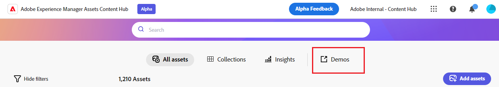

# 配置Content Hub用户界面 {#configure-content-hub-user-interface}

<!--  -->

Experience Manager Assets允许管理员配置Content Hub用户界面上可用的选项。 根据管理员选择的配置选项，Content Hub用户能够查看Content Hub上的字段。 配置选项包括：

* 用户在搜索资产时可用的筛选器。

* 每个资源的可用资源详细信息或属性。

* 向Content Hub添加资源时，用户可以使用的元数据字段。

* 可在Content Hub上搜索的资源元数据字段。

* 您需要为组织显示的品牌推广内容。

* 除了资源、收藏集和分析之外，您需要在Content Hub中包含的任何自定义链接。

## 先决条件 {#prerequisites-configuration-ui}

[Content Hub管理员](/help/assets/deploy-content-hub.md#step-3-onboard-content-hub-administrator) 可以为组织内的其他用户设置配置选项。

## 访问Content Hub上的配置选项 {#access-configuration-options-content-hub}

要在Content Hub上访问配置选项，请执行以下操作：

1. 单击右窗格中的用户图标。

1. 在 **[!UICONTROL 产品设置]** 部分，选择 **[!UICONTROL 配置]**.

   

## 在Content Hub上管理配置选项 {#manage-configuration-options}

为用户管理以下配置选项：

* [导入](#configure-import-options-content-hub)

* [过滤器](#configure-filters-content-hub)

* [资源详情](#configure-asset-details-content-hub)

* [搜索](#configure-metadata-search-content-hub)

* [品牌化](#configure-branding-content-hub)

* [自定义链接](#configure-custom-links-content-hub)

### 导入 {#configure-import-options-content-hub}

您可以配置在将资源上传或导入到Content Hub门户时向用户显示的元数据字段，例如促销活动名称、关键字、渠道、时间范围、区域等。 若要禁用，请执行以下步骤：

1. 在 [配置](#access-configuration-options-content-hub) 用户界面，单击 **[!UICONTROL 导入]**.

1. 单击 **[!UICONTROL 添加元数据]**.

1. 指定属性的标签，然后使用 **[!UICONTROL 元数据]** 字段，然后选择新资源元数据的输入类型。

1. 单击 **[!UICONTROL 必填字段]** 切换可让新元数据字段成为强制字段，以便在上传新资产时为用户指定。

1. 单击 **[!UICONTROL 确认]**. 新元数据将显示在现有资源属性列表中。

1. 单击 **[!UICONTROL 保存]** 以应用更改。

同样，您可以单击 ，位于每个可用属性旁边，要编辑标签，在使用上传资产时，请将这些字段设为用户必需或非必需字段 **[!UICONTROL 必填字段]** 切换或单击“删除”图标可删除任何元数据属性。

单击 **[!UICONTROL 自动审批]** 如果您需要自动批准添加到Experience Manager Assets存储库的所有资源，以便这些资源立即在Content Hub中可用，请进行切换。 否则，DAM作者或管理员需要手动批准资源，才能在Content Hub上使用这些资源。 默认情况下，切换设置为“关闭”状态。

单击 **[!UICONTROL 保存]** 进行所有修改以应用更改后。

在配置用户界面中启用的元数据将显示在资源上传页面上：

### 过滤器 {#configure-filters-content-hub}

Content Hub允许管理员配置在搜索资源时显示的过滤器。 执行以下步骤以添加新筛选器：

1. 在 [配置](#access-configuration-options-content-hub) 用户界面，单击 **[!UICONTROL 过滤器]**.

1. 单击 **[!UICONTROL 添加过滤器]**.

1. 指定过滤器的标签，然后使用 **[!UICONTROL 元数据]** 字段，然后选择新过滤器的输入类型。
1. 单击 **[!UICONTROL 确认]**. 新筛选器显示在现有筛选器的列表中。

1. 单击 **[!UICONTROL 保存]** 以应用更改，以便在筛选资产时新筛选器显示在“搜索”页面上。

同样，您可以单击 ，在每个可用过滤器旁边，可编辑标签或单击“删除”图标可删除任何现有过滤器。 单击 **[!UICONTROL 保存]** 进行所有修改以应用更改后。

“搜索”页上将显示在“配置用户界面”中启用的过滤器：

### 资源详情 {#configure-asset-details-content-hub}

您还可以配置为每个资源显示的资源属性，例如文件名、标题、格式、大小等。 若要禁用，请执行以下步骤：

1. 在 [配置](#access-configuration-options-content-hub) 用户界面，单击 **[!UICONTROL 资源详细信息]**.

1. 单击 **[!UICONTROL 添加元数据]**.

1. 指定属性的标签，然后使用 **[!UICONTROL 元数据]** 字段，然后选择新资源元数据的输入类型。
1. 单击 **[!UICONTROL 确认]**. 新元数据将显示在现有资源属性列表中。

1. 单击 **[!UICONTROL 保存]** 以应用更改，以便在资产详细信息页面上显示新资产。

同样，您可以单击 ，在每个可用属性旁边可用，以编辑标签，或者单击删除图标以删除任何现有资源详细信息。 单击 **[!UICONTROL 保存]** 进行所有修改以应用更改后。

在“配置用户界面”中启用的属性将显示在“资产详细信息”页面上：

### 搜索 {#configure-metadata-search-content-hub}

管理员可以定义在用户在Content Hub上指定搜索条件时搜索的元数据字段。 执行以下步骤：

1. 在 [配置](#access-configuration-options-content-hub) 用户界面，单击 **[!UICONTROL 添加元数据]**.

1. 指定元数据字段并单击 **[!UICONTROL 确认]**.

1. 单击 **[!UICONTROL 保存]** 以应用更改，使新的元数据属性显示在元数据字段列表中。

同样，您可以单击 ，在每个可用元数据属性旁边可用，以编辑该属性或单击“删除”图标以删除任何现有属性。 单击 **[!UICONTROL 保存]** 进行所有修改以应用更改后。

### 品牌化 {#configure-branding-content-hub}

管理员还可以根据您的品牌要求，个性化Content Hub门户横幅上的标题和正文文本。 若要禁用，请执行以下步骤：

1. 在 [配置](#access-configuration-options-content-hub) 用户界面，单击 **[!UICONTROL 品牌化]**.

1. 指定文本 **[!UICONTROL 横幅上的标题文本]** 和 **[!UICONTROL 横幅上的正文文本]** 字段。

1. 单击 **[!UICONTROL 保存]** 以应用更改。

在配置用户界面上启用的品牌更新将显示在Content Hub门户横幅上：

### 自定义链接 {#configure-custom-links-content-hub}

除了标准选项卡外，您还可以添加自定义选项卡 **[!UICONTROL 所有Assets]**， **[!UICONTROL 收藏集]**、和 **[!UICONTROL Insights]** 选项卡位于Content Hub门户上的横幅正下方。 若要禁用，请执行以下步骤：

1. 在 [配置](#access-configuration-options-content-hub) 用户界面，单击 **[!UICONTROL 自定义链接]**.

1. 单击 **[!UICONTROL 添加链接]**.

1. 指定文本 **[!UICONTROL 标签]** 和 **[!UICONTROL URL]** 字段。 您定义的标签显示为选项卡，单击该标签时，您可以导航到中定义的URL **[!UICONTROL URL]** 字段。

1. 单击 **[!UICONTROL 确认]**.

1. 单击 **[!UICONTROL 保存]** 以应用更改。

同样，您可以单击 ，以编辑链接，或者单击删除图标以删除任何现有的URL。 单击 **[!UICONTROL 保存]** 进行所有修改以应用更改后。

自定义链接在Content Hub主页的“分析”选项卡旁边显示为新选项卡。

