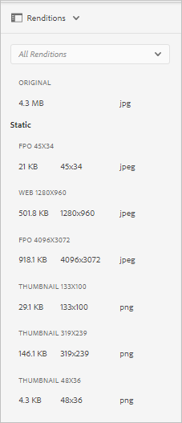

# 为Adobe InDesign生成“仅用于置入”演绎版 {#fpo-renditions}

<table>
    <tr>
        <td>
            <i>新</i> <a href="/help/assets/dynamic-media/dm-prime-ultimate.md"><b>Dynamic Media Prime和Ultimate</b></a>
        </td>
        <td>
            <i>新</i><a href="/help/assets/assets-ultimate-overview.md"><b>AEM Assets Ultimate</b></a>
        </td>
        <td>
            <i>新</i> <a href="/help/assets/integrate-aem-assets-edge-delivery-services.md"><b>AEM Assets与Edge Delivery Services的集成</b></a>
        </td>
        <td>
            <i>新</i> <a href="/help/assets/aem-assets-view-ui-extensibility.md"><b>UI可扩展性</b></a>
        </td>
          <td>
            <i>新建</i> <a href="/help/assets/dynamic-media/enable-dynamic-media-prime-and-ultimate.md"><b>启用Dynamic Media Prime和Ultimate</b></a>
        </td>
    </tr>
    <tr>
        <td>
            <a href="/help/assets/search-best-practices.md"><b>搜索最佳实践</b></a>
        </td>
        <td>
            <a href="/help/assets/metadata-best-practices.md"><b>元数据最佳实践</b></a>
        </td>
        <td>
            <a href="/help/assets/product-overview.md"><b>Content Hub</b></a>
        </td>
        <td>
            <a href="/help/assets/dynamic-media-open-apis-overview.md"><b>具有 OpenAPI 功能的 Dynamic Media</b></a>
        </td>
        <td>
            <a href="https://developer.adobe.com/experience-cloud/experience-manager-apis/"><b>AEM Assets 开发人员文档</b></a>
        </td>
    </tr>
</table>

| 版本 | 文章链接 |
| -------- | ---------------------------- |
| AEM 6.5 | [单击此处](https://experienceleague.adobe.com/zh-hans/docs/experience-manager-65/content/assets/administer/configure-fpo-renditions) |
| AEM as a Cloud Service | 本文 |

将大型资源从Experience Manager置入Adobe InDesign文档时，创意专业人士在[置入资源](https://helpx.adobe.com/cn/indesign/using/placing-graphics.html)后必须等待相当长的时间。 同时，用户被阻止使用InDesign。 这会中断创作流并对用户体验产生负面影响。 Adobe允许首先在InDesign文档中临时放置小型演绎版。 在需要最终输出时（例如，对于打印和发布工作流），原始的全分辨率资产会在后台替换临时演绎版。 这种后台异步更新可加快设计流程以提高工作效率，且不会阻碍创作过程。

Assets提供仅用于置入(FPO)的演绎版。 这些FPO呈现版本的文件大小较小，但纵横比相同。 如果FPO演绎版不可用于某个资源，Adobe InDesign将改用原始资源。 此回退机制可确保创意工作流不间断地进行。

Experience Manager as a Cloud Service提供了云原生资源处理功能来生成FPO演绎版。 使用资源微服务生成节目。 您可以配置新上传的资源以及Experience Manager中存在的资源的演绎版生成。

以下是生成FPO呈现形式的步骤：

1. [创建处理配置文件](#create-processing-profile)。

1. 将Experience Manager配置为使用此配置文件[处理新资源](#generate-renditions-of-new-assets)。
1. 使用配置文件[处理现有资源](#generate-renditions-of-existing-assets)。

## 创建处理配置文件 {#create-processing-profile}

要生成FPO呈现版本，请创建&#x200B;**[!UICONTROL 处理配置文件]**。 配置文件使用云原生资产微服务进行处理。 有关说明，请参阅[创建资产微服务的处理配置文件](asset-microservices-configure-and-use.md)。

选择&#x200B;**[!UICONTROL 创建FPO呈现版本]**&#x200B;以生成FPO呈现版本。 或者，单击&#x200B;**[!UICONTROL 新增]**&#x200B;以将其他节目设置添加到同一配置文件。

## 生成新资源的演绎版 {#generate-renditions-of-new-assets}

要生成新资产的FPO演绎版，请将&#x200B;**[!UICONTROL 处理配置文件]**&#x200B;应用于文件夹属性中的文件夹。 在文件夹的“属性”页中，单击&#x200B;**[!UICONTROL 资产处理]**&#x200B;选项卡，选择&#x200B;**[!UICONTROL FPO配置文件]**&#x200B;作为&#x200B;**[!UICONTROL 处理配置文件]**，然后保存更改。 使用此配置文件处理上传到该文件夹的所有新资源。

## 生成现有资源的演绎版 {#generate-renditions-of-existing-assets}

要生成演绎版，请选择资源并按照以下步骤操作。

## 查看FPO呈现版本 {#view-fpo-renditions}

您可以检查工作流完成之后生成的FPO演绎版。 在Experience Manager Assets用户界面中，单击资源以打开大型预览。 打开左边栏并选择&#x200B;**[!UICONTROL 格式副本]**。 或者，在预览打开时使用键盘快捷键`Alt + 3`。

单击&#x200B;**[!UICONTROL FPO呈现版本]**&#x200B;以加载其预览。 或者，您也可以右键单击该演绎版并将其保存到您的文件系统。 检查左边栏中是否有可用的演绎版。

**另请参阅**

* [翻译资源](translate-assets.md)
* [Assets HTTP API](mac-api-assets.md)
* [资源支持的文件格式](file-format-support.md)
* [搜索资源](search-assets.md)
* [连接的资源](use-assets-across-connected-assets-instances.md)
* [资源报告](asset-reports.md)
* [元数据架构](metadata-schemas.md)
* [下载资源](download-assets-from-aem.md)
* [管理元数据](manage-metadata.md)
* [搜索 Facet](search-facets.md)
* [管理收藏集](manage-collections.md)
* [批量元数据导入](metadata-import-export.md)
* [发布资源到 AEM 和 Dynamic Media](/help/assets/publish-assets-to-aem-and-dm.md)