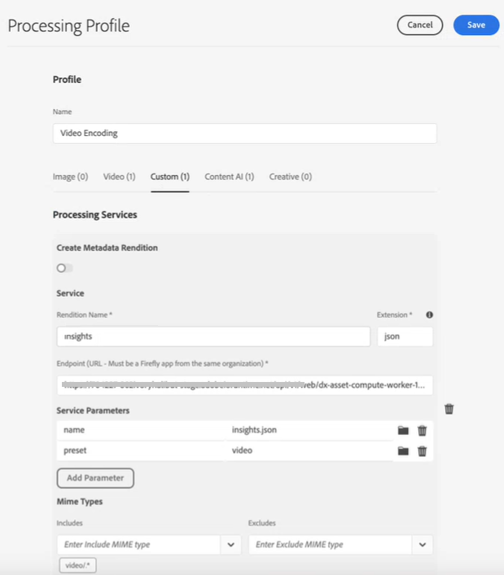
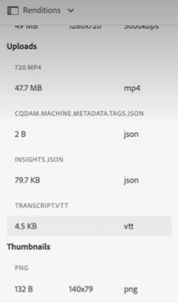
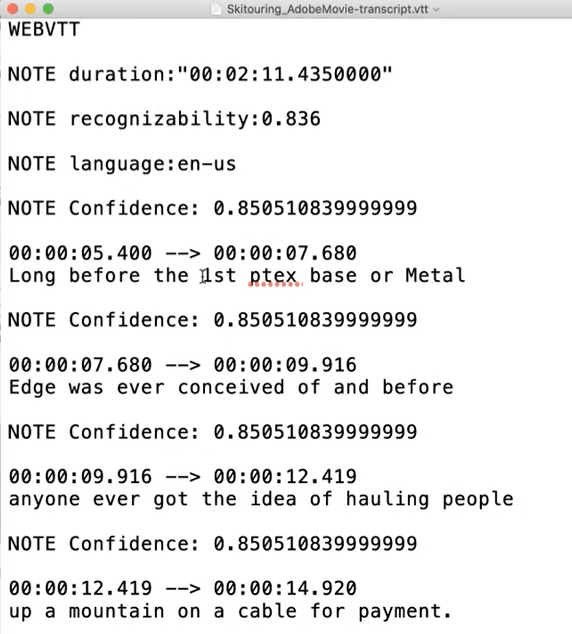

# 在中配置转录 [!DNL Experience Manager Assets] {#configure-transcription-service}

转录是使用语音识别技术将音频从音频或视频文件转换为文本（语音到文本）的过程。
[!DNL Adobe Experience Manager Assets] 已配置 [!DNL Azure Media Services] 它以WebVTT(.vtt)格式的支持音频或视频文件自动生成讲话语言的文本记录。 在中处理音频或视频资产时 [!DNL Experience Manager Assets]，则转录服务会自动生成音频或视频资产的文本记录呈现版本，并将其存储在原始资产所在的Assets存储库中的相同位置。 的 [!DNL Experience Manager Assets] 转录服务允许营销人员通过增加的文本内容可发现性来有效管理其音频和视频内容，并通过支持辅助功能和本地化来提高这些资产的ROI。

笔录是讲话内容的文本版本；例如，您正在任何OTT平台上观看的影片，通常包含字幕或字幕，以帮助辅助辅助功能或使用其他语言的内容。 或用于营销、学习或娱乐目的的任何音频或视频文件。 这些体验以转录开始，然后根据需要对其进行格式化或翻译。 在手动执行时，转录音频或视频是一个非常耗时且容易出错的过程。 鉴于对音频视频内容的需求日益增长，对手动过程进行扩展也是一个挑战。 [!DNL Experience Manager Assets] 使用Azure基于AI的转录，该转录允许对音频和视频资产进行大规模处理，并生成文本记录（.vtt文件）以及时间戳详细信息。 除了Assets之外，转录功能也受Dynamic Media支持。

转录功能可在 [!DNL Experience Manager Assets]. 但是，管理员需要用户的Azure凭据才能在中配置转录服务 [!DNL Experience Manager Assets]. 您还可以 [获取试用凭据](https://azure.microsoft.com/en-us/pricing/details/media-services/) 直接从Microsoft®体验Assets中的音频或视频转录功能。

## 转录先决条件 {#prerequisites}

1. 启动并运行 [!DNL Experience Manager Assets as a Cloud Service] 实例。
1. 在中进行配置需要以下Azure凭据 [!DNL Experience Manager Assets]:

   * 客户端ID（API密钥）
   * 客户端密钥
   * 租户端点（域）
   * 媒体帐户
   * 资源组
   * 订阅ID

   请参阅 [Azure文档](https://docs.microsoft.com/en-us/azure/media-services/latest/access-api-howto?tabs=portal) 获取访问Azure媒体服务API的凭据。

1. 确保Azure帐户具有足够的信用以处理新请求。

## 在中配置转录 [!DNL Experience Manager Assets] {#configure-transcription}

以下是在中启用转录功能所需的配置 [!DNL Experience Manager Assets]:

1. [配置Azure媒体服务](#configure-azure-media-service)
1. [配置音频/视频转录的处理配置文件](#configure-processing-profile-for-transcription)

### 配置Azure媒体服务 {#configure-azure-media-services}

[!DNL Experience Manager Assets] 使用 [!DNL Azure Media Services] 自动生成口语的文本记录 [支持的音频或视频文件](#supported-file-formats-for-transcription) (.vtt)格式。 管理员可以配置 [!DNL Azure Media Services] in [!DNL Experience Manager Assets] 使用Azure凭据。 的 [转录先决条件](#transcription-prerequisites) 列出 [!DNL Azure] 配置所需的凭据。 如果您没有 [!DNL Azure] 帐户和凭据，请参阅 [Azure媒体服务文档](https://azure.microsoft.com/en-us/pricing/details/media-services/) 以获取试用凭据。

转到 **[!UICONTROL 工具]** > **[!UICONTROL Cloud Services]** > **[!UICONTROL Azure媒体服务配置]**. 从左边栏中选择一个文件夹（位置），然后单击 [!UICONTROL 创建] 按钮以配置与 [!DNL Azure] 帐户。 此文件夹是 [!DNL Azure] 云配置存储在Experience Manager Assets中。 输入 [!DNL Azure] 凭据，单击 **[!UICONTROL 保存并关闭]**.

### 配置转录的处理配置文件 {#configure-processing-profile}

一旦 [!DNL Azure Media Services] 已在Experience Manager Assets中配置，下一步是创建资产处理配置文件，以生成基于AI的音频和视频资产转录。 基于AI的处理用户档案生成 [支持的音频或视频资产](#supported-file-formats-for-transcription) 格式副本，并将记录（.vtt文件）存储在原始资产所在的同一文件夹中。 因此，用户更容易搜索和查找资产及其记录呈现版本。

转到 **[!UICONTROL 工具]** > **[!UICONTROL 资产]** > **[!UICONTROL 处理配置文件]** 并单击 **[!UICONTROL 创建]** 按钮创建基于AI的处理配置文件，以生成音频和视频文件的转录。 默认情况下，处理配置文件页面仅反映三个选项卡（“图像”、“视频”和“自定义”）。 但是， **[!UICONTROL 内容人工智能]** 选项卡 [!DNL Azure Media Services] 在 [!DNL Experience Manager Assets] 实例。 验证 [!DNL Azure] 凭据（如果您没有看到） **[!UICONTROL 内容人工智能]** 选项卡。

在 **[!UICONTROL 内容人工智能]** ，单击 **[!UICONTROL 新增]** 按钮来配置转录。 在此，您可以通过从下拉列表中选择文件类型来包含和排除用于生成记录的文件格式（MIME类型）。 在下图中，包含所有支持的音频和视频文件，并排除文本文件。

启用 **[!UICONTROL 在同一目录中创建VTT记录]** 切换以创建记录格式副本（.vtt文件）并将其存储在原始资产所在的同一文件夹中。 其他演绎版也由默认的DAM资产处理工作流生成，无论进行何种设置。

下图详细介绍了在Experience Manager Assets中创建的自定义视频配置文件。

视频配置文件还包含以下自定义配置。 请参阅 [处理配置文件文档](/help/assets/asset-microservices-configure-and-use.md) 有关如何创建自定义处理配置文件的详细信息。

现在，让我们在此视频配置文件中配置转录。 导航到 **[!UICONTROL 内容人工智能]** 选项卡上单击 **[!UICONTROL 新增]** 按钮。 包括所有音频和视频文件，并排除图像和应用程序文件。 启用 **[!UICONTROL 在同一目录中创建VTT记录]** 切换并保存配置。

在配置了处理配置文件以转录音频和视频文件后，您可以使用以下方法之一将此处理配置文件应用到文件夹：

* 在中选择处理配置文件定义 **[!UICONTROL 工具]** > **[!UICONTROL 资产]** > **[!UICONTROL 处理配置文件]**，使用 **[!UICONTROL 将配置文件应用到文件夹]** 操作。 内容浏览器允许您导航到特定文件夹，选择文件夹并确认配置文件的应用程序。
* 在Assets用户界面中选择文件夹，然后单击 **[!UICONTROL 属性]** 操作以打开文件夹属性。 单击 **[!UICONTROL 资产处理]** ，然后从 **[!UICONTROL 处理配置文件]** 列表。 要保存更改，请单击 **[!UICONTROL 保存并关闭]**.

   

* 用户可以在Assets用户界面中选择文件夹或特定资产以应用处理配置文件，然后选择 **[!UICONTROL 重新处理资产]** 选项。

>[!TIP]
>一个文件夹只能应用一个处理配置文件。
>
>将处理配置文件应用到文件夹后，系统会使用配置的附加处理配置文件来处理该文件夹中上传（或更新）的所有新资产或其任何子文件夹。 此处理过程除了标准默认配置文件之外，还包含其他内容。

>[!NOTE]
>
>应用到文件夹的处理配置文件适用于整个树，但是，可能会与应用到子文件夹的其他配置文件重叠。
>
>将资产上传到文件夹后，Experience Manager会与容器文件夹的属性进行通信，以标识处理配置文件。 如果未应用任何文件夹，则会检查层次结构中的父文件夹以应用处理配置文件。

## 生成音频或视频资产的转录 {#generate-transcription}

处理视频资产时， [基于AI的处理配置文件](#configure-processing-profile-for-transcription) 会自动将记录（.vtt文件）与同一文件夹中的原始资产一起生成为演绎版。

您还可以通过访问原始视频资产的演绎版来查看记录演绎版。 访问 **[!UICONTROL 演绎版]** 面板，选择原始视频资产并打开左边栏。 您可以看到记录副本（.vtt文件）显示在 **[!UICONTROL TRACKPTVTT]** 头。

您可以直接从文件夹下载记录（.vtt文本文件）作为单独的资产演绎版，也可以从 **[!UICONTROL 演绎版]** 面板，方法是下载资产的所有演绎版。

目前，Experience Manager不支持在本机预览或编辑VTT文件的全文。 但是，您可以下载记录副本，并使用任何文本编辑器来编辑或验证记录。 记录以文本形式反映讲话语言，在视频的给定时间戳处，且包含转录的置信度分数（准确度）。

## 在Dynamic Media中使用转录 {#using-transcription-in-dynamic-media}

如果 [已配置Dynamic Media](/help/assets/dynamic-media/config-dm.md) 在Experience Manager Assets实例中，您可以将资产（音频或视频文件）及其记录（.vtt文件）发布到Dynamic Media。 这样，原始资产（音频或视频文件）及其转录的呈现版本（.vtt文件）就会发布到同一文件夹中的Dynamic Media。 Dynamic Media管理员可以 [启用CC隐藏式字幕体验](/help/assets/dynamic-media/video.md#adding-captions-to-video) 用于使用记录格式副本（.vtt文件）的音频或视频文件。

另请参阅：

* [有关如何将CC隐藏式字幕添加到Dynamic Media视频的视频教程](https://experienceleague.adobe.com/docs/experience-manager-learn/assets/dynamic-media/dynamic-media-overview-feature-video-use.html#add-cc-closed-captioning-to-dynamic-media-video)
* [将Dynamic Media视频发布到YouTube](/help/assets/dynamic-media/video.md#publishing-videos-to-youtube)

在下图中，URL反映引用记录（.vtt文件）的标题部分。 该视频将口语（转录的文本）反映为 **[!UICONTROL 隐藏式字幕]** 在视频中的给定时间戳。 用户可以使用 **[!UICONTROL CC]** 按钮。

## 支持的转录文件格式 {#supported-file-format}

支持以下音频和视频文件格式进行转录：

| 支持的音频/视频格式 | 扩展 |
|----|----|
| FLV（带H.264和AAC编解码器） | (.flv) |
| MXF | (.mxf) |
| MPEG2-PS、MPEG2-TS、3GP | (.ts， .ps， .3gp， .3gpp， .mpg) |
| Windows Media视频(WMV)/ASF | (.wmv、.asf) |
| AVI（未压缩8位/10位） | (.avi) |
| MP4 | (.mp4、.m4a、.m4v) |
| Microsoft®数字视频录制(DVR-MS) | (.dvr-ms) |
| Matroska/WebM | (.mkv) |
| 波/波 | (.wav) |
| QuickTime | (.mov) |

>[!NOTE]
>
>不支持转录应用程序类型的资产（音频或视频文件）。

## 已知限制 {#known-limitations}

* 持续时间长达10分钟的视频支持转录功能。
* 视频标题的长度必须少于80个字符。
* 支持的文件大小高达15 GB。
* 支持的最大处理持续时间为60分钟。
* 付费 [!DNL Azure] 帐户，您每分钟最多可上传50部影片。 但是，在试用帐户中，您每分钟最多可以上传五部影片。

## 故障诊断提示 {#troubleshooting}

登录到 [!DNL Azure Media Services] 帐户具有与您用于配置的相同凭据，用于验证请求状态。 联系人 [!DNL Azure] 支持。

