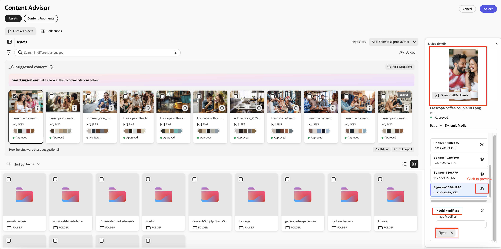

# 使用内容审查程序访问Adobe应用程序中的AEM内容{#content-advisor-aem-assets-adobe-applications}

Content Advisor提供了跨Adobe应用程序的统一内容发现体验。 Content Advisor与Adobe Workfront（即将推出）、AJO B2C（即将推出）、AEM Sites和其他应用程序原生集成，在单个智能界面中将内容（资源和内容片段）整合在一起。 它使您能够在工作流程中轻松地发现、浏览和重新使用最相关的内容，因此您可以在不中断上下文的情况下更快地移动。

>[!IMPORTANT]
> 
> 内容片段药丸当前不可用，不久将支持适当的Adobe应用程序。

Content Advisor将智能、上下文感知的发现直接引入创作体验中，帮助您根据自己的意图快速找到相关、经批准的内容。 借助智能建议、Dynamic Media演绎版和详细资产元数据等功能，您可以在不离开应用程序界面的情况下高效地评估和重用内容，从而加快内容创建，同时保持品牌一致性。

## 先决条件 {#prerequisites}

* 访问AEM Assets as a Cloud Service环境。

* 访问已创作内容片段的AEM Sites环境。

## 使用Content Advisor发现智能资产 {#intelligent-asset-discovery-content-advisor}

内容审查程序会根据您托管的Adobe应用程序内容或营销活动摘要，使用智能的上下文感知建议来帮助您发现相关内容。 它还允许您选择针对用例优化的现成渠道Dynamic Media演绎版。

>[!IMPORTANT]
> 
>确保从&#x200B;**存储库**&#x200B;下拉列表中选择一个&#x200B;**作者**&#x200B;存储库。 **投放**&#x200B;存储库不显示内容审查程序功能。
>
> 此外，**投放**&#x200B;存储库没有在文件夹和收藏集中整理内容。 内容以扁平结构显示在根级别。

内容审查程序提供了以下主要功能：

* [AI 搜索更智能的资源发现](#content-advisor-ai-search)

* [基于上下文和意图的智能建议](#smart-suggestions-content-advisor)

* [用于发现相关资产的Campaign摘要](#campaign-briefs-content-advisor)

* [可供使用的Dynamic Media资产演绎版](#dynamic-media-renditions-content-advisor)

* [与内容片段无缝集成](#content-fragments-integration-content-advisor)

* [访问与Assets视图一致的资源元数据](#asset-metadata-content-advisor)

* [访问与Assets视图一致的筛选器](#filters-content-advisor)

* [访问和重复使用最近和保存的搜索](#saved-searches-content-advisor)

* [在收藏集中和收藏集中搜索资产](#search-collections-content-advisor)

### AI 搜索更智能的资源发现 {#content-advisor-ai-search}

内容审查工具使用高级搜索功能，该功能理解用户查询的含义和意图，而不是依赖精确的关键字匹配。 它利用人工智能(AI)和机器学习提供更准确和上下文感知的结果。

传统基于关键字的搜索会查找精确的术语，而AI 搜索则解释单词、概念和使用意图之间的关系。 这可以确保用户找到他们要查找的内容 — 即使他们的查询用词不同、包含拼写错误或使用另一种语言。

内容审查程序中的

如果它的主要优势包括：

* 多语言支持：可跨多种语言搜索，无需精确翻译。 用户可以找到相关内容，而不管其查询语言如何。

* 处理拼写错误：解释拼写错误和拼写错误，确保即使输入不完美也能获得准确的结果。

* 理解同义词：提供相关术语和短语的结果，因此用户无需猜测正确的关键字。

* 上下文感知搜索：识别查询背后的意图，而不仅仅是确切的单词。

>[!IMPORTANT]
> 
>* 访问Content Advisor中的AI 搜索所需的最低AEM发行版本是`21994`
>* 即将推出对内容片段的AI 搜索支持。

### 基于上下文和意图的智能建议 {#smart-suggestions-content-advisor}

内容审查程序根据主机Adobe应用程序的上下文显示智能建议。 这有助于您快速发现和使用符合您的内容需求的资产，而无需费时的手动搜索。

>[!IMPORTANT]
> 
>* 您必须签署GenAI骑士才能在Content Advisor中访问此功能。 要签署GenAI附加程序，请联系您的Adobe代表。
>* 访问此功能所需的最低AEM发行版本是`21994`。
>* 内容审查程序根据主机Adobe应用程序中可用内容的上下文和意图显示智能建议。 它不显示基于图像的结果。 有关支持此功能的Adobe应用程序的列表，请参阅[跨Adobe应用程序支持内容顾问功能](#content-advisor-feature-support-adobe-applications)。

### 用于发现相关资产的Campaign摘要 {#campaign-briefs-content-advisor}

内容审查程序允许您上传活动简介文档以发现相关资源，而无需手动输入搜索关键词。 内容审查程序会分析营销活动简介中的信息以了解营销活动的意图，并推荐AEM Assets中可用的相关资源。

>[!IMPORTANT]
>
>* 内容审查程序会分析营销活动简报中作为文本提供的信息，以推荐相关资源。 它不会分析营销活动简报中作为图像提供的信息。
>* 可以作为营销活动简介上传的受支持文件类型包括PDF、DOCX和TXT文档。
>* 您必须签署GenAI骑士才能在Content Advisor中访问此功能。 要签署GenAI附加程序，请联系您的Adobe代表。
>* 访问此功能所需的最低AEM发行版本是`21994`。
>* 即将为内容片段提供上传活动简述支持。

### 可供使用的Dynamic Media资产演绎版 {#dynamic-media-renditions-content-advisor}

Dynamic Media演绎版提供现成的渠道优化版资产，包括[图像预设](/help/assets/dynamic-media/managing-image-presets.md)、[智能裁剪](/help/assets/dynamic-media/image-profiles.md)、格式类型和颜色配置文件。 这些演绎版有助于确保选定的资产满足渠道和设计要求，而无需手动编辑或资产重复。

您还可以应用Dynamic Media修饰符以在为宿主Adobe应用程序选择演绎版之前实时预览调整，从而加快选择最合适的演绎版，同时保持资源一致性和质量。

单击资产卡上的图标，然后选择&#x200B;**[!UICONTROL Dynamic Media]**&#x200B;选项卡以查看资产的可用演绎版。 您可以选择查看[Dynamic Media Scene7](/help/assets/dynamic-media/dynamic-media.md)呈现版本或具有OpenAPI的[Dynamic Media](/help/assets/dynamic-media-open-apis-overview.md)呈现版本。 当您为某个资产选择&#x200B;**[!UICONTROL OpenAPI]**&#x200B;时，只有当该资产获得批准并且可用于带有OpenAPI的Dynamic Media时，才会显示可用的演绎版。

您必须拥有有效的AEM Dynamic Media许可证才能查看Dynamic Media选项卡。

单击图标以预览该演绎版，或者单击该演绎版名称，然后单击&#x200B;**[!UICONTROL 选择]**&#x200B;以使该演绎版可在您的主机应用程序中使用。

单击&#x200B;**[!UICONTROL 添加修饰符]**，在文本框中指定修饰符，然后按Enter实时将转换应用于所有资产演绎版。 同样，您可以向格式副本添加多个修饰符并预览这些转换。 单击该演绎版名称，然后单击&#x200B;**[!UICONTROL 选择]**&#x200B;使该演绎版可在您的主机应用程序中使用。 应用这些修饰符后的演绎版不会保存。 查看[Dynamic Media Scene7](https://experienceleague.adobe.com/en/docs/dynamic-media-developer-resources/image-serving-api/image-serving-api/http-protocol-reference/command-reference/c-command-reference)和具有OpenAPI的[Dynamic Media](https://developer.adobe.com/experience-cloud/experience-manager-apis/api/stable/assets/delivery/#operation/getAssetSeoFormat)支持的修饰符列表。

### 内容片段的发现 {#content-fragments-discovery-content-advisor}

Content Advisor提供内容片段发现功能，使您能够轻松浏览片段并将片段合并到支持的Adobe应用程序中。 搜索内容片段列表并选择最相关的内容，而不离开当前工作流。

每个内容片段都表示为卡片，其内容中生成了实时缩略图预览，可帮助您快速识别正确的片段。 卡片还会显示标题和状态（草稿、已修改或已发布）等键详细信息。 要获得更深入的见解，请单击图标以查看详细的属性、对其他内容片段的引用以及可用的变体，从而确保明智的内容选择和重用。

内容审查程序中的

>[!IMPORTANT]
> 
>* 内容审查器中的内容片段尚不支持AI 搜索、智能建议、上传活动摘要和预览功能。

### 访问与Assets视图一致的资源元数据 {#asset-metadata-content-advisor}

内容审查程序提供对AEM Assets中定义的资源属性的访问，包括Assets视图中可用的元数据。 内容审查器使用与Assets视图中的相同的元数据配置，复制Assets视图资源详细信息页面中的元数据选项卡和内容列表。 这允许您在选择资源之前查看关键资源详细信息，如标题、描述、格式、大小和其他元数据。 访问资源属性有助于确保为您的内容选择正确且已获批准的资源。

单击资产卡上的图标，然后选择&#x200B;**[!UICONTROL 基本]**&#x200B;选项卡以查看资产元数据。 您还可以查看其他资源元数据选项卡，如产品、促销活动和标记，这些选项卡与Assets视图中存在的资源元数据一致。

内容审查程序在只读视图中显示文件的属性（元数据）。 收藏集和文件夹的属性不显示。

### 访问与Assets视图一致的筛选器 {#filters-content-advisor}

内容审查程序在主机Adobe应用程序中提供了与Assets视图中相同的筛选功能，这使您能够使用预定义过滤器来优化资源。 Assets视图中提供的相同筛选功能也适用于特定于内容类型的筛选器，例如文件、文件夹和收藏集。 这可以确保获得一致的资源发现体验，并帮助您在主机Adobe应用程序中高效地找到相关资源。

如果您未在Assets视图中通过过滤器架构设置过滤器，则内容审查程序会显示现成的过滤器，包括文件类型、文件格式、资源状态、文件大小、图像宽度、图像高度、修改日期和创建日期。

Assets（文件）支持自定义筛选架构，但文件夹和收藏集尚不支持自定义筛选架构。

### 访问和重复使用最近和保存的搜索 {#saved-searches-content-advisor}

在Assets视图中创建的已保存搜索也可用，这使您能够重复使用预定义的搜索条件。 保存的搜索在Assets视图和内容审查程序之间跨浏览器的一致工作。 这有助于您在AEM Assets和其他Adobe应用程序中使用一致的搜索模式来高效地查找资源。

要使用内容审查程序保存常用搜索，请执行以下操作：

1. 指定搜索词（可选），单击过滤器图标，然后根据您的要求选择选项以创建搜索查询。

1. 单击&#x200B;**管理保存的搜索** > **新建保存的搜索**。

1. 指定搜索的名称，然后单击进行保存。 搜索将显示在项目列表中。

   

要应用任何保存的搜索项，请从&#x200B;**[!UICONTROL 保存的搜索]**&#x200B;下拉列表中选择搜索项。 内容审查程序根据搜索查询显示结果。

内容审查器保存您最近的搜索，还允许您保存经常使用的搜索以便以后快速访问。 最近搜索的列表在Assets视图与内容审查器之间不一致。 同一用户可以在Assets视图和内容审查器中拥有一组不同的近期搜索。 如果您使用无痕模式访问内容审查程序，则最近的搜索列表不可用。 此外，最近搜索不会在不同浏览器之间共享给同一用户，这些搜索是特定于AEM环境的。

在Assets视图中提供的默认已保存搜索功能在内容审查器中尚不可用。

### 在收藏集中和收藏集中搜索资产 {#search-collections-content-advisor}

内容审查程序允许您在所有收藏集中搜索资产或收藏集，或将搜索限制在特定的收藏集。 这有助于快速找到和使用策划收藏集中的资产，同时保留其预期组织上下文。

## 跨Adobe应用程序支持内容审查程序功能 {#content-advisor-feature-support-adobe-applications}

下表说明了跨Adobe应用程序支持的内容审查程序功能。

>[!IMPORTANT]
> 
> 随着Content Advisor扩展到其他Adobe应用程序，此表将会更新以反映最新支持。

| 应用程序 | 支持用于搜索Assets的简短上传 | 搜索Assets时支持建议的内容面板 | 搜索Assets时支持Dynamic Media面板 | 支持搜索内容片段 |
|--------------------------------------|----------------------------------------------|-----------------------------------------------------------|--------------------------------------------------------|------------------------------------------|
| AEM Sites（基于文档的创作） | ✓ | − | ✓ | − |
| AEM Sites（文档创作） | ✓ | ✓ | ✓ | − |
| AEM Sites（内容片段编辑器） | ✓ | ✓ | ✓ | − |
| AEM Sites（通用编辑器） | ✓ | ✓ | ✓ | − |

