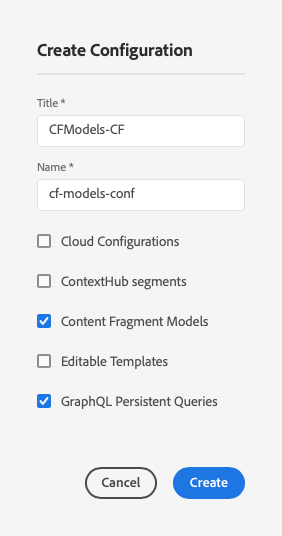

# 内容片段模型{#content-fragment-models}

内容片段模型定义内容片段的内 [容结构](/help/assets/content-fragments/content-fragments.md)。

## Enable Content Fragment Models {#enable-content-fragment-models}

>[!CAUTION]
>
>如果不启用内 **容片段模型** , **则“创** 建”选项将不可用于创建新模型。

要启用内容片段模型，您需要：

* 在配置管理器中启用内容片段模型
* 将配置应用到您的资产文件夹

### 在Configuration Manager中启用内容片段模型 {#enable-content-fragment-models-in-configuration-manager}

要创 [建新的内容片段模型](#creating-a-content-fragment-model) , **您必须首先** 使用配置管理器启用它们：

1. 导航到&#x200B;**工具**、**常规**，然后打开&#x200B;**配置浏览器**。
2. 选择适合您的网站的位置。
3. 使 **用创建** 打开对话框，您可以：

   1. 指定 **标题**。
   2. 选择 **内容片段模型** ，以启用其使用。

   

4. 选择 **创建** ，以保存定义。

### 将配置应用到您的资产文件夹 {#apply-the-configuration-to-your-assets-folder}

为内容片 **段模型** 启用配置全局后，用户创建的任何模型都可以用于任何资产文件夹中。

要将其他配置（即不包括全局配置）与类似的 Assets 文件夹一起使用，您必须定义连接。这是通过在相应文件夹的“ **文件夹属性** ”的“云服务 **”选项卡中选****** 择相应的配置来完成的。

## 创建内容片段模型 {#creating-a-content-fragment-model}

1. 导航到 **工具**、资 **产**，然后打 **开内容片段模型**。
1. 导览至适合您的配置的文 [件夹](#enable-content-fragment-models)。
1. 使用 **创建** ，打开向导。

   >[!CAUTION]
   >
   >如果 [未启用内容片段模型的使用](#enable-content-fragment-models)，则 **“创建** ”选项将不可用。

1. 指定&#x200B;**模型标题**。您还可以根据需要添加&#x200B;**描述**。

   

1. 使 **用** “创建”(Create)保存空模型。 将显示一条消息，指示操作成功，您可以选 **择** “打开”(Open)以立即编辑模型， **或选择“** 完成”(Done)以返回控制台。

## 定义内容片段模型 {#defining-your-content-fragment-model}

内容片段模型有效地定义所生成内容片段的结构。 使用模型编辑器，您可以添加和配置必填字段：

>[!CAUTION]
>
>编辑现有内容片段模型可能会影响相关片段。

1. 导航到 **工具**、资 **产**，然后打 **开内容片段模型**。

1. 导航到包含内容片段模型的文件夹。
1. 打开编辑所需的 **模型**; 使用快速操作，或先选择模型，然后从工具栏中选择操作。

   打开模型编辑器后，将显示：

   * 左： 字段已定义
   * 右侧：可用于创建字段的&#x200B;**数据类型**（可在创建字段后使用的&#x200B;**属性**）

   >[!NOTE]
   >
   >当字段为&#x200B;**必填字段**&#x200B;时，左窗格中显示的&#x200B;**标签**&#x200B;将标有一个星号标记 (*****)。

   

1. **添加字段**

   * 将所需数据类型拖动到字段的所需位置：

   

   * 将字段添加到模型后，右侧面板将显示可为该 **特定** 数据类型定义的属性。 您可以在此处定义该字段的必需内容。 例如：

   

   >[!NOTE]
   对于数据类型&#x200B;**多行文本**，可将&#x200B;**默认类型**&#x200B;定义为以下任一类型：
   * **富文本**
   * **Markdown**
   * **纯文本**

   如果未指定，则此字 **段使用** 默认值富文本。
   更改内容片段模型中的&#x200B;**默认类型**&#x200B;仅会对在编辑器中打开并保存的现有相关内容片段生效。

1. **删除字段**

   选择所需字段，然后单击／点按垃圾桶图标。 系统将要求您确认该操作。

   

1. 添加所有必填字段并定义属性后，请 **使用** “保存”保留定义。 例如：

   

## 删除内容片段模型 {#deleting-a-content-fragment-model}

>[!CAUTION]
删除内容片段模型可能会影响相关片段。

要删除内容片段模型，请执行以下操作：

1. 导航到 **工具**、资 **产**，然后打 **开内容片段模型**。

1. 导航到包含内容片段模型的文件夹。
1. 选择模型，然后从工 **具栏** 中选择删除。

   >[!NOTE]
   如果模型被引用，则会发出警告。 采取适当措施。

## 发布内容片段模型 {#publishing-a-content-fragment-model}

内容片段模型需要在发布任何相关内容片段时／之前发布。

要发布内容片段模型，请执行以下操作：

1. 导航到 **工具**、资 **产**，然后打 **开内容片段模型**。

1. 导航到包含内容片段模型的文件夹。
1. 选择您的模型，然后从工 **具栏** 中选择发布。

   >[!NOTE]
   如果发布的内容片段尚未发布模型，则将显示一个选择列表来指示此情况，并且该模型将随片段一起发布。
