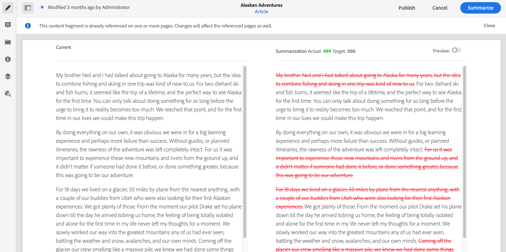
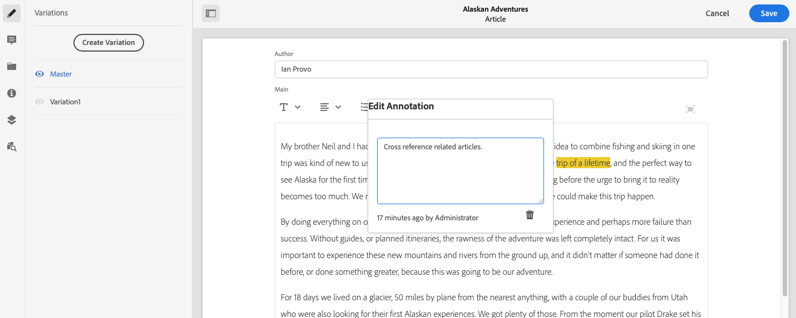
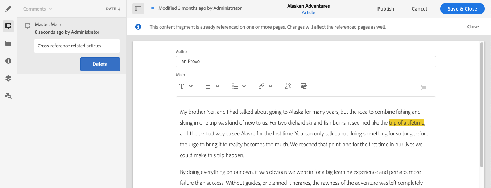
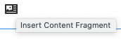
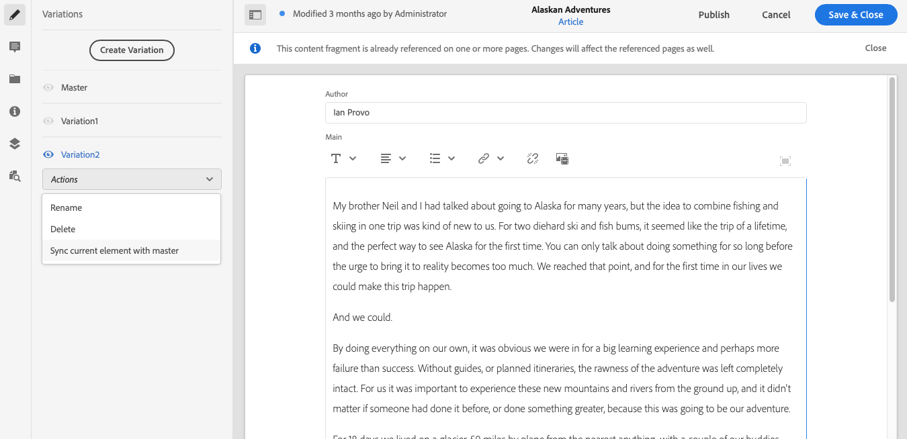

# 变量 - 创作片段内容{#variations-authoring-fragment-content}

[变](/help/assets/content-fragments/content-fragments.md#constituent-parts-of-a-content-fragment) 量是AEM内容片段的重要功能，它们允许您创建和编辑主控内容的副本，以用于特定渠道和/或场景，从而使无头内容投放更加灵活。

在&#x200B;**变量**&#x200B;选项卡中，您可以：

* [输入片](#authoring-your-content) 段的内容，
* [创建和管](#managing-variations) 理Mastercontent的 **** 变量，

根据正在编辑的数据类型执行一系列其他操作；例如：

* [将可视资产插入片段](#inserting-assets-into-your-fragment) （图像）

* 在[富文本](#rich-text)、[纯文本](#plain-text)和[标记](#markdown)之间进行选择以进行编辑

* [上传内容](#uploading-content)

* [视图键统计](#viewing-key-statistics) （关于多行文本）

* [总结文本](#summarizing-text)

* [使变量与主控内容同步](#synchronizing-with-master)

>[!CAUTION]
>
>在发布和/或引用片段后，当作者打开片段以再次进行编辑时，AEM将显示警告。 这将警告对片段所做的更改也会影响引用的页面。

## 创作内容{#authoring-your-content}

打开内容片段进行编辑时，默认情况下将打开&#x200B;**变量**&#x200B;选项卡。 您可以在此创作内容，以用于主控或您拥有的任何变体。 结构化片段包含在内容模型中定义的各种数据类型的字段。

例如：

辑器您可以：

* 直接在&#x200B;**变量**&#x200B;选项卡中进行编辑

   * 每种数据类型提供不同的编辑选项

* 对于&#x200B;**多行文本**&#x200B;字段，还可以打开[全屏编辑器](#full-screen-editor):

   * 选择[格式](#formats)
   * 查看更多编辑选项（对于[富文本](#rich-text)格式）
   * 访问[操作](#actions)的范围

* 对于&#x200B;**片段引用**&#x200B;字段，根据模型定义，**[编辑内容片段](#fragment-references-edit-content-fragment)**&#x200B;选项可用。

### 全屏编辑器{#full-screen-editor}

编辑多行文本字段时，可以打开全屏编辑器；点按或单击实际文本，然后选择以下操作图标：

这将打开全屏文本编辑器：

全屏文本编辑器提供：

* 访问各种[操作](#actions)
* 根据格式，其他格式选项（[富文本](#rich-text)）

### 操作 {#actions}

当全屏编辑器（即多行文本）打开时，还可以执行以下操作（适用于所有[formats](#formats)）：

* 选择[格式](#formats)（[富文本](#rich-text)、[纯文本、](#plain-text) [标记](#markdown)）

* [上传内容](#uploading-content)

* [显示文本统计](#viewing-key-statistics)

* [与主控同步](#synchronizing-with-master) （编辑变量时）

* [总结文本](#summarizing-text)

### 格式 {#formats}

编辑多行文本的选项取决于所选的格式：

* [富文本](#rich-text)
* [纯文本](#plain-text)
* [Markdown](#markdown)

在全屏编辑器中，可以选择格式。

### 富文本 {#rich-text}

富文本编辑允许您设置格式：

* 粗体
* 斜体
* 下划线
* 对齐：左，中，右
* 项目符号列表
* 编号列表
* 缩进：增加，减少
* 创建/断开超链接
* 粘贴文本/从Word
* 插入表
* 段落样式：段落，标题1/2/3
* [插入资产](#inserting-assets-into-your-fragment)
* 打开全屏编辑器，其中提供以下格式选项：
   * 搜索
   * 查找/替换
   * 拼写检查器
   * [注释](/help/assets/content-fragments/content-fragments-variations.md#annotating-a-content-fragment)
* [插入内容片段](#inserting-content-fragment-into-your-fragment);当多行文 **本字** 段配置了允许片段 **引用时可用**。

也可以从全屏编辑器访问[操作](#actions)。

### 纯文本 {#plain-text}

纯文本允许快速输入内容，而无需设置格式或标记信息。 您还可以打开全屏编辑器，以进一步[操作](#actions)。

>[!CAUTION]
>
>如果您选择&#x200B;**纯文本**，则可能会丢失已插入&#x200B;**富文本**&#x200B;或&#x200B;**标记**&#x200B;中的任何格式、标记和/或资产。

### Markdown {#markdown}

>[!NOTE]
>
>有关完整信息，请参阅[标记](/help/assets/content-fragments/content-fragments-markdown.md)文档。

这允许您使用标记设置文本格式。 您可以定义：

* 标题
* 段落和换行
* 链接
* 图像
* 块引号
* 列表
* 重点
* 代码块
* 反斜线转义

您还可以打开全屏编辑器，以进一步[操作](#actions)。

>[!CAUTION]
>
>如果在&#x200B;**富文本**&#x200B;和&#x200B;**标记**&#x200B;之间切换，您可能会在“引述块”和“代码块”中遇到意料之外的体验效果，因为这两种格式在处理方式上可能有所不同。

### 片段引用{#fragment-references}

如果内容片段模型包含片段引用，则片段作者可能还有其他选项：

* [编辑内容片段](#fragment-references-edit-content-fragment)
* [新内容片段](#fragment-references-new-content-fragment)

#### 编辑内容片段{#fragment-references-edit-content-fragment}

选项&#x200B;**编辑内容片段**&#x200B;将在新的编辑器选项卡（在同一个浏览器选项卡中）中打开该片段。

再次选择原始选项卡（例如，**Little Pony Inc.**）将关闭此辅助选项卡（在此例中为&#x200B;**Adam Smith**）。

#### 新内容片段 {#fragment-references-new-content-fragment}

选项&#x200B;**新建内容片段**&#x200B;将允许您创建全新的片段。 为此，将在编辑器中打开创建内容片段向导的变体。

然后，您将能够通过以下方式创建新片段：

1. 导览至，然后选择所需的文件夹。
1. 选择&#x200B;**下一步**。
1. 指定属性；例如&#x200B;**Title**。
1. 选择&#x200B;**创建**。
1. 最后：
   1. **多** 尼将返回（到原始片段）并引用新片段。
   1. **Open将** 引用新片段，并在新的浏览器选项卡中打开新片段进行编辑。

### 查看密钥统计{#viewing-key-statistics}

当打开全屏编辑器时，**文本统计信息**&#x200B;操作将显示有关文本的一系列信息。

例如：

### 上传内容{#uploading-content}

要简化创作内容片段的过程，您可以上传在外部编辑器中准备的文本，并直接将其添加到片段。

### 摘要文本{#summarizing-text}

摘要文本旨在帮助用户将文本的长度缩短到预定义的单词数，同时保留关键点和整体含义。

>[!NOTE]
>
>在更为技术的层面上，系统根据特定算法保持其评分的句子，以提供&#x200B;*信息密度和唯一性的最佳比率*。

>[!CAUTION]
>
>内容片段必须具有有效的语言文件夹（ISO代码）作为祖代；这用于确定要使用的语言模型。
>
>例如，`en/`如以下路径所示：
>
>  `/content/dam/my-brand/en/path-down/my-content-fragment`

>[!CAUTION]
现成提供英语。
包共享中的语言模型包提供了其他语言：
* [法语(fr)](https://www.adobeaemcloud.com/content/marketplace/marketplaceProxy.html?packagePath=/content/companies/public/adobe/packages/cq630/product/smartcontent-model-fr)
* [德语(de)](https://www.adobeaemcloud.com/content/marketplace/marketplaceProxy.html?packagePath=/content/companies/public/adobe/packages/cq630/product/smartcontent-model-de)
* [意大利语(it)](https://www.adobeaemcloud.com/content/marketplace/marketplaceProxy.html?packagePath=/content/companies/public/adobe/packages/cq630/product/smartcontent-model-it)
* [西班牙语(es)](https://www.adobeaemcloud.com/content/marketplace/marketplaceProxy.html?packagePath=/content/companies/public/adobe/packages/cq630/product/smartcontent-model-es)

1. 选择&#x200B;**主控**&#x200B;或所需的变量。
1. 打开全屏编辑器。

1. 从工具栏中选择&#x200B;**摘要文本**。

   

1. 指定单词的目标数，然后选择&#x200B;**开始**:
1. 原始文本与建议的摘要并排显示：

   * 任何要删除的句子都以红色突出显示，并带有删除。
   * 单击任何高亮显示的句子，将其保留在摘要内容中。
   * 单击任何未加亮的句子以将其删除。

1. 选择&#x200B;**摘要**&#x200B;以确认更改。

1. 原始文本与建议的摘要并排显示：

   * 任何要删除的句子都以红色突出显示，并带有删除。
   * 单击任何高亮显示的句子，将其保留在摘要内容中。
   * 单击任何未加亮的句子以将其删除。
   * 将显示总结统计信息：**实际**&#x200B;和&#x200B;**目标**-
   * 可以&#x200B;**预览**&#x200B;更改。

   

### 对内容片段{#annotating-a-content-fragment}添加注释

要对片段添加注释：

1. 选择&#x200B;**主控**&#x200B;或所需的变量。

1. 打开全屏编辑器。

1. 顶部工具栏中提供&#x200B;**注释**&#x200B;图标。 您可以根据需要选择一些文本。

   

1. 此时将打开一个对话框。您可以在此处输入您的注释。

   

1. 在对话框上选择&#x200B;**应用**。

   

   如果将注释应用于选定文本，则该文本仍将高亮显示。

   

1. 关闭全屏编辑器后，注释仍会高亮显示。 如果选择此项，将打开一个对话框，以便您能够进一步编辑注释。

1. 选择&#x200B;**保存**。

1. 关闭全屏编辑器后，注释仍会高亮显示。 如果选择此项，将打开一个对话框，以便您能够进一步编辑注释。

   

### 查看、编辑和删除注释{#viewing-editing-deleting-annotations}

注释:

* 在编辑器的全屏和普通模式下，都通过文本上的高亮显示来指示。 然后，可通过单击将重新打开对话框的高亮文本来查看、编辑和/或删除注释的完整详细信息。

   >[!NOTE]
   如果对一个文本应用了多个注释，则会提供下拉选择器。

* 删除应用注释的整个文本时，注释也会被删除。

* 通过在片段编辑器中选择&#x200B;**注释**&#x200B;选项卡，可以列出和删除。

   

* 可在选定片段的[时间轴](/help/assets/content-fragments/content-fragments-managing.md#timeline-for-content-fragments)中查看和删除。

### 将资产插入片段{#inserting-assets-into-your-fragment}

要简化创作内容片段的过程，您可以直接将[资产](/help/assets/manage-digital-assets.md)（图像）添加到片段。

它们将添加到片段的段落序列中，不加任何格式；在页面](/help/sites-cloud/authoring/fundamentals/content-fragments.md)上使用/引用[片段时，可以执行格式设置。

>[!CAUTION]
无法在引用页面上移动或删除这些资产，这必须在片段编辑器中完成。
但是，必须在[页面编辑器](/help/sites-cloud/authoring/fundamentals/content-fragments.md)中完成资产的格式设置（如大小）。 资产在片段编辑器中的表示形式仅用于创作内容流。

>[!NOTE]
有多种方法可将[images](/help/assets/content-fragments/content-fragments.md#fragments-with-visual-assets)添加到片段和/或页面。

1. 将光标定位到要添加图像的位置。
1. 使用插入 **资产图标** ，打开搜索对话框。

   

1. 在对话框中，您可以：

   * 在DAM中导航到所需的资产
   * 在DAM中搜索资产

   找到后，单击缩略图以选择所需的资产。

1. 使用&#x200B;**选择**&#x200B;将资产添加到当前位置的内容片段的段落系统中。

   >[!CAUTION]
   如果在添加资产后，您将格式更改为：
   * **纯文本**：资产将从片段中完全丢失。
   * **标记**：资产将不可见，但在您恢复为&#x200B;**富文本**&#x200B;时仍将存在。

### 将内容片段插入片段{#inserting-content-fragment-into-your-fragment}

为了简化内容片段的创作过程，您还可以向片段中添加其他内容片段。

它们将作为引用添加到片段的当前位置。

>[!NOTE]
当您的&#x200B;**多行文本**&#x200B;配置了&#x200B;**允许片段引用**&#x200B;时，此选项可用。

>[!CAUTION]
无法在引用页面上移动或删除这些资产，这必须在片段编辑器中完成。
但是，必须在[页面编辑器](/help/sites-cloud/authoring/fundamentals/content-fragments.md)中完成资产的格式设置（如大小）。 资产在片段编辑器中的表示形式仅用于创作内容流。

>[!NOTE]
有多种方法可将[images](/help/assets/content-fragments/content-fragments.md#fragments-with-visual-assets)添加到片段和/或页面。

1. 将光标置于要添加片段的位置。
1. 使用&#x200B;**插入内容片段**&#x200B;图标打开搜索对话框。

   

1. 在对话框中，您可以：

   * 导航到“资产”文件夹中所需的片段
   * 搜索片段

   找到后，单击缩略图以选择所需的片段。

1. 使用&#x200B;**选择**&#x200B;将对所选内容片段的引用添加到您当前的内容片段（在当前位置）。

   >[!CAUTION]
   如果在将引用添加到另一个片段之后，将格式更改为：
   * **纯文本**:片段中的引用将完全丢失。
   * **Markdown**:引用将保留。

## 管理变量{#managing-variations}

### 创建变量{#creating-a-variation}

各种变量允许您获取&#x200B;**主控**&#x200B;内容，并根据用途（如果需要）进行更改。

要创建新变体，请执行以下操作：

1. 打开片段并确保侧面板可见。
1. 从侧面板的图标栏中选择&#x200B;**变量**。
1. 选择&#x200B;**创建变量**。
1. 将打开一个对话框，为新变 **体指** 定 **标题和说** 明。
1. 选择 **添加**;片段 **主** (Master)将被复制到新变体中，该变体现在打开进行 [编辑](#editing-a-variation)。

   >[!NOTE]
   创建新变体时，始终是复制的&#x200B;**主控**，而不是当前打开的变体。

### 编辑变量{#editing-a-variation}

您可以在以下任一操作之后对变体内容进行更改：

* [创建变体](#creating-a-variation)。
* 打开现有片段，然后从侧面板中选择所需的变量。

### 重命名变量{#renaming-a-variation}

要重命名现有变体，请执行以下操作：

1. 打开片段，从侧面板中选择&#x200B;**变量**。
1. 选择所需的变量。
1. 从&#x200B;**操作**&#x200B;下拉列表中选择&#x200B;**重命名**。

1. 在生成的对 **话框中** ，输入新的 **标题和** /或说明。

1. 确认&#x200B;**重命名**&#x200B;操作。

>[!NOTE]
这仅影响变量&#x200B;**Title**。

### 删除变量{#deleting-a-variation}

要删除现有变量，请执行以下操作：

1. 打开片段，从侧面板中选择&#x200B;**变量**。
1. 选择所需的变量。
1. 从&#x200B;**操作**&#x200B;下拉列表中选择&#x200B;**删除**。

1. 确认对话框中的&#x200B;**删除**&#x200B;操作。

>[!NOTE]
无法删除&#x200B;**主控**。

### 与主控{#synchronizing-with-master}同步

**Masteris** 是内容片段的一个组成部分，根据定义，它包含内容的主控副本，而变量包含该内容的个别更新和定制版本。更新主控时，这些更改也可能与变量相关，因此需要传播到它们。

在编辑变量时，您有权访问将变量的当前元素与主控同步的操作。 这允许您自动将对主控所做的更改复制到所需的变量。

>[!CAUTION]
同步仅可将更改从&#x200B;***主**复制到变体*。
将只同步变量的当前元素。
同步仅适用于&#x200B;**多行文本**&#x200B;数据类型。
不提供将更改&#x200B;*从变体传输到&#x200B;**母版***选项。

1. 在片段编辑器中打开内容片段。 确保已编辑&#x200B;**主控**。

1. 从以下任一位置选择特定的变体，然后选择相应的同步操作：

   * **Actions**&#x200B;下拉选择器 — **将当前元素与主控**&#x200B;同步

      

   * 全屏编辑器的工具栏 — **与主控**&#x200B;同步

      

1. 主控，变量将并排显示：

   * 绿色表示已添加（到变量中）的内容
   * 红色表示内容已删除（从变体中）
   * 蓝色表示替换文本

   

1. 选择&#x200B;**同步**，将更新并显示变量。
