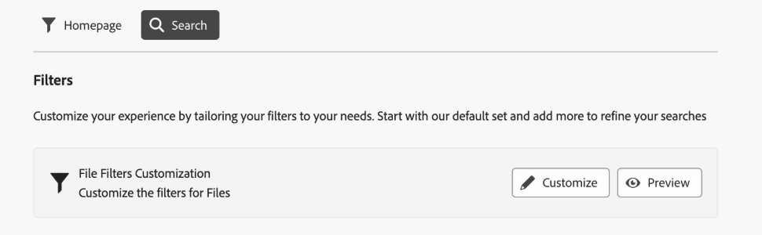

# 自定义搜索筛选器 {#customize-search-filters}

通过搜索过滤器，您可以根据各种参数（如日期、文件类型、标记和相关性）来优化搜索结果，从而提高搜索查询的精度。 通过应用过滤器，您可以高效地快速筛选最相关的结果。 这不仅可以节省时间，还可以根据特定偏好和需求定制结果，从而改善整体搜索体验。
查看有关[搜索](search-assets-view.md)的详细信息。

自定义搜索筛选器AEM Assets只能映射到可搜索属性索引中的条目。 在配置自定义筛选器体验之前，请确保包含任何自定义元数据。 [!DNL Assets view]帮助自定义搜索筛选器以简化搜索过程。 要自定义AEM Assets自定义搜索过滤器，请执行以下步骤：

1. 前往&#x200B;**[!UICONTROL 设置]** > **[!UICONTROL 常规设置]**。
1. 转到&#x200B;**[!UICONTROL 搜索]**&#x200B;选项卡。 单击&#x200B;**[!UICONTROL 自定义]**&#x200B;以配置您的搜索表单。

   

1. 出现[!UICONTROL 配置筛选器]表单。 确保您处于编辑模式，以便能够在模板中进行修改。 您可以切换到[!UICONTROL 预览模式]以查看现有搜索表单的预览。
1. 将[自定义筛选器](#available-custom-filters)中的筛选器元素拖放到画布上。 如果需要，您可以拖放组件以重新排序。

   >[!VIDEO](https://video.tv.adobe.com/v/3443080)

1. 单击&#x200B;**[!UICONTROL 预览模式]**&#x200B;以查看更改。
1. 单击&#x200B;**[!UICONTROL 确认]**&#x200B;以进行保存。

## 可用的自定义筛选条件 {#available-custom-filters}

Assets视图提供了以下可根据需要重新配置的自定义筛选器：

* [筛选元素](#filter-elements)
* [预配置的过滤器](#preconfigured-filters)

### 筛选元素 {#filter-elements}

自定义筛选条件AEM Assets允许您在自定义搜索筛选条件画布上使用筛选条件元素集合。 这些元素是基于搜索属性属性的可用性进行重构的。 但是，您可以根据需要自定义[筛选器属性](#filter-properties)。 [!DNL Assets view]中有以下筛选器元素：

<table>
    <tr>
        <th>筛选元素</th>
        <th>描述</th>
        <th>属性</th>
    </tr>
    <tr>
        <td>文本</td>
        <td>文本字段是一个输入区域，您可以在其中键入与过滤器相关的信息。</td>
        <td>
            <ul>
                <li>标签
                <li>元数据
                <li>值
                <li>描述
            </ul>
        </td>
    </tr>
    <tr>
        <td>选项</td>
        <td>选项是指从列表中选择首选项目的可用替代项。</td>
        <td>
            <ul>
                <li>标签
                <li>元数据
                <li>值
                <li>选项
                <li>描述
            </ul>
        </td>
    </tr>
    <tr>
        <td>布尔值</td>
        <td>Boolean表示一个true值。 您可以在希望特定地选择其中一个选项的位置使用该选项。</td>
        <td>
            <ul>
                <li>标签
                <li>元数据
                <li>描述
            </ul>
        </td>
    </tr>
    <tr>
        <td>数字</td>
        <td>使用此过滤元素表示数字值。</td>
        <td>
            <ul>
                <li>标签
                <li>元数据
                <li>选择类型
                <li>步进器
                <li>步进值
                <li>描述
            </ul>
        </td>
    </tr>
    <tr>
        <td>下拉列表</td>
        <td>在选项列表中显示的各种选项中进行选择。</td>
        <td>
            <ul>
                <li>标签
                <li>元数据
                <li>选项
                <li>值
                <li>描述
            </ul>
        </td>
    </tr>
    <tr>
        <td>日期</td>
        <td>用于指定日期。</td>
        <td>
            <ul>
                <li>标签
                <li>元数据
                <li>选择类型
                <li>描述
            </ul>
        </td>
    </tr>
    <tr>
        <td>路径浏览器</td>
        <td>用于浏览Experience Manager存储库中的文件或文件夹。</td>
        <td>
            <ul>
                <li>标签
                <li>元数据
                <li>路径资源管理器
                <li>描述
            </ul>
        </td>
    </tr>
    <tr>
        <td>标记</td>
        <td>用于从可用选项中选择标记。 标记提供了有关资产的更具体信息并增强了它们的可发现性。 已应用于所选资源的标记会显示在<b>属性</b>面板中。 如果您将标记存储在自定义元数据属性上，并使用根路径将其限制为层次结构，则可以在搜索筛选器中利用相同的配置。 如果找不到相关标记，请创建这些标记并将其分配给选定的资源。 有关创建标记并将标记分配给资源的详细信息，请参阅<a href = "tagging-management-assets-view.md">在Assets视图</a>中管理标记。</td>
        <td>
            <ul>
                <li>标签
                <li>元数据
                <li>标记选取器
                <li>描述
            </ul>
        </td>
    </tr>
    <tr>
        <td>用户</td>
        <td>用于指定管理员、常规用户和使用者用户之间的用户类型。</td>
        <td>
            <ul>
                <li>标签
                <li>元数据
                <li>描述
            </ul>
        </td>
    </tr>
</table>

### 预配置的过滤器 {#preconfigured-filters}

预配置的筛选器是预设设置，允许您直接在画布上使用它们。 但是，您可以根据需要自定义[筛选器属性](#filter-properties)。 已在[!DNL Assets view]中预配置以下筛选器：

<table>
    <tr>
        <th>预配置的过滤器</th>
        <th>描述</th>
        <th>属性</th>
    </tr>
    <tr>
        <td>文件类型</td>
        <td>按照支持的文件类型筛选搜索结果，即“图像”、“文档”和“视频”。</td>
        <td>
            <ul>
                <li>标签
                <li>元数据
                <li>选择类型
                <li>选项
                <li>值
                <li>描述
            </ul>
        </td>
    </tr>
    <tr>
        <td>文件格式</td>
        <td>Assets视图支持任何二进制文件格式并提供基本服务，例如存储、上传、复制、移动、删除和添加元数据。</td>
        <td>
            <ul>
                <li>标签
                <li>元数据
                <li>选择类型
                <li>描述
            </ul>
        </td>
    </tr>
    <tr>
        <td>图像大小</td>
        <td>提供一个或多个最小和最大尺寸来筛选图像。 大小按照以像素为单位的尺寸提供，而不是图像的文件大小。</td>
        <td>
            <ul>
                <li>标签
                <li>元数据
                <li>选择类型
                <li>步进器
                <li>步进值
                <li>描述
            </ul>
        </td>
    </tr>
    <tr>
        <td>图像宽度</td>
        <td>图像的垂直尺寸。</td>
        <td>
            <ul>
                <li>标签
                <li>元数据
                <li>选择类型
                <li>步进器
                <li>步进值
                <li>描述
            </ul>
        </td>
    </tr>
    <tr>
        <td>图像高度</td>
        <td>图像的水平尺寸。</td>
        <td>
            <ul>
                <li>标签
                <li>元数据
                <li>选择类型
                <li>步进器
                <li>步进值
                <li>描述
            </ul>
        </td>
    </tr>
    <tr>
        <td>创建日期</td>
        <td>创建资源的日期范围。</td>
        <td>
            <ul>
                <li>标签
                <li>元数据
                <li>选择类型
                <li>描述
            </ul>
        </td>
    </tr>
    <tr>
        <td>修改日期</td>
        <td>修改资源的日期范围。</td>
        <td>
            <ul>
                <li>标签
                <li>元数据
                <li>选择类型
                <li>描述
            </ul>
        </td>
    </tr>
    <tr>
        <td>资源状态</td>
        <td>Assets视图允许您为存储库中可用的资源设置状态。 设置资源状态以更好地治理和管理下游对数字资源的使用。 从<b>批准、拒绝或无状态</b>中进行选择。</td>
        <td>
            <ul>
                <li>标签
                <li>元数据
                <li>选择类型
                <li>描述
            </ul>
        </td>
    </tr>
    <tr>
        <td>智能标记</td>
        <td>使用Experience Manager存储库中添加的智能标记筛选资源。</td>
        <td>
            <ul>
                <li>标签
                <li>元数据
                <li>选择类型
                <li>Delimeter支持
                <li>描述
            </ul>
        </td>
    </tr>
    <tr>
        <td>Dynamic media状态</td>
        <td>选择已发布或未发布之间的资源状态。</td>
        <td>
            <ul>
                <li>标签
                <li>元数据
                <li>选择类型
                <li>选项
                <li>值
                <li>描述
            </ul>
        </td>
    </tr>
    <tr>
        <td>过期日期</td>
        <td>筛选资源，指定在哪个日期范围之后资源不再有效或不再需要。 </td>
        <td>
            <ul>
                <li>标签
                <li>元数据
                <li>选择类型
                <li>描述
            </ul>
        </td>
    </tr>
    <tr>
        <td>标记（分类法）</td>
        <td>它是一个使用标记来组织和分类数字资源的系统，本质上创建关键字的分层结构，该结构允许用户通过将特定标记应用于每个资源来轻松搜索和查找相关内容， </td>
        <td>
            <ul>
                <li>标签
                <li>元数据
                <li>标记选取器
                <li>描述
            </ul>
        </td>
    </tr>
</table>

#### 筛选器属性 {#filter-properties}

每个过滤器元素都与一组属性相关联。 AEM Assets自定义搜索筛选器在筛选器和预配置的元素中使用以下属性：

<table>
    <tr>
        <th>属性</th>
        <th>值</th>
        <th>描述</th>
    </tr>
    <tr>
        <td>标签</td>
        <td>文本</td>
        <td>它是您所使用的过滤器的标识符。</td>
    </tr>
    <tr>
        <td>元数据</td>
        <td>下拉面板</td>
        <td>元数据属性用于映射来自Adobe Experience Manager Assets存储库的已批准元数据。 您可以从下拉菜单中选择需要使用过滤器元素映射的元数据值。 </td>
    </tr>
    <tr>
        <td>选择类型</td> 
        <td>单个、多个、精确或范围 </td>
        <td>
            <ul>
                <li><b>单个选择</b>允许一次选择一个项目，非常适合不同的选择。
                <li><b>多项选择</b>允许同时选择多个项目，这对于选择多个选项很有用。 
                <li><b>精确选择</b>允许从各种选项中选择精确的单项。
                <li><b>范围选择</b>允许选择定义范围内的连续值集，这有助于选择日期范围或数值。
            </ul>
        </td>   
    </tr>
    <tr>
        <td>选项</td>
        <td>手动、JSON路径或CSV上传</td>
        <td>
            <ul>
                <li>如果要手动添加选项，请选择<b>手动</b>。 
                <li>选择<b>JSON路径</b>以从JSON文件添加选项。 
                <li>选择<b>CSV上传</b>以导入包含要添加到选项中的值的CSV文件。
            </ul>
        </td>
    </tr>
    <tr>
       <td>值</td>
        <td>添加或编辑</td>
        <td>
        <ul>
        <li>单击<b>添加</b>以添加新值。 
        <li>单击✎编辑标签。 
        <li>单击??以删除选项值。 
        <li>单击<b>编辑</b>以修改编辑选项。 
        <li>您也可以通过保存选项来更改选项的顺序。
        </td>
    </tr>
    <tr>
        <td>Delimeter支持</td>
        <td>启用或禁用</td>
        <td>分隔符是用于分隔文本中不同元素的符号。 例如逗号、空格或分号。</td>
    </tr>
    <tr>
        <td>步进器</td>
        <td>值</td>
        <td>启用“数字”字段的“步进器”按钮以在每次单击时增加或减少值。 </td>
    </tr>
    <tr>
        <td>步进值 </td>
        <td>数字</td>
        <td>它指示使用步进器按钮时的增量/减量值。 启用步进器时出现。</td>
    </tr>
    <tr>
        <td>描述</td>
        <td>文本</td>
        <td>添加详细说明以提供有关筛选条件元素的其他信息。</td>
    </tr>
</table>

## 删除过滤器元素 {#delete-a-filter-element}

要删除搜索过滤器，请执行以下步骤：

1. 前往&#x200B;**[!UICONTROL 设置]** > **[!UICONTROL 常规设置]**。
1. 转到&#x200B;**[!UICONTROL 搜索]**&#x200B;选项卡。 单击&#x200B;**[!UICONTROL 自定义]**&#x200B;以配置您的搜索表单。
1. 出现[!UICONTROL 配置筛选器]表单。 确保您处于编辑模式，以便能够在模板中进行修改。
1. 选择要删除的过滤器元素。 例如，选择&#x200B;**[!UICONTROL 图像高度]**。
1. 单击&#x200B;**[!UICONTROL 删除类别]**&#x200B;以删除筛选器元素。 已从画布中删除&#x200B;**[!UICONTROL 图像高度]**&#x200B;元素。
1. 单击&#x200B;**[!UICONTROL 确认]**&#x200B;以保存表单。

## 使用自定义搜索过滤器{#using-custom-search-filters}

配置搜索筛选器后，您可以使用这些筛选器在存储库中搜索资源。

>[!MORELIKETHIS]
>
>* [搜索资产](search-assets-view.md)
