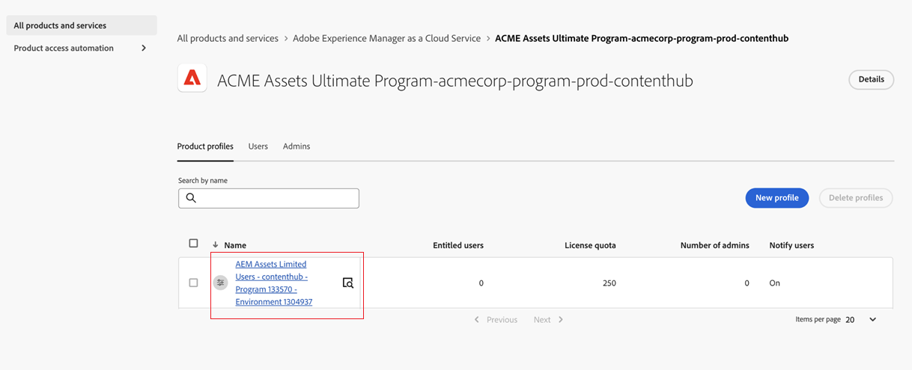
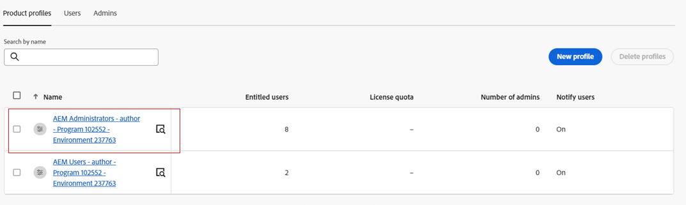

# 部署 Content Hub {#deploy-content-hub}

Content Hub作为Experience Manager Assets as a Cloud Service的一部分提供，用于实现组织及其业务合作伙伴对品牌上内容的访问大众化。

在Experience Manager Assetsas a Cloud Service上标记为“已批准”的资源可用于Content Hub上的资源分发。

本文提供了一个端到端的工作流，以向用户提供Content Hub访问权限，包括根据用户的需求提供各种权限。

Content Hub上各种权限的变体包括：

* [Content Hub用户](#onboard-content-hub-users)：访问Content Hub门户上的品牌批准资源。

* [Content Hub管理员](#onboard-content-hub-administrator)：除了访问品牌批准的资源、将资源上传到Content Hub、Adobe Express集成以编辑图像(如果您拥有Adobe Express权限)之外，还可以访问Content Hub上的[配置用户界面](/help/assets/configure-content-hub-ui-options.md)。

* [有权添加资产的Content Hub用户](#onboard-content-hub-users-add-assets)：除了访问Content Hub门户上的品牌批准资产外，还可以[将资产上传到Content Hub](/help/assets/upload-brand-approved-assets.md)。

* [有权将资源重新混合到新变体的Content Hub用户](#onboard-content-hub-users-remix-assets)：[Adobe Express集成](/help/assets/edit-images-content-hub.md)(如果您具有Adobe Express权限)，以及访问Content Hub门户上的品牌批准资源。

* [Experience Manager Assets用户](#experience-manager-assets-users)：能够在Experience Manager Assetsas a Cloud Service上批准资源，以便这些资源可在Content Hub上使用。

## 步骤1：使用Cloud Manager启用适用于Experience Manager Assets的Content Hub {#enable-content-hub}

要访问Content Hub门户，管理员首先需要使用Cloud Manager启用Content Hub for Experience Manager Assetsas a Cloud Service。 执行以下步骤：

1. 登录到Cloud Manager。 确保在登录时选择正确的组织。 Cloud Manager列出了您的所有程序。

1. 导航到Experience Manager Assetsas a Cloud Service程序，单击“更多选项”图标(...)，然后选择&#x200B;**[!UICONTROL 编辑程序]**。

   

1. 在[!UICONTROL 编辑程序]对话框中，选择&#x200B;**[!UICONTROL 解决方案和加载项]**&#x200B;选项卡。

1. 展开&#x200B;**[!UICONTROL Assets]**&#x200B;并选择&#x200B;**[!UICONTROL Content Hub]**。
   

   >[!NOTE]
   >
   >如果在选择Content Hub后没有为您启用&#x200B;**[!UICONTROL 更新]**，请确保您已为项目指定上线设置。

1. 单击&#x200B;**[!UICONTROL 更新]**。

Content Hub现已为Experience Manager Assetsas a Cloud Service启用。

>[!NOTE]
>
>您最多可以对250个Content Hub用户访问和使用Content Hub。 如果您还有其他问题，请联系您的Adobe代表。

如果您是Experience Manager Assets的新用户，请单击&#x200B;**[!UICONTROL 添加程序]**，然后提供程序详细信息（程序名称，为生产设置），然后单击&#x200B;**[!UICONTROL 继续]**。 然后在&#x200B;**[!UICONTROL 解决方案和加载项]**&#x200B;选项卡中选择&#x200B;**[!UICONTROL Assets]**&#x200B;和&#x200B;**[!UICONTROL Content Hub]**。

### Admin Console上的Content Hub实例和产品配置文件{#content-hub-instance-product-profile}

在[使用Cloud Manager](#enable-content-hub)为Assets启用Content Hubas a Cloud Service后，在Admin Console上的AEM Assetsas a Cloud Service中创建了一个新实例，后缀为`delivery`：

>[!NOTE]
>
>如果您在2024年8月14日之前配置了Content Hub，则会创建新实例，并将`contenthub`作为后缀。

请注意，Content Hub的实例名称中没有`author`或`publish`。

单击实例名称以查看Content Hub产品配置文件。

>[!NOTE]
>
>如果您在2024年8月14日之前配置了Content Hub，则Content Hub产品配置文件在`Limited Users`之后提及`contenthub`，而不是`delivery`。

## 步骤2：载入Content Hub管理员 {#onboard-content-hub-administrator}

除了访问Content Hub上品牌批准的资源、将资源上传到Content Hub、Adobe Express集成以编辑图像(如果您拥有Adobe Express权限)之外，Content Hub管理员还可以访问上的[配置用户界面](/help/assets/configure-content-hub-ui-options.md)。

要载入Content Hub管理员：

1. [访问并单击Content Hub用户产品配置文件](#content-hub-instance-product-profile)。

1. 单击&#x200B;**[!UICONTROL 添加用户]**&#x200B;以将用户或用户组添加到产品配置文件。

1. 单击&#x200B;**[!UICONTROL 保存]**&#x200B;以保存更改。

1. 将用户添加到Content Hub产品配置文件后，单击Admin Console上产品列表中的AEM as a Cloud Service产品名称以访问Experience Manager Assets产品配置文件。

1. 单击AEM as a Cloud Service的生产创作实例：
   AEM as a Cloud Service的

   Admin Console显示AEM as a Cloud Service的两个产品配置文件：管理员和用户。
1. 单击管理员产品配置文件，然后单击&#x200B;**[!UICONTROL 添加用户]**以将用户添加到产品配置文件。
   

1. 单击&#x200B;**[!UICONTROL 保存]**&#x200B;以保存更改。

## 步骤3：载入Content Hub用户 {#onboard-content-hub-users}

Content Hub用户可以访问门户上可用的资源，但无法添加任何新资源或修改现有资源。

载入Content Hub用户：

1. [访问并单击Content Hub用户产品配置文件](#content-hub-instance-product-profile)。

1. 单击&#x200B;**[!UICONTROL 添加用户]**&#x200B;以将用户或用户组添加到产品配置文件。

1. 单击&#x200B;**[!UICONTROL 保存]**&#x200B;以保存更改。

这些用户现在可以访问Content Hub门户中提供的资源。

>[!NOTE]
>
>可以使用所有高级企业功能，如与外部身份提供程序同步。

### 如何访问Content Hub？ {#access-content-hub}

可通过以下方式访问Content Hub：

* 使用以下链接访问Content Hub：

  `https://experience.adobe.com/#/assets/contenthub`

* 登录到`experience.adobe com`，然后单击&#x200B;**[!UICONTROL 快速访问]**&#x200B;部分中的&#x200B;**[!UICONTROL Experience Manager Assets Content Hub]**：
  

* 登录到`experience.adobe com`，然后单击产品切换器中可用的&#x200B;**[!UICONTROL Experience Manager Assets Content Hub]**：
  

### 禁用发送给用户的电子邮件通知 {#disable-email-notifications}

如果管理员在将其添加到Content Hub产品配置文件时需要禁用发送给用户的电子邮件通知：

单击产品配置文件名称旁边的搜索图标，并禁用&#x200B;**[!UICONTROL 通过电子邮件通知用户]**&#x200B;切换开关。

## 步骤4：让有权添加资产的Content Hub用户上线（可选） {#onboard-content-hub-users-add-assets}

有权添加资产的Content Hub用户可以[将新的品牌批准的资产](/help/assets/upload-brand-approved-assets.md)上传到Content Hub。

要载入具有添加用户权限的Content Hub用户，请执行以下操作：

1. [将用户添加到Content Hub产品配置文件后](#onboard-content-hub-users)，单击Admin Console产品列表中的AEM as a Cloud Service产品名称以访问Experience Manager Assets产品配置文件。

1. 单击AEM as a Cloud Service的生产创作实例：
   AEM as a Cloud Service的

   Admin Console显示AEM as a Cloud Service的两个产品配置文件：管理员和用户。
1. 单击“用户”产品配置文件，然后单击“**[!UICONTROL 添加用户]**”以将该用户添加到产品配置文件。
   

1. 单击&#x200B;**[!UICONTROL 保存]**&#x200B;以保存更改。

## 步骤4：让有权将资源重新混合到新变体的Content Hub用户上线（可选） {#onboard-content-hub-users-remix-assets}

有权将资源重新混合到新变体的Content Hub用户可以[使用Adobe Express修改现有资源并将资源保存到存储库](/help/assets/edit-images-content-hub.md)。 仅当Adobe Express具有Adobe Express权限时，使用User编辑资源才可用。

要载入有权将资产重新混合到新变体的Content Hub用户，请执行以下操作：

1. [将用户添加到Content Hub产品配置文件后](#onboard-content-hub-users)，单击Admin Console产品列表中的AEM as a Cloud Service产品名称以访问Experience Manager Assets产品配置文件。

1. 单击AEM as a Cloud Service的生产创作实例：
   AEM as a Cloud Service的

   Admin Console显示AEM as a Cloud Service的两个产品配置文件：管理员和用户。
1. 单击“用户”产品配置文件，然后单击“**[!UICONTROL 添加用户]**”以将该用户添加到产品配置文件。
   

1. 单击&#x200B;**[!UICONTROL 保存]**&#x200B;以保存更改。

## Experience Manager Assets用户 {#experience-manager-assets-users}

Experience Manager Assets用户可以批准AEM as a Cloud Service上的资源，以便这些资源在Content Hub上可用。

配置Experience Manager Assets用户：

1. 通过单击Admin Console上产品列表中的Experience Manager Assets产品名称来访问AEM as a Cloud Service产品配置文件。

1. 单击AEM as a Cloud Service的生产创作实例：
   AEM as a Cloud Service的

   Admin Console显示AEM as a Cloud Service的两个产品配置文件：管理员和用户。
1. 单击“用户”产品配置文件，然后单击“**[!UICONTROL 添加用户]**”以将该用户添加到产品配置文件。
   

1. 单击&#x200B;**[!UICONTROL 保存]**&#x200B;以保存更改。

   >[!NOTE]
   >
   > 您无需添加到Experience Manager Assets用户的[Content Hub产品配置文件](#onboard-content-hub-users)。
