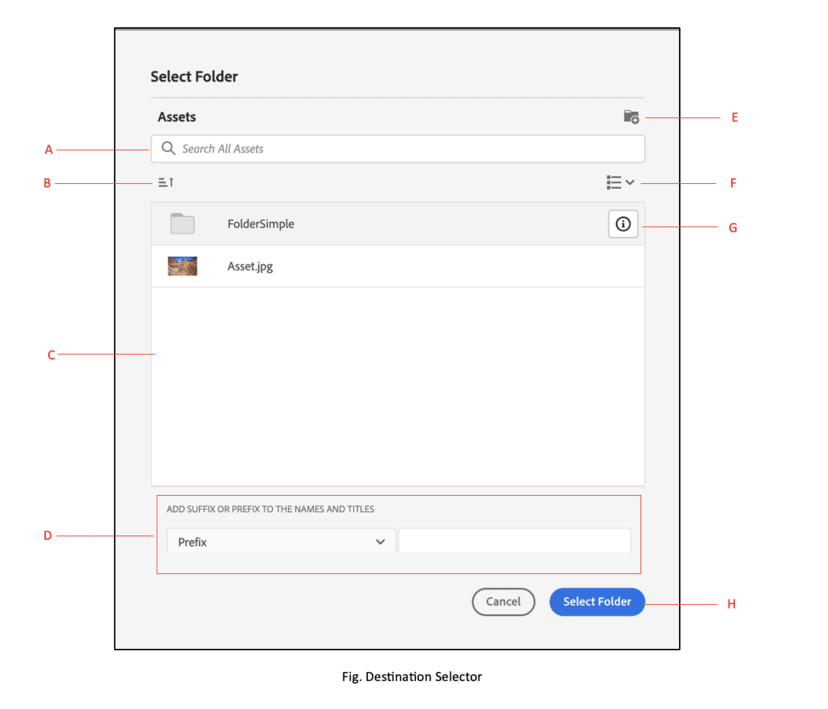

# 微前端目标选择器 {#Overview}

微前端目标选择器在您的应用程序中提供了一个用户界面，可以轻松地与 [!DNL Experience Manager Assets as a Cloud Service] 存储库集成。您可以搜索或浏览到 [!DNL Experience Manager Assets as a Cloud Service] 存储库中的相应文件夹，并从应用程序上传资源。

微前端用户界面可用于采用了目标选择器包的应用程序体验。对该包的任何更新都会自动导入，并且最新部署的目标选择器会自动加载到您的应用程序中。


目标选择器提供了许多好处，例如：

* 使用 Vanilla JavaScript 库轻松与任何 Adobe 或非 Adobe 应用程序集成。
* 易于维护，因为对目标选择器包的更新将自动部署到可用于应用程序的目标选择器。您的应用程序中无需更新即可加载最新的修改。
* 易于定制，因为提供了用于控制应用程序中的目标选择器显示的属性。
* 全文搜索可快速导航到文件夹以从您的应用程序上传资源。
* 能够创建文件夹，按升序或降序对文件夹进行排序，并通过列表、网格、图库或瀑布视图查看它们。

本文内容旨在说明如何将目标选择器与 Unified Shell 下的 [!DNL Adobe] 应用程序结合使用，或如何在已生成用于身份验证的 imsToken 时使用目标选择器。在本文中，我们将这些工作流称作非 SUSI 流。

执行以下任务以将目标选择器与您的 [!DNL Experience Manager Assets as a Cloud Service] 存储库集成和结合使用：

* [使用 Vanilla JS 集成目标选择器](#integration-with-vanilla-js)
* [定义目标选择器显示属性](#destination-selector-properties)
* [使用目标选择器](#using-destination-selector)

## 使用 Vanilla JS 集成目标选择器 {#integration-with-vanilla-js}

您可以将任何 [!DNL Adobe] 或非 Adobe 应用程序与 [!DNL Experience Manager Assets] as a [!DNL Cloud Service] 存储库集成，并从该应用程序中选择资源。

通过导入目标选择器包并使用 Vanilla JavaScript 库连接到 Assets as a Cloud Service 来实现集成。您必须编辑 `index.html` 或您应用程序中的任何相应文件以 -
* 定义身份验证详细信息
* 访问 Assets as a Cloud Service 存储库
* 配置目标选择器显示属性

在以下情况下，您无需定义某些 IMS 属性即可执行身份验证：

* 您正在 [Unified Shell](https://experienceleague.adobe.com/docs/experience-manager-cloud-service/content/overview/aem-cloud-service-on-unified-shell.html?lang=zh-Hans) 上集成 [!DNL Adobe] 应用程序。
* 您已生成用于身份验证的 IMS 令牌。

## 前提条件 {#prerequisites}

在 `index.html` 文件或应用程序实施中的类似文件中定义先决条件，以定义用于访问 [!DNL Experience Manager Assets] as a [!DNL Cloud Service] 存储库的身份验证详细信息。先决条件包括：
* imsOrg
* imsToken
* apikey

## 安装 {#installation}

可通过 ESM CDN（例如 [esm.sh](https://esm.sh/)/[skypack](https://www.skypack.dev/)）和 [UMD](https://github.com/umdjs/umd) 版本获得目标选择器。

在使用 **UMD 版本**&#x200B;的浏览器中（推荐）：

```
<script src="https://experience.adobe.com/solutions/CQ-assets-selectors/assets/resources/assets-selectors.js"></script>

<script>
  const { renderDestinationSelector } = PureJSSelectors;
</script>
```

在使用 **ESM CDN 版本**&#x200B;并支持 `import maps` 的浏览器中：

```
<script type="module">
  import { DestinationSelector } from 'https://experience.adobe.com/solutions/CQ-assets-selectors/assets/resources/@assets/selectors/index.js'
</script>
```

在使用 **ESM CDN 版本**&#x200B;的 Deno/Webpack 模块联合中：

```
import { DestinationSelector } from 'https://experience.adobe.com/solutions/CQ-assets-selectors/assets/resources/@assets/selectors/index.js'
```

### 选定的目标 {#selected-destination}

目标选择器接收来自 `onItemSelect`、`onTreeToggleItem` 或 `onTreeSelectionChange` 的回调，其中所选目录包含对象（目录、图像等）。

**架构语法**

```
interface SelectedDestination {
  id: string;
  children: SelectedDestination[];
  'repo:repositoryId': string;
  'dc:format': string;
  'repo:assetClass': string;
  'storage:directoryType': string;
  'storage:region': string;
  'repo:name': string;
  'repo:path': string;
  'repo:ancestors': string[];
  'repo:createDate': string;
  'storage:assignee':

  { type: string; id: string; }
  ;
  'repo:assetId': string;
  'aem:published': boolean;
  'repo:createdBy': string;
  'repo:state': string;
  'repo:id': string;
  'repo:modifyDate': string;
  _page:

  { orderBy: string; count: number; };
}
```

下表描述了选定目标的一些重要属性。

| 属性 | 类型 | 解释 |
|---|---|---|
| *repo:repositoryId* | 字符串 | 存储资源的存储库的唯一标识符。 |
| *repo:id* | 字符串 | 资源的唯一标识符。 |
| *repo:assetClass* | 字符串 | 资源的分类（例如，图像、视频或文档）。 |
| *repo:name* | 字符串 | 资源的名称，包括文件扩展名。 |
| *repo:size* | 数字 | 资源的大小，以字节为单位。 |
| *repo:path* | 字符串 | 资源在存储库中的位置。 |
| *repo:ancestors* | `Array<string>` | 存储库中资源的祖先项数组。 |
| *repo:state* | 字符串 | 存储库中资产的当前状态（例如，活动、删除等）。 |
| *repo:createdBy* | 字符串 | 创建资源的用户或系统。 |
| *repo:createDate* | 字符串 | 资源的创建日期和时间。 |
| *repo:modifiedBy* | 字符串 | 上次修改资源的用户或系统。 |
| *repo:modifyDate* | 字符串 | 资源的上次修改日期和时间。 |
| *dc:format* | 字符串 | 资源的格式。 |
| *_page* | 顺序：字符串；计数：数量； | 包括文档的页码。 |

有关属性和详细示例的完整列表，请访问[目标选择器代码示例](https://github.com/adobe/aem-assets-selectors-mfe-examples)。

### 非 SUSI 流的示例 {#non-ims-vanilla}

此示例说明如何在 Unified Shell 下运行 [!DNL Adobe] 应用程序时或在您已生成用于身份验证的 `imsToken` 时，将目标选择器与非 SUSI 流结合使用。

使用以下工具在您的代码中包含目标选择器包 `script` 标记，如中所示 _第6-15行_ 下面示例中的。 加载脚本后， `PureJSSelectors` 全局变量可供使用。 定义目标选择器 [属性](#destination-selector-properties) 如所示 _第16-23行_. `imsOrg` 和 `imsToken` 属性是非 SUSI 流中的身份验证所必需的。`handleSelection` 属性用于处理选定资源。要呈现目标选择器，请调用 `renderDestinationSelector` 函数，如&#x200B;_第 17 行_&#x200B;中所述。目标选择器将显示在 `<div>` 容器元素中，如&#x200B;_第 21 行和第 22 行_&#x200B;中所示。

通过执行这些步骤，您可以在 [!DNL Adobe] 应用程序中将目标选择器用于非 SUSI 流。

```html {line-numbers="true"}
<!DOCTYPE html>
<html>
<head>
    <title>Destination Selector</title>
    <script src="https://experience.adobe.com/solutions/CQ-assets-selectors/assets/resources/assets-selectors.js"></script>
    <script>
        // get the container element in which we want to render the DestinationSelector component
        const container = document.getElementById('destination-selector-container');
        // imsOrg and imsToken are required for authentication in non-SUSI flow
        const destinationSelectorProps = {
            imsOrg: 'example-ims@AdobeOrg',
            imsToken: "example-imsToken",
            apiKey: "example-apiKey-associated-with-imsOrg",
            handleSelection: (assets: SelectedAssetType[]) => {},
        };
        // Call the `renderDestinationSelector` available in PureJSSelectors globals to render DestinationSelector
        PureJSSelectors.renderDestinationSelector(container, destinationselectorprops);
    </script>
</head>

<body>
    <div id="destination-selector-container" style="height: calc(100vh - 80px); width: calc(100vw - 60px); margin: -20px;">
    </div>
</body>

</html>
```

有关详细示例，请访问[目标选择器代码示例。](https://github.com/adobe/aem-assets-selectors-mfe-examples)

## 使用目标选择器属性 {#destination-selector-properties}

您可以使用目标选择器属性来自定义目标选择器的呈现方式。下表列出了可用于自定义和使用目标选择器的属性。

| 属性 | 类型 | 必需 | 默认 | 描述 |
|---|---|---|---|---|
| *imsOrg* | 字符串 | 是 | | 为组织设置 [!DNL Adobe Experience Manager] as a [!DNL Cloud Service] 时分配的 Adobe Identity Management System (IMS) ID。此 `imsOrg` 需要密钥来验证您访问的组织是否处于Adobe IMS下。 |
| *imsToken* | 字符串 | 否 | | 用于身份验证的 IMS 持有者令牌。`imsToken` 如果您使用的是SUSI流，则不是必需的。 但是，如果您使用的是非SUSI流，则需要使用此参数。 |
| *apiKey* | 字符串 | 否 | | 用于访问 AEM 发现服务的 API 密钥。`apiKey` 如果您使用的是SUSI流，则不是必需的。 但是，它在非 SUSI 流程中是必需的。 |
| *rootPath* | 字符串 | 否 | /content/dam/ | 目标选择器从中显示您的资源的文件夹路径。也可采用封装形式使用 `rootPath`。例如，给定以下路径， `/content/dam/marketing/subfolder/`，目标选择器不允许您遍历任何父文件夹，但仅显示子文件夹。 |
| *hasMore* | 布尔型 | 否 | | 当应用程序有更多内容要显示时，您可以使用此属性添加加载器，并加载内容以使其在应用程序中可见。它是一个表示内容加载正在进行的指示器。 |
| *orgName* | 布尔型 | 否 | | 它是与 AEM 关联的组织名称（可能是 orgID） |
| *initRepoID* | 字符串 | 否 | | 这是您要在默认初始视图中使用的资源存储库的路径 |
| *onCreateFolder* | 字符串 | 否 | | `onCreateFolder` 属性允许您添加在应用程序中添加新文件夹的图标。 |
| *onConfirm* | 字符串 | 否 | | 当您点击确认按钮时，这是一个回调。 |
| *confirmDisabled* | 字符串 | 否 | | 此属性可控制确认按钮的切换。 |
| *viewType* | 字符串 | 否 | | `viewType` 属性用于指定用于显示资源的视图。 |
| *viewTypeOptions* | 字符串 | 否 | | 此属性与 `viewType` 属性相关。您可以指定一个或多个视图来显示资源。可用的 viewTypeOptions 有：列表视图、网格视图、图库视图、瀑布视图和树视图。 |
| *itemNameFormatter* | 字符串 | 否 | | 此属性允许您格式化项目名称 |
| *i18nSymbols* | `Object<{ id?: string, defaultMessage?: string, description?: string}>` | 否 |  | 如果 OOTB 翻译不足以满足您的应用程序需求，您可以公开一个接口，利用该接口可通过 `i18nSymbols` 属性传递自定义本地化值。通过此接口传递值将覆盖提供的默认翻译，而改用您自己的翻译。要执行覆盖，您必须将一个有效的[消息描述符](https://formatjs.io/docs/react-intl/api/#message-descriptor)对象传递到要覆盖的 `i18nSymbols` 键。 |
| *inlineAlertSetup* | 字符串 | 否 | | 它可添加您要在应用程序中传递的警报消息。例如，添加一条警报消息，提示您没有访问该文件夹的权限。 |
| *intl* | 对象 | 否 | | 目标选择器提供默认的 OOTB 翻译。您可以通过用 `intl.locale` 属性提供有效的区域设置字符串来选择翻译语言。例如：`intl={{ locale: "es-es" }}` </br></br> 支持的区域设置字符串遵循语言标准名称表示的 [ISO 639 - 代码](https://www.iso.org/iso-639-language-codes.html)。</br></br> 支持的区域设置列表：英语 -“en-us”（默认）西班牙语 -“es-es”德语 -“de-de”法语 -“fr-fr”意大利语 -“it-it”日语 -“ja-jp”朝鲜语 -“ko-kr”葡萄牙语 -“pt-br”中文（繁体）-“zh-cn”中文（台湾地区）-“zh-tw” |

## 有关使用目标选择器属性的示例 {#usage-examples}

您可以在 `index.html` 文件中定义目标选择器[属性](#destination-selector-properties)，以自定义应用程序中的目标选择器显示。

### 示例 1：在目标选择器中创建文件夹

目标选择器允许您创建一个新文件夹以在特定位置上传、移动或复制资源。


### 示例 2：指定目标选择器的视图类型

目标选择器以四种不同的视图显示各种资源，包括列表视图、网格视图、图库视图和瀑布视图。要指定默认视图类型，您可以使用`viewType`财产。`viewTypeOptions`属性与`viewType`属性一起用于规定其他视图类型，以便可以在下拉列表中显示其他视图类型选项。如果您只想显示一个选项，则可以使用单个参数。


### 示例 3：初始化资源文件夹的路径

使用 `path` 属性定义在呈现目标选择器时自动显示的文件夹名称。


## 使用目标选择器 {#using-destination-selector}

在设置完目标选择器后，您可以通过身份验证将目标选择器与您的 [!DNL Adobe Experience Manager] as a [!DNL Cloud Service] 应用程序结合使用，可以选择资源或执行各种其他操作以在存储库中搜索您的资源。



* **A**：[搜索栏](#search-bar)
* **B**：[排序](#sorting)
* **C**：[资源](#assets-repo)
* **D**：[添加后缀或前缀](#add-suffix-or-prefix)
* **E**：[创建新文件夹](#create-new-folder)
* **F**：[查看](#types-of-view)
* **G**：[信息](#info)
* **H**：[选择文件夹](#select-folder)

### 搜索栏 {#search-bar}

目标选择器允许您在所选存储库中对资源进行全文搜索。例如，如果您在搜索栏中键入关键字 `wave`，则将显示任意元数据属性中提及的所有带 `wave` 关键字的资源。

### 排序 {#sorting}

您可以在目标选择器中按资源的名称、尺寸或大小对资源进行排序。您还可以按升序或降序对资源进行排序。

### 资源存储库 {#assets-repo}

目标选择器还允许您查看 AEM 应用程序中可用的所选存储库的数据。您可以使用 `repositoryID` 属性来初始化要在目标选择器的第一个实例中查看的目标文件夹的路径。

### 添加后缀或前缀 {#add-suffix-or-prefix}

这是 `optionsFormSetup` 属性的一个例子。您可以使用它来确认选择，它会在 `onConfirm` 事件中传递。

### 创建新文件夹 {#create-new-folder}

它允许您在 [!DNL Adobe Experience Manager] as a [!DNL Cloud Service] 的目标文件夹中创建一个新文件夹。

### 视图类型 {#types-of-view}

目标选择器允许您在四种不同的视图中查看资源：

* **[!UICONTROL 列表视图]**：列表视图在单个列中显示可滚动的文件和文件夹。
* **[!UICONTROL 网格视图]**：网格视图在行和列的网格中显示可滚动的文件和文件夹。
* **[!UICONTROL 库视图]**：库视图在居中锁定的水平列表中显示文件或文件夹。
* **[!UICONTROL 瀑布视图]**：瀑布视图以桥的形式显示文件或文件夹。

### 信息 {#info}

信息或信息图标允许您查看所选资源的元数据。它包括各种详细信息，例如维度、大小、描述、路径、修改日期和创建日期。在上传或复制或创建新资源时提供元数据信息。

### 选择文件夹 {#select-folder}

“选择”文件夹按钮允许您选择资源，以便在目标选择器上执行与[属性](#destination-selector-properties)相关的各种操作。