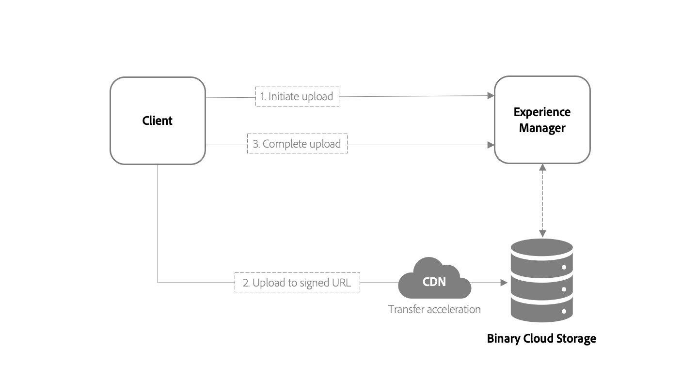

# [!DNL Adobe Experience Manager Assets] 开发人员用例、 API和参考资料  {#assets-cloud-service-apis}

本文包含针对[!DNL Assets]作为[!DNL Cloud Service]的开发人员的建议、参考材料和资源。 它包括新的资产上传模块、API引用，以及有关后处理工作流中提供支持的信息。

## [!DNL Experience Manager Assets] API和操作  {#use-cases-and-apis}

[!DNL Assets] as a提供 [!DNL Cloud Service] 了多个API以编程方式与数字资产交互。每个API都支持特定的用例，如下表所述。 [!DNL Assets]用户界面、[!DNL Experience Manager]桌面应用程序和[!DNL Adobe Asset Link]支持所有或部分操作。

>[!CAUTION]
>
>某些API仍然存在，但不受支持(表示为×)。 请尽量不要使用这些API。

| 支持级别 | 描述 |
| ------------- | --------------------------- |
| ✓ | 支持 |
| × | 不受支持. 请勿使用。 |
| - | 不可用 |

| 用例 | [aem-upload](https://github.com/adobe/aem-upload) | [AEM / Sling / ](https://docs.adobe.com/content/help/en/experience-manager-cloud-service-javadoc/index.html) JCRJava API | [Asset compute服务](https://experienceleague.adobe.com/docs/asset-compute/using/extend/understand-extensibility.html) | [[!DNL Assets] HTTP API](https://experienceleague.adobe.com/docs/experience-manager-cloud-service/assets/admin/mac-api-assets.html#create-an-asset) | Sling [GET](https://sling.apache.org/documentation/bundles/rendering-content-default-get-servlets.html) / [POST](https://sling.apache.org/documentation/bundles/manipulating-content-the-slingpostservlet-servlets-post.html) Servlet | [GraphQL](https://experienceleague.adobe.com/docs/experience-manager-learn/getting-started-with-aem-headless/graphql/overview.html) _（预览）_ |
| ----------------|:---:|:---:|:---:|:---:|:---:|:---:|
| **原始二进制** |  |  |  |  |  |  |
| 创建原始 | ✓ | × | - | × | × | - |
| 读取原始 | - | × | ✓ | ✓ | ✓ | - |
| 更新原始 | ✓ | × | ✓ | × | × | - |
| 删除原始 | - | ✓ | - | ✓ | ✓ | - |
| 复制原始 | - | ✓ | - | ✓ | ✓ | - |
| 移动原始 | - | ✓ | - | ✓ | ✓ | - |
| **元数据** |  |  |  |  |  |  |
| 创建元数据 | - | ✓ | ✓ | ✓ | ✓ | - |
| 读取元数据 | - | ✓ | - | ✓ | ✓ | - |
| 更新元数据 | - | ✓ | ✓ | ✓ | ✓ | - |
| 删除元数据 | - | ✓ | ✓ | ✓ | ✓ | - |
| 复制元数据 | - | ✓ | - | ✓ | ✓ | - |
| 移动元数据 | - | ✓ | - | ✓ | ✓ | - |
| **内容片段(CF)** |  |  |  |  |  |  |
| 创建CF | - | ✓ | - | ✓ | - | - |
| 读取CF | - | ✓ | - | ✓ | - | ✓ |
| 更新CF | - | ✓ | - | ✓ | - | - |
| 删除CF | - | ✓ | - | ✓ | - | - |
| 复制CF | - | ✓ | - | ✓ | - | - |
| 移动CF | - | ✓ | - | ✓ | - | - |
| **版本** |  |  |  |  |  |  |
| 创建版本 | ✓ | ✓ | - | - | - | - |
| 读取版本 | - | ✓ | - | - | - | - |
| 删除版本 | - | ✓ | - | - | - | - |
| **文件夹** |  |  |  |  |  |  |
| 创建文件夹 | ✓ | ✓ | - | ✓ | - | - |
| 读取文件夹 | - | ✓ | - | ✓ | - | - |
| 删除文件夹 | ✓ | ✓ | - | ✓ | - | - |
| 复制文件夹 | ✓ | ✓ | - | ✓ | - | - |
| 移动文件夹 | ✓ | ✓ | - | ✓ | - | - |

## 资产上传{#asset-upload}

在[!DNL Experience Manager]中，作为[!DNL Cloud Service]，您可以使用HTTP API直接将资产上传到云存储。 下面是上载二进制文件的步骤。 在外部应用程序中而不是在[!DNL Experience Manager] JVM中执行这些步骤。

1. [提交HTTP请求](#initiate-upload)。它会通知[!DNL Experience Manage]r部署您上传新二进制文件的意图。
1. [POST由启动请](#upload-binary) 求提供的一个或多个URI的二进制内容。
1. [提交HTTP请](#complete-upload) 求，以通知服务器二进制文件的内容已成功上传。



>[!IMPORTANT]
在外部应用程序中而不是在[!DNL Experience Manager] JVM中执行上述步骤。

该方法可以对资产上传进行可伸缩、更高性能的处理。 与[!DNL Experience Manager] 6.5相比的区别如下：

* 二进制文件不会通过[!DNL Experience Manager]，现在，它只是将上传过程与为部署配置的二进制云存储进行协调。
* 二进制云存储可与内容交付网络(CDN)或边缘网络配合使用。 CDN会选择更接近客户端的上传端点。 当数据传输到附近端点的距离较短时，上传性能和用户体验会得到改善，尤其是对于地理上分散的团队而言。

>[!NOTE]
请参阅客户端代码以在开源[aem-upload库](https://github.com/adobe/aem-upload)中实施此方法。

### 启动上载{#initiate-upload}

将HTTPPOST请求提交到所需的文件夹。 资产会在此文件夹中创建或更新。 包括选择器`.initiateUpload.json`以指示请求启动二进制文件的上传。 例如，应创建资产的文件夹路径为`/assets/folder`。 POST请求为`POST https://[aem_server]:[port]/content/dam/assets/folder.initiateUpload.json`。

请求正文的内容类型应为`application/x-www-form-urlencoded`表单数据，其中包含以下字段：

* `(string) fileName`: 必填. 资产在[!DNL Experience Manager]中显示的名称。
* `(number) fileSize`: 必填. 上传资产的文件大小（以字节为单位）。

只要每个二进制文件包含必填字段，就可以使用单个请求启动多个二进制文件的上传。 如果成功，请求将以下格式响应`201`状态代码和包含JSON数据的正文：

```json
{
    "completeURI": "(string)",
    "folderPath": (string)",
    "files": [
        {
            "fileName": "(string)",
            "mimeType": "(string)",
            "uploadToken": "(string)",
            "uploadURIs": [
                "(string)"
            ]
        }
    ]
}
```

* `completeURI` （字符串）：在二进制文件完成上传时调用此URI。URI可以是绝对URI或相对URI，客户端应该能够处理这两个URI。 即，该值可以是`"https://author.acme.com/content/dam.completeUpload.json"`或`"/content/dam.completeUpload.json"`。请参阅[完成上载](#complete-upload)。
* `folderPath` （字符串）：上传二进制文件的文件夹的完整路径。
* `(files)` （数组）：元素列表，其长度和顺序与启动请求中提供的二进制信息列表的长度和顺序相匹配。
* `fileName` （字符串）：相应二进制文件的名称，在启动请求中提供。此值应包含在完整请求中。
* `mimeType` （字符串）：相应二进制文件的mime类型，在启动请求中提供。此值应包含在完整请求中。
* `uploadToken` （字符串）：对应二进制文件的上传令牌。此值应包含在完整请求中。
* `uploadURIs` （数组）：其值是应将二进制内容上传到的完整URI的字符串列表(请参阅 [上传二进制](#upload-binary))。
* `minPartSize` （数字）：如果有多个URI，则可能提供给其中任一URI的数据的最 `uploadURIs`小长度（以字节为单位）。
* `maxPartSize` （数字）：如果有多个URI，则可能提供给其中任何一个的数据的最大长度(以字 `uploadURIs`节为单位)。

### 上载二进制文件{#upload-binary}

启动上传的输出包括一个或多个上传URI值。 如果提供了多个URI，则客户端会将二进制文件拆分为多个部分，并按顺序对每个URI发出每个部分的POST请求。 使用所有URI。 确保每个部件的大小在启动响应中指定的最小和最大大小范围内。 CDN边缘节点有助于加快请求的二进制文件上传。

实现此目的的一种潜在方法是，根据API提供的上传URI数量计算部件大小。 例如，假设二进制文件的总大小为20,000字节，并且上传URI的数量为2。 然后，执行以下步骤：

* 通过将总大小除以URI数来计算部件大小：20,000 / 2 = 10,000。
* POST字节范围0-9,999（二进制）到上传URI列表中的第一个URI。
* POST字节范围10,000 - 19,999（二进制到上传URI列表中的第二个URI）。

如果上传成功，服务器将使用`201`状态代码响应每个请求。

### 完成上载{#complete-upload}

上传二进制文件的所有部分后，将HTTPPOST请求提交到初始数据提供的完整URI。 请求正文的内容类型应为`application/x-www-form-urlencoded`表单数据，其中包含以下字段。

| 字段 | 类型 | 必需或不需要 | 描述 |
|---|---|---|---|
| `fileName` | 字符串 | 必填 | 初始数据提供的资产名称。 |
| `mimeType` | 字符串 | 必填 | 二进制文件的HTTP内容类型，由启动数据提供。 |
| `uploadToken` | 字符串 | 必填 | 初始化数据提供的二进制文件的上载令牌。 |
| `createVersion` | 布尔型 | 可选 | 如果存在`True`且资产存在指定的名称，则[!DNL Experience Manager]会创建资产的新版本。 |
| `versionLabel` | 字符串 | 可选 | 如果创建了新版本，则会显示与资产新版本关联的标签。 |
| `versionComment` | 字符串 | 可选 | 如果创建了新版本，则与该版本关联的注释。 |
| `replace` | 布尔型 | 可选 | 如果存在`True`且具有指定名称的资产，则[!DNL Experience Manager]会删除该资产，然后重新创建该资产。 |

>[!NOTE]
如果资产存在且未指定`createVersion`和`replace`，则[!DNL Experience Manager]会使用新二进制文件更新资产的当前版本。

与启动过程一样，完整的请求数据可能包含多个文件的信息。

只有在为文件调用完整URL后，才会完成上传二进制文件的过程。 上传过程完成后，会处理资产。 即使资产的二进制文件已完全上传，但上传过程未完成，处理也不会开始。

如果成功，服务器将回复`200`状态代码。

### 开源上载库{#open-source-upload-library}

要了解有关上传算法的更多信息或构建您自己的上传脚本和工具，Adobe提供了开源库和工具：

* [开源aem上传库](https://github.com/adobe/aem-upload)。
* [开源命令行工具](https://github.com/adobe/aio-cli-plugin-aem)。

### 已弃用的资产上传API {#deprecated-asset-upload-api}

<!-- #ENGCHECK review / update the list of deprecated APIs below. -->

仅[!DNL Adobe Experience Manager]作为[!DNL Cloud Service]支持新的上载方法。 [!DNL Adobe Experience Manager] 6.5中的API已弃用。 以下API中弃用了与上传或更新资产或演绎版（任何二进制上传）相关的方法：

* [Experience Manager资产HTTP API](mac-api-assets.md)
* `AssetManager` Java API，例如  `AssetManager.createAsset(..)`

>[!MORELIKETHIS]
* [开源aem上传库](https://github.com/adobe/aem-upload)。
* [开源命令行工具](https://github.com/adobe/aio-cli-plugin-aem)。


## 资产处理和后处理工作流{#post-processing-workflows}

在[!DNL Experience Manager]中，资产处理基于使用[资产微服务](asset-microservices-configure-and-use.md#get-started-using-asset-microservices)的&#x200B;**[!UICONTROL 处理配置文件]**&#x200B;配置。 处理不需要开发人员扩展。

对于后处理工作流配置，请使用带有自定义步骤的扩展的标准工作流。

## 在后处理工作流{#post-processing-workflows-steps}中支持工作流步骤

从以前版本的[!DNL Experience Manager]升级的客户可以使用资产微服务来处理资产。 云原生资产微服务的配置和使用更简单。 不支持在以前版本的[!UICONTROL DAM更新资产]工作流中使用的一些工作流步骤。

[!DNL Experience Manager] 作为支 [!DNL Cloud Service] 持以下工作流步骤：

* `com.day.cq.dam.similaritysearch.internal.workflow.process.AutoTagAssetProcess`
* `com.day.cq.dam.core.impl.process.CreateAssetLanguageCopyProcess`
* `com.day.cq.wcm.workflow.process.CreateVersionProcess`
* `com.day.cq.dam.similaritysearch.internal.workflow.smarttags.StartTrainingProcess`
* `com.day.cq.dam.similaritysearch.internal.workflow.smarttags.TransferTrainingDataProcess`
* `com.day.cq.dam.core.impl.process.TranslateAssetLanguageCopyProcess`
* `com.day.cq.dam.core.impl.process.UpdateAssetLanguageCopyProcess`
* `com.adobe.cq.workflow.replication.impl.ReplicationWorkflowProcess`
* `com.day.cq.dam.core.impl.process.DamUpdateAssetWorkflowCompletedProcess`

以下技术工作流模型已被资产微服务取代，或者无法获得支持：

* `com.day.cq.dam.core.process.DeleteImagePreviewProcess`
* `com.day.cq.dam.s7dam.common.process.DMEncodeVideoWorkflowCompletedProcess`
* `com.day.cq.dam.core.process.GateKeeperProcess`
* `com.day.cq.dam.core.process.AssetOffloadingProcess`
* `com.day.cq.dam.core.process.MetadataProcessorProcess`
* `com.adobe.cq.dam.dm.process.workflow.DMImageProcess`
* `com.day.cq.dam.s7dam.common.process.S7VideoThumbnailProcess`
* `com.day.cq.dam.scene7.impl.process.Scene7UploadProcess`
* `com.day.cq.dam.s7dam.common.process.VideoProxyServiceProcess`
* `com.day.cq.dam.s7dam.common.process.VideoThumbnailDownloadProcess`
* `com.day.cq.dam.s7dam.common.process.VideoUserUploadedThumbnailProcess`
* `com.day.cq.dam.core.process.CreatePdfPreviewProcess`
* `com.day.cq.dam.core.process.CreateWebEnabledImageProcess`
* `com.day.cq.dam.video.FFMpegThumbnailProcess`
* `com.day.cq.dam.core.process.ThumbnailProcess`
* `com.day.cq.dam.cameraraw.process.CameraRawHandlingProcess`
* `com.day.cq.dam.core.process.CommandLineProcess`
* `com.day.cq.dam.pdfrasterizer.process.PdfRasterizerHandlingProcess`
* `com.day.cq.dam.core.process.AddPropertyWorkflowProcess`
* `com.day.cq.dam.core.process.CreateSubAssetsProcess`
* `com.day.cq.dam.core.process.DownloadAssetProcess`
* `com.day.cq.dam.word.process.ExtractImagesProcess`
* `com.day.cq.dam.word.process.ExtractPlainProcess`
* `com.day.cq.dam.video.FFMpegTranscodeProcess`
* `com.day.cq.dam.ids.impl.process.IDSJobProcess`
* `com.day.cq.dam.indd.process.INDDMediaExtractProcess`
* `com.day.cq.dam.indd.process.INDDPageExtractProcess`
* `com.day.cq.dam.core.impl.lightbox.LightboxUpdateAssetProcess`
* `com.day.cq.dam.pim.impl.sourcing.upload.process.ProductAssetsUploadProcess`
* `com.day.cq.dam.core.process.ScheduledPublishBPProcess`
* `com.day.cq.dam.core.process.ScheduledUnPublishBPProcess`
* `com.day.cq.dam.core.process.SendDownloadAssetEmailProcess`
* `com.day.cq.dam.core.impl.process.SendTransientWorkflowCompletedEmailProcess`

<!-- PPTX source: slide in add-assets.md - overview of direct binary upload section of 
https://adobe-my.sharepoint.com/personal/gklebus_adobe_com/_layouts/15/guestaccess.aspx?guestaccesstoken=jexDC5ZnepXSt6dTPciH66TzckS1BPEfdaZuSgHugL8%3D&docid=2_1ec37f0bd4cc74354b4f481cd420e07fc&rev=1&e=CdgElS
-->

>[!MORELIKETHIS]
* [[!DNL Experience Cloud] as a [!DNL Cloud Service] SDK](/help/implementing/developing/introduction/aem-as-a-cloud-service-sdk.md)。

