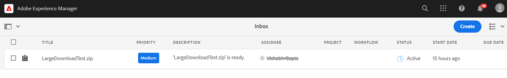

# 从[!DNL Adobe Experience Manager]下载资源 {#download-assets-from-aem}

| 版本 | 文章链接 |
| -------- | ---------------------------- |
| AEM 6.5 | [单击此处](https://experienceleague.adobe.com/docs/experience-manager-65/assets/managing/download-assets-from-aem.html?lang=en) |
| AEM as a Cloud Service | 本文 |

您可以下载资源，包括静态和动态演绎版。 或者，您可以直接从[!DNL Adobe Experience Manager Assets]发送带有资产链接的电子邮件。 下载的资源捆绑在一个ZIP文件中。<!-- The compressed ZIP file has a maximum file size of 1 GB for the export job. A maximum of 500 total assets per export job are allowed. -->

<!--
>[!NOTE]
>
>Recipients of emails must be members of the `dam-users` group to access the ZIP download link in the email message. To be able to download the assets, the members must have permissions to launch workflows that trigger downloading of assets.
-->

无法下载以下资源类型：图像集、旋转集、混合媒体集和轮播集。

您可以使用以下方法从Experience Manager下载资源：

<!-- * [Link Share](#link-share-download) -->

* [Experience Manager用户界面](#download-assets)
* [资产共享平台](https://adobe-marketing-cloud.github.io/asset-share-commons/)
* [Brand Portal](https://experienceleague.adobe.com/docs/experience-manager-brand-portal/using/introduction/brand-portal.html)
* [桌面应用程序](https://experienceleague.adobe.com/docs/experience-manager-desktop-app/using/using.html#download-assets)

## 使用[!DNL Experience Manager]界面下载资源 {#download-assets}

Experience Manager根据资源数量和大小优化下载体验。 从用户界面实时下载较小的文件。 [!DNL Experience Manager]直接下载原始文件的单个资产请求，而不是将单个资产放在ZIP存档中，以便更快地下载。 Experience Manager支持通过异步请求进行大型下载。 大于100 GB的下载请求将拆分为多个ZIP存档，每个存档的最大大小为100 MB。

默认情况下，[!DNL Experience Manager]会在生成下载存档时在[[!DNL Experience Manager] 收件箱](/help/sites-cloud/authoring/inbox.md)中触发通知。



当用户请求下载包含文件夹或收藏集时，AEM会快速估计下载的文件夹或收藏集下方的项目（Assets、文件夹或演绎版）数量，以确保请求的下载在我们支持的限制之内。 默认情况下，包含50,000个以上项目的下载会被阻止，AEM会显示`The selected items are larger than the configured maximum download limit`消息。

可以通过将如下所示的OSGI配置添加到应用程序代码并[通过Cloud Manager管道进行部署](https://experienceleague.adobe.com/en/docs/experience-manager-cloud-service/content/implementing/deploying/configuring-osgi)来增加下载大小限制：

```
com.adobe.cq.dam.download.impl.DownloadConfiguration   
downloadMaxItems = 100000
```


### 为大型下载启用电子邮件通知 {#enable-emails-for-large-downloads}

在以下任意情况下都会触发异步下载：

* 如果有十个以上的资产
* 如果下载大小大于100 MB
* 如果下载准备时间超过30秒

异步下载在后端运行时，用户可以继续在Experience Manager中探索并进一步工作。 除了Experience Manager收件箱通知之外，Experience Manager还可以在下载过程完成后发送电子邮件通知用户。 若要启用此功能，管理员可以通过[配置SMTP服务器连接](https://experienceleague.adobe.com/docs/experience-manager-cloud-service/content/implementing/developing/development-guidelines.html#sending-email)来配置电子邮件服务。

配置电子邮件服务后，管理员和用户可以从Experience Manager界面启用电子邮件通知。

要启用电子邮件通知，请执行以下操作：

1. 登录到[!DNL Experience Manager Assets]。
1. 单击右上角的用户图标，然后单击&#x200B;**[!UICONTROL 我的首选项]**&#x200B;以打开“用户首选项”窗口。
1. 选中&#x200B;**[!UICONTROL 资产下载电子邮件通知]**&#x200B;复选框，然后单击&#x200B;**[!UICONTROL 接受]**。

   


要下载资产，请执行以下步骤：

1. 在[!DNL Experience Manager]用户界面中，单击&#x200B;**[!UICONTROL Assets]** > **[!UICONTROL 文件]**。
1. 导航到要下载的资源。 选择文件夹或文件夹中的一个或多个资源。 在工具栏上，单击&#x200B;**[!UICONTROL 下载]**。

   从[!DNL Experience Manager Assets]](/help/assets/assets/asset-download1.png)下载资源时![可用选项

1. 在下载对话框中，选择所需的下载选项。

   | 下载选项 | 描述 |
   |---|---|
   | **[!UICONTROL 为每个资产创建单独的文件夹]** | 选择此选项可为每个资源创建一个文件夹，其中包含资源的所有已下载演绎版。 如果未选定该属性，则每个资产（以及所选的下载资产演绎版）都会包含在生成的存档的父文件夹中。 |
   | **[!UICONTROL 电子邮件]** | 选择此选项可向其他用户发送电子邮件通知（包含下载链接）。 收件人用户必须是`dam-users`组的成员。 标准电子邮件模板可在以下位置使用：<ul><li>`/libs/settings/dam/workflow/notification/email/downloadasset`.</li><li>`/libs/settings/dam/workflow/notification/email/transientworkflowcompleted`.</li></ul> 您可以在以下位置找到部署期间自定义的模板： <ul><li>`/apps/settings/dam/workflow/notification/email/downloadasset`.</li><li>`/apps/settings/dam/workflow/notification/email/transientworkflowcompleted`。</li></ul>您可以在以下位置存储特定于租户的自定义模板：<ul><li>`/conf/<tenant_specific_config_root>/settings/dam/workflow/notification/email/downloadasset`.</li><li>`/conf/<tenant_specific_config_root>/settings/dam/workflow/notification/email/transientworkflowcompleted`。</li></ul> |
   | **[!UICONTROL 资源]** | 选择此选项可下载原始格式的资源。<br>如果原始资产具有子资产，则子资产选项可用。 |
   | **[!UICONTROL 节目]** | 演绎版是资产的二进制表示形式。 Assets具有主要表示形式 — 已上传文件的主要表示形式。 它们可以有任意数量的呈现。<br> 使用此选项，您可以选择想要下载的演绎版。 可用的演绎版取决于您选择的资源。 |
   | **[!UICONTROL 智能裁剪]** | 选择此选项可从[!DNL Experience Manager]内下载所选资源的所有智能裁剪演绎版。 将创建包含智能裁剪呈现的zip文件并下载到本地计算机。 |
   | **[!UICONTROL 动态演绎版]** | 选择此选项可实时生成一系列替代演绎版。 选择此选项时，您还可以通过从[图像预设](/help/assets/dynamic-media/image-presets.md)列表中选择来选择要动态创建的演绎版。 <br>此外，您还可以选择大小和度量单位、格式、颜色空间、分辨率以及任何可选的图像修饰符（如反转图像）。 仅当您启用了[!DNL Dynamic Media]时，该选项才可用。 |

1. 在该对话框中，单击&#x200B;**[!UICONTROL 下载]**。

   如果为大型下载启用了电子邮件通知，则收件箱中会显示一封包含已存档zip文件夹的下载URL的电子邮件。 单击电子邮件中的下载链接以下载zip存档。

   

   您还可以在[!DNL Experience Manager]收件箱中查看通知。

   

## 下载使用链接共享功能共享的资源 {#link-share-download}

使用链接共享资产是一种方便的方法，使感兴趣的人无需登录到[!DNL Assets]即可访问它。 查看[链接共享功能](/help/assets/share-assets.md#sharelink)。

当用户从共享链接下载资产时，[!DNL Assets]使用异步服务，该服务可提供更快且无中断的下载。 要下载的资产将在收件箱中的后台排入可管理文件大小的ZIP存档中。 对于较大的下载，下载将分块为100 GB的文件。

[!UICONTROL 下载收件箱]显示每个存档的处理状态。 处理完成后，您可以从收件箱中下载存档。


## OnTime或OffTime呈现版本 {#on-off-time-rendition}

要启用`OnOffTimeAssetAccessFilter`服务，您需要创建OSGi配置。 根据开启/结束时间设置，此服务允许除了资源本身之外，还阻止对演绎版和元数据的访问。 OSGi配置应为`com.day.cq.dam.core.impl.servlet.OnOffTimeAssetAccessFilter`。 应遵循以下步骤：

1. 在Git中的项目代码中，在`/apps/system/config/com.day.cq.dam.core.impl.servlet.OnOffTimeAssetAccessFilter.cfg.json`处创建一个配置文件。 该文件应包含`{}`作为其内容，表示相应的OSGi组件的OSGi配置为空。 此操作将启用该服务。
1. 通过[!DNL Cloud Manager]部署您的代码，包括此新配置。
1. 部署后，即可根据资源的开启/结束时间设置访问演绎版和元数据。 如果当前日期或时间早于开启时间或晚于关闭时间，则会显示错误消息。
有关添加空OSGi配置的更多详细信息，请参阅此[指南](https://experienceleague.adobe.com/docs/experience-manager-cloud-service/content/implementing/deploying/configuring-osgi.html?lang=en)。

## 提示和限制 {#tips-limitations}

* 如果下载空文件夹，[!DNL Experience Manager]会传达有关创建ZIP存档的成功消息，但并未创建该存档。

**另请参阅**

* [翻译资源](translate-assets.md)
* [Assets HTTP API](mac-api-assets.md)
* [资源支持的文件格式](file-format-support.md)
* [搜索资源](search-assets.md)
* [连接的资源](use-assets-across-connected-assets-instances.md)
* [资源报告](asset-reports.md)
* [元数据架构](metadata-schemas.md)
* [管理元数据](manage-metadata.md)
* [搜索 Facet](search-facets.md)
* [管理收藏集](manage-collections.md)
* [批量元数据导入](metadata-import-export.md)
* [发布资源到 AEM 和 Dynamic Media](/help/assets/publish-assets-to-aem-and-dm.md)

>[!MORELIKETHIS]
>
>* [下载受DRM保护的资产](drm.md)
>* [在Win或Mac桌面上使用Experience Manager桌面应用程序下载资源](https://experienceleague.adobe.com/docs/experience-manager-desktop-app/using/using.html)
>* [使用Adobe Assets Link从支持的Adobe Creative Cloud应用程序中下载资源](https://helpx.adobe.com/enterprise/using/manage-assets-using-adobe-asset-link.html)
