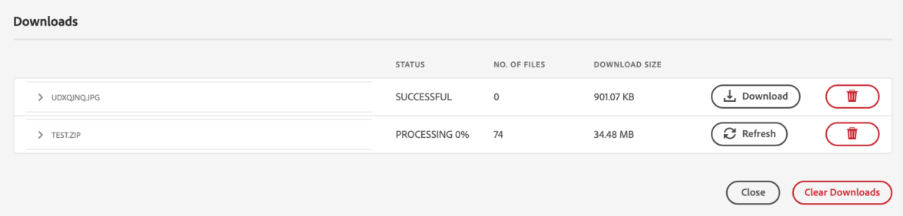

# 从下载资产 [!DNL Adobe Experience Manager] {#download-assets-from-aem}

您可以下载资产，包括静态和动态演绎版。 或者，您也可以直接从发送包含指向资产链接的电子邮件 [!DNL Adobe Experience Manager Assets]. 下载的资产捆绑在ZIP文件中。 <!-- The compressed ZIP file has a maximum file size of 1 GB for the export job. A maximum of 500 total assets per export job are allowed. -->

>[!NOTE]
>
>电子邮件的收件人必须是 `dam-users` 群组，访问电子邮件中的ZIP下载链接。 要能够下载资产，成员必须有权启动可触发资产下载的工作流。

无法下载资产类型图像集、旋转集、混合媒体集和轮播集。

您可以使用以下方法下载Experience Manager资产：

<!-- * [Link Share](#link-share-download) -->

* [Experience Manager用户界面](#download-assets)
* [资产共享共用](https://adobe-marketing-cloud.github.io/asset-share-commons/)
* [Brand Portal](https://experienceleague.adobe.com/docs/experience-manager-brand-portal/using/introduction/brand-portal.html)
* [桌面应用程序](https://experienceleague.adobe.com/docs/experience-manager-desktop-app/using/using.html#download-assets)

## 使用下载资产 [!DNL Experience Manager] 界面 {#download-assets}

异步下载服务为无缝下载大型资产提供了一个框架。 从用户界面实时下载较小的文件。 [!DNL Experience Manager] 在下载原始文件的位置不会存档单个资产下载。 此功能可加快下载速度。 大文件是异步下载的，并且 [!DNL Experience Manager] 通过收件箱中的通知通知完成。 请参阅 [了解 [!DNL Experience Manager] 收件箱](/help/sites-cloud/authoring/getting-started/inbox.md).


*图：通过下载通知 [!DNL Experience Manager] 收件箱。*

在以下任一情况下，都会触发异步下载：

* 如果要下载的资产超过10个或超过100 MB，则。
* 如果下载需要超过30秒才能准备。

要下载资产，请执行以下步骤：

1. 在 [!DNL Experience Manager] 用户界面，单击 **[!UICONTROL 资产]** > **[!UICONTROL 文件]**.
1. 导航到要下载的资产。 选择文件夹，或在文件夹中选择一个或多个资产。 在工具栏中，单击 **[!UICONTROL 下载]**.

   ![从下载资产时可用的选项 [!DNL Experience Manager Assets]](/help/assets/assets/asset-download1.png)

   *图：下载对话框选项。*

1. 在下载对话框中，选择所需的下载选项。

   | 下载选项 | 描述 |
   |---|---|
   | **[!UICONTROL 为每个资产创建单独的文件夹]** | 选择此选项可将您下载的每个资产（包括嵌套在资产父文件夹下的子文件夹中的资产）包含到本地计算机上的一个文件夹中。 当此选项为 *not* 默认情况下，选择文件夹层次结构将被忽略，所有资产都会下载到本地计算机的一个文件夹中。 |
   | **[!UICONTROL 电子邮件]** | 选择此选项可向收件人发送电子邮件通知。 标准电子邮件模板可在以下位置使用：<ul><li>`/libs/settings/dam/workflow/notification/email/downloadasset`。</li><li>`/libs/settings/dam/workflow/notification/email/transientworkflowcompleted`。</li></ul> 在部署过程中自定义的模板可在以下位置使用： <ul><li>`/apps/settings/dam/workflow/notification/email/downloadasset`。</li><li>`/apps/settings/dam/workflow/notification/email/transientworkflowcompleted`。</li></ul>您可以在以下位置存储特定于租户的自定义模板：<ul><li>`/conf/<tenant_specific_config_root>/settings/dam/workflow/notification/email/downloadasset`。</li><li>`/conf/<tenant_specific_config_root>/settings/dam/workflow/notification/email/transientworkflowcompleted`。</li></ul> |
   | **[!UICONTROL 资产]** | 选择此选项可下载其原始形式的资产，而不包含任何演绎版。<br>如果原始资产具有子资产，则子资产选项可用。 |
   | **[!UICONTROL 演绎版]** | 演绎版是资产的二进制表示形式。资产具有主要表示形式 — 上传文件的表示形式。 它们可以有任意数量的表示形式。 <br> 通过此选项，您可以选择要下载的演绎版。 可用的演绎版取决于您选择的资产。 |
   | **[!UICONTROL 智能裁剪]** | 选择此选项可从以下位置下载选定资产的所有智能裁剪演绎版 [!DNL Experience Manager]. 系统会创建一个包含智能裁剪呈现版本的zip文件，并将其下载到您的本地计算机。 |
   | **[!UICONTROL 动态演绎版]** | 选择此选项可实时生成一系列替代演绎版。 当您选择此选项时，您还可以通过从 [图像预设](/help/assets/dynamic-media/image-presets.md) 列表。 <br>此外，您还可以选择大小和单位、格式、色彩空间、分辨率以及任何可选的图像修饰符（如反转图像）。 仅当您具有 [!DNL Dynamic Media] 已启用。 |

1. 在对话框中，单击 **[!UICONTROL 下载]**.

## 下载使用链接共享共享的资产 {#link-share-download}

>[!NOTE]
>
>此功能在Experience Manager预发行渠道中可用。

使用链接共享资产是一种非常方便的方式，可让感兴趣的人不必先登录即可使用它 [!DNL Assets]. 要生成用于共享资产的URL，请使用 [链接共享功能](/help/assets/share-assets.md#sharelink).

当用户从共享链接下载资产时， [!DNL Assets] 使用异步服务，可提供更快、不间断的下载。 要下载的资产将在后台的收件箱中排入可管理文件大小的ZIP存档。 对于非常大的下载，下载内容将分块为大小为100 GB的文件。

收件箱会显示每个存档的处理状态。 处理完成后，您可以从收件箱中下载存档。



## 启用资产下载Servlet {#enable-asset-download-servlet}

中的默认Servlet [!DNL Experience Manager] 允许经过身份验证的用户发出任意大小的并发下载请求，以创建资产的ZIP文件。 下载准备可能会影响性能，甚至可能会使服务器和网络过载。 要降低此功能所导致的类似DoS的潜在风险， `AssetDownloadServlet` 对于发布实例，OSGi组件处于禁用状态。 如果不需要在创作实例上下载功能，请在创作时禁用Servlet。

要允许从DAM下载资产，例如，在使用资产共享共用或其他类似门户的实施时，通过OSGi配置手动启用Servlet。 Adobe建议将允许的下载大小设置得尽可能低，而不影响日常下载要求。 高值可能会影响性能。

1. 创建具有针对发布运行模式(即， `config.publish`:

   `/apps/<your-app-name>/config.publish`

1. 在配置文件夹中，创建一个类型为 `nt:file` 已命名 `com.day.cq.dam.core.impl.servlet.AssetDownloadServlet.config`.
1. 填充 `com.day.cq.dam.core.impl.servlet.AssetDownloadServlet.config` 以下内容。 将下载的最大大小（以字节为单位）设置为值 `asset.download.prezip.maxcontentsize`. 以下示例将ZIP下载的最大大小配置为不超过100千字节。

   ```java
   enabled=B"true"
   asset.download.prezip.maxcontentsize=I"102400"
   ```

## 禁用资产下载Servlet {#disable-asset-download-servlet}

如果您不需要下载功能，请禁用Servlet以防范任何类似DoS的风险。 的 `Asset Download Servlet` 可在 [!DNL Experience Manager] 通过更新dispatcher配置以阻止任何资产下载请求，创作和发布实例。 也可以直接通过OSGi控制台手动禁用Servlet。

1. 要通过调度程序配置阻止资产下载请求，请编辑 `dispatcher.any` 配置，并向 [过滤器区域](https://experienceleague.adobe.com/docs/experience-manager-dispatcher/using/configuring/dispatcher-configuration.html#configuring).

   `/0100 { /type "deny" /url "*.assetdownload.zip/assets.zip*" }`

## 提示和限制 {#tips-limitations}

* 如果下载空文件夹， [!DNL Experience Manager] 传达了有关创建ZIP存档的成功消息，但未创建存档。

>[!MORELIKETHIS]
>
>* [下载受DRM保护的资产](drm.md)
>* [在Win或Mac桌面上使用Experience Manager桌面应用程序下载资产](https://experienceleague.adobe.com/docs/experience-manager-desktop-app/using/using.html)
>* [从支持的Adobe Creative Cloud应用程序中使用Adobe资产链接下载资产](https://helpx.adobe.com/cn/enterprise/using/manage-assets-using-adobe-asset-link.html)

