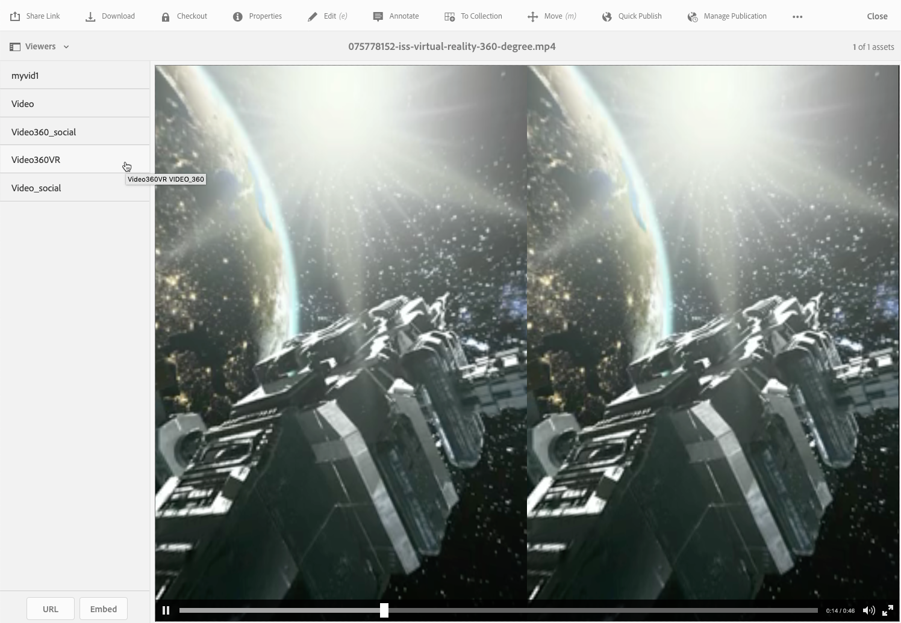

# 360/VR视频 {#vr-video}

360°视频同时记录每个方向的视图。 它们是用全方位相机或一组相机拍摄的。 在播放期间，在平面显示器上，用户可以控制观看角度；移动设备上的播放通常应用其内置的陀螺仪控件。

Dynamic Media包含交付360个视频资产的本机支持。 默认情况下，查看或播放不需要任何其他配置。 您使用标准视频扩展名(如.mp4、.mkv和.mov)来交付360视频。 最常见的编解码器是H.264。

您可以使用360/VR视频查看器来渲染等矩形视频。 这样，您就可以体验到房间、房产、位置、景观、医疗程序等的沉浸式观看体验。

当前不支持空间音频；如果音频在立体声中混合，则余额(L/R)不会随客户更改相机视角而改变。

请参阅 [在AEM Assets中使用Dynamic Media 360视频和自定义视频缩略图](https://experienceleague.adobe.com/docs/experience-manager-learn/assets/dynamic-media/dynamic-media-360-video-custom-thumbnail-feature-video-use.html#dynamic-media).

另请参阅 [管理查看器预设](/help/assets/dynamic-media/managing-viewer-presets.md).

## 360视频正在使用 {#video-in-action}

选择 [空间站360](https://s7d1.scene7.com/s7viewers/html5/Video360Viewer.html?asset=Viewers/space_station_360-AVS) 要打开浏览器窗口并观看360°视频，请执行以下操作： 在视频播放期间，将指针拖动到新位置以更改观看角度。

*360空间站的视频帧*

## 360/VR视频和Adobe Premiere Pro {#vr-video-and-adobe-premiere-pro}

您可以使用AdobePremier Pro查看和编辑360/VR素材。 例如，您可以将徽标和文本正确放置在场景中，并应用专为等矩形媒体设计的效果和过渡。

请参阅 [编辑360/VR视频](https://helpx.adobe.com/premiere-pro/how-to/edit-360-vr-video.html).

## 上传资产以与360视频查看器一起使用 {#uploading-assets-for-use-with-the-video-viewer}

360个视频资产已上传到 [!DNL Experience Manager] 标记为 **多媒体** ，与普通视频资产类似。

*在卡片视图中看到已上传的360个视频资产。 资产将标记为多媒体。*

**上传资产以与360视频查看器一起使用：**

1. 创建了专用于360视频资产的文件夹。
1. [将自适应视频配置文件应用到文件夹](/help/assets/dynamic-media/video-profiles.md#applying-a-video-profile-to-folders).

   与标准非360视频内容相比，渲染360视频内容对源视频分辨率和编码呈现分辨率提出了更高的要求。

   您可以使用已随附的现成自适应视频配置文件Dynamic Media。 但是，对于使用非360视频查看器呈现的相同设置编码的非360视频，其360视频质量会明显低于预期。 因此，如果需要高品质的360视频，请执行以下操作：

   * 理想情况下，您的原始360视频内容将具有以下任一分辨率：

      * 1080p - 1920 x 1080，称为全高清或全高清分辨率，或
      * 2160p - 3840 x 2160，称为4k、UHD或UltraHD分辨率。 这种大的显示分辨率通常出现在高档电视机和电脑显示器上。 2160p分辨率通常称为“4k”，因为宽度接近4000像素。 换句话说，它的像素数是1080p的四倍。
   * [创建自定义自适应视频配置文件](/help/assets/dynamic-media/video-profiles.md#creating-a-video-encoding-profile-for-adaptive-streaming) 具有更高质量的演绎版。 例如，您可以创建包含以下三个设置的自适应视频配置文件：

      * Width=auto;高度=720;比特率= 2500 kbps
      * Width=auto;高度=1080;比特率= 5000 kbps
      * Width=auto;高度=1440;比特率= 6600 kbps
   * 在专门用于360个视频资产的文件夹中处理360个视频内容。

   这种方法对最终用户的网络和CPU提出了更高的要求。

1. [将视频上传到文件夹](/help/assets/manage-video-assets.md#upload-and-preview-video-assets).

<!--

## Overriding the default aspect ratio of 360 videos  {#overriding-the-default-aspect-ratio-of-videos}

For an uploaded asset to qualify as a 360 video that you intend to use with the 360 Video viewer, the asset must have an aspect ratio of 2.

By default, AEM detects video as "360" if its aspect ratio (width/height) is 2.0. If you are an Administrator, you can override the default aspect ratio setting of 2 by setting the optional `s7video360AR` property in CRXDE Lite at the following:

* `/conf/global/settings/cloudconfigs/dmscene7/jcr:content`

  * **Property type**: Double
  * **Value**: floating-point aspect ratio, default 2.0.

After you set this property, it takes effect immediately on both existing videos and newly uploaded videos.

The aspect ratio applies to 360 video assets for the asset details page and the [Video 360 Media WCM component](/help/assets/dynamic-media/adding-dynamic-media-assets-to-pages.md#dynamic-media-components).

Start by uploading 360 Videos.

-->

## 预览360视频 {#previewing-video}

您可以使用“预览”功能查看您的360视频如何显示给客户，并确保其行为符合预期。

另请参阅 [编辑查看器预设](/help/assets/dynamic-media/managing-viewer-presets.md#editing-viewer-presets).

如果您对360视频满意，可以发布该视频。

请参阅[在网页上嵌入视频查看器或图像查看器](/help/assets/dynamic-media/embed-code.md)。请参阅[将 URL 关联到您的 Web 应用程序](/help/assets/dynamic-media/linking-urls-to-yourwebapplication.md)。如果您的交互式内容具有包含相对URL的链接，特别是指向的链接，则无法使用基于URL的链接方法 [!DNL Experience Manager Sites] 页面。
请参阅 [将Dynamic Media Assets添加到页面](/help/assets/dynamic-media/adding-dynamic-media-assets-to-pages.md).

**要预览360个视频，请执行以下操作：**

1. 在 **[!UICONTROL 资产]**，导航到您创建的现有360视频。 要在预览模式下将其打开，请选择360视频资产。

   

   要预览视频，请选择360视频资产。

1. 在预览页面的左上角附近，选择下拉列表，然后选择 **[!UICONTROL 查看器]**.

   

   从查看器列表中，选择 **[!UICONTROL Video360_social]**，然后执行下列操作之一：

   * 要更改静态场景的观看角度，请在视频中拖动指针。
   * 要开始播放，请选择视频的 **[!UICONTROL 播放]** 按钮。 在视频播放时，在视频中拖动指针以更改观看角度。

   *360视频屏幕截图。*

   * 从查看器列表中，选择 **[!UICONTROL Video360VR]**.

      虚拟现实(VR)视频是使用虚拟现实耳机访问的沉浸式视频内容。 与普通视频一样，在视频被录制或捕获时，您会在开始时使用360°摄像机创建VR视频。
   
   *360 VR视频屏幕截图。*

1. 在预览页面的右上方附近，选择 **[!UICONTROL 关闭]**.

## 发布360视频 {#publishing-video}

要使用360视频，您必须发布它。 发布360视频可激活URL和嵌入代码。 它还会将360视频发布到Dynamic Media云，该云与CDN集成以进行可扩展且性能出众的交付。

请参阅 [发布Dynamic Media Assets](/help/assets/dynamic-media/publishing-dynamicmedia-assets.md) 有关如何发布360视频的详细信息。
另请参阅 [在网页上嵌入视频查看器或图像查看器](/help/assets/dynamic-media/embed-code.md).
另请参阅 [将URL关联到您的Web应用程序](/help/assets/dynamic-media/linking-urls-to-yourwebapplication.md). 如果您的交互式内容具有包含相对URL的链接，特别是指向的链接，则无法使用基于URL的链接方法 [!DNL Experience Manager Sites] 页面。
另请参阅 [将Dynamic Media Assets添加到页面](/help/assets/dynamic-media/adding-dynamic-media-assets-to-pages.md).
