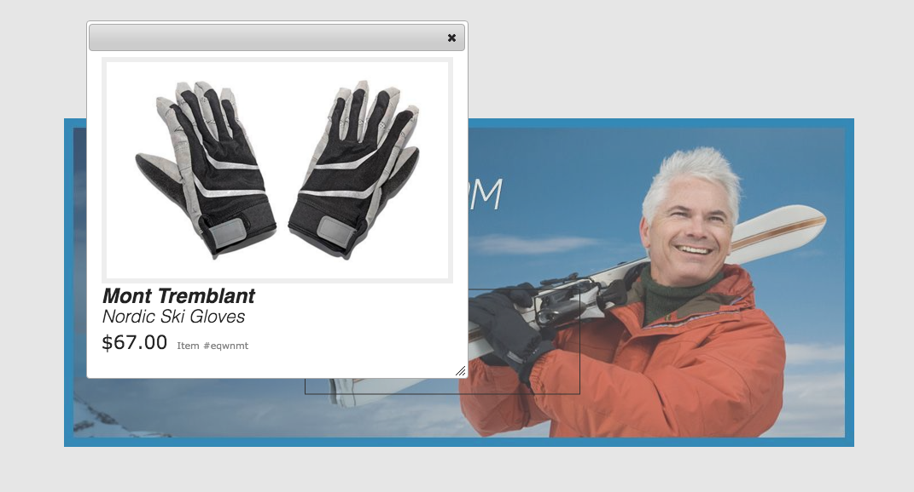

# 传送横幅{#carousel-banners}

通过创建交互式旋转促销内容并将其交付到任何屏幕，轮播横幅使营销人员能够推动转化。

创建和修改促销横幅中特有的内容可能非常耗时，这会限制您快速发布新内容或使其更具针对性的能力。 通过传送横幅，您可以快速创建或修改旋转横幅，并添加交互性，如将热点链接到产品详细信息或相关资源。 您可以将这些内容传送到任何屏幕，从而更快地将新促销内容推向市场。

传送横幅由带有单词的横幅来指定 **[!UICONTROL 卡鲁塞]**:

在您的网站上，轮播横幅可以如下所示：

在此，您可以通过选择数字来浏览图像。 此外，幻灯片会根据您可以自定义的时间间隔自动旋转。 轮播横幅中的图像同时支持热点和图像映射。 用户可以选择或转到超链接或访问“概览”窗口。

在此示例中，用户选择了图像映射并访问手套的“概览”窗口：

## 观看如何创建轮播横幅 {#watch-how-carousel-banners-are-created}

观看 [轮播横幅的创建方式](https://s7d5.scene7.com/s7viewers/html5/VideoViewer.html?videoserverurl=https://s7d5.scene7.com/is/content/&amp;emailurl=https://s7d5.scene7.com/s7/emailFriend&amp;serverUrl=https://s7d5.scene7.com/is/image/&amp;config=Scene7SharedAssets/Universal_HTML5_Video_social&amp;contenturl=https://s7d5.scene7.com/skins/&amp;asset=S7tutorials/InteractiveCarouselBanner) (持续时间：10分33秒)。 您还将了解如何预览、编辑和传送轮播横幅。

>[!NOTE]
>
>非管理用户必须添加到 **[!UICONTROL dam-users]** 组，以便能够创建或编辑传送横幅。 如果您在创建或编辑时遇到问题，请咨询系统管理员，该管理员可以将您添加到 **d[!UICONTROL am用户]** 群组。

## 快速入门：传送横幅 {#quick-start-carousel-banners}

要快速设置并运行图像集，请执行以下操作：

1. [识别热点和图像映射变量](#identifying-hotspot-and-image-map-variables) (仅适用于使用Adobe Experience Manager Assets + Dynamic Media的客户)

   首先，识别现有概览实施所使用的动态变量。 这样做有助于您在Experience Manager Assets的轮播横幅创建过程中正确输入热点和图像映射数据。

<!-- LEAVE; COMMERCE BEING ADDED AGAIN IN THE FUTURE

   >[!NOTE]
   >
   >If you are an Experience Manager Sites or Ecommerce customer, you can use the built-in feature to navigate to product pages and lookup the existing skus in the product catalog. You do not need to manually enter hotspot or image map variables.
   >
   >
   >If you are an Experience ManagerAssets and Dynamic Media customer, you will manually enter data for hotspots and image maps, and then integrate the published URL or Embed code with your third-party content management system.

-->

1. 可选：根据需要[创建轮播集查看器预设](/help/assets/dynamic-media/managing-viewer-presets.md)。

   如果您是管理员，则可以通过创建自己的轮播查看器预设来自定义轮播的行为和外观。 其主要好处是，您可以为多个轮播重复使用此自定义查看器预设。 但是，用户可以选择在创作轮播时直接自定义轮播的行为和外观。 当您想要为给定轮播设计特定设计时，首选此方法。

1. [上传图像横幅](#uploading-image-banners).

   上传您要实现交互的图像横幅。

1. [创建轮播集](#creating-carousel-sets).

   在轮播集中，用户在横幅图像中导航，并选择热点或图像映射以访问相关内容。

   要在资产中创建轮播集，请选择 **[!UICONTROL 创建]**，然后选择 **[!UICONTROL 轮播集]**. 将资产添加到幻灯片，然后选择 **[!UICONTROL 保存]**. 您还可以直接在编辑器中编辑轮播集的外观和行为。

1. [将热点或图像映射添加到图像横幅](#adding-hotspots-or-image-maps-to-an-image-banner).

   向图像横幅中添加一个或多个热点或图像映射。 然后，将每个体验片段与某个操作相关联，例如链接、概览或体验片段。 添加热点或图像映射后，可通过发布轮播集来完成此任务。 发布后会创建嵌入代码，您可以使用该代码复制嵌入代码并将其应用于网站登录页面。

   请参阅 [（可选）预览传送横幅](#optional-previewing-carousel-banners)  — 可选。 如果需要，您可以查看轮播集的表示形式并测试其交互性。

1. [发布传送横幅](#publishing-carousel-banners).

   与发布任何资产一样，您也可以发布轮播集。 在资产中，导航到轮播集，并将其选中，然后选择 **[!UICONTROL 发布]**. 发布轮播集时，会激活URL和嵌入字符串。

1. 执行下列操作之一：

   * [将轮播横幅添加到您的网站页面](#adding-a-carousel-banner-to-your-website-page)您可以将复制的轮播横幅URL或嵌入代码添加到网站页面。

      * [将轮播横幅与现有概览相集成](#integrating-the-carousel-banner-with-an-existing-quickview). 如果您使用的是第三方Web内容管理系统，则必须将新的轮播横幅与网站上的现有概览实施相集成。
   * [在Experience Manager中向网站添加轮播横幅](/help/assets/dynamic-media/adding-dynamic-media-assets-to-pages.md). 如果您是Experience Manager Sites客户，则可以使用交互式媒体组件将轮播集直接添加到页面。

如果必须编辑传送集，请参阅 [编辑轮播集](#editing-carousel-sets). 此外，您还可以查看和编辑 [轮播集属性](/help/assets/manage-digital-assets.md#editing-properties).

## 识别热点和图像映射变量 {#identifying-hotspot-and-image-map-variables}

首先，识别现有概览实施所使用的动态变量。 此方法可帮助您在Experience Manager Assets的轮播集创建过程中正确输入热点或图像映射数据。

在将热点或图像映射添加到横幅图像时，您需要分配一个SKU（库存单位）。 您还可以为每个热点或图像映射分配可选的额外变量。 这些变量稍后会用于将热点或图像映射与概览内容进行匹配。

<!-- LEAVE; COMMERCE BEING ADDED LATER

>[!NOTE]
>
>If you are an Experience Manager Sites and/or Experience Manager Ecommerce customer, skip this step. You do not need to manually identify hotspot or image map variables; you can use the integration with Ecommerce for product integration. See information on [setting up eCommerce](/help/sites-cloud/administering/generic.md). In addition, you can use the Interactive component and add it to your web page.
>
>If you are an Experience Manager Assets or Media customer, you publish the URL or Embed code and then integrate with your third-party content management system and identify hotspots and image maps manually.

-->

必须正确识别要与热点或图像映射数据关联的变量数量和类型。 添加到横幅图像的每个热点或图像映射都必须包含足够的信息，以便在现有的后端系统中明确地识别产品。 同时，请确保每个热点或图像映射不包含的数据不比必需的数据多。 原因是这样会使数据输入过程过于复杂，并且会使正在进行的热点或图像映射管理更容易出错。

有不同的方法来识别一组用于热点或图像映射数据的变量。

有时，只需咨询负责现有概览实施的IT专家即可。 他们可能知道系统中用于标识概览的最少数据集。 但是，可以简单地分析前端代码的现有行为。

大多数概览实施都使用以下范例：

* 用户在网站上激活用户界面元素。例如，选择 **[!UICONTROL 概览]** 按钮。
* 如果需要，网站会向后端发送Ajax请求以加载概览数据或内容。
* 概览数据会转换为内容，以准备在网页上渲染。
* 最后，前端代码以可视形式将这些内容呈现在屏幕上。

然后，方法是访问现有网站中实施了概览功能的不同区域。 然后触发概览并获取网页发送的用于加载概览数据或内容的Ajax URL。

通常情况下，您不需要使用任何专业的调试工具。现代的 Web 浏览器具备 Web 检查器，可以实现相同的功能。下面列举了一些具备 Web 检查器的 Web 浏览器：

* 要在Google Chrome中查看所有传出的HTTP请求，请按F12(Windows®)或Command-Option-I(Mac)以打开开发人员工具面板。 选择“网络”选项卡。
* 在Firefox中，您可以通过按F12(Windows®)或Command-Option-I(Mac)来激活Firebug插件。 使用其“网络”选项卡，或使用内置的“检查器”工具及其“网络”选项卡。

在浏览器中打开网络监控时，会触发页面上的概览。

现在，在网络日志中找到概览Ajax URL，并复制记录的URL以供将来分析。 通常，在触发概览时，会向服务器发送大量请求。 通常，Quickview Ajax URL是列表中最先使用的URL之一。 它具有复杂的查询字符串部分或路径，其响应MIME类型为 `text/html`, `text/xml`或 `text/javascript`.

在此过程中，访问网站中具有不同产品类别和类型的不同区域非常重要。 原因是概览URL的某些部分对于给定的网站类别是通用的，但仅当您访问网站的其他区域时，才会发生更改。

在最简单的情况下，概览URL中唯一的变量部分是产品SKU。 在这种情况下，SKU值是您在将热点或图像映射添加到横幅图像时需要的唯一数据块。

但是，在复杂情况下，除SKU之外，快速视图URL还具有不同的可变元素。 其中一些元素包括类别ID、颜色代码、大小代码等。 在这种情况下，在热点或轮播横幅功能的图像映射数据定义中，每个元素都是一个单独的变量。

请考虑以下概览URL示例及其生成的热点或图像映射变量：

<table>
 <tbody>
  <tr>
   <td>单个 SKU，位于查询字符串中。</td>
   <td>
记录的概览URL包括：

    <ul>
     <li>
<code>https://server/json?productId=866558&amp;source=100</code>
 </li>
     <li>
<code>https://server/json?productId=1196184&amp;source=100</code>
 </li>
     <li>
<code>https://server/json?productId=1081492&amp;source=100</code>
 </li>
     <li>
<code>https://server/json?productId=1898294&amp;source=100</code>
 </li>
    </ul> 
URL中唯一的变量部分是 <code>productId=</code> 查询字符串参数，很明显它是SKU值。 因此，热点或图像映射只需在SKU字段中填充如下值即可 <code>866558,</code> <code>1196184,</code> <code>1081492,</code> <code>1898294.</code>
 </td>
  </tr>
  <tr>
   <td>单个 SKU，位于 URL 路径中。</td>
   <td>
记录的概览URL包括：

    <ul>
     <li>
<code>https://server/product/6422350843</code>
 </li>
     <li>
<code>https://server/product/1607745002</code>
 </li>
     <li>
<code>https://server/product/0086724882</code>
 </li>
    </ul> 
变量部分位于路径的最后一部分，它将成为热点/图像映射的SKU值：<strong><code>6422350843</code>, <code>1607745002,</code> </strong><code>0086724882.</code>
 </td>
  </tr>
  <tr>
   <td>SKU 和类别 ID，位于查询字符串中。</td>
   <td>
记录的概览URL包括：

    <ul>
     <li>
<code>https://server/quickView/product/?category=1100004&amp;prodId=305466</code>
 </li>
     <li>
<code>https://server/quickView/product/?category=1100004&amp;prodId=310181</code>
 </li>
     <li>
<code>https://server/quickView/product/?category=1740148&amp;prodId=308706</code>
 </li>
    </ul> 
在这种情况下，URL 中有两个可变部分。SKU存储在 <code>prodId</code> 参数和类别ID存储在 <code>category=</code>参数。
 
因此，热点/图像映射定义是成对存在的。 即，一个SKU值和一个名为 <code>categoryId</code>. 生成的各对如下所示：

    <ul>
     <li>
SKU是 <strong><code>305466</code></strong> 和 <code>categoryId</code> is <code>1100004</code>.
 </li>
     <li>
SKU是 <strong><code>310181</code></strong> 和 <code>categoryId</code> is <strong><code>1100004</code></strong>.
 </li>
     <li>
SKU是 <strong><code>308706</code></strong> 和 <code>categoryId</code> is <strong><code>1740148</code></strong>.
 </li>
    </ul> </td>
  </tr>
 </tbody>
</table>

## 上传图像横幅 {#uploading-image-banners}

如果您已上传要使用的图像，请前进到下一步， [创建轮播集](#creating-carousel-sets). 启用Dynamic Media后，必须上传轮播中使用的图像。

要上传图像横幅，请参阅 [上传资产](/help/assets/manage-digital-assets.md).

## 创建轮播集 {#creating-carousel-sets}

>[!NOTE]
>
>非管理用户必须添加到 **[!UICONTROL dam-users]** 组，以便能够创建或编辑传送横幅。 如果您在创建或编辑时遇到问题，请咨询系统管理员，该管理员可以将您添加到 **[!UICONTROL dam-users]** 群组。

**要创建轮播集，请执行以下操作：**

1. 在Assets中，导航到要创建轮播集的文件夹，然后转到 **[!UICONTROL 创建>轮播集]**.
1. 在“轮播横幅编辑器”页面上，选择 **[!UICONTROL 点按以打开资产选择器]** 来选择第一张幻灯片的图像。

   在“轮播横幅编辑器”页面上，执行以下任一操作：

   * 在页面的左上角附近，选择 **[!UICONTROL 添加幻灯片]** 图标。

   * 在页面中间附近，选择 **[!UICONTROL 点按以打开资产选择器]**.
   选择以选择要包含在轮播集中的资产。 选定资产上有一个复选标记图标。 完成后，在页面的右上角附近，选择 **[!UICONTROL 选择]**.

   借助资产选择器，您可以通过键入关键字并选择 **[!UICONTROL 返回]**. 您还可以应用过滤器来优化搜索结果。您可以按路径、收藏集、文件类型和标记进行过滤。选择过滤器，然后选择 **[!UICONTROL 过滤器]** 图标。 通过选择“视图”图标并选择 **[!UICONTROL 列视图]**, **[!UICONTROL 卡片视图]**&#x200B;或 **[!UICONTROL 列表视图]**.

   请参阅 [使用选择器](/help/assets/dynamic-media/working-with-selectors.md) 以了解更多信息。

1. 继续添加幻灯片，直到您添加了所有要在轮播集中旋转的图像。
1. （可选）执行以下操作之一：

   * 如有必要，可拖动幻灯片来重新排序列表中的图像。
   * 要删除图像，请选择图像，然后选择 **[!UICONTROL 删除幻灯片]** 中。

   * 要应用预设，请在页面的右上角附近，选择预设下拉列表，然后选择要一次应用于该预设集的预设。
   要删除幻灯片，请选择该幻灯片。 在工具栏中，选择 **[!UICONTROL 删除幻灯片]** 中。 要移动幻灯片，请选择重新排序图标并移动到所需位置。

1. 在幻灯片中添加图像后，您可以向图像添加热点和/或图像映射。 请参阅 [将热点或图像映射添加到图像横幅](#adding-hotspots-or-image-maps-to-an-image-banner).
1. 您可以更改轮播集的可视化设计和行为。 选择 **[!UICONTROL 行为]** 和 **[!UICONTROL 外观]** 选项卡。 请参阅 [管理查看器预设](/help/assets/dynamic-media/viewer-presets.md) 以了解有关如何使用查看器编辑器的更多信息。

   >[!NOTE]
   >
   >对于传送横幅，您可以调整以下内容：
   >
   >* 图像显示的持续时间。 默认情况下，每幅图像显示9秒。
   >* 动画. 默认情况下，每个幻灯片过渡都是渐隐效果。 您可以将其更改为幻灯片过渡。
   >* 按钮的样式。 用户可以通过选择每个圆点或数字来旋转横幅。 您可以更改设置指示器按钮的显示位置（如果是数字或虚线样式）以及其大小。
   >* 更改图像映射的高亮显示样式或用于热点的图标。
   >* 在编辑查看器预设之前，请选择要作为预设基础的样式。 如果您没有选择样式，则在开始编辑查看器预设时，如果您更改为其他预设，则会丢失所有更改。

   您还可以预览轮播横幅的外观。 请参阅 [（可选）预览传送横幅](#optional-previewing-carousel-banners).

1. 选择 **[!UICONTROL 保存]** 完成。

## 将热点或图像映射添加到图像横幅 {#adding-hotspots-or-image-maps-to-an-image-banner}

您可以使用轮播集编辑器将热点或图像映射添加到横幅。

添加热点或图像映射时，您可以将热点或图像映射定义为概览弹出显示、超链接或体验片段。

请参阅 [体验片段](/help/sites-cloud/authoring/fundamentals/experience-fragments.md).

>[!NOTE]
>
>在体验片段中嵌入查看器时，不支持轮播横幅中的社交媒体共享工具。
>
>要解决此问题，您可以使用或创建没有社交媒体共享工具的查看器预设。 通过此类查看器预设，您可以成功将其嵌入到体验片段中。

在向图像添加热点或图像映射时，请记住保存您的工作。 在当前创建/编辑会话期间，支持页面右上角附近的撤消和重做选项。

创建完轮播横幅后，您可以选择使用“预览”来显示轮播横幅对客户的显示方式。

请参阅 [（可选）预览传送横幅](#optional-previewing-carousel-banners).

>[!NOTE]
>
>在将热点添加到图像横幅时，热点信息会存储在相对于图像位置的同一元数据位置。 无论是交互式图像还是轮播横幅，此点均为true。 此功能意味着您可以在任意查看器中轻松重复使用同一图像及其定义的热点数据。
但是，请注意，传送横幅支持图像映射的图像也可能包含热点；交互式图像不会。 如果您打算创建使用相同图像的交互式图像或轮播横幅，请记住此提示。 请考虑使用同一图像的不同副本来创建交互式图像和传送横幅。

>[!NOTE]
如果您正在使用热点编辑交互式图像并裁剪图像，则热点会被删除。

<!-- See also [Adding Image Maps](/help/assets/image-maps.md). -->

**要向图像横幅添加热点或图像映射，请执行以下操作：**

1. 在资产中，导航到要进行交互的轮播集。
1. 选择轮播集，然后选择 **[!UICONTROL 编辑]**. 将打开轮播查看器编辑器。
1. 选择要进行交互的幻灯片。
1. 在页面的左上角附近，选择 **[!UICONTROL 热点]** 或 **[!UICONTROL 图像映射]**.
1. 执行以下任一操作：

   * 对于热点：在图像上，选择您希望显示热点的位置。
   * 对于图像映射：在图像上，从左上角向右下角拖动以创建图像映射区域。 您可以通过拖动角来调整图像映射的大小。

   如有必要，请将热点或图像映射拖到新位置。 或者，使用键盘箭头键控制选定热点的位置。 根据需要添加更多热点或图像映射。

   要删除热点或图像映射，请选择 **[!UICONTROL 操作]** 选项卡。 在 **[!UICONTROL 地图和热点]** 标题，从 **[!UICONTROL 选定类型]** 下拉列表中，选择要删除的热点或图像映射的名称。 选择 **[!UICONTROL 垃圾]** 图标，然后选择 **[!UICONTROL 删除]**.

1. 在“名称”文本字段中，键入热点或图像映射的名称。 此名称也会显示在 **[!UICONTROL 映射和热点]** 下拉列表。 如果您决定在将来更改热点或图像映射，则提供名称可以让您轻松地识别该热点或图像映射。
1. 在 **[!UICONTROL 操作]** 选项卡：

   * 选择 **[!UICONTROL 概览]**.

      * 如果您是Experience Manager Sites <!-- and Ecommerce--> 客户，选择产品选取器图标（放大镜）以打开选择产品页面。 要返回到轮播横幅编辑器，请选择要使用的产品，然后选择页面右上角的复选标记。
      * 如果你不是Experience Manager Sites <!-- or Ecommerce --> 客户：

         * 定义变量。 请参阅 [识别热点变量](#identifying-hotspot-and-image-map-variables).
         * 然后，手动输入SKU值。 在“SKU值”文本字段中，键入产品的SKU（库存单位），即您提供的每个不同产品或服务的唯一标识符。 输入的SKU值会自动填充概览模板的变量部分。 系统现在知道将选定的热点与特定SKU的概览相关联。
         * （可选）如果概览中有其他变量必须使用才能进一步识别产品，请选择 **[!UICONTROL 添加常规变量]**. 在文本字段中，指定一个额外的变量。 例如，category=Mens是一个添加的变量。

         * 请参阅 [使用选择器](/help/assets/dynamic-media/working-with-selectors.md) 以了解更多信息。
   * 选择 **[!UICONTROL 超链接]**.

      * 如果您是Experience Manager Sites客户，请选择站点选择器图标（文件夹）以导航到URL。

         >[!NOTE]
         如果您的交互式内容具有包含相对URL的链接，特别是指向Experience Manager Sites页面的链接，则无法使用基于URL的链接方法。

      * 如果您是独立客户，请在href文本字段中，指定链接网页的完整URL路径。

   请确保指定是在新的浏览器选项卡（推荐为默认选项卡）还是在同一选项卡中打开链接。

   请参阅 [使用选择器](/help/assets/dynamic-media/working-with-selectors.md) 以了解更多信息。

   * 选择 **[!UICONTROL 体验片段]**.

      * 如果您是Experience Manager Sites客户，请选择“搜索”图标（放大镜）以打开“体验片段”页面。 要返回到热点管理页面，请选择您要使用的体验片段，然后在页面的右上角选择 **[!UICONTROL 选择]**.
请参阅 [体验片段](/help/sites-cloud/authoring/fundamentals/experience-fragments.md).

      * 指定在横幅上显示的体验片段的宽度和高度。

         >[!NOTE]
         在体验片段中嵌入查看器时，不支持轮播横幅中的社交媒体共享工具。
         要解决此问题，您可以使用或创建没有社交媒体共享工具的查看器预设。 通过此类查看器预设，您可以成功将其嵌入到体验片段中。
   

   您还可以预览轮播横幅的外观。 请参阅 [（可选）预览传送横幅](#optional-previewing-carousel-banners).

1. 选择&#x200B;**[!UICONTROL 保存]**。
1. 发布轮播集。 发布后会创建可在您的网站页面上使用的嵌入代码或URL。 如果您是Experience Manager Sites客户，请将轮播集直接添加到您的网页。

   请参阅 [发布资产](/help/assets/dynamic-media/publishing-dynamicmedia-assets.md).

   请参阅 [将轮播集添加到您的网站登录页面](#adding-a-carousel-banner-to-your-website-page)

## 编辑轮播集 {#editing-carousel-sets}

>[!NOTE]
非管理用户必须添加到 **[!UICONTROL dam-users]** 组，以便能够创建或编辑传送横幅。 如果您在创建或编辑时遇到问题，请咨询系统管理员，该管理员可以将您添加到 **[!UICONTROL dam-users]** 群组。

您可以对轮播集执行各种编辑任务，如下所示：

* 向轮播集添加幻灯片。 另请参阅 [使用选择器](/help/assets/dynamic-media/working-with-selectors.md).
* 在轮播集中重新排序幻灯片。
* 删除轮播集中的资产。
* 应用查看器预设。
* 删除轮播集。
* 添加或编辑热点和图像映射。 另请参阅 [使用选择器](/help/assets/dynamic-media/working-with-selectors.md).

**要编辑传送集，请执行以下操作：**

1. 执行以下任一操作：

   * 将鼠标悬停在轮播集资产上，然后选择 **[!UICONTROL 编辑]** （铅笔图标）。
   * 将鼠标悬停在轮播集资产上，选择 **[!UICONTROL 选择]** （复选标记图标），然后在工具栏中，选择 **[!UICONTROL 编辑]**.

   * 选择轮播集资产，然后在页面的左上角选择 **[!UICONTROL 编辑]** （铅笔图标）。

1. 要编辑轮播集，请执行以下任一操作：

   * 要添加幻灯片，请选择 **[!UICONTROL 添加幻灯片]** 图标。 导航到要添加到该幻灯片的资产，然后选择复选标记。
   * 要对幻灯片重新排序，请将幻灯片拖到新位置（选择重新排序图标以移动项目）。
   * 要添加热点或图像映射，请选择热点或图像映射图标，然后参阅 [将热点和图像映射添加到图像横幅](#adding-hotspots-or-image-maps-to-an-image-banner).
   * 要编辑轮播集的外观或行为，请选择 **[!UICONTROL 外观]** 选项卡或 **[!UICONTROL 行为]** 选项卡，然后设置所需的选项。
   * 要编辑热点或图像映射，请在相应的幻灯片上选择热点或图像映射。 在 **[!UICONTROL 操作]** 选项卡来访问Advertising Cloud的帮助。
   * 要删除幻灯片，请选择它，然后选择 **[!UICONTROL 删除幻灯片]** 中。
   * 要应用预设，请在页面的右上角附近，选择 **[!UICONTROL 预设]** 下拉列表中，然后选择查看器预设。
   * 要删除整个轮播集，请导航到轮播集，选择它，然后选择 **[!UICONTROL 删除]**.

   >[!NOTE]
   如果您正在使用热点编辑交互式图像并裁剪图像，则热点会被删除。

## （可选）预览传送横幅 {#optional-previewing-carousel-banners}

您可以使用“预览”来查看轮播横幅向客户的显示方式。 使用“预览”还可以测试轮播横幅的热点和图像映射，以确保它们按预期运行。

当您对轮播横幅满意时，可以发布该横幅。
请参阅 [在网页上嵌入视频查看器或图像查看器](/help/assets/dynamic-media/embed-code.md).
请参阅 [将URL关联到您的Web应用程序](/help/assets/dynamic-media/linking-urls-to-yourwebapplication.md). 如果您的交互式内容具有包含相对URL的链接，特别是指向Experience Manager Sites页面的链接，则无法使用基于URL的链接方法。
请参阅 [将Dynamic Media Assets添加到页面](/help/assets/dynamic-media/adding-dynamic-media-assets-to-pages.md).

您可以从轮播编辑器（首选方法）或 **[!UICONTROL 查看器]** 列表。

**（可选）要预览传送横幅，请执行以下操作：**

1. 在 **[!UICONTROL 资产]**，导航到您创建的现有轮播横幅并选择将其打开。
1. 选择&#x200B;**[!UICONTROL 编辑]**。
1. 在工具栏右角的查看器预设列表中，选择查看器以预览轮播横幅。

   

1. 选择&#x200B;**[!UICONTROL 预览]**。
1. 要测试其关联的操作，请选择图像上的热点或图像映射。

**要从“查看器”列表预览轮播横幅，请执行以下操作：**

1. 在 **[!UICONTROL 资产]**，导航到您创建的现有轮播横幅并选择将其打开。
1. 在预览页面的左上角附近，选择内容图标。
1. 在 **[!UICONTROL 查看器]** 在页面左侧的面板中列出，选择要使用的轮播横幅查看器预设的名称。
1. 要测试其关联的操作，请选择图像上的热点或图像映射。

## 发布传送横幅 {#publishing-carousel-banners}

要使用轮播，必须发布它。 发布轮播集时，会激活URL和嵌入代码。 它还会将轮播发到Dynamic Media云，该云与CDN集成以进行可扩展且性能卓越的交付。

>[!NOTE]
如果您在轮播横幅中使用带有热点的现有交互式图像，则在发布轮播横幅后，必须单独发布该交互式图像。
此外，如果您修改了在轮播横幅中使用的预先已发布的交互式图像，则应发布交互式图像，以便这些更改反映在轮播横幅中。

请参阅 [发布Dynamic Media Assets](/help/assets/dynamic-media/publishing-dynamicmedia-assets.md) 有关如何发布传送横幅的信息。

## 将轮播横幅添加到您的网站页面 {#adding-a-carousel-banner-to-your-website-page}

在将横幅图像上传到横幅以创建轮播后，将热点或图像映射（或同时将其添加到横幅）或图像映射。 已发布轮播集。 您现在可以将其添加到现有网站页面。

>[!NOTE]
如果您是Experience Manager Sites客户，则可以通过将交互式媒体组件拖动到页面来直接将轮播横幅添加到您的页面。 请参阅 [将Dynamic Media Assets添加到页面](/help/assets/dynamic-media/adding-dynamic-media-assets-to-pages.md).

但是，如果您是独立的Experience Manager Assets客户，则可以手动将轮播横幅添加到您的网站登录页面。

1. 复制已发布的轮播集的嵌入代码。
请参阅 [在网页上嵌入视频查看器或图像查看器](/help/assets/dynamic-media/embed-code.md).

1. 将您从Experience Manager Assets复制的嵌入代码添加到您的网页。
复制的嵌入代码是响应式的，因此会自动适合页面的嵌入区域。

## 将轮播横幅与现有概览相集成 {#integrating-the-carousel-banner-with-an-existing-quickview}

注意：仅当您是独立的Experience Manager Assets客户时，此步骤才适用。

此过程的最后一个步骤是将轮播横幅与您网站上的现有概览实施集成。 每个概览实施都是独一无二的，需要一种特定的方法，通常需要前端IT人员的协助。

现有的概览实施通常表示在网页上发生的一系列相互关联的操作，这些操作按以下顺序发生：

1. 用户在网站的用户界面上触发一个元素。
1. 前端代码根据在步骤1中触发的用户界面元素获取概览URL。
1. 前端代码使用在第 2 步获取的 URL 发送一个 Ajax 请求。
1. 后端逻辑会将相应的概览数据或内容返回到前端代码。
1. 前端代码加载概览数据或内容。
1. （可选）前端代码将加载的概览数据转换为HTML表示。
1. 前端代码显示一个模态对话框或面板，并将 HTML 内容呈现在屏幕上以供最终用户查看。

这些调用不表示独立的公共API调用，网页逻辑可从任意步骤中调用这些调用。 相反，这些调用属于链式调用，即，每个后续步骤都隐藏在前一步的最后阶段（回调）。

在轮播横幅替换步骤1和部分步骤2的同时，当用户选择热点或图像映射时，此类交互由查看者处理。 查看器会向网页返回一个事件，其中包含之前添加的所有热点或图像映射数据。

在此类事件处理程序中，前端代码会执行下列操作：

* 监听轮播横幅发出的事件。
* 根据热点或图像映射数据构建概览URL。
* 触发从后端加载概览并将其呈现在屏幕上以供显示的过程。

由Experience Manager Assets返回的嵌入代码已拥有一个现成的事件处理程序，该处理程序已被注释掉。

因此，只需取消对该代码的注释，并用针对特定网页的代码来替换虚拟处理程序主体即可。

构建概览URL的过程与用于识别先前涵盖的热点和图像映射变量的过程相反。

请参阅 [识别热点和图像映射变量](#identifying-hotspot-and-image-map-variables).

触发概览URL并激活概览面板的最后一步，很可能需要IT部门的前端IT人员的协助。他们深知如何通过拥有现成的概览URL，从正确的步骤中准确触发概览实施。

## 使用概览创建自定义弹出窗口Windows® {#using-quickviews-to-create-custom-pop-ups}

请参阅 [使用概览创建自定义弹出窗口Windows®](/help/assets/dynamic-media/custom-pop-ups.md).
