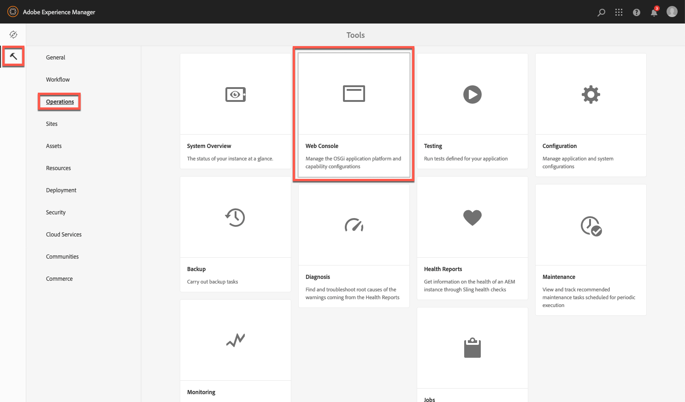

# 关于配置Dynamic MediaCloud Service {#configuring-dynamic-media}

如果您将Adobe Experience Manager用于不同的环境（如开发、暂存和实时生产），请为每个环境配置Dynamic MediaCloud Services。

另请参阅 [配置Dynamic Media公司别名帐户](/help/assets/dynamic-media/dm-alias-account.md)

## Dynamic Media架构图 {#architecture-diagram-of-dynamic-media}

以下架构图介绍了Dynamic Media的工作方式。

使用新架构时，Experience Manager负责主源资产并与Dynamic Media同步以进行资产处理和发布：

1. 将主源资产上传到Adobe Experience Manager as a Cloud Service后，该资产会复制到Dynamic Media。 此时，Dynamic Media将处理所有资产处理和演绎版生成，如图像的视频编码和动态变体。
1. 生成演绎版后，Experience Manageras a Cloud Service可以安全地访问和预览远程Dynamic Media演绎版(不会将二进制文件发送回Experience Manageras a Cloud Service实例)。
1. 在内容准备好发布和批准后，它将触发Dynamic Media服务，以将内容推送到交付服务器，并在CDN（内容交付网络）处缓存内容。

>[!NOTE]
>
>以下功能列表要求您使用与Adobe Experience Manager - Dynamic Media捆绑在一起的现成CDN。 这些功能不支持任何其他自定义CDN。
>
>* [智能图像处理](/help/assets/dynamic-media/imaging-faq.md)
>* [缓存失效](/help/assets/dynamic-media/invalidate-cdn-cache-dynamic-media.md)
>* [热链接保护](/help/assets/dynamic-media/hotlink-protection.md)
>* [HTTP/2 内容交付](/help/assets/dynamic-media/http2faq.md)
>* CDN级别的URL重定向
>* Akamai ChinaCDN（在中国实现最佳交付）

<!-- OBSOLETE CONTENT

## (Optional) Migrating Dynamic Media presets and configurations from 6.3 to 6.5 Zero Downtime {#optional-migrating-dynamic-media-presets-and-configurations-from-to-zero-downtime}

If you are upgrading Experience Manager as a Cloud Service Dynamic Media from 6.3 to 6.4 or 6.5 (which now includes the ability for zero downtime deployments), you are required to run the following curl command to migrate all your presets and configurations from `/etc` to `/conf` in CRXDE Lite.

>[!NOTE]
>
>If you run your Experience Manager as a Cloud Service instance in compatibility mode--that is, you have the compatibility packaged installed--you do not need to run these commands.

For all upgrades, either with or without the compatibility package, you can copy the default, out-of-the-box viewer presets that originally came with Dynamic Media by running the following Linux curl command:

`curl -u admin:admin -X POST https://<server_address>:<server_port>/libs/settings/dam/dm/presets/viewer.pushviewerpresets.json`

To migrate any custom viewer presets and configurations that you have created from `/etc` to `/conf`, run the following Linux curl command:

`curl -u admin:admin -X POST https://<server_address>:<server_port>/libs/settings/dam/dm/presets.migratedmcontent.json`

-->

## 在Cloud Services中创建Dynamic Media配置 {#configuring-dynamic-media-cloud-services}

<!-- **Before you creating a Dynamic Media Configuration in Cloud Services**: After you receive your provisioning email with Dynamic Media credentials, you must open the [Dynamic Media Classic desktop application](https://experienceleague.adobe.com/docs/dynamic-media-classic/using/getting-started/signing-out.html#getting-started), then sign in to your account to change your password. The password provided in the provisioning email is system-generated and intended to be a temporary password only. It is important that you update the password so that Dynamic Media Cloud Service is set up with the correct credentials. -->

1. 在Experience Manageras a Cloud Service中，选择Experience Manageras a Cloud Service徽标以访问全局导航控制台。
1. 在控制台的左侧，选择工具图标，然后转到 **[!UICONTROL Cloud Services> Dynamic Media配置]**.
1. 在Dynamic Media配置浏览器页面的左窗格中，选择 **[!UICONTROL 全球]** (请勿选择 **[!UICONTROL 全球]**)。 然后选择 **[!UICONTROL 创建]**.
1. 在 **[!UICONTROL 创建Dynamic Media配置]** 页面，输入Dynamic Media帐户公司管理员的标题、Dynamic Media帐户电子邮件地址和密码，然后选择您所在的地区。 此信息通过配置电子邮件中的Adobe提供给您。 如果您未收到此电子邮件，请联系Adobe客户支持。
1. 选择 **[!UICONTROL 连接到Dynamic Media]**.
1. 在 **[!UICONTROL 更改密码]** 对话框中 **[!UICONTROL 新密码]** 字段，输入包含8-25个字符的新密码。 密码必须至少包含以下任一项：

   * 大写字母
   * 小写字母
   * 数字
   * 特殊字符： `# $ & . - _ : { }`

   的 **[!UICONTROL 当前密码]** 字段，且该字段会在交互中被有意预填充和隐藏。

   如有必要，您可以通过选择密码眼图标来显示密码，来检查您键入或重新键入的密码的拼写。 再次选择图标以隐藏密码。

1. 在 **[!UICONTROL 重复密码]** 字段，重新键入新密码，然后选择 **[!UICONTROL 完成]**.

   当您选择 **[!UICONTROL 保存]** 的右上角 **[!UICONTROL 创建Dynamic Media配置]** 页面。

   如果已选择 **[!UICONTROL 取消]** 在 **[!UICONTROL 更改密码]** 对话框中，在保存新创建的Dynamic Media配置时，仍必须输入新密码。

   另请参阅 [将密码更改为Dynamic Media](#change-dm-password).

1. 连接成功后，您可以设置以下内容：

   | 属性 | 描述 |
   |---|---|
   | 公司 | Dynamic Media帐户的名称。 您可以在Experience Manager中有一个Dynamic Media帐户。<!-- CQDOC-19579 and CQDOC-19612 --> 另请参阅 [配置Dynamic Media公司别名帐户](/help/assets/dynamic-media/dm-alias-account.md). |
   | 公司根文件夹路径 | 您公司的根文件夹路径。 |
   | 发布资产 | 您可以从以下三个选项中进行选择： **[!UICONTROL 立即&#x200B;]**— 上传资产后，系统会摄取资产并立即提供URL/嵌入。 发布资产无需用户干预。 **[!UICONTROL 激活时]**  — 必须先明确发布资产，然后才能提供URL/嵌入链接。 **[!UICONTROL 选择性发布&#x200B;]**— 资产自动发布仅供安全预览。 也可以将它们明确发布到Experience Manageras a Cloud Service，而不发布到DMS7以在公共域中交付。 将来，此选项打算将资产发布到Experience Manager，以as a Cloud Service，并将资产发布到Dynamic Media，这两个选项会相互排斥。 也就是说，您可以将资产发布到DMS7，以便使用智能裁剪或动态演绎版等功能。 或者，您也可以在Experience Manageras a Cloud Service中专门发布资产以进行预览；这些相同的资产不会发布在DMS7中，才能在公共域中交付。 |
   | 安全预览服务器 | 用于指定安全演绎版预览服务器的URL路径。 也就是说，在生成演绎版后，Experience Manageras a Cloud Service可以安全地访问和预览远程Dynamic Media演绎版(不会将二进制文件发送回Experience Manageras a Cloud Service实例)。 除非您有使用自己公司服务器或特殊服务器的特殊安排，否则Adobe建议您按指定的方式保留此设置。 |
   | 同步所有内容 | 默认选中。 如果要在同步到Dynamic Media时有选择地包含或排除资产，请取消选择此选项。 取消选中此选项允许您从以下两种Dynamic Media同步模式中进行选择： **[!UICONTROL Dynamic Media同步模式]** **[!UICONTROL 默认启用&#x200B;]**— 默认情况下，配置将应用于所有文件夹，除非您专门标记文件夹以进行排除。 <!-- you can then deselect the folders that you do not want the configuration applied to.--> **[!UICONTROL 默认情况下处于禁用状态]**  — 在您明确标记要同步到Dynamic Media的选定文件夹之前，不会将配置应用于任何文件夹。 要将选定的文件夹标记为同步到Dynamic Media，请选择一个资产文件夹，然后在工具栏中，选择 **[!UICONTROL 属性]**. 在 **[!UICONTROL 详细信息]** 选项卡 **[!UICONTROL Dynamic Media同步模式]** 下拉列表中，从以下三个选项中进行选择。 完成后，选择 **[!UICONTROL 保存]**. *请记住：如果您选择&#x200B;**同步所有内容**早期。* 另请参阅 [在Dynamic Media的文件夹级别使用“选择性发布”](/help/assets/dynamic-media/selective-publishing.md). **[!UICONTROL 继承&#x200B;]**— 文件夹上没有明确的同步值。 相反，文件夹会从其上级文件夹之一继承同步值，或继承云配置中的默认模式。 通过工具提示，显示继承的节目的详细状态。 **[!UICONTROL 为子文件夹启用]**  — 包含此子树中要同步到Dynamic Media的所有内容。 特定于文件夹的设置会覆盖云配置中的默认模式。 **[!UICONTROL 子文件夹已禁用&#x200B;]**— 将此子树中的所有内容从同步到Dynamic Media。 |

   >[!NOTE]
   >
   >Dynamic Media 不支持版本控制。此外，仅当 **[!UICONTROL 发布资产]** 在“编辑Dynamic Media配置”页面中，将设置为 **[!UICONTROL 激活时]**.然后，直到首次激活资产为止。
   >
   >
   >激活资产后，任何更新都会立即实时发布到S7交付。

   

1. 选择&#x200B;**[!UICONTROL “保存”]**。将保存新的Dynamic Media密码和配置。 如果已选择 **[!UICONTROL 取消]** 相反，不会进行密码更新。
1. 在 **[!UICONTROL 配置Dynamic Media]** 对话框，选择 **[!UICONTROL 确定]** 以开始配置。

   >[!IMPORTANT]
   >
   >当新的Dynamic Media配置完成其设置时，您会在Experience Manageras a Cloud Service的收件箱中收到状态通知。
   >
   >此收件箱通知会通知您配置是否成功。
   > 请参阅 [对新的Dynamic Media配置进行故障诊断](#troubleshoot-dm-config) 和 [您的收件箱](/help/sites-cloud/authoring/getting-started/inbox.md) 以了解更多信息。

1. 为了在发布Dynamic Media内容之前安全地预览该内容，Experience Manageras a Cloud Service会使用基于令牌的验证，因此默认情况下，Experience Manager作者会预览Dynamic Media内容。 但是，您可以 *允许列表* 提供更多IP，以为用户提供安全预览内容的访问权限。 要在Experience Manageras a Cloud Service中设置此操作，请参阅 [为图像服务器配置Dynamic Media发布设置 — 安全选项卡](/help/assets/dynamic-media/dm-publish-settings.md#security-tab). <!-- To securely preview Dynamic Media content before it gets published, you must "allowlist" the Experience Manager as a Cloud Service author instance to connect to Dynamic Media. To set up this action, do the following: -->

<!--
    * Open the [Dynamic Media Classic desktop application](https://experienceleague.adobe.com/docs/dynamic-media-classic/using/getting-started/signing-out.html#getting-started), then sign in to your account. Your credentials and sign-in details were provided by Adobe at the time of provisioning. If you do not have this information, contact Adobe Customer Support.
    * On the navigation bar near the upper right corner of the page, go to **[!UICONTROL Setup]** > **[!UICONTROL Application Setup]** > **[!UICONTROL Publish Setup]** > **[!UICONTROL Image Server]**.
    * On the Image Server Publish page, in the **[!UICONTROL Publish Context]** drop-down list, select **[!UICONTROL Test Image Serving]**.
    * For the Client Address Filter, select **[!UICONTROL Add]**.
    * To enable (turn on) the address, select the check box, then enter the IP address of the Experience Manager Author instance (not Dispatcher IP).
    * Select **[!UICONTROL Save]**. -->

您现在已完成基本配置；您已准备好使用Dynamic Media。

如果要进一步自定义配置，可以选择完成 [在Dynamic Media中配置高级设置](#optional-configuring-advanced-settings-in-dynamic-media-scene-mode).

### 对新的Dynamic Media配置进行故障诊断 {#troubleshoot-dm-config}

当新Dynamic Media配置完成其设置时，您会在Experience Manageras a Cloud Service的收件箱中收到状态通知。 此通知会通知您配置是否成功，如收件箱中以下相应图像所示。

另请参阅 [您的收件箱](/help/sites-cloud/authoring/getting-started/inbox.md).

**要对新的Dynamic Media配置进行故障诊断，请执行以下操作：**

1. 在Experience Manageras a Cloud Service页面的右上角附近，选择铃铛图标，然后选择 **[!UICONTROL 查看全部]**.
1. 在收件箱页面上，选择成功通知以阅读配置状态和日志的概述。

   如果配置失败，请选择与以下屏幕截图类似的失败通知。

   

1. 在 **[!UICONTROL DMSETUP]** 页面，查看描述失败的配置详细信息。 请特别注意任何错误消息或错误代码。 请联系Adobe客户支持，以获取此信息。

   

### 将密码更改为Dynamic Media {#change-dm-password}

Dynamic Media中的密码过期时间设置为从当前系统日期起100年。

密码必须至少包含以下任一项：

* 大写字母
* 小写字母
* 数字
* 特殊字符： `# $ & . - _ : { }`

如有必要，您可以通过选择密码眼图标来显示密码，来检查您键入或重新键入的密码的拼写。 再次选择图标以隐藏密码。

在选择 **[!UICONTROL 保存]** 的右上角 **[!UICONTROL 编辑Dynamic Media配置]** 页面。

1. 在Experience Manageras a Cloud Service中，选择Experience Manageras a Cloud Service徽标以访问全局导航控制台。
1. 在控制台的左侧，选择工具图标，然后转到 **[!UICONTROL Cloud Services> Dynamic Media配置]**.
1. 在Dynamic Media配置浏览器页面的左窗格中，选择 **[!UICONTROL 全球]**. 请勿选择 **[!UICONTROL 全球]**. 然后，选择 **[!UICONTROL 编辑]**.
1. 在 **[!UICONTROL 编辑Dynamic Media配置]** 页面的正下方 **[!UICONTROL 密码]** 字段，选择 **[!UICONTROL 更改密码]**.
1. 在 **[!UICONTROL 更改密码]** 对话框中，执行以下操作：

   * 在 **[!UICONTROL 新密码]** 字段输入新密码。

      的 **[!UICONTROL 当前密码]** 字段，且该字段会在交互中被有意预填充和隐藏。

   * 在 **[!UICONTROL 重复密码]** 字段，重新键入新密码，然后选择 **[!UICONTROL 完成]**.

1. 位于的右上角 **[!UICONTROL 编辑Dynamic Media配置]** 页面，选择 **[!UICONTROL 保存]**，然后选择 **[!UICONTROL 确定]**.

## （可选）在Dynamic Media中配置高级设置{#optional-configuring-advanced-settings-in-dynamic-media-scene-mode}

要进一步自定义Dynamic Media的配置和设置，或优化其性能，您可以完成以下一个或多个操作 *可选* 任务：

* [（可选）Dynamic Media设置的设置和配置](#optional-setup-and-configuration-of-dynamic-media-scene-mode-settings)
* [（可选）调整Dynamic Media的性能](#optional-tuning-the-performance-of-dynamic-media-scene-mode)

<!--

* [(Optional) Filtering assets for replication](#optional-filtering-assets-for-replication)

-->

### （可选）Dynamic Media设置的设置和配置 {#optional-setup-and-configuration-of-dynamic-media-scene-mode-settings}

使用Dynamic Media Classic用户界面更改Dynamic Media设置。

<!-- Some of the tasks above require that you open the [Dynamic Media Classic desktop application](https://experienceleague.adobe.com/docs/dynamic-media-classic/using/getting-started/signing-out.html#getting-started), then sign in to your account. -->

安装和配置任务包括：

* [为图像服务器配置Dynamic Media发布设置](#publishing-setup-for-image-server)
* [配置Dynamic Media常规设置](#configuring-application-general-settings)
* [配置色彩管理](#configuring-color-management)
* [编辑支持的格式的MIME类型](#editing-mime-types-for-supported-formats)
* [为不支持的格式添加MIME类型](#adding-mime-types-for-unsupported-formats)

<!-- OBSOLETE BUT LEAVE FOR POSSIBLE FUTURE* [Creating batch set presets to auto-generate Image Sets and Spin Sets](#creating-batch-set-presets-to-auto-generate-image-sets-and-spin-sets) -->

#### 为图像服务器配置Dynamic Media发布设置 {#publishing-setup-for-image-server}

“Dynamic Media发布设置”页面可建立默认设置，以确定如何将资产从Dynamic MediaAdobe服务器交付到网站或应用程序。

请参阅 [为图像服务器配置Dynamic Media发布设置](/help/assets/dynamic-media/dm-publish-settings.md).

#### 配置Dynamic Media常规设置 {#configuring-application-general-settings}

配置Dynamic Media **[!UICONTROL 发布服务器名称]** URL和 **[!UICONTROL 源服务器名称]** URL。 您还可以指定 **[!UICONTROL 上传到应用程序]** 设置和 **[!UICONTROL 默认上传选项]** 所有这些都基于您的特定用例。

请参阅 [配置Dynamic Media常规设置](/help/assets/dynamic-media/dm-general-settings.md).

#### 配置色彩管理 {#configuring-color-management}

Dynamic Media色彩管理允许您对资产进行颜色校正。 通过颜色校正，摄取的资产会保留其色彩空间(RGB、CMYK、灰色)和嵌入的色彩配置文件。 请求动态呈现时，图像颜色会使用CMYK、RGB或灰色输出校正为目标颜色空间。

请参阅 [配置图像预设](/help/assets/dynamic-media/managing-image-presets.md).

要配置默认颜色属性，以便在请求图像时启用颜色校正，请执行以下操作：

1. 打开 [Dynamic Media Classic桌面应用程序](https://experienceleague.adobe.com/docs/dynamic-media-classic/using/getting-started/signing-out.html#getting-started)，然后使用配置期间提供的凭据登录到您的帐户。
1. 转到 **[!UICONTROL 设置>应用程序设置]**.
1. 展开&#x200B;**[!UICONTROL 发布设置]**&#x200B;区域，然后选择&#x200B;**[!UICONTROL 图像服务器]**。设置发布实例的默认设置时，将&#x200B;**[!UICONTROL 发布上下文]**&#x200B;设置为&#x200B;**[!UICONTROL 图像提供]**。
1. 滚动到必须更改的属性，例如 **[!UICONTROL 色彩管理属性]** 的上界。
您可以设置以下颜色校正属性：

   | 属性 | 描述 |
   |---|---|
   | CMYK默认色彩空间 | 默认CMYK颜色配置文件的名称。 |
   | 灰度默认色彩空间 | 默认灰色配置文件的名称。 |
   | RGB默认色彩空间 | 默认RGB颜色配置文件的名称。 |
   | 颜色转换调色 | 指定渲染意图。 可接受的值包括： **[!UICONTROL 知觉]**, **[!UICONTROL 相对色度]**, **[!UICONTROL 饱和度]**, **[!UICONTROL 绝对色度]**. Adobe建议 **[!UICONTROL 相对]** 作为默认设置。 |

1. 选择&#x200B;**[!UICONTROL “保存”]**。

例如，可以将 **[!UICONTROL RGB 默认色彩空间]**&#x200B;设置为 *sRGB*，将 **[!UICONTROL CMYK 默认色彩空间]**&#x200B;设置为 *WebCoated*。

这样做可以执行以下操作：

* 为RGB和CMYK图像启用颜色校正。
* 没有颜色配置文件的RGB图像假定位于 *sRGB* 色彩空间。
* 假定没有颜色配置文件的CMYK图像位于 *WebCoated* 色彩空间。
* 返回RGB输出的动态演绎版，将其返回 *sRGB* 色彩空间。
* 返回CMYK输出的动态呈现，将其返回 *WebCoated* 色彩空间。

#### 编辑支持的格式的MIME类型 {#editing-mime-types-for-supported-formats}

您可以定义Dynamic Media处理的资产类型，并自定义高级资产处理参数。 例如，您可以指定资产处理参数以执行以下操作：

* 将Adobe PDF转换为eCatalog资产。
* 将Adobe Photoshop文档(.PSD)转换为横幅模板资产以进行个性化。
* 将Adobe Illustrator文件(.AI)或Adobe Photoshop封装的PostScript®文件(.EPS)栅格化。
* [视频配置文件](/help/assets/dynamic-media/video-profiles.md) 和 [图像配置文件](/help/assets/dynamic-media/image-profiles.md) 可以分别用于定义视频和图像的处理。

请参阅 [上传资产](/help/assets/add-assets.md).

**要编辑支持格式的MIME类型，请执行以下操作：**

1. 以产品管理员身份登录到您的Experience Manageras a Cloud Service。
1. 在Experience Manageras a Cloud Service中，选择Experience Manageras a Cloud Service徽标以访问全局导航控制台，然后转到 **[!UICONTROL 常规>CRXDE Lite]**.

   如果您无权访问CRXDE Lite，请参阅 [使用CRXDE Lite](/help/implementing/developing/tools/crxde.md).

1. 在左边栏中，导航到以下内容：

   `/conf/global/settings/cloudconfigs/dmscene7/jcr:content/mimeTypes`

   

1. 在mimeTypes文件夹下，选择MIME类型。
1. 在CRXDE Lite页面的右侧，在下部：

   * 双击 **[!UICONTROL 已启用]** 字段。 默认情况下，所有资产MIME类型均已启用(设置为 **[!UICONTROL true]**)，这表示资产会同步到Dynamic Media以进行处理。 如果要排除此资产MIME类型，请将此设置更改为 **[!UICONTROL false]**.

   * 双击 **[!UICONTROL jobParam]** 打开其关联的文本字段。 请参阅 [支持的MIME类型](/help/assets/file-format-support.md) 以获取可用于给定MIME类型的允许处理参数值列表。

1. 执行下列操作之一：
   * 重复步骤3-4以编辑更多MIME类型。
   * 在CRXDE Lite页面的菜单栏上，选择 **[!UICONTROL 全部保存]**.

1. 在页面的左上角，选择 **[!UICONTROL CRXDE Lite]** 返回Experience Manageras a Cloud Service。

#### 为不支持的格式添加MIME类型 {#adding-mime-types-for-unsupported-formats}

您可以为Experience Manager Assets中不支持的格式添加自定义MIME类型。 要确保在CRXDE Lite中添加的任何新节点不会被Experience Manager删除，请将MIME类型移到 `image_`. 此外，请确保将其启用值设置为 **[!UICONTROL false]**.

**要为不支持的格式添加MIME类型，请执行以下操作：**

1. 以产品管理员身份登录到您的Experience Manageras a Cloud Service。
1. 从Experience Manageras a Cloud Service，转到 **[!UICONTROL “工具”>“操作”>“Web控制台”]**.

   

1. 将打开一个新的浏览器选项卡，该选项卡将显示 **[!UICONTROL Adobe Experience Manager Web控制台配置]** 页面。

   

1. 在页面上，向下滚动到名称 *Adobe CQ Scene7 Asset MIME 类型服务*，如下面的屏幕截图所示。在名称的右侧，点按&#x200B;**[!UICONTROL 编辑配置值]**（铅笔图标）。

   

1. 在 **Adobe CQ Scene7资产MIME类型服务** ，请选择任意加号图标&lt;+>。 在表格中选择加号以添加新MIME类型的位置很琐碎。

   

1. 类型 `DWG=image/vnd.dwg` 的空文本字段中。

   的 `DWG=image/vnd.dwg` MIME类型仅用于示例。 您在此处添加的MIME类型可以是任何其他不支持的格式。

   

1. 在页面的右下角，选择 **[!UICONTROL 保存]**.

   此时，您可以关闭已打开Adobe Experience Manager Web Console配置页面的浏览器选项卡。

1. 返回到具有打开的Experience Manageras a Cloud Service控制台的浏览器选项卡。
1. 从Experience Manageras a Cloud Service，转到 **[!UICONTROL 工具>常规>CRXDE Lite]**.

   如果您无权访问CRXDE Lite，请参阅 [使用CRXDE Lite](/help/implementing/developing/tools/crxde.md).

   

1. 在左边栏中，导航到以下内容：

   `conf/global/settings/cloudconfigs/dmscene7/jcr:content/mimeTypes`

1. 拖动MIME类型 `image_vnd.dwg` 直接放在上面 `image_` 在树中，如以下屏幕截图所示。

   

1. 具有MIME类型 `image_vnd.dwg` 仍选定， **[!UICONTROL 属性]** 选项卡 **[!UICONTROL 已启用]** 行，在 **[!UICONTROL 值]** 列标题中，双击值。 的 **[!UICONTROL 值]** 下拉列表已打开。
1. 类型 `false` (或选择 **[!UICONTROL false]** )。

   

1. 在CRXDE Lite页面的左上角附近，选择 **[!UICONTROL 全部保存]**.

### （可选）调整Dynamic Media的性能 {#optional-tuning-the-performance-of-dynamic-media-scene-mode}

保留Dynamic Media <!--(with `dynamicmedia_scene7` run mode)--> 运行顺利，Adobe建议使用以下同步性能/可伸缩性微调提示：

* [更新预定义的作业参数，以处理不同的文件格式](#update-job-para).
* [更新预定义的Granite工作流队列（视频资产）工作线程](#update-granite-workflow-queue-worker-threads-video)
* [更新预定义的Granite Transient工作流队列（图像和非视频资产）工作线程](#update-granite-transient-workflow-queue-worker-threads-images).
* [更新与Dynamic Media Classic(Scene7)服务器的最大上传连接数](#update-max-s7-upload-connections).

#### 更新预定义的作业参数，以处理不同的文件格式 {#update-job-para}

您可以在上传文件时调整作业参数以加快处理速度。 例如，如果您上传PSD文件，但不希望将它们作为模板进行处理，则可以将层提取设置为false(off)。 在这种情况下，调整的作业参数如下所示： `process=None&createTemplate=false`.

如果确实要打开模板创建，请使用以下参数： `process=MaintainLayers&layerNaming=AppendName&createTemplate=true`.

<!-- THIS PARAGRAPH WAS REPLACED WITH THE TWO PARAGRAPHS DIRECTLY ABOVE BASED ON CQDOC-17657 You can tune job parameters for faster processing when you upload files. For example, if you are uploading PSD files, but do not want to process them as templates, you can set layer extraction to false (off). In such case, the tuned job parameter would appear as `process=None&createTemplate=false`. -->

Adobe建议对PDF、PostScript®和PSD文件使用以下“已调整”的作业参数：

| 文件类型 | 推荐的作业参数 |
| ---| ---|
| PDF | `pdfprocess=Rasterize&resolution=150&colorspace=Auto&pdfbrochure=false&keywords=false&links=false` |
| PostScript® | `psprocess=Rasterize&psresolution=150&pscolorspace=Auto&psalpha=false&psextractsearchwords=false&aiprocess=Rasterize&airesolution=150&aicolorspace=Auto&aialpha=false` |
| PSD | `process=None&layerNaming=AppendName&anchor=Center&createTemplate=false&extractText=false&extendLayers=false` |

<!-- CQDOC-17657 for PSD entry in table above -->

要更新其中的任何参数，请参阅 [编辑支持的格式的MIME类型](#editing-mime-types-for-supported-formats).

另请参阅 [为不支持的格式添加MIME类型](#adding-mime-types-for-unsupported-formats).

#### 更新预定义的Granite工作流队列（视频资产）工作线程 {#update-granite-workflow-queue-worker-threads-video}

Granite工作流队列用于非临时工作流。 在Dynamic Media中，它使用 **[!UICONTROL Dynamic Media编码视频]** 工作流。

>[!NOTE]
>
>您必须以产品管理员身份登录以Experience Manageras a Cloud Service，才能完成此任务。

如果您无权访问OSGi，请参阅 [OSGi配置](/help/implementing/developing/components/overview.md#osgi-configuration).

**要更新预定义的Granite工作流队列（视频资产）工作线程，请执行以下操作：**

1. 导航到 `https://<server>/system/console/configMgr` 和搜索 **队列：Granite工作流队列**.

   >[!NOTE]
   >
   >由于OSGi PID是动态生成的，因此需要进行文本搜索，而不是直接URL。

1. 在 **[!UICONTROL 最大并行作业数]** 字段，请将数字更改为所需的值。

   默认情况下，最大并行作业数取决于可用CPU核心的数量。 例如，在4核服务器上，它分配两个工作线程。 （0.0到1.0之间的值基于比率，或者大于1的任何数字都分配工作线程的数量。）

   对于大多数用例，0.5的默认设置已足够。

   

1. 选择&#x200B;**[!UICONTROL “保存”]**。

#### 更新预定义的Granite Transient工作流队列工作线程 {#update-granite-transient-workflow-queue-worker-threads-images}

Granite传输工作流队列用于 **[!UICONTROL DAM更新资产]** 工作流。 在Dynamic Media中，它用于图像和非视频资产摄取和处理。

>[!NOTE]
>
>您必须以产品管理员身份登录以Experience Manageras a Cloud Service，才能完成此任务。

**要更新预定义的Granite Transient工作流队列工作线程，请执行以下操作：**

1. 导航到 **Adobe Experience Manager Web控制台配置** at `http://<host>:<port>/system/console/configMgr`
1. 搜索 **队列：Granite Transient工作流队列**.

   >[!NOTE]
   >
   >由于OSGi PID是动态生成的，因此需要进行文本搜索，而不是直接URL。

1. 在 **[!UICONTROL 最大并行作业数]** 字段，请将数字更改为所需的值。

   您可以 **[!UICONTROL 最大并行作业数]** 以充分支持将文件重量上传到Dynamic Media。 具体值取决于硬件容量。 在某些情况下（例如初始迁移或一次性批量上传），您可以使用较大的值。 但是，请注意，使用较大的值（如内核数的两倍）可能会对其他并发活动产生负面影响。 因此，请根据您的特定用例测试和调整值。

<!--    By default, the maximum number of parallel jobs depends on the number of available CPU cores. For example, on a 4-core server, it assigns 2 worker threads. (A value between 0.0 and 1.0 is ratio based, or any numbers greater than 1 will assign the number of worker threads.)

   Adobe recommends that 32 **[!UICONTROL Maximum Parallel Jobs]** be configured to adequately support heavy upload of files to Dynamic Media Classic. -->

1. 选择&#x200B;**[!UICONTROL “保存”]**。

#### 更新与Dynamic Media Classic(Scene7)服务器的最大上传连接数 {#update-max-s7-upload-connections}

Dynamic Media Classic(Scene7)上传连接设置可将Experience Manager资产同步到Dynamic Media Classic服务器。

>[!NOTE]
>
>您必须以产品管理员身份登录以Experience Manageras a Cloud Service，才能完成此任务。

**要更新与Dynamic Media Classic(Scene7)服务器的最大上传连接，请执行以下操作：**

1. 导航至 `https://<server>/system/console/configMgr/com.day.cq.dam.scene7.impl.Scene7UploadServiceImpl`
1. 在 **[!UICONTROL 连接数]** 字段，或 **[!UICONTROL 活动作业超时]** 字段，或根据需要更改数字。

   的 **[!UICONTROL 连接数]** 设置控制允许Experience Manager到Dynamic Media上载的HTTP连接的最大数量。 通常，十个连接的预定义值就足够了。

   的 **[!UICONTROL 活动作业超时]** 设置可确定在交付服务器中发布已上传的Dynamic Media资产的等待时间。 默认情况下，此值为2100秒或35分钟。

   对于大多数用例，设置2100便已足够。

   

1. 选择&#x200B;**[!UICONTROL “保存”]**。

<!-- NOTE - OBSOLETE that customisations to replication agents to transform content are no longer used; the following content is obsolete now 

### (Optional) Filtering assets for replication {#optional-filtering-assets-for-replication}

In non-Dynamic Media deployments, you replicate *all* assets (both images and video) from your Experience Manager as a Cloud Service author environment to the Experience Manager as a Cloud Service publish node. This workflow is necessary because the Experience Manager as a Cloud Service publish servers also deliver the assets.

However, in Dynamic Media deployments, because assets are delivered by way of the cloud service, there is no need to replicate those same assets to Experience Manager as a Cloud Service publish nodes. Such a "hybrid publishing" workflow avoids extra storage costs and longer processing times to replicate assets. Other content, such as Site pages, continue to be served from the Experience Manager as a Cloud Service publish nodes.

The filters provide a way for you to *exclude* assets from being replicated to the Experience Manager as a Cloud Service publish node.

#### Using default asset filters for replication {#using-default-asset-filters-for-replication}

If you are using Dynamic Media for imaging and/or video, then you can use the default filters that we provide as-is. The following filters are active by default:

<table>
 <tbody>
  <tr>
   <td> </td>
   <td><strong>Filter</strong></td>
   <td><strong>Mimetype</strong></td>
   <td><strong>Renditions</strong></td>
  </tr>
  <tr>
   <td>Dynamic Media Image Delivery</td>
   <td>
filter-images
 
filter-sets
 
 
 </td>
   <td>
Starts with <strong>image/</strong>
 
Contains <strong>application/</strong> and ends with <strong>set</strong>.
 </td>
   <td>The out-of-the-box "filter-images" (applies to single images assets, including interactive images) and "filter-sets" (applies to Spin Sets, Image Sets, Mixed Media Sets, and Carousel Sets) will:
    <ul>
     <li>Exclude from replication the original image and static image renditions.</li>
    </ul> </td>
  </tr>
  <tr>
   <td>Dynamic Media Video Delivery</td>
   <td>filter-video</td>
   <td>Starts with <strong>video/</strong></td>
   <td>The out-of-the-box "filter-video" will:
    <ul>
     <li>Exclude from replication the original video and static thumbnail renditions.    </li>
    </ul> </td>
  </tr>
 </tbody>
</table>

>[!NOTE]
>
>Filters apply to mime types and cannot be path specific.

#### Customizing asset filters for replication {#customizing-asset-filters-for-replication}

1. In Experience Manager as a Cloud Service, select the Experience Manager as a Cloud Service logo to access the global navigation console and select the **[!UICONTROL Tools > General > CRXDE Lite]**.
1. In the left folder tree, navigate to `/etc/replication/agents.author/publish/jcr:content/damRenditionFilters` to review the filters.

   

1. To define the Mime Type for the filter, you can locate the Mime Type as follows:

   In the left rail, expand `content > dam > <locate_your_asset> > jcr:content > metadata`, and then in the table, locate `dc:format`.

   The following graphic is an example of an asset's path to `dc:format`.

   

   Notice that the `dc:format` for the asset `Fiji Red.jpg` is `image/jpeg`.

   To have this filter apply to all images, regardless of their format, set the value to `image/*` where `*` is a regular expression that is applied to all images of any format.

   To have the filter apply only to images of the type JPEG, enter a value of `image/jpeg`.

1. Define what renditions you want to include or exclude from replication.

   Characters that you can use to filter for replication include the following:

<table>
 <tbody>
  <tr>
   <td><strong>Character to use</strong></td>
   <td><strong>How it filters assets for replication</strong></td>
  </tr>
  <tr>
   <td>*</td>
   <td>Wildcard character  </td>
  </tr>
  <tr>
   <td>+</td>
   <td>Includes assets for replication.</td>
  </tr>
  <tr>
   <td>-</td>
   <td>Excludes assets from replication.</td>
  </tr>
 </tbody>
</table>

   Navigate to `content/dam/<locate your asset>/jcr:content/renditions`.

   The following graphic is an example of an asset's renditions.

   

   If you only wanted to replicate the original, then you would enter `+original`.

   -->
