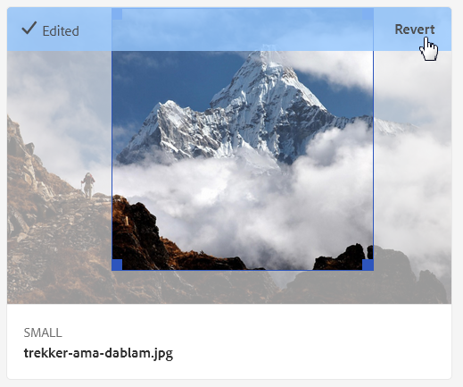

# Dynamic Media 图像配置文件 {#image-profiles}

上传图像时，您可以通过将图像配置文件应用到文件夹，在上传时自动裁剪图像。

>[!IMPORTANT]
>
>图像配置文件不适用于PDF、GIF动画或INDD(Adobe InDesign)文件。

## 裁切选项 {#crop-options}

<!-- CQDOC-16069 for the paragraph directly below -->

智能裁切坐标取决于宽高比。 对于图像配置文件中的智能裁剪设置，如果图像配置文件中添加的维度的宽高比相同，则会将相同的宽高比发送到Dynamic Media。 Adobe建议您使用相同的裁剪区域。 这样做可确保对图像配置文件中使用的不同维度不会产生任何影响。

您创建的每个智能裁剪生成都需要额外的处理。 例如，添加五个以上智能裁剪长宽比会导致资产摄取速度缓慢。 它还可能增加系统的负载。 由于您可以在文件夹级别应用智能裁剪，因此Adobe建议您在需要智能裁剪的文件夹&#x200B;*仅*&#x200B;上使用智能裁剪。

您有两个图像裁剪选项可供您选择。 您还可以选择自动创建颜色和图像色板。

<table>
 <tbody>
  <tr>
   <td><strong>选项</strong></td>
   <td><strong>何时使用</strong></td>
   <td><strong>描述</strong></td>
  </tr>
  <tr>
   <td>像素裁剪</td>
   <td>仅基于维度批量裁剪图像。</td>
   <td>
要使用此选项，请从“裁剪选项”下拉列表中选择<strong>像素裁剪</strong> 。
 
要从图像的侧边进行裁剪，请输入要从图像的任一侧边或各个侧边裁剪的像素数。裁剪的图像多少取决于图像文件中的 ppi（每英寸像素数）设置。
 
图像配置文件像素裁剪以下方式呈现：  

    <ul>
     <li>值包括“顶部”、“底部”、“左”和“右”。</li>
     <li>左上角被视为0,0，并且从此处计算像素裁剪。</li>
     <li>裁剪起点：左为X，上为Y</li>
     <li>水平计算：原始图像的水平像素大小减去“左”，然后减去“右”。</li>
     <li>垂直计算：垂直像素高度减去“顶部”，然后减去“底部”。</li>
    </ul> 
例如，假定您的图像为4000 x 3000像素。 您使用以下值：顶=250，底=500，左=300，右=700。
 
从左上角(300,250)使用填充空间(4000-300-700、3000-250-500或3000,2250)进行裁剪。
 </td>
  </tr>
  <tr>
   <td>智能裁剪</td>
   <td>根据图像的可视焦点批量裁剪图像。</td>
   <td>
Smart Crop利用Adobe Sensei中人工智能的强大功能，快速批量自动裁剪图像。 智能裁剪可自动检测并裁剪到任何图像中的焦点以获取预期的目标点，而不管屏幕大小。
 
要使用智能裁剪，请从“裁剪选项”下拉列表中选择<strong>智能裁剪</strong>，然后在响应式图像裁剪的右侧启用（打开）该功能。
 
默认的断点大小（大、中、小）涵盖大多数图像在移动和平板电脑设备、台式机和横幅上使用的所有大小。 如果需要，您可以编辑默认名称“大”、“中”和“小”。
 
要添加更多断点，请选择<strong>添加裁剪</strong>;要删除裁剪，请选择垃圾箱图标。
 </td>
  </tr>
  <tr>
   <td>颜色和图像样本</td>
   <td>批量会为每个图像生成一个图像样本。</td>
   <td>
<strong>注意</strong>:Dynamic Media Classic不支持智能色板。
 
自动从显示颜色或纹理的产品图像中定位并生成高质量样本。
 
要使用颜色和图像色板，请从“裁剪选项”下拉列表中选择<strong>智能裁剪</strong>。 然后在“颜色”和“图像色板”的右侧，启用（打开）该功能。 在“宽度”和“高度”文本框中输入像素值。
 
虽然所有图像裁剪都可以从演绎版边栏中获取，但样本仅通过复制URL功能来使用。 使用您自己的查看组件在网站上渲染色板。 此规则的例外是传送横幅。 Dynamic Media为轮播横幅中使用的色板提供查看组件。
 
<strong>使用图像色板</strong>
 
图像样本的URL非常简单：
 
<code>/is/image/company/&lt;asset_name&gt;:Swatch</code>
 
其中， <code>:Swatch</code>会附加到资产请求中。
 
<strong>使用颜色色板</strong>
 
要使用颜色色板，请发出<code>req=userdata</code>请求，其中包含以下内容：
 
<code>/is/image/&lt;company_name&gt;/&lt;swatch_asset_name&gt;:Swatch?req=userdata</code>
 
例如，以下是Dynamic Media Classic中的样本资产：
 
<code>https://my.company.com:8080/is/image/DemoCo/Sleek:Swatch</code>
 
以下是色板资产对应的<code>req=userdata</code> URL:
 
<code>https://my.company.com:8080/is/image/DemoCo/Sleek:Swatch?req=userdata</code>
 
<code>req=userdata</code>响应如下所示：
 
<code class="code">SmartCropDef=Swatch
       SmartCropHeight=200.0
       SmartCropRect=0.421671,0.389815,0.0848564,0.0592593,200,200
       SmartCropType=Swatch
       SmartCropWidth=200.0
       SmartSwatchColor=0xA56DB2</code>
 
您还可以请求XML或JSON格式的<code>req=userdata</code>响应，如以下各个URL示例所示：
 
<code>https://my.company.com:8080/is/image/DemoCo/Sleek:Swatch?req=userdata,xml</code>

<code>SmartSwatchColor</code>

</td></tr></tbody></table>

## USM 锐化 {#unsharp-mask}

使用&#x200B;**[!UICONTROL 钝化蒙版]**&#x200B;对最终取样缩小的图像微调锐化滤镜效果。您可以控制效果的强度、效果的半径（以像素为单位）以及被忽略的对比度阈值。 此效果使用与 Adobe Photoshop 的“钝化蒙蔽”滤镜相同的选项。

>[!NOTE]
>
>USM锐化仅应用于PTIFF（金字塔tiff）中缩减采样率超过50%的缩小演绎版。 这意味着ptiff中最大大小的演绎版不会受到USM锐化的影响。 但是，大小较小的演绎版（如缩略图）会发生更改（并显示USM锐化）。

在&#x200B;**[!UICONTROL USM锐化]**&#x200B;中，您有以下筛选选项：

<table>
 <tbody>
  <tr>
   <td><strong>选项</strong></td>
   <td><strong>描述</strong></td>
  </tr>
  <tr>
   <td>数量</td>
   <td>控制应用于边缘像素的对比度量。 默认值为1.75。对于高分辨率图像，最高可将其增加到5。 可以考虑使用数量来衡量滤镜强度。范围为0-5。</td>
  </tr>
  <tr>
   <td>半径</td>
   <td>确定边缘像素周围影响锐化的像素数量。对于高分辨率图像，输入 1 到 2。低值仅锐化边缘像素；高值锐化较宽范围的像素。正确的值取决于图像大小。默认值为0.2。范围为0-250。</td>
  </tr>
  <tr>
   <td>阈值</td>
   <td>
确定在应用USM锐化滤镜时要忽略的对比度范围。换句话说，此选项确定锐化的像素与周围区域必须有多大的不同，才会被视为边缘像素并进行锐化。 为避免引入杂色，请尝试使用0到255之间的值。
 </td>
  </tr>
 </tbody>
</table>

有关“锐化”的信息，请参阅[锐化图像](/help/assets/dynamic-media/assets/sharpening_images.pdf)。

## 创建Dynamic Media图像配置文件 {#creating-image-profiles}

要为其他资产类型定义高级处理参数，请参阅[配置资产处理](config-dm.md#configuring-asset-processing)。

请参阅[关于Dynamic Media图像配置文件和视频配置文件](/help/assets/dynamic-media/about-image-video-profiles.md)。

另请参阅[组织数字资产以使用处理配置文件的最佳实践](/help/assets/organize-assets.md)。

**要创建Dynamic Media图像配置文件，请执行以下操作：**

1. 选择Adobe Experience Manager徽标，然后导航到&#x200B;**[!UICONTROL 工具]** > **[!UICONTROL Assets]** > **[!UICONTROL 图像配置文件]**。
1. 要添加图像配置文件，请选择&#x200B;**[!UICONTROL 创建]**。
1. 输入USM锐化、裁切或色板的配置文件名称和值，或同时输入两者。

   提示：使用特定于其预期目的的配置文件名称。 例如，假定您要创建仅生成色板的配置文件。 即，禁用（关闭）智能裁剪，启用（打开）颜色和图像色板。 在这些情况下，您可以使用配置文件名称“Smart Swatches”。

   另请参阅[智能裁切和智能色板选项](#crop-options)和[钝化蒙版](#unsharp-mask)。

   

1. 选择&#x200B;**[!UICONTROL 保存]**。此时新创建的配置文件会显示在可用配置文件列表中。

## 编辑或删除Dynamic Media图像配置文件 {#editing-or-deleting-image-profiles}

1. 选择Experience Manager徽标，然后导航到&#x200B;**[!UICONTROL 工具]** > **[!UICONTROL 资产]** > **[!UICONTROL 图像配置文件]**。
1. 选择要编辑或删除的图像配置文件。要编辑配置文件，请选择&#x200B;**[!UICONTROL 编辑图像处理配置文件]**。 要删除该配置文件，请选择&#x200B;**[!UICONTROL 删除图像处理配置文件]**。

   

1. 如果是进行编辑操作，请保存更改。如果是进行删除操作，请确认您要删除配置文件。

## 将Dynamic Media图像配置文件应用到文件夹 {#applying-an-image-profile-to-folders}

当您将图像配置文件分配给文件夹后，该文件夹中的所有子文件夹都会自动继承父文件夹的配置文件。 因此，您只能为一个文件夹分配一个图像配置文件。 因此，您在上传、存储、使用资产以及将资产存档的过程中，请妥善安排文件夹结构。

如果您为文件夹分配了其他图像配置文件，则新配置文件会覆盖之前的配置文件。以前存在的文件夹资产将保持不变。新配置文件会应用于稍后添加到文件夹的资产。

用户界面中会指示为其分配了配置文件的文件夹，卡片中会显示配置文件的名称。

<!-- When you add smart crop to an existing Image Profile, you need to re-trigger the [DAM Update Asset workflow](assets-workflow.md) if you want to generate crops for existing assets in your asset repository. -->

您可以将图像配置文件应用到特定文件夹或全局应用到所有资产。

您可以重新处理文件夹中的资产，该文件夹中已有您稍后更改的图像配置文件。 请参阅[编辑文件夹中的处理配置文件](/help/assets/dynamic-media/about-image-video-profiles.md#reprocessing-assets)后，重新处理该文件夹中的资产。

### 将Dynamic Media图像配置文件应用到特定文件夹 {#applying-image-profiles-to-specific-folders}

您可以从&#x200B;**[!UICONTROL 工具]**&#x200B;菜单中将图像配置文件应用到文件夹，或者如果您在文件夹中，也可以从&#x200B;**[!UICONTROL 属性]**&#x200B;将图像配置文件应用到文件夹。

如果文件夹已经分配了配置文件，则文件夹名称正下方会显示配置文件的名称。

您可以重新处理文件夹中已有视频配置文件且稍后进行了更改的资产。 请参阅[编辑文件夹中的处理配置文件](/help/assets/dynamic-media/about-image-video-profiles.md#reprocessing-assets)后，重新处理该文件夹中的资产。

#### 将Dynamic Media图像配置文件从配置文件用户界面应用到文件夹 {#applying-image-profiles-to-folders-from-profiles-user-interface}

1. 选择Experience Manager徽标，然后导航到&#x200B;**[!UICONTROL 工具]** > **[!UICONTROL 资产]** > **[!UICONTROL 图像配置文件]**。
1. 选择要应用于一个或多个文件夹的图像配置文件。

   

1. 选择&#x200B;**[!UICONTROL 将处理配置文件应用到文件夹]**，然后选择一个或多个用于接收新上传资产的文件夹，然后选择&#x200B;**[!UICONTROL 应用]**。 如果文件夹已经分配了配置文件，则文件夹名称正下方会显示配置文件的名称。

#### 将Dynamic Media图像配置文件从属性应用到文件夹 {#applying-image-profiles-to-folders-from-properties}

1. 点按Experience Manager徽标，然后导航到&#x200B;**[!UICONTROL Assets]**。
1. 导航到要将图像配置文件应用到的&#x200B;*文件夹*（不是资产）。
1. 根据您所在的视图，执行以下操作之一：
   * 在“卡片视图”中，将指针悬停在文件夹上，然后选择复选标记以将其选中。
   * 在列视图或列表视图中，选中文件夹名称左侧的复选框。
1. 在工具栏中，选择&#x200B;**[!UICONTROL 属性]**。
1. 选择&#x200B;**[!UICONTROL Dynamic Media处理]**&#x200B;选项卡。
1. 在&#x200B;**[!UICONTROL 图像配置文件]**&#x200B;下，从&#x200B;**[!UICONTROL 配置文件名称]**&#x200B;下拉列表中，选择要应用的配置文件。
1. 在页面的右上角附近，选择&#x200B;**[!UICONTROL 保存并关闭]**。 如果文件夹已经分配了配置文件，则文件夹名称正下方会显示配置文件的名称。

   

### 全局应用Dynamic Media图像配置文件 {#applying-an-image-profile-globally}

除了将配置文件应用到文件夹之外，您还可以全局应用一个配置文件。 任何文件夹中上传到Experience Manager资产中的任何内容都会应用选定的配置文件。

您可以重新处理文件夹中已有视频配置文件且稍后进行了更改的资产。 请参阅[编辑文件夹中的处理配置文件](/help/assets/dynamic-media/about-image-video-profiles.md#reprocessing-assets)后，重新处理该文件夹中的资产。

**要全局应用Dynamic Media图像配置文件，请执行以下操作：**

1. 执行下列操作之一：

   * 导航到`https://&lt;AEM server&gt;/mnt/overlay/dam/gui/content/assets/foldersharewizard.html/content/dam`并应用相应的配置文件，然后选择&#x200B;**[!UICONTROL Save]**。

      

   * 导航到CRXDE Lite到以下节点：`/content/dam/jcr:content`。

      添加属性`imageProfile:/conf/global/settings/dam/adminui-extension/imageprofile/<name of image profile>`并选择&#x200B;**[!UICONTROL Save All]**。

      

## 编辑单个图像的智能裁剪或智能色板 {#editing-the-smart-crop-or-smart-swatch-of-a-single-image}

您可以手动重新调整图像的智能裁剪窗口大小或调整其大小，以进一步优化其焦点。

编辑智能裁剪并保存后，所做的更改会传播到您对特定图像使用裁剪的所有位置。

如有必要，您可以重新运行智能裁剪以再次生成其他裁剪。

另请参阅[编辑多个图像的智能裁剪或智能色板](#editing-the-smart-crop-or-smart-swatch-of-multiple-images)。

**要编辑单个图像的智能裁切或智能色板，请执行以下操作：**

1. 选择Experience Manager徽标，然后导航到&#x200B;**[!UICONTROL Assets]**，然后导航到应用了智能裁剪或智能色板图像配置文件的文件夹。
1. 要打开其内容，请选择文件夹。
1. 选择要调整其智能裁剪或智能色板的图像。
1. 在工具栏中，选择&#x200B;**[!UICONTROL 智能裁剪]**。

1. 执行以下操作之一：

   * 在页面的右上角附近，向左或向右拖动滑块条以分别增加或减少图像显示。
   * 在图像上，拖动角手柄以调整裁剪或色板可查看区域的大小。
   * 在图像上，将框/色板拖到新位置。 您只能编辑图像色板；颜色色板是静态的。
   * 在图像上方，选择&#x200B;**[!UICONTROL Revert]**&#x200B;以撤消所有编辑并恢复原始裁剪或色板。
   * 使用键盘箭头键裁剪帧大小，或调整图像位置，或者同时调整两者。

1. 在页面的右上角附近，选择&#x200B;**[!UICONTROL 保存]**，然后选择&#x200B;**[!UICONTROL 关闭]**&#x200B;以返回到资产文件夹。

## 编辑多幅图像的智能裁切或智能色板 {#editing-the-smart-crop-or-smart-swatch-of-multiple-images}

将包含智能裁剪的图像配置文件应用到文件夹后，该文件夹中的所有图像都会对其应用裁剪。 如果需要，您可以&#x200B;*手动*&#x200B;重新调整多个图像中智能裁剪窗口的对齐或大小，以进一步优化其焦点。

编辑智能裁剪并保存后，所做的更改会传播到您对特定图像使用裁剪的所有位置。

如有必要，您可以重新运行智能裁剪以再次生成其他裁剪。

**要编辑多幅图像的智能裁切或智能色板，请执行以下操作：**

1. 选择Experience Manager徽标，然后导航到&#x200B;**[!UICONTROL Assets]**，然后导航到应用了智能裁剪或智能色板图像配置文件的文件夹。
1. 在文件夹中，选择&#x200B;**[!UICONTROL 更多操作]**(...)图标，然后选择&#x200B;**[!UICONTROL 智能裁剪]**。

1. 在&#x200B;**[!UICONTROL 编辑智能裁剪]**&#x200B;页面上，执行以下任一操作：

   * 调整页面上图像的查看大小。

      在断点名称下拉列表的右侧，向左或向右拖动滑块以更改可查看图像显示的大小。

      

   * 根据断点名称过滤可查看图像的列表。 在以下示例中，图像是在断点名称“Medium”上过滤的。

      在页面的右上角附近，从下拉列表中，选择一个断点名称以过滤您看到的图像。 （请参阅上图。）

      

   * 调整智能裁剪框的大小。 执行以下任一操作：

      * 如果图像仅具有智能裁剪或智能色板，请在图像上拖动裁剪框的角手柄。 调整裁剪可查看区域的大小。
      * 如果图像同时具有智能裁切和智能色板，请在图像上拖动裁剪框的角手柄。 调整裁剪可查看区域的大小。 或者，选择图像下方的智能色板（颜色色板为静态色板），然后拖动裁剪框的角手柄。 调整样本可查看区域的大小。

      。

   * 移动智能裁剪框。 执行以下任一操作：

      * 如果图像仅具有智能裁剪或智能色板，则在图像上将裁剪框拖到新位置。
      * 如果图像同时具有智能裁切和智能色板，则在图像上，将智能裁切框拖到新位置。 或者，选择图像下方的智能色板（颜色色板为静态色板），然后将智能色板裁剪框拖到新位置。

      

   * 撤消所有编辑并恢复原始智能裁剪或智能色板（仅适用于当前编辑会话）。

      选择图像上方的&#x200B;**[!UICONTROL 还原]**。

      

1. 在页面的右上角附近，选择&#x200B;**[!UICONTROL 保存]**，然后选择&#x200B;**[!UICONTROL 关闭]**&#x200B;以返回到资产文件夹。

## 将图像配置文件从文件夹删除 {#removing-an-image-profile-from-folders}

当您将图像配置文件从文件夹删除后，该文件夹中的所有子文件夹都会自动删除从父文件夹继承的配置文件。但是，对文件夹中已发生的文件的任何处理均将保持不变。

您可以从&#x200B;**[!UICONTROL 工具]**&#x200B;菜单的文件夹中删除图像配置文件，或者如果您在文件夹中，也可以从&#x200B;**[!UICONTROL 属性]**&#x200B;中删除。

### 通过Profiles用户界面将Dynamic Media图像配置文件从文件夹删除 {#removing-image-profiles-from-folders-via-profiles-user-interface}

1. 选择Experience Manager徽标，然后导航到&#x200B;**[!UICONTROL 工具]** > **[!UICONTROL 资产]** > **[!UICONTROL 图像配置文件]**。
1. 选择要从一个或多个文件夹中删除的图像配置文件。
1. 选择&#x200B;**[!UICONTROL 从文件夹删除处理配置文件]**，然后选择一个或多个要从中删除配置文件的文件夹，然后选择&#x200B;**[!UICONTROL 删除]**。

   您可以确认图像配置文件不再应用于文件夹，因为文件夹名称的下方不再显示该名称。

### 通过属性将Dynamic Media图像配置文件从文件夹删除 {#removing-image-profiles-from-folders-via-properties}

1. 选择Experience Manager徽标，然后导航&#x200B;**[!UICONTROL Assets]**，然后导航到您要从中删除图像配置文件的文件夹。
1. 在文件夹中，选择复选标记以进行选择，然后选择&#x200B;**[!UICONTROL 属性]**。
1. 选择&#x200B;**[!UICONTROL 图像配置文件]**&#x200B;选项卡。
1. 从&#x200B;**[!UICONTROL 配置文件名称]**&#x200B;下拉列表中，选择&#x200B;**[!UICONTROL 无]**，然后选择&#x200B;**[!UICONTROL 保存并关闭]**。

   如果文件夹已经分配了配置文件，则文件夹名称正下方会显示配置文件的名称。
