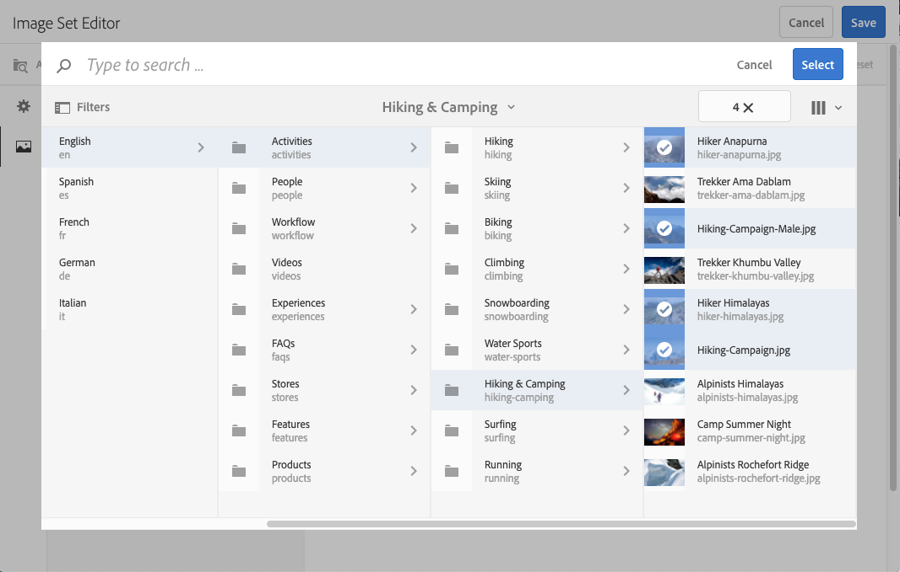

# 图像集 {#image-sets}

图像集为用户提供了集成的查看体验，用户可通过单击缩略图图像来查看项目的不同视图。 图像集允许您展示项目的替代视图，查看器提供了缩放工具来仔细检查图像。

图像集由带有单词的横幅来指定 `IMAGESET`。 此外，如果图像集已发布，则横幅上会显示发布日期（由&#x200B;**[!UICONTROL World]**&#x200B;图标指示）。 此外，还会显示由&#x200B;**[!UICONTROL 铅笔]**&#x200B;图标指示的上次修改日期。

在该图像集中，您还可以通过创建图像集并添加缩略图来创建色板。

当您希望以不同的颜色、图案或成品显示项目时，此应用程序非常有用。 要创建包含色板的图像集，您需要为要呈现给用户的每种颜色、图案或完成创建一个图像。 您还需要为每个颜色、图案或光洁度使用一个颜色、图案或光洁度色板。

例如，假设您要用不同的颜色清单显示大写字母的图像；这些清单为红色、绿色和蓝色。 这种情况下，你需要同一顶帽子打三针。 你需要一个红色的，一个绿色的，一个蓝色的。 您还需要红色、绿色和蓝色色板。 颜色样本用作缩略图，用户单击样本集查看器可看到红色计费、绿色计费或蓝色计费次数上限。

>[!NOTE]
>
>有关Assets用户界面的信息，请参阅[使用Touch UI管理资源](/help/assets/manage-digital-assets.md)。

在创建图像集时，Adobe建议以下最佳实践并强制实施以下限制：

| 限制类型 | 最佳实践 | 施加的限制 |
| --- | --- | --- |
| 每集的重复资产数 | 无重复项 | 20 |
| 每组的最大图像数 | 每组5至10个图像 | 1000 |

另请参阅[Dynamic Media限制](/help/assets/dynamic-media/limitations.md)。

## 快速入门：图像集 {#quick-start-image-sets}

要让您快速启动并运行，请执行以下操作：

1. 可选。 [创建批次集预设](/help/assets/dynamic-media/batch-set-presets-dm.md)，并将其应用到旋转集图像已上传的新文件夹。

   批次集预设可以帮助您自动创建图像集。

   >[!IMPORTANT]
   >
   >批量集由IPS（图像生产系统）作为资产引入的一部分创建。

1. [上载多个视图的主源图像](#uploading-assets-in-image-sets)。

   上载图像集的图像。 请记住，用户可以在图像集查看器中缩放图像。 因此，请仔细选择您的图像。 确保图像的最大大小至少为2000像素。

   有关图像集支持的格式列表，请参阅[Dynamic Media — 支持的栅格图像格式](/help/assets/file-format-support.md#image-support-dynamic-media)。

1. [创建图像集](#creating-image-sets)。

   在图像集中，用户在图像集查看器中单击缩略图图像。

   要在Assets中创建图像集，请选择&#x200B;**[!UICONTROL 创建]** > **[!UICONTROL 图像集]**。 然后，添加图像并单击&#x200B;**[!UICONTROL 保存]**。

   请参阅[准备图像集资源以上传和上传文件](#uploading-assets-in-image-sets)。

   请参阅[使用选择器](/help/assets/dynamic-media/working-with-selectors.md)。

1. 根据需要添加[图像集查看器预设](/help/assets/dynamic-media/managing-viewer-presets.md)。

   管理员可以创建或修改图像集查看器预设。 要查看带有查看器预设的图像集，请选择该图像集，然后在左边栏下拉列表中选择&#x200B;**[!UICONTROL 查看器]**。

   要创建或编辑查看器预设，请参阅&#x200B;**[!UICONTROL 工具]** > **[!UICONTROL Assets]** > **[!UICONTROL 查看器预设]**。

1. （可选） [查看使用批次集预设创建的图像集](/help/assets/dynamic-media/image-sets.md#viewing-image-sets)。
1. [预览图像集](/help/assets/dynamic-media/previewing-assets.md)。

   选择图像集并预览。 要在选定的查看器中检查图像集，请选择缩略图图标。 您可以从左边栏下拉列表中的&#x200B;**[!UICONTROL 查看器]**&#x200B;菜单中选择不同的查看器。

1. [Publish图像集](/help/assets/dynamic-media/publishing-dynamicmedia-assets.md)。

   发布图像集将激活URL和嵌入字符串。 此外，您必须[发布已创建的任何自定义查看器预设](/help/assets/dynamic-media/managing-viewer-presets.md)。 现成的查看器预设已发布。

1. [将URL链接到您的Web应用程序](/help/assets/dynamic-media/linking-urls-to-yourwebapplication.md)或[嵌入视频查看器或图像查看器](/help/assets/dynamic-media/embed-code.md)。

   Experience Manager Assets为图像集创建URL调用，并在您发布图像集后激活它们。 您可以在预览资产时复制这些URL。 或者，您也可以将它们嵌入到您的网站上。

   选择图像集，然后在左边栏下拉列表中选择&#x200B;**[!UICONTROL 查看器]**。

   请参阅[将图像集链接到网页](/help/assets/dynamic-media/linking-urls-to-yourwebapplication.md)和[嵌入视频查看器或图像查看器](/help/assets/dynamic-media/embed-code.md)。

要编辑图像集，请参阅[编辑图像集](#editing-image-sets)。 此外，您还可以查看和编辑[图像集属性](/help/assets/manage-digital-assets.md#editing-properties)。

如果您在创建集时遇到问题，请参阅[Dynamic Media疑难解答](/help/assets/dynamic-media/troubleshoot-dm.md#images-and-sets)中的图像和集。

## 上传图像集的资产 {#uploading-assets-in-image-sets}

首先，上传图像集的图像资产。 请记住，用户可以在图像集查看器中缩放图像。 因此，请仔细选择您的图像。 确保图像的最大大小至少为2000像素，以获得最佳的缩放详细信息。 Dynamic Media可渲染每个图像高达2500万像素。 例如，您可以使用5000x5000兆像素的图像或任何其他大小组合，最大可达2500兆像素。

<!-- Image Sets supports many image file formats, but lossless TIFF, PNG, and EPS images are recommended. -->

有关图像集支持的格式列表，请参阅[Dynamic Media — 支持的栅格图像格式](/help/assets/file-format-support.md#image-support-dynamic-media)。

您可以像在Assets](/help/assets/manage-digital-assets.md#uploading-assets)中[上传任何其他资源一样上传图像集的图像。

### 准备图像集资源以供上传 {#preparing-image-set-assets-for-upload}

在创建图像集之前，请确保图像的大小和格式正确。

要创建多视图图像集，您需要从不同视点显示项目或显示同一项目的不同方面的图像。 目标是突出显示项目的重要功能，以便查看者能够全面了解项目的显示方式或用途。

由于用户可以缩放图像集中的图像，因此请确保图像的最大大小至少为2000像素。 Experience Manager Assets支持多种图像文件格式，但建议使用无损TIFF、PNG和EPS图像。

>[!NOTE]
>
>如果使用缩略图指示产品色板，请执行以下操作：
>
>创建同一图像的晕影或不同快照，以不同的颜色、图案或光洁度显示图像。 您还需要与不同的颜色、图案或完成相对应的缩略图文件。 例如，要呈现缩览图，其中图像集以黑色、棕色和绿色显示同一夹克，您需要：
>
>* 同一件夹克的黑色、棕色和绿色照片。
>* 黑色、棕色和绿色的缩略图。

## 创建图像集 {#creating-image-sets}

您可以通过用户界面或API创建图像集。

>[!NOTE]
>
>您还可以通过[批次集预设](/help/assets/dynamic-media/batch-set-presets-dm.md)自动创建图像集。
>**重要信息：**&#x200B;批次集由IPS（图像生产系统）作为资产引入的一部分创建。

将资源添加到集时，会自动按字母数字顺序添加资源。 添加资源后，您可以手动对资源重新排序或排序。

>[!NOTE]
>
>文件名中带有“，”（逗号）的资源不支持图像集。

在创建图像集时，Adobe建议以下最佳实践并强制实施以下限制：

| 限制类型 | 最佳实践 | 施加的限制 |
| --- | --- | --- |
| 每集的重复资产数 | 无重复项 | 20 |
| 每组的最大图像数 | 每组5至10个图像 | 1000 |

另请参阅[Dynamic Media限制](/help/assets/dynamic-media/limitations.md)。

**创建图像集：**

1. 在Adobe Experience Manager中，选择Experience Manager徽标以访问全局导航控制台。
1. 选择&#x200B;**[!UICONTROL 导航]** > **[!UICONTROL Assets]**。 导航到要创建图像集的位置，然后转到&#x200B;**[!UICONTROL 创建]** > **[!UICONTROL 图像集]**&#x200B;以打开“图像集编辑器”页。

   您还可以从包含资产的文件夹中创建集。

   

1. 在“图像集编辑器”页面的&#x200B;**[!UICONTROL 标题]**&#x200B;字段中，输入图像集的名称。 该名称将显示在图像集的横幅中。 （可选）输入说明。

   

1. 执行以下任一操作：

   * 在“图像集编辑器”页面的左上角附近，选择&#x200B;**[!UICONTROL 添加资产]**。

   * 在“图像集编辑器”页面中间附近，选择&#x200B;**[!UICONTROL 点按以打开资产选择器]**。

   选择以选择要包含在图像集中的资源。 选定资源上有一个复选标记图标。 完成后，在页面的右上角附近，选择&#x200B;**[!UICONTROL 选择]**。

   使用资产选择器，您可以通过键入关键字并选择&#x200B;**[!UICONTROL 返回]**&#x200B;来搜索资产。 您还可以应用过滤器来优化搜索结果。您可以按路径、收藏集、文件类型和标记进行过滤。选择筛选器，然后在工具栏中选择&#x200B;**[!UICONTROL 筛选器]**&#x200B;图标。 通过选择“视图”图标并选择&#x200B;**[!UICONTROL 列视图]**、**[!UICONTROL 卡片视图]**&#x200B;或&#x200B;**[!UICONTROL 列表视图]**&#x200B;来更改视图。

   请参阅[使用选择器](/help/assets/dynamic-media/working-with-selectors.md)。

   

1. 将资源添加到集时，会自动按字母数字顺序添加资源。 添加资源后，您可以手动对资源重新排序或排序。

   如有必要，请将资源的“重新排序”图标拖动到资源文件名的右侧，以将图像在集列表中上下重新排序。

   

   如果要更改缩略图或色板，请单击图像旁的 **+** **缩略图**&#x200B;图标，然后导航到所需的缩略图或色板。选择完所有图像后，单击&#x200B;**[!UICONTROL 保存]**。

1. （可选）执行以下任一操作：

   * 要删除图像，请选择该图像，然后选择&#x200B;**[!UICONTROL 删除资产]**。

   * 要应用预设，请选择页面右上角附近的&#x200B;**[!UICONTROL 预设]**，然后选择要应用于所有资产的预设。

   >[!NOTE]
   >
   >创建图像集时，可以更改图像集缩略图。 或者，您可以让Experience Manager根据图像集中的资源自动选择缩略图。 要选择缩略图，请选择“图像集编辑器”页面上“标题”字段上方的&#x200B;**[!UICONTROL 更改缩略图]**。 然后，选择任意图像（您也可以导航到其他文件夹以查找图像）。 如果您选择了缩略图，然后决定希望Experience Manager从图像集生成缩略图，请选择&#x200B;**[!UICONTROL 切换到]** **[!UICONTROL 自动缩略图]**。

1. 单击&#x200B;**[!UICONTROL 保存]**。您创建的图像集会显示在您创建该图像集的文件夹中。

## 查看图像集 {#viewing-image-sets}

您可以在用户界面中创建图像集，也可以使用[批次集预设](/help/assets/dynamic-media/batch-set-presets-dm.md)自动创建图像集。

>[!IMPORTANT]
>
>批处理集由IPS [Image Production System]作为资产引入的一部分创建。

但是，使用批次集预设创建的集&#x200B;*不*&#x200B;会出现在用户界面中。 您可以通过三种不同的方式查看这些集合。 （即使您在用户界面中创建了图像集，这些方法也可用）。

* 打开资源的属性。 属性指明所选资产被引用或作为成员的设置。 要查看整个集，请选择集名称。

  

* 来自任何集的成员图像。选择&#x200B;**[!UICONTROL 集]**&#x200B;菜单以显示资产所属的集。

  

* 从搜索中，您可以选择&#x200B;**[!UICONTROL 筛选器]**，然后展开&#x200B;**[!UICONTROL Dynamic Media]**&#x200B;并选择&#x200B;**[!UICONTROL 集]**。

  搜索会返回在UI中手动创建或通过批次集预设自动创建的匹配集。 对于自动化集，搜索查询使用“开头为”执行。 此搜索条件与基于使用“包含”的Experience Manager条件不同。 将筛选器设置为&#x200B;**[!UICONTROL 集]**&#x200B;是搜索自动集的唯一方法。

  

>[!NOTE]
>
>您可以通过[编辑图像集](#editing-image-sets)中所述的用户界面查看图像集。

## 编辑图像集 {#editing-image-sets}

您可以对图像集执行各种编辑任务，如下所示：

* 将图像添加到图像集。
* 对图像集中的图像重新排序。
* 删除图像集中的资源。
* 应用查看器预设。
* 删除图像集。

**要编辑图像集：**

1. 执行以下任一操作：

   * 将鼠标悬停在图像集资源上，然后选择&#x200B;**[!UICONTROL 编辑]**（铅笔图标）。
   * 将鼠标悬停在图像集资源上，选择&#x200B;**[!UICONTROL 选择]**（复选标记图标），然后在工具栏中选择&#x200B;**[!UICONTROL 编辑]**。
   * 在图像集资源上选择，然后在工具栏中选择&#x200B;**[!UICONTROL 编辑]**（铅笔图标）。

1. 要编辑图像集中的图像，请执行下列任一操作：

   * 要重新排序资产，请将图像拖动到新位置（选择重新排序图标以移动项目）。
   * 要按升序或降序对项目排序，请单击列标题。
   * 要添加资源或更新现有资源，请单击&#x200B;**[!UICONTROL 添加资源]**。 导航到某个资源，选择该资源，然后选择页面右上角附近的&#x200B;**[!UICONTROL 选择]**。
     >[!NOTE]
     >
     >如果通过将Experience Manager用于缩略图的图像替换为其他图像来删除该图像，则仍会显示原始资源。
   * 要删除资源，请选择该资源并选择&#x200B;**[!UICONTROL 删除资源]**。
   * 要应用预设，请选择页面右上角附近的&#x200B;**[!UICONTROL 预设]**，然后选择查看器预设。
   * 要添加或更改缩略图，请选择资源右侧的缩略图图标。 导航到新的缩略图或样本资源，选择它，然后选择&#x200B;**[!UICONTROL 选择]**。
   * 要删除整个图像集，请导航到该图像集，选择它，然后选择&#x200B;**[!UICONTROL 删除]**。

   >[!NOTE]
   >
   >您可以编辑图像集中的图像。 导航到该集，然后在左边栏中选择&#x200B;**[!UICONTROL 设置成员]**。 要打开编辑窗口，请选择资产上的铅笔图标。

1. 完成编辑后，选择&#x200B;**[!UICONTROL 保存]**。

## 预览图像集 {#previewing-image-sets}

请参阅[预览资源](/help/assets/dynamic-media/previewing-assets.md)。

## 发布图像集 {#publishing-image-sets}

请参阅[Publish Assets](/help/assets/dynamic-media/publishing-dynamicmedia-assets.md)。
