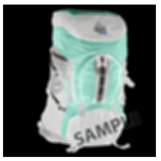

# 管理图像预设{#managing-image-presets}

图像预设使Adobe Experience Manager Assets能够动态地交付不同大小、不同格式的图像，或交付使用动态生成的其他图像属性的图像。 每个图像预设表示用于显示图像的预定义的调整大小和格式命令集合。 创建图像预设时，可以选择图像投放的大小。 您还可以选择格式设置命令，以便在交付图像以进行查看时优化图像的外观。

管理员可以创建用于导出资产的预设。 用户可以在导出图像时选择预设，这样还可以按照管理员指定的规范重新格式化图像。

您还可以创建响应式图像预设。 如果将响应式图像预设应用于资源，则这些资源会根据查看它们的设备或屏幕大小而发生更改。 可将图像预设配置为除RGB或灰度之外在色彩空间中使用CMYK。

本节介绍如何创建、修改和一般管理图像预设。 无论您何时预览图像，都可以将图像预设应用于图像。 请参阅[应用图像预设](/help/assets/dynamic-media/image-presets.md)。

>[!NOTE]
>
>智能成像可与您现有的图像预设配合使用，并在交付的最后毫秒内使用智能功能，以根据浏览器或网络连接速度进一步减小图像文件大小。 有关详细信息，请参阅[智能成像](/help/assets/dynamic-media/imaging-faq.md)。

## 了解图像预设 {#understanding-image-presets}

像宏一样，图像预设是预先定义的名称下保存的大小和格式命令集合。 要了解图像预设的工作方式，请假设您的网站要求每个产品图像以不同的大小、不同的格式和压缩率显示，以实现桌面和移动设备交付。

您可以创建两个图像预设：500 x 500像素用于桌面，150 x 150像素用于移动设备。 您创建了两个图像预设，一个名为`Enlarge`，用于以500x500像素显示图像，另一个名为`Thumbnail`，用于以150 x 150像素显示图像。 为了投放大小为`Enlarge`和`Thumbnail`的图像，Experience Manager查找`Enlarge Image Preset`和`Thumbnail Image Preset`的定义。 然后，Experience Manager会根据每个图像预设的大小和格式规范动态生成图像。

动态交付图像时尺寸减小的图像可能会失去锐利度和细节。 因此，每个图像预设都包含格式控制，用于在以特定大小交付图像时优化图像。 这些控件可确保图像在传送到您的网站或应用程序时锐利而清晰。

管理员可以创建图像预设。 要创建图像预设，可以从头开始，也可以从现有图像预设开始，然后以新名称保存。

## 管理图像预设 {#managing-image-presets-1}

您可以通过选择Experience Manager徽标访问全局导航控制台，然后选择“工具”图标并导航到&#x200B;**[!UICONTROL Assets]** > **[!UICONTROL 图像预设]**，来管理Experience Manager中的图像预设。


>[!NOTE]
>
>在预览或交付资产时，您创建的任何图像预设也可用作动态演绎版。
>
>您&#x200B;*不*&#x200B;需要发布图像预设，因为图像预设会自动发布。
>
>请参阅[发布图像预设](#publishing-image-presets)。

>[!NOTE]
>
>当您在资产的详细信息视图中选择&#x200B;**[!UICONTROL 呈现版本]**&#x200B;时，系统会显示各种呈现版本。 您可以增加或减少显示的图像预设数。 请参阅[增加显示的图像预设数](#increasing-or-decreasing-the-number-of-image-presets-that-display)。

## 图像预设与演绎版的关系 {#how-image-presets-relate-to-renditions}

图像预设定义Dynamic Media交付图像的方式，包括大小、格式、压缩和其他显示参数。 预设本身不会生成节目。 相反，它们依赖在处理资源时创建的演绎版。

### AEM as a Cloud Service中的演绎版生成{#rendition-generation-in-aemaacs}

在AEM as a Cloud Service中，使用[资源微服务](https://experienceleague.adobe.com/en/docs/experience-manager-cloud-service/content/assets/manage/asset-microservices-configure-and-use#)生成节目。 DAM更新资产工作流无法在Cloud Service中进行自定义。

重要注意事项包括：

* 在上载时生成演绎版。
* 对处理配置文件的更改会影响新上传的资产。 如果需要新演绎版，则必须重新处理现有资源。
* AEM as a Cloud Service不支持自定义工作流模型以生成演绎版。

图像预设在投放时引用可用演绎版。 在配置或使用图像预设之前，请确保存在所需的演绎版。

**若要控制生成哪些演绎版：**

1. 创建或编辑[处理配置文件](https://experienceleague.adobe.com/en/docs/experience-manager-cloud-service/content/assets/manage/asset-microservices-configure-and-use#)。
2. 配置所需的演绎版定义。
3. 将处理配置文件应用到相应的文件夹。

将资源上传到应用了处理配置文件的文件夹时，资源微服务会自动生成定义的演绎版。

<!--
### Adobe Illustrator (AI), PostScript&reg; (EPS), and PDF file formats {#adobe-illustrator-ai-postscript-eps-and-pdf-file-formats}

If you intend to support the ingestion of AI, EPS, and PDF files so that you can generate dynamic renditions of these file formats, review the following information before you create Image Presets.

Adobe Illustrator's file format is a variant of PDF. The main differences, in the context of Experience Manager Assets, are the following:

* Adobe Illustrator documents consist of a single page with multiple layers. Each layer is extracted as a PNG subasset under the main Illustrator asset.
* PDF documents consist of one or more pages. Each page is extracted as a single page PDF subasset under the main multi-page PDF document.

The `Create Sub Asset process` component creates the subassets within the overall `DAM Update Asset` workflow. To see this process component within the workflow, navigate to **[!UICONTROL Tools]** > **[!UICONTROL Workflow]** > **[!UICONTROL Models]** > **[!UICONTROL DAM Update Asset]** > **[!UICONTROL Edit]**.

See also [Viewing pages of a multi-page file](/help/assets/manage-linked-subassets.md#view-pages-of-a-multi-page-file).

You can view the subassets or the pages when you open the asset, select the Content menu, and select **[!UICONTROL Subassets]** or **[!UICONTROL Pages]**. The subassets are real assets. The `Create Sub Asset` workflow component extracts the PDF pages. They are then stored as `page1.pdf`, `page2.pdf`, and so on, below the main asset. After they are stored, the `DAM Update Asset` workflow processes them.

To use Dynamic Media to preview and generate dynamic renditions for AI, EPS or PDF files, the following processing steps are required:

1. In the `DAM Update Asset` workflow, the `Rasterize PDF/AI Image Preview Rendition` process component rasterizes the first page of the original asset &ndash; using the configured resolution &ndash; into a `cqdam.preview.png` rendition.

1. The `Dynamic Media Process Image Assets` process component within the workflow optimizes the `cqdam.preview.png` rendition into a PTIFF.

>[!NOTE]
>
>In the DAM Update Asset workflow, the **[!UICONTROL EPS thumbnails]** step generates thumbnails for EPS files.

#### PDF/AI/EPS asset metadata properties {#pdf-ai-eps-asset-metadata-properties}

| **Metadata property** |**Description** |
|---|---|
| `dam:Physicalwidthininches` |Document width in inches. |
| `dam:Physicalheightininches` |Document height in inches. |

You access `Rasterize PDF/AI Image Preview Rendition` process component options by way of the `DAM Update Asset` workflow.

Select Adobe Experience Manager in the upper left, the click **[!UICONTROL Tools]** > **[!UICONTROL Workflow]** > **[!UICONTROL Models]**. On the Workflow Models page, select **[!UICONTROL DAM Update Asset]**, then on the toolbar select **[!UICONTROL Edit]**. On the DAM Update Asset workflow page, double-select the `Rasterize PDF/AI Image Preview Rendition` process component to open its Step Properties dialog box.

#### Rasterize PDF/AI Image Preview Rendition options {#rasterize-pdf-ai-image-preview-rendition-options}


Arguments to rasterize PDF or AI workflow

|Process Argument | Default setting | Description |
|---|---|---|
| Mime Types | application/pdf<br>application/postscript<br>application/illustrator| List of document mime-types that are considered to be PDF or Illustrator documents. |
| Max Width | 2048 | Maximum width of the generated preview rendition, in pixels.|
| Max Height | 2048| Maximum height of the generated preview rendition, in pixels. |
| Resolution | 72 | Resolution to rasterize the first page, in ppi (pixels per inch). |

Using the default process arguments, the first page of a PDF/AI document is rasterized at 72 ppi and the generated preview image is sized at 2048 x 2048 pixels. For a typical deployment, you can increase the resolution to a minimum of 150 ppi or more. For example, a US letter size document at 300 ppi requires a maximum width and height of 2550 x 3300 pixels, respectively.

Max Width and Max Height limit the resolution at which to rasterize. For example, if the maximums are unchanged, and Resolution is set to 300 ppi, a US Letter document is rasterized at 186 ppi. That is, the document is 1581 x 2046 pixels.

The `Rasterize PDF/AI Image Preview Rendition` process component has a maximum defined to ensure that it does not create overly large images in memory. Such large images can overflow the memory provided to the JVM (Java&trade; Virtual Machine). Care must be taken to provide the JVM with enough memory to manage the configured number of parallel workflows, with each having the potential to create an image at the maximum configured size. -->

<!--
### InDesign (INDD) file format {#indesign-indd-file-format}

If you intend to support the ingestion of INDD files so that you can generate dynamic rendition of this file format, review the following information before you create Image Presets.

For InDesign files, sub assets are extracted only if the Adobe InDesign Server is integrated with Experience Manager. Referenced assets are linked based on their metadata. InDesign Server is not required for linking. However, the referenced assets must be present within Experience Manager before the InDesign files are processed for the links to be created between the InDesign files and the referenced assets.

See [Integrate Experience Manager Assets with InDesign Server](/help/assets/indesign.md).

The Media Extraction process component in the `DAM Update Asset` workflow runs several pre-configured Extend Scripts to process InDesign files.


The ExtendScript paths in the arguments of the Media Extraction process component in the DAM Update Asset workflow.

The following scripts are used by Dynamic Media integration:


|ExtendScript name | Default | Description |
|---|---|---|
| ThumbnailExport.jsx | Yes  | Generates a 300 PPI `thumbnail.jpg` rendition that is optimized and turned into a PTIFF rendition by `Dynamic Media Process Image Assets` process component.  |
| JPEGPagesExport.jsx | Yes | Generates a 300 PPI JPEG subasset for each page. The JPEG subasset is a real asset stored under the InDesign asset. The `DAM Update Asset` workflow optimizes and converts it into a PTIFF. |
| PDFPagesExport.jsx | No | Generates a PDF subasset for each page. The PDF subasset gets processed as described earlier. Because the PDF contains a single page only, no subassets are generated. |
-->

<!--
### Configure the image thumbnail size {#configuring-image-thumbnail-size}

You can configure the size of thumbnails by configuring those settings in the **[!UICONTROL DAM Update Asset]** workflow. There are two steps in the workflow where you can configure the thumbnail size of image assets. One (**[!UICONTROL Dynamic Media Process Image Assets]**) is used for dynamic image assets. The other (**[!UICONTROL Process Thumbnails]**) is used for static thumbnail generation or when all other processes fail to generate thumbnails. Regardless, *both* must have the same settings.

The **[!UICONTROL Dynamic Media Process Image Assets]** step uses the image server to generate thumbnails, independently of the configuration applied to the **[!UICONTROL Process Thumbnails]** step. Generating thumbnails through the **[!UICONTROL Process Thumbnails]** step is the slowest and most memory intensive way to create thumbnails.

Thumbnail sizing is defined in the following format: **[!UICONTROL width:height:center]**, for example, `80:80:false`. The width and height determine the size in pixels of the thumbnail. The center value is either false or true. If set to true, it indicates that the thumbnail image has exactly the size given in the configuration. If the resized image is smaller, it is centered within the thumbnail.

>[!NOTE]
>
>* Thumbnail sizes for EPS files are configured in the **[!UICONTROL EPS thumbnails]** step, in the **[!UICONTROL Arguments]** tab under Thumbnails.
>
>* Thumbnail sizes for videos are configured in the **[!UICONTROL FFmpeg thumbnails]** step, in the **[!UICONTROL Process]** tab under **[!UICONTROL Arguments]**.
>

**To configure the image thumbnail size:**

1. Navigate to **[!UICONTROL Tools]** > **[!UICONTROL Workflow]** > **[!UICONTROL Models]** > **[!UICONTROL DAM Update Asset]** > **[!UICONTROL Edit]**.
1. Select the **[!UICONTROL Dynamic Media Process Image Assets]** step and select the **[!UICONTROL Thumbnails]** tab. Change the thumbnail size, as needed, then select **[!UICONTROL OK]**.

   

1. Select the **[!UICONTROL Process Thumbnails]** step, then select the **[!UICONTROL Thumbnails]** tab. Change the thumbnail size, as needed, then select **[!UICONTROL OK]**.

   >[!NOTE]
   >
   >The values in the thumbnails argument in the **[!UICONTROL Process Thumbnails]** step must match the thumbnails argument in the **[!UICONTROL Dynamic Media Process Image Assets]** step.

1. Select **[!UICONTROL Save]** to save the changes to the workflow.
-->

### 增加或减少显示的图像预设数 {#increasing-or-decreasing-the-number-of-image-presets-that-display}

在预览资产时，您创建的图像预设可用作动态演绎版。 从&#x200B;**[!UICONTROL 详细信息视图>呈现版本]**&#x200B;查看资源时，Experience Manager会显示各种动态呈现版本。 您可以增加或减少显示的演绎版限制。

**增加或减少显示的图像预设数：**

1. 导航到CRXDE Lite ([https://localhost:4502/crx/de](https://localhost:4502/crx/de))。
1. 导航到`/libs/dam/gui/coral/content/commons/sidepanels/imagepresetsdetail/imgagepresetslist`上的图像预设列表节点

   

1. 在 **[!UICONTROL limit]** 属性中，将默认设 **[!UICONTROL 置为15的Value]**（值）更改为所需的数字。
1. 导航到`/libs/dam/gui/coral/content/commons/sidepanels/imagepresetsdetail/imgagepresetslist/datasource`处的图像预设数据源

   

1. 在limit属性中，将数字更改为所需的数字，例如`{empty requestPathInfo.selectors[1] ? "20" : requestPathInfo.selectors[1]}`
1. 选择&#x200B;**[!UICONTROL 全部保存]**。

### 创建图像预设 {#creating-image-presets}

创建图像预设，以便在预览或发布图像时以一致的方式应用设置。

>[!NOTE]
>
>如果使用Internet Explorer 9，则在保存预设后，创建预设不会立即显示在预设列表中。 要解决此问题，请禁用IE9的缓存。

如果您打算支持AI、PDF和EPS文件的摄取，以便生成这些文件格式的动态演绎版，请在创建图像预设之前查看以下信息。

请参阅[Adobe Illustrator (AI)、PostScript® (EPS)和PDF文件格式](#adobe-illustrator-ai-postscript-eps-and-pdf-file-formats)。

如果要支持INDD文件的摄取，以便生成此文件格式的动态演绎版，请在创建图像预设之前查看以下信息。

请参阅[InDesign (INDD)文件格式](#indesign-indd-file-format)。

**创建图像预设：**

1. 在Experience Manager中，选择Experience Manager徽标以访问全局导航控制台，然后转到&#x200B;**[!UICONTROL 工具]** > **[!UICONTROL Assets]** > **[!UICONTROL 图像预设]**。
1. 选择&#x200B;**[!UICONTROL 创建]**。

   

   >[!NOTE]
   >
   >若要使此图像预设具有响应性，请擦除&#x200B;**[!UICONTROL 宽度]**&#x200B;和&#x200B;**[!UICONTROL 高度]**&#x200B;字段中的值，并将其留空。

1. 在&#x200B;**[!UICONTROL 编辑图像预设]**&#x200B;窗口中，根据需要在&#x200B;**[!UICONTROL 基本]**&#x200B;和&#x200B;**[!UICONTROL 高级]**&#x200B;选项卡中输入值，包括名称。 图像预设选项中概 [述了这些选项](#image-preset-options)。 预设显示在左窗格中，并可以与其他资产一起动态使用。

   

1. 选择&#x200B;**[!UICONTROL 保存]**。

### 创建响应式图像预设 {#creating-a-responsive-image-preset}

要创建响应式图像预设，请执行[创建图像预设](#creating-image-presets)中的步骤。 在&#x200B;**[!UICONTROL 编辑图像预设]**&#x200B;窗口中输入高度和宽度时，请擦除值并将其留空。

将其保留为空将告知Experience Manager此图像预设可响应。 您可以根据需要调整其他值。

>[!NOTE]
>
>要在将图像预设应用于资产时查看&#x200B;**[!UICONTROL URL]**&#x200B;和&#x200B;**[!UICONTROL RESS]**&#x200B;按钮，必须发布资产。
>
>
>
>图像预设和图像资产会自动发布。

### 图像预设选项 {#image-preset-options}

创建或编辑图像预设时，您具有本节中介绍的选项。 此外，Adobe建议从以下“最佳实践”选项开始：

* **[!UICONTROL 格式]** （**[!UICONTROL 基本]**&#x200B;选项卡） — 选择&#x200B;**[!UICONTROL JPEG]**&#x200B;或其他符合您要求的格式。 所有 Web 浏览器都支持 JPEG 图像格式；它可以在小文件大小和图像质量之间实现良好的平衡。但是，JPEG 格式图像使用有损压缩方案，如果压缩设置太低，则会引入不需要的图像伪影。因此，Adobe 建议将压缩质量设置为 75。此设置在图像质量和小文件大小之间提供了良好的平衡。

* **[!UICONTROL 启用简单锐化]** - 请勿选择&#x200B;**[!UICONTROL 启用简单锐化]**（此锐化滤镜提供的控制度低于“钝化蒙版”设置）。

* **[!UICONTROL 锐化：重新取样模式]** — 选择&#x200B;**[!UICONTROL 锐化2]**。

#### 基本选项卡选项 {#basic-tab-options}

| 字段 | 描述 |
| --- | --- |
| **名称** | 请输入一个描述性名称，且不含任何空格。 为帮助用户识别此图像预设，请在名称中包含图像大小规范。 |
| **宽度和高度** | 输入交付图像的像素大小。 宽度和高度必须大于0像素。 如果任一值为0，则不会创建预设。 如果两个值都为空，则会创建响应式图像预设。 |
| **格式** | 从菜单中选择一种格式。<br>选择&#x200B;**JPEG**&#x200B;可提供以下其他选项：<br>· **质量** - JPEG质量范围为1-100。 拖动滑块时，比例可见。<br>· **启用JPG色度缩减像素采样** — 由于眼睛对高频颜色信息的敏感性低于高频亮度，因此JPEG图像将图像信息划分为亮度和颜色分量。 当JPEG图像被压缩时，亮度分量以全分辨率保留，而颜色分量通过平均像素组而被缩减采样。 缩减取样会将数据量减少到一半或三分之一，而且对感知质量的影响最小。 缩减像素取样不适用于灰度图像。 此技术可减少可用于高对比度（例如，具有叠加文本的图像）的压缩量。<br><br>选择&#x200B;**GIF**&#x200B;或&#x200B;**带有Alpha的GIF**&#x200B;可提供这些额外的&#x200B;**GIF颜色量化**&#x200B;选项：<br>· **类型** — 选择&#x200B;**自适应**（默认值）、**Web**&#x200B;或&#x200B;**Macintosh**。 如果选择&#x200B;**GIF与Alpha**，则Macintosh选项不可用。<br>· **Dither** — 选择&#x200B;**扩散**&#x200B;或&#x200B;**关闭**。<br>· **颜色数** — 输入数字2 - 256。<br>· **颜色列表** — 输入逗号分隔的列表。 例如，对于白色、灰色和黑色，输入`000000,888888,ffffff`。<br><br>选择&#x200B;**PDF**、**TIFF**&#x200B;或带有Alpha **的** TIFF提供了此附加选项：<br>· **压缩** — 选择压缩算法。 PDF的算法选项为&#x200B;**None**、**Zip**&#x200B;和&#x200B;**Jpeg**；对于TIFF，这些选项为&#x200B;**None**、**LZW**、**Jpeg**&#x200B;和&#x200B;**Zip**；对于TIFF和Alpha，这些选项为&#x200B;**None**、**LZW**&#x200B;和&#x200B;**Zip**。<br><br>选择&#x200B;**PNG**、Alpha的&#x200B;**PNG**&#x200B;或&#x200B;**EPS**&#x200B;不提供其他选项。 |
| **锐化** | 选择&#x200B;**启用简单锐化**&#x200B;可在执行所有缩放操作后将基本锐化滤镜应用于图像。 锐化有助于弥补在以不同大小显示图像时可能产生的模糊。 |

#### 高级选项卡选项 {#advanced-tab-options}

<table>
 <tbody>
  <tr>
   <td><strong>字段</strong></td>
   <td><strong>描述</strong></td>
  </tr>
  <tr>
   <td><strong>颜色空间</strong></td>
   <td>为色彩空间选择<strong>RGB、CMYK、</strong>或<strong>灰度</strong>。</td>
  </tr>
  <tr>
   <td><strong>颜色配置文件</strong></td>
   <td>如果资产与工作配置文件不同，请选择您希望将资产转换为的输出色彩空间配置文件。</td>
  </tr>
  <tr>
   <td><strong>渲染方法</strong></td>
   <td>可以覆盖默认的渲染方法。 渲染意图决定了在目标颜色配置文件（超出色域）中无法重现的颜色会发生什么情况。 如果渲染意图与ICC配置文件不兼容，则会将其忽略。
    <ul>
     <li>选择<strong>可感知</strong>可在原始图像中的一种或多种颜色超出目标颜色空间的色域时，将总色域从一个颜色空间压缩到另一个颜色空间。</li>
     <li>当当前颜色空间中的颜色超出目标颜色空间中的色域时，选择<strong>相对色度</strong>。 并且您希望将其映射到最接近的目标色域，而不更改其他颜色。 </li>
     <li>如果要在转换为目标色彩空间时重现原始图像色彩饱和度，请选择<strong>饱和度</strong>。 </li>
     <li>选择<strong>绝对色度</strong>以完全匹配颜色，而不调整会改变图像亮度的白点或黑点。</li>
    </ul> </td>
  </tr>
  <tr>
   <td><strong>黑场补偿</strong></td>
   <td>如果输出配置文件支持此功能，请选择此选项。 如果黑场补偿与指定的ICC配置文件不兼容，则忽略黑场补偿。</td>
  </tr>
  <tr>
   <td><strong>仿色</strong></td>
   <td>选择此选项可避免或减少可能出现的颜色分段伪像。 </td>
  </tr>
  <tr>
   <td><strong>锐化类型</strong></td>
   <td><p>选择<strong>无</strong>、<strong>锐化</strong>或<strong>钝化蒙版</strong>。 </p>
    <ul>
     <li>如果要禁用锐化，请选择<strong>无</strong>。</li>
     <li>选择<strong>锐化</strong>可在执行所有缩放操作后对图像应用基本锐化滤镜。 锐化有助于弥补在以不同大小显示图像时可能产生的模糊。 </li>
     <li>如果要对最终取样缩小的图像微调锐化滤镜效果，请选择<strong>钝化蒙版</strong>。 您可以控制效果的强度、效果的半径（以像素为单位）以及被忽略的对比度阈值。 此效果使用与Photoshop的“钝化蒙版”滤镜相同的选项。</li>
    </ul> <p>在<strong>USM锐化</strong>中，您可以选择以下选项：</p>
    <ul>
     <li><strong>数量</strong> — 控制应用于边缘像素的对比度。 缺省实数值为1.0。对于高分辨率图像，最高可将其增加到5.0。将“量”视为滤镜强度的度量。</li>
     <li><strong>半径</strong> — 确定边缘像素周围影响锐化的像素数。 对于高分辨率图像，请输入1到2之间的实数。 低值仅锐化边缘像素；高值锐化较宽范围的像素。 正确的值取决于图像的大小。</li>
     <li><strong>阈值</strong> — 确定在应用钝化蒙版滤镜时要忽略的对比度范围。 换言之，此选项定义锐化的像素与周围区域必须存在多大差异，才能被视为边缘像素并进行锐化。 为避免引入噪声，请尝试使用2到20之间的整数值。 </li>
     <li><strong>应用于</strong> — 确定取消锐化是应用于每种颜色还是亮度。</li>
    </ul>
    <div>
      中介绍了锐化
     <a href="https://experienceleague.adobe.com/en/docs/experience-manager-learn/assets/dynamic-media/images/dynamic-media-image-sharpening-feature-video-use#dynamic-media">在Experience Manager Dynamic Media中使用图像锐化</a>视频、<a href="https://experienceleague.adobe.com/en/docs/dynamic-media-classic/using/master-files/sharpening-image#master-files">锐化图像</a>联机帮助主题以及<a href="https://experienceleague.adobe.com/docs/dynamic-media-classic/assets/s7_sharpening_images.pdf">在Dynamic Media Classic中锐化图像的最佳实践</a>可下载的PDF。
    </div> </td>
  </tr>
  <tr>
   <td><strong>重新取样模式</strong></td>
   <td>选择<strong>重新取样模式</strong>选项。 在缩减图像取样时，以下选项会锐化图像：
    <ul>
     <li><strong>双线性</strong> — 最快速的重新取样方法。 会出现一些锯齿伪像。</li>
     <li><strong>两次立方</strong> — 增加CPU的使用，但生成较锐利的图像，出现的锯齿伪像较少。</li>
     <li><strong>锐化2</strong> — 可以生成比两次立方更锐利的结果，但成本更高CPU。</li>
     <li><strong>两次锐化</strong> — 为减小图像大小选择Photoshop默认重新取样器，在Adobe Photoshop中将其称为<strong>两次锐化</strong>。</li>
     <li><strong>每种颜色</strong>和<strong>亮度</strong> — 每种方法都可以基于颜色或亮度。 默认情况下，<strong>每个颜色</strong>都处于选中状态。</li>
    </ul> </td>
  </tr>
  <tr>
   <td><strong>打印分辨率</strong></td>
   <td>选择用于打印此图像的分辨率；默认值为72像素。</td>
  </tr>
  <tr>
   <td><strong>图像修饰符</strong></td>
   <td><p>除了UI中可用的常见图像设置之外，Dynamic Media还支持您可以在<strong>图像修饰符</strong>字段中指定的大量高级图像修改。 这些参数在<a href="https://experienceleague.adobe.com/en/docs/dynamic-media-developer-resources/image-serving-api/image-serving-api/http-protocol-reference/syntax-and-features/image-serving-http/c-command-overview">图像服务器协议命令引用</a>中定义。</p> <p>重要信息：不支持API中列出的以下功能：</p>
    <ul>
     <li>基本模板化和文本渲染命令： <code>text= textAngle= textAttr= textFlowPath= textFlowXPath= textPath=</code>和 <code>textPs=</code></li>
     <li>本地化命令： <code>locale=</code>和 <code>req=xlate</code></li>
     <li><code>req=set</code> 不可用于一般用途。</li>
     <li><code>req=mbrset</code></li>
     <li><code>req=saveToFile</code></li>
     <li><code>req=targets</code></li>
     <li><code>template=</code></li>
     <li>非核心Dynamic Media服务：SVG、图像渲染和Web到打印</li>
    </ul> </td>
  </tr>
 </tbody>
</table>

### 使用图像修饰符定义图像预设选项 {#defining-image-preset-options-with-image-modifiers}

除了“基本”和“高级”选项卡中可用的选项外，您还可以定义图像修饰符，以便在定义图像预设时为您提供更多选项。 图像渲染依赖于Dynamic Media图像渲染API，并在[HTTP协议引用](https://experienceleague.adobe.com/en/docs/dynamic-media-developer-resources/image-serving-api/image-rendering-api/http-protocol-reference/c-ir-introduction#image-rendering-api)中详细定义。

以下是一些使用图像修饰符可以执行操作的基本示例。

>[!NOTE]
>
>某些图像修饰符[不能在Experience Manager](#advanced-tab-options)中使用。

* [op_invert](https://experienceleague.adobe.com/en/docs/dynamic-media-developer-resources/image-serving-api/image-serving-api/http-protocol-reference/command-reference/r-op-invert) — 反转每个颜色组件以获得负图像效果。

  ```xml {.line-numbers}
  &op_invert=1
  ```

  

* [op_blur](https://experienceleague.adobe.com/en/docs/dynamic-media-developer-resources/image-serving-api/image-serving-api/http-protocol-reference/command-reference/r-op-blur) — 将模糊滤镜应用于图像。

  ```xml {.line-numbers}
  &op_blur=7
  ```

  

* 组合命令 — op_blur和反向转换

  ```xml {.line-numbers}
  &op_invert=1&op_blur=7
  ```

  

* [op_brightness](https://experienceleague.adobe.com/en/docs/dynamic-media-developer-resources/image-serving-api/image-serving-api/http-protocol-reference/command-reference/r-op-brightness) — 降低或增加亮度。

  ```xml {.line-numbers}
  &op_brightness=58
  ```

  

* [opac](https://experienceleague.adobe.com/en/docs/dynamic-media-developer-resources/image-serving-api/image-serving-api/http-protocol-reference/command-reference/r-opac) — 调整图像不透明度。 用于降低前景不透明度。

  ```xml {.line-numbers}
  opac=29
  ```

  

### 编辑图像预设 {#modifying-image-presets}

1. 在Experience Manager中，选择Experience Manager徽标以访问全局导航控制台，然后转到&#x200B;**[!UICONTROL 工具]** > **[!UICONTROL Assets]** > **[!UICONTROL 图像预设]**。

   

1. 选择预设，然后选择&#x200B;**[!UICONTROL 编辑]**。 将打开&#x200B;**[!UICONTROL 编辑图像预设]**&#x200B;窗口。
1. 进行更改并选择&#x200B;**[!UICONTROL 保存]**&#x200B;以保存您的更改，或选择&#x200B;**[!UICONTROL 取消]**&#x200B;以取消您的更改。

### 发布图像预设 {#publishing-image-presets}

系统会自动为您发布图像预设。

### 删除图像预设 {#deleting-image-presets}

1. 在Experience Manager中，选择Experience Manager徽标以访问全局导航控制台，然后选择工具图标。
1. 导航到&#x200B;**[!UICONTROL Assets]** > **[!UICONTROL 图像预设]**。
1. 选择预设，然后选择&#x200B;**[!UICONTROL 删除]**。 Dynamic Media会确认您要删除它。 选择&#x200B;**[!UICONTROL 删除]**&#x200B;以删除，或选择&#x200B;**[!UICONTROL 取消]**&#x200B;以返回图像预设。
