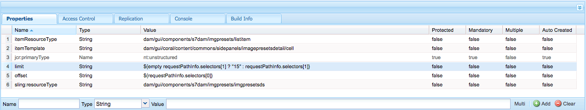

# 管理图像预设{#managing-image-presets}

图像预设使Adobe Experience Manager资产能够动态地传送不同大小、不同格式或具有动态生成的其他图像属性的图像。 每个图像预设都代表一组预定义的大小调整和格式设置命令，以用于显示图像。在创建图像预设时，您需要选择图像传送的大小。此外，还需要选择格式设置命令，以确保传送供查看的图像时，显示优化的图像外观。

管理员可以创建用于导出资产的预设。在导出图像时，用户可以选择预设，这也会按照管理员指定的规范重新设置图像的格式。

您还可以创建响应式图像预设。如果您将响应式图像预设应用到您的资产，则资产会根据查看资产时所使用的设备或屏幕大小而发生更改。 除了RGB或灰色之外，您还可以配置图像预设，以在色彩空间中使用CMYK。

本节介绍如何创建、修改图像预设，以及一般管理图像预设。 无论您何时预览图像，都可以对图像应用图像预设。请参阅[应用图像预设](/help/assets/dynamic-media/image-presets.md)。

>[!NOTE]
>
>智能成像功能可以与您现有的图像预设配合使用，并在投放的最后一毫秒使用智能功能根据浏览器或网络连接速度进一步减小图像文件大小。 有关详细信息，请参阅[智能成像](/help/assets/dynamic-media/imaging-faq.md)。

## 了解图像预设{#understanding-image-presets}

与宏一样，图像预设是一组预定义的大小调整和格式设置命令，这些命令使用同一个名称进行保存。为了了解图像预设的工作方式，假定您的网站要求每个产品图像在桌面和移动投放中以不同的大小、格式和压缩率显示。

您可以创建两种图像预设：一种是适用于桌面版本的 500 x 500 像素；一种是适用于移动版本的 150 x 150 像素。您可以创建两个图像预设，一个称为`Enlarge`，用于以500x500像素显示图像，另一个称为`Thumbnail`，用于以150 x 150像素显示图像。 要传送大小为`Enlarge`和`Thumbnail`的图像，Experience Manager会查找“大图预设”和“缩略图预设”的定义。 然后，Experience Manager会根据每个图像预设的大小和格式规范动态地生成图像。

如果图像在动态传送时大小大幅缩减，图像可能会丢失锐化和细节。由于这一原因，每个图像预设中都包含格式控制，以在传送图像时将其优化为特定大小。这些控制可确保图像在传送到网站或应用程序时具有锐化、清晰的效果。

管理员可以创建图像预设。要创建图像预设，您可以从头开始创建，也可以通过现有图像预设创建，然后使用新名称对其保存。

## 管理图像预设 {#managing-image-presets-1}

要以Experience Manager方式管理图像预设，请点按或单击Experience Manager徽标以访问全局导航控制台，然后点按或单击工具图标，然后导航到&#x200B;**[!UICONTROL 资产>图像预设]**。


>[!NOTE]
>
>在您预览或传送资产时，您创建的任何图像预设也可用作动态演绎版。
>
>您&#x200B;*不*&#x200B;需要在图像预设自动发布时发布图像预设。
>
>请参阅[发布图像预设。](#publishing-image-presets)

>[!NOTE]
>
>当您在资产的详细信息视图中选择&#x200B;**[!UICONTROL 演绎版]**&#x200B;时，系统会显示各种演绎版。 您可以增加或减少显示的图像预设数。 请参阅[增加显示](#increasing-or-decreasing-the-number-of-image-presets-that-display)的图像预设数。

### Adobe Illustrator(AI)、PostScript®(EPS)和PDF文件格式{#adobe-illustrator-ai-postscript-eps-and-pdf-file-formats}

如果您希望支持摄取AI、EPS和PDF文件，以便生成这些文件格式的动态演绎版，请在创建图像预设之前查看以下信息。

Adobe Illustrator的文件格式是PDF的变体。 在Experience Manager资产方面，主要区别如下：

* Adobe Illustrator文档由包含多个图层的单个页面组成。 每个图层都会作为PNG子资产提取到主Illustrator资产下。
* PDF文档由一个或多个页面组成。 每个页面都会在主多页PDF文档下提取为单页PDF子资产。

子资产由整个`DAM Update Asset`工作流中的`Create Sub Asset process`组件创建。 要在工作流中查看此流程组件，请点按&#x200B;**[!UICONTROL 工具>工作流>模型> DAM更新资产>编辑]**。

<!-- See also [Viewing pages of a multi-page file](/help/assets/manage-linked-subassets.md#view-pages-of-a-multi-page-file). -->

在打开资产时，您可以视图子资产或页面，点按内容菜单，然后选择&#x200B;**[!UICONTROL 子资产]**&#x200B;或&#x200B;**[!UICONTROL 页面]**。 子资产是真实资产。 即，PDF页面由`Create Sub Asset`工作流组件提取。 然后，它们会作为`page1.pdf`、`page2.pdf`等存储在主资产下方。 在存储它们后，`DAM Update Asset`工作流会处理它们。

要使用Dynamic Media来预览和生成AI、EPS或PDF文件的动态演绎版，需要执行以下处理步骤：

1. 在`DAM Update Asset`工作流中，`Rasterize PDF/AI Image Preview Rendition`进程组件使用配置的分辨率将原始资产的第一页栅格化为`cqdam.preview.png`格式副本。

1. 然后，工作流中的`Dynamic Media Process Image Assets`进程组件会将`cqdam.preview.png`再现优化为PTIFF。

>[!NOTE]
>
>在 DAM 更新资产工作流中，**[!UICONTROL EPS 缩略图]**&#x200B;步骤为 EPS 文件生成缩略图。

#### PDF/AI/EPS资产元数据属性{#pdf-ai-eps-asset-metadata-properties}

| **元数据属性** | **描述** |
|---|---|
| dam:Physicalwidthininch | 文档宽度（英寸）。 |
| dam：物理高度 | 文档高度（英寸）。 |

可通过`DAM Update Asset`工作流访问`Rasterize PDF/AI Image Preview Rendition`进程组件选项。

点按左上角的Adobe Experience Manager，导航到&#x200B;**[!UICONTROL 工具>工作流>模型]**。 在“工作流模型”页面上，选择&#x200B;**[!UICONTROL DAM更新资产]**，然后在工具栏中点按&#x200B;**[!UICONTROL 编辑]**。 在“DAM更新资产”工作流页面中，多次点按`Rasterize PDF/AI Image Preview Rendition`流程组件以打开其步骤属性对话框。

#### 栅格化PDF/AI图像预览再现选项{#rasterize-pdf-ai-image-preview-rendition-options}


用于栅格化PDF或AI工作流程的参数

<table>
 <tbody>
  <tr>
   <td><strong>进程参数</strong></td>
   <td><strong>默认设置</strong></td>
   <td><strong>描述</strong></td>
  </tr>
  <tr>
   <td>Mime 类型</td>
   <td><p>application/pdf</p> <p>application/postscript</p> <p>application/illustrator<br /> </p> </td>
   <td>列表被视为PDF或Illustrator文档的文档mime类型。<br /> </td>
  </tr>
  <tr>
   <td>最大宽度</td>
   <td>2048</td>
   <td>生成的预览再现的最大宽度（以像素为单位）。<br /> </td>
  </tr>
  <tr>
   <td>最大高度</td>
   <td>2048</td>
   <td>生成的预览再现的最大高度（以像素为单位）。<br /> </td>
  </tr>
  <tr>
   <td>分辨率</td>
   <td>72</td>
   <td>用于栅格化第一页的分辨率，以ppi为单位（每英寸像素数）。</td>
  </tr>
 </tbody>
</table>

使用默认处理参数，PDF/AI文档的第一页将栅格化为72 ppi，生成的预览图像的大小为2048 x 2048像素。 对于典型部署，您可以将分辨率提高到至少150 ppi或更高。 例如，300 ppi的美国字母大小文档要求最大宽度和高度分别为2550 x 3300像素。

“最大宽度”和“最大高度”限制栅格化的分辨率。 例如，如果最大值保持不变，而“分辨率”设置为300 ppi，则“美国字母文档”将栅格化为186 ppi。 即，文档为1581 x 2046像素。

`Rasterize PDF/AI Image Preview Rendition`进程组件已定义最大值，以确保它不会在内存中创建过大的映像。 这样的大映像可能会溢出提供给JVM（Java虚拟机）的内存。 必须注意向JVM提供足够的内存来管理已配置的并行工作流数，每个并行应用程序都有可能以最大配置大小创建映像。

### InDesign(INDD)文件格式{#indesign-indd-file-format}

如果您希望支持摄取INDD文件，以便生成此文件格式的动态演绎版，请在创建图像预设之前查看以下信息。

对于InDesign文件，仅当Adobe InDesign Server与Experience Manager集成时，才会提取子资源。 引用的资产会根据其元数据进行链接。 InDesign Server不是链接所必需的。 但是，在处理InDesign文件之前，Experience Manager中必须存在引用的资产，才能在InDesign文件与引用的资产之间创建链接。

<!-- See [Integrating Experience Manager Assets with InDesign Server](/help/assets/indesign.md). -->

`DAM Update Asset`工作流中的媒体提取进程组件运行多个预配置的扩展脚本以处理InDesign文件。


DAM更新资产工作流中媒体提取流程组件参数中的ExtendScript路径。

以下脚本由Dynamic Media集成使用：

<table>
 <tbody>
  <tr>
   <td><strong>ExtendScript</strong></td>
   <td><strong>默认</strong></td>
   <td><strong>描述</strong></td>
  </tr>
  <tr>
   <td>ThumbnailExport.jsx</td>
   <td>是</td>
   <td>生成300 ppi <code>thumbnail.jpg</code>再现，该再现经过优化并由<code>Dynamic Media Process Image Assets</code>进程组件转换为PTIFF再现。<br /> </td>
  </tr>
  <tr>
   <td>JPEGPagesExport.jsx</td>
   <td>是</td>
   <td>为每页生成一个300 ppi JPEG子资产。 JPEG子资产是存储在InDesign资产下的真实资产。 它还通过<code>DAM Update Asset</code>工作流优化并转换为PTIFF。<br /> </td>
  </tr>
  <tr>
   <td>PDFPagesExport.jsx</td>
   <td>否</td>
   <td>为每个页面生成一个PDF子资产。 PDF子资产会按如前所述进行处理。 由于PDF仅包含单页，因此不会生成子资产。<br /> </td>
  </tr>
 </tbody>
</table>

### 配置图像缩略图大小{#configuring-image-thumbnail-size}

您可以通过在&#x200B;**[!UICONTROL DAM更新资产]**&#x200B;工作流中配置这些设置来配置缩略图的大小。 在工作流中，您可以通过两个步骤配置图像资产的缩略图大小。 一个(**[!UICONTROL Dynamic Media处理图像资产]**)用于动态图像资产。 其他（**[!UICONTROL 处理缩略图]**）用于生成静态缩略图，或者当所有其他进程无法生成缩略图时。 无论如何，*两个*&#x200B;必须具有相同的设置。

在 **[!UICONTROL Dynamic Media 流程图像资产]**&#x200B;步骤中，缩略图由图像服务器生成，此配置与应用于&#x200B;**[!UICONTROL 流程缩略图]**&#x200B;步骤的配置无关。通过&#x200B;**[!UICONTROL 流程缩略图]**&#x200B;步骤生成缩略图是创建缩览图最耗时、内存占用最多的方法。

缩览图大小按以下格式定义：**[!UICONTROL width:height:center]**，例如&#x200B;*80:80:false*。 宽度和高度决定缩览图的大小（以像素为单位）。 中心值为false或true。 如果设置为true，则表示缩略图图像的大小与配置中指定的大小完全相同。 如果调整后的图像较小，则图像将居中在缩略图中。

>[!NOTE]
>
>* EPS文件的缩览图大小在“缩览图”下的&#x200B;**[!UICONTROL 参数]**&#x200B;选项卡的&#x200B;**[!UICONTROL EPS缩览图]**&#x200B;步骤中进行配置。
   >
   >
* 视频的缩略图大小在&#x200B;**[!UICONTROL FFmpeg缩略图]**&#x200B;步骤中的&#x200B;**[!UICONTROL 处理]**&#x200B;选项卡的&#x200B;**[!UICONTROL 参数]**&#x200B;中进行配置。

>


**配置图像缩略图大小**

1. 点按&#x200B;**[!UICONTROL 工具>工作流>模型> DAM更新资产>编辑]**。
1. 点按&#x200B;**[!UICONTROL Dynamic Media处理图像资产]**&#x200B;步骤，然后点按&#x200B;**[!UICONTROL 缩略图]**&#x200B;选项卡。 根据需要更改缩略图大小，然后点按&#x200B;**[!UICONTROL 确定]**。

   

1. 点按&#x200B;**[!UICONTROL 流程缩略图]**&#x200B;步骤，然后点按&#x200B;**[!UICONTROL 缩略图]**&#x200B;选项卡。根据需要更改缩略图大小，然后点按&#x200B;**[!UICONTROL 确定]**。

   >[!NOTE]
   >
   >**[!UICONTROL 流程缩略图]**&#x200B;步骤的缩略图参数中的值必须与 **[!UICONTROL Dynamic Media 流程图像资产]**&#x200B;步骤中的缩略图参数相匹配。

1. 点按&#x200B;**[!UICONTROL 保存]**&#x200B;以保存对工作流所做的更改。

### 增加或减少显示{#increasing-or-decreasing-the-number-of-image-presets-that-display}的图像预设数

在预览资产时，您创建的图像预设可以作为动态演绎版使用。 Experience Manager在从&#x200B;**[!UICONTROL 详细信息视图>演绎版]**&#x200B;查看资产时显示各种动态演绎版。 您可以增加或减少显示的演绎版限制。

**要增加或减少显示的图像预设数**:

1. 导航到CRXDE Lite([https://localhost:4502/crx/de](https://localhost:4502/crx/de))。
1. 导航到`/libs/dam/gui/coral/content/commons/sidepanels/imagepresetsdetail/imgagepresetslist`的图像预设列表节点

   

1. 在 **[!UICONTROL limit]** 属性中，将默认设 **[!UICONTROL 置为15的Value]**（值）更改为所需的数字。
1. 导航到位于`/libs/dam/gui/coral/content/commons/sidepanels/imagepresetsdetail/imgagepresetslist/datasource`的图像预设数据源

   

1. 在limit属性中，将数字更改为所需的数字，例如`{empty requestPathInfo.selectors[1] ? "20" : requestPathInfo.selectors[1]}`
1. 点按&#x200B;**[!UICONTROL 保存全部]**。

### 创建图像预设{#creating-image-presets}

通过创建图像预设，您可以在预览或发布图像时将这些设置应用到任何图像。

>[!NOTE]
>
>如果使用 Internet Explorer 9，创建的预设在保存后不会立即显示在预设列表中。要解决此问题，请禁用 IE9 的缓存。

如果您希望支持摄取AI、PDF和EPS文件，以便生成这些文件格式的动态演绎版，请在创建图像预设前查看以下信息。

请参阅[Adobe Illustrator(AI)、PostScript®(EPS)和PDF文件格式](#adobe-illustrator-ai-postscript-eps-and-pdf-file-formats)。

如果您希望支持摄取INDD文件，以便生成此文件格式的动态演绎版，请在创建图像预设之前查看以下信息。
请参阅[InDesign(INDD)文件格式](#indesign-indd-file-format)。

**要创建图像预设，请执行以下操作**:

1. 在Experience Manager中，点按Experience Manager徽标以访问全局导航控制台，然后点按&#x200B;**[!UICONTROL 工具>资产>图像预设]**。
1. 单击&#x200B;**[!UICONTROL 创建]**。此时将打开&#x200B;**[!UICONTROL 编辑图像预设]**&#x200B;窗口。

   

   >[!NOTE]
   >
   >要使此图像预设具有响应性，请擦除&#x200B;**[!UICONTROL 宽度]**&#x200B;和&#x200B;**[!UICONTROL 高度]**&#x200B;字段中的值，并将其留空。

1. 根据需要，在&#x200B;**[!UICONTROL 基本]**&#x200B;和&#x200B;**[!UICONTROL 高级]**&#x200B;选项卡中输入值，包括名称。图像预设选项中概 [述了这些选项](#image-preset-options)。 预设显示在左窗格中，并可以与其他资产一起动态使用。

   

1. 单击&#x200B;**[!UICONTROL 保存]**。

### 创建响应式图像预设{#creating-a-responsive-image-preset}

要创建响应式图像预设，请执行[创建图像预设](#creating-image-presets)中的步骤。在&#x200B;**[!UICONTROL 编辑图像预设]**&#x200B;窗口中输入高度和宽度时，请清除这两个字段的值，并将其保留为空。

将这些预设留空会告知Experience Manager此图像预设是响应式的。 您可以视需要调整其他值。

>[!NOTE]
>
>要在将图像 **[!UICONTROL 预设应用到资产时]** ，查看URL和 **** RESS按钮，必须发布资产。
>
>
>
>图像预设和图像资产会自动发布。

### 图像预设选项{#image-preset-options}

在创建或编辑图像预设时，您可以使用本节介绍的几种选项。此外，Adobe建议开始选择以下“最佳实践”选项：

* **[!UICONTROL 格式]** (基&#x200B;**** 本选项卡) — 选择 **** JPEG或其他符合您要求的格式。所有Web浏览器都支持JPEG图像格式；它可以在小文件大小和图像质量之间实现良好的平衡。但是，JPEG格式图像使用有损压缩方案，如果压缩设置太低，会引入不需要的图像伪像。因此，Adobe 建议将压缩质量设置为 75。此设置在图像质量和小文件大小之间提供了良好的平衡。

* **[!UICONTROL 启用简单锐化]** - 请勿选择&#x200B;**[!UICONTROL 启用简单锐化]**（此锐化滤镜提供的控制度低于“钝化蒙版”设置）。

* **[!UICONTROL 锐化：重新取样模]** 式 — 选 **[!UICONTROL 择“双三次]**”。

#### “基本”选项卡选项{#basic-tab-options}

<table>
 <tbody>
  <tr>
   <td><strong>字段</strong></td>
   <td><strong>描述</strong></td>
  </tr>
  <tr>
   <td><strong>名称</strong></td>
   <td>输入一个描述性名称，不加任何空格。要帮助用户识别此图像预设，请在名称中包含图像大小规范。</td>
  </tr>
  <tr>
   <td><strong>宽度和高度</strong></td>
   <td>输入传送图像时所用的像素大小。宽度和高度必须大于 0 像素。如果任一值为 0，则无法创建预设。如果两个值均为空，则表示已经创建了响应式图像预设。</td>
  </tr>
  <tr>
   <td><strong>格式</strong></td>
   <td><p>从菜单中选择一个格式。</p> <p>选择<strong>JPEG</strong>将优惠以下其他选项：</p>
    <ul>
     <li><strong>品质</strong>  — 控制JPEG压缩级别。此设置会影响文件大小和图像质量。JPEG质量比例为1-100。拖动滑块时，比例可见。</li>
     <li><strong>启用JPG色度缩减采样</strong>  — 由于眼睛对高频颜色信息的敏感度低于高频亮度，因此JPEG图像将图像信息分为明亮度和颜色分量。在压缩JPEG图像时，明亮度分量将保持全分辨率，而颜色分量则通过平均像素组来缩减像素采样。缩减像素采样可将数据量减少一半或三分之一，几乎不会影响感知质量。缩减像素采样不适用于灰度图像。此技术可减少对高对比度图像（例如，叠加有文本的图像）有用的压缩量。</li>
    </ul>
    <div>
      选择 <strong>GIF</strong> 或<strong>带有 Alpha 的 GIF</strong> 可提供以下更多 <strong>GIF 颜色量化</strong>选项：
    </div>
    <ul>
     <li><strong>类 </strong>型 — 选 <strong>择</strong> Adaptive <strong>（默认）、</strong>Web <strong></strong>或Macintosh。如果您选 <strong>择带有Alpha的GIF</strong>，则Macintosh选项不可用。</li>
     <li><strong>仿色</strong>  — 选择 <strong></strong> “扩散 <strong>”或“关</strong>”。</li>
     <li><strong>颜色数 </strong>量 — 输入一个介于2到256之间的数字。</li>
     <li><strong>颜色列表</strong> - 输入一个以逗号分隔的列表。例如，对于白色、灰色和黑色，输入 000000,888888,ffffff。</li>
    </ul>
    <div>
      选择 <strong>PDF</strong>、<strong>TIFF</strong> 或<strong>带有 Alpha 的 TIFF</strong> 可提供以下更多选项：
    </div>
    <ul>
     <li><strong>压缩</strong> - 选择一种压缩算法。“PDF”的算法选项有<strong>无</strong>、<strong>Zip</strong> 和 <strong>Jpeg</strong>；对于“TIFF”，压缩算法选项有<strong>无</strong>、<strong>LZW</strong>、<strong>Jpeg</strong> 和 <strong>Zip</strong>；对于“带有 Alpha 的 TIFF”，压缩算法选项有<strong>无</strong>、<strong>LZW</strong> 和 <strong>Zip</strong>。</li>
    </ul> <p>如果选择 <strong>PNG</strong>、<strong>带有 Alpha 的 PNG</strong>，或者选择 <strong>EPS</strong>，则不提供其他选项。</p> </td>
  </tr>
  <tr>
   <td><strong>锐化</strong></td>
   <td>选择<strong>启用简单锐化</strong>选项可在执行所有缩放操作后对图像应用基本锐化滤镜。锐化有助于弥补在以不同大小显示图像时可能产生的模糊。 </td>
  </tr>
 </tbody>
</table>

#### “高级”选项卡选项{#advanced-tab-options}

<table>
 <tbody>
  <tr>
   <td><strong>字段</strong></td>
   <td><strong>描述</strong></td>
  </tr>
  <tr>
   <td><strong>色彩空间</strong></td>
   <td>为色彩空间选择<strong>RGB、CMYK、</strong>或<strong>灰度</strong>。</td>
  </tr>
  <tr>
   <td><strong>颜色配置文件</strong></td>
   <td>如果资产与工作用户档案不同，请选择要将其转换为的输出色彩空间用户档案。</td>
  </tr>
  <tr>
   <td><strong>渲染方法</strong></td>
   <td>您可以覆盖默认的渲染方法。 渲染方法确定在目标颜色用户档案（溢色）中无法再现的颜色会发生什么情况。 如果“渲染方法”与ICC用户档案不兼容，则会忽略它。
    <ul>
     <li>选择<strong>“可感知</strong>”，当原始图像中的一个或多个颜色超出目标色彩空间的色域时，将一个色彩空间的总色域压缩到另一个色彩空间。</li>
     <li>当当前色彩空间中的颜色超出目标色彩空间中的色域时，选择“相对比色”<strong>。 </strong>并且，您希望将其映射到目标色彩空间色域内最接近的可能颜色，而不影响任何其他颜色。 </li>
     <li>选择<strong>饱和度</strong>以在转换为目标色彩空间时重现原始图像色彩饱和度。 </li>
     <li>选择<strong>绝对比色</strong>以完全匹配颜色，而不对会改变图像亮度的白点或黑点进行任何调整。</li>
    </ul> </td>
  </tr>
  <tr>
   <td><strong>黑场补偿</strong></td>
   <td>如果输出用户档案支持此功能，请选择此选项。 如果黑点补偿与指定的ICC用户档案不兼容，则忽略它。</td>
  </tr>
  <tr>
   <td><strong>仿色</strong></td>
   <td>选择此选项可避免或减少色带伪像。 </td>
  </tr>
  <tr>
   <td><strong>锐化类型</strong></td>
   <td><p>选择<strong>无</strong>、<strong>锐化</strong>或 <strong>USM 锐化</strong>。 </p>
    <ul>
     <li>选择<strong>无</strong>可禁用锐化。</li>
     <li>选择<strong>锐化</strong>可在执行所有缩放操作后对图像应用基本锐化滤镜。锐化有助于弥补在以不同大小显示图像时可能产生的模糊。 </li>
     <li>选择<strong> USM锐化</strong>可对最终的缩减采样图像微调锐化滤镜效果。 您可以控制效果的强度、效果的半径（以像素为单位）以及被忽略的对比度阈值。 此效果使用与 Photoshop 的“钝化蒙蔽”滤镜相同的选项。</li>
    </ul> <p>在 <strong>USM 锐化</strong>中，您可以设置以下选项：</p>
    <ul>
     <li><strong>数量</strong>  — 控制应用于边缘像素的对比度数量。默认的实数值为1.0。对于高分辨率图像，最高可将其增加到5.0。可以考虑使用“数量”来衡量滤镜强度。</li>
     <li><strong>半径</strong>  — 确定边缘像素周围影响锐化的像素数。对于高分辨率图像，输入一个介于1到2之间的实数。 低值仅锐化边缘像素；高值可锐化更宽范围的像素。 正确的值取决于图像大小。</li>
     <li><strong>阈值</strong>  — 确定应用USM锐化滤镜时要忽略的对比度范围。换句话说，此选项确定锐化的像素与周围区域必须有多大的不同，才能被视为边缘像素并进行锐化。要避免引入杂色，请尝试2到20之间的整数值。 </li>
     <li><strong>应用于</strong>  — 确定是否将取消锐化应用于每种颜色或亮度。</li>
    </ul>
    <div>
      有关锐化的说明，请参阅
     <a href="https://experienceleague.adobe.com/docs/experience-manager-learn/assets/dynamic-media/dynamic-media-image-sharpening-feature-video-use.html#dynamic-media">将图像锐化与Experience Manager Dynamic Media</a>视频结合使用，请参阅<a href="https://experienceleague.adobe.com/docs/dynamic-media-classic/using/master-files/sharpening-image.html#master-files">锐化图像</a>联机帮助主题和<a href="https://experienceleague.adobe.com/docs/dynamic-media-classic/assets/s7_sharpening_images.pdf">在Dynamic Media Classic</a>可下载PDF中锐化图像的最佳实践。
    </div> </td>
  </tr>
  <tr>
   <td><strong>重新取样模式</strong></td>
   <td>选择一个<strong>重新取样模式</strong>选项。在缩减像素采样时，这些选项会锐化图像：
    <ul>
     <li><strong>双线性</strong>  — 最快速的重新取样方法。会出现一些锯齿伪像。</li>
     <li><strong>两次立方</strong>  — 提高CPU使用率，但生成的图像更锐利，出现的锯齿伪像较少。</li>
     <li><strong>锐化2</strong>  — 可以生成比两次立方选项更锐利的结果，但CPU成本更高。</li>
     <li><strong>Bi-Sharp</strong>  — 选择Photoshop默认重新采样器以减小图像大小，称为双立 <strong>方</strong> 锐化Adobe Photoshop。</li>
     <li><strong>每种颜色</strong>和<strong>亮度</strong> - 每种方法均可基于颜色或亮度。默认情况下将选择<strong>每种颜色</strong>。</li>
    </ul> </td>
  </tr>
  <tr>
   <td><strong>打印分辨率</strong></td>
   <td>选择此图像的打印分辨率；默认值为 72 像素。</td>
  </tr>
  <tr>
   <td><strong>图像修饰符</strong></td>
   <td><p>除了UI中提供的常见图像设置之外，Dynamic Media还支持许多高级图像修改，您可以在<strong>图像修饰符</strong>字段中指定这些修改。 这些参数在<a href="https://experienceleague.adobe.com/docs/dynamic-media-developer-resources/image-serving-api/image-serving-api/http-protocol-reference/syntax-and-features/image-serving-http/c-command-overview.html">Image Server Protocol命令参考</a>中定义。</p> <p>重要说明：不支持API中列出的以下功能：</p>
    <ul>
     <li>基本模板和文本渲染命令：<code>text= textAngle= textAttr= textFlowPath= textFlowXPath= textPath=</code>和 <code>textPs=</code></li>
     <li>本地化命令：<code>locale=</code>和 <code>req=xlate</code></li>
     <li><code>req=set</code> 不可用于一般用途。</li>
     <li><code>req=mbrset</code></li>
     <li><code>req=saveToFile</code></li>
     <li><code>req=targets</code></li>
     <li><code>template=</code></li>
     <li>非核心Dynamic Media服务：SVG、图像渲染和Web到打印</li>
    </ul> </td>
  </tr>
 </tbody>
</table>

### 使用图像修饰符定义图像预设选项 {#defining-image-preset-options-with-image-modifiers}

除了“基本”和“高级”选项卡中提供的选项外，您还可以定义图像修饰符，以便在定义图像预设时有更多选择。图像渲染依赖于Dynamic Media图像渲染API，在[HTTP协议参考](https://experienceleague.adobe.com/docs/dynamic-media-developer-resources/image-serving-api/image-rendering-api/http-protocol-reference/c-ir-introduction.html#image-rendering-api)中有详细定义。

下面的一些基本示例显示了可以使用图像修饰符实现的操作。

>[!NOTE]
>
>某些图像修饰符[不能用于Experience Manager](#advanced-tab-options)。

* [op_invert](https://experienceleague.adobe.com/docs/dynamic-media-developer-resources/image-serving-api/image-serving-api/http-protocol-reference/command-reference/r-op-invert.html)  — 反转每个颜色分量以获得负图像效果。

   ```xml
   &op_invert=1
   ```

   

* [op_blur](https://experienceleague.adobe.com/docs/dynamic-media-developer-resources/image-serving-api/image-serving-api/http-protocol-reference/command-reference/r-op-blur.html) - 向图像应用模糊滤镜。

   ```xml
   &op_blur=7
   ```

   

* 组合命令 - op_blur 和 op-invert

   ```xml
   &op_invert=1&op_blur=7
   ```

   

* [op_brightness](https://experienceleague.adobe.com/docs/dynamic-media-developer-resources/image-serving-api/image-serving-api/http-protocol-reference/command-reference/r-op-brightness.html)  — 降低或增加亮度。

   ```xml
   &op_brightness=58
   ```

   

* [opac](https://experienceleague.adobe.com/docs/dynamic-media-developer-resources/image-serving-api/image-serving-api/http-protocol-reference/command-reference/r-opac.html) - 调整图像不透明度。可用于降低前景不透明度。

   ```xml
   opac=29
   ```

   

### 编辑图像预设{#modifying-image-presets}

1. 在Experience Manager中，点按Experience Manager徽标以访问全局导航控制台，然后点按&#x200B;**[!UICONTROL 工具>资产>图像预设]**。

   

1. 选择一个预设，然后单击&#x200B;**[!UICONTROL 编辑]**。将打开&#x200B;**[!UICONTROL 编辑图像预设]**&#x200B;窗口。
1. 进行更改，然后单击&#x200B;**[!UICONTROL 保存]**&#x200B;以保存更改，或单击&#x200B;**[!UICONTROL 取消]**&#x200B;以取消更改。

### 发布图像预设{#publishing-image-presets}

图像预设会自动为您发布。

### 删除图像预设 {#deleting-image-presets}

1. 在Experience Manager中，点按Experience Manager徽标以访问全局导航控制台，然后点按或单击工具图标，并导航到&#x200B;**[!UICONTROL 资产>图像预设]**。
1. 选择一个预设，然后单击&#x200B;**[!UICONTROL 删除]**。 Dynamic Media会向您确认是否要删除该组件。 点按&#x200B;**[!UICONTROL 删除]**&#x200B;可删除，或点按&#x200B;**[!UICONTROL 取消]**&#x200B;可中止删除。
