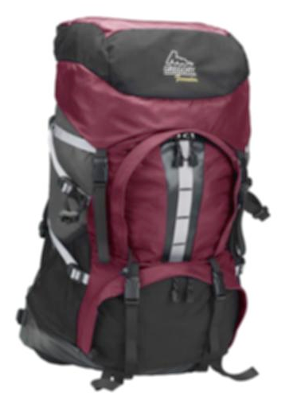

# 管理图像预设{#managing-image-presets}

图像预设使Adobe Experience Manager Assets能够动态地交付不同大小、不同格式的图像，或交付使用动态生成的其他图像属性的图像。 每个图像预设表示用于显示图像的预定义的调整大小和格式命令集合。 创建图像预设时，可以选择图像投放的大小。 您还可以选择格式设置命令，以便在交付图像以进行查看时优化图像的外观。

管理员可以创建用于导出资产的预设。 用户可以在导出图像时选择预设，这样还可以按照管理员指定的规范重新格式化图像。

您还可以创建响应式图像预设。 如果将响应式图像预设应用于资源，则这些资源会根据查看它们的设备或屏幕大小而发生更改。 可将图像预设配置为除RGB或灰色之外还可在色彩空间中使用CMYK。

本节介绍如何创建、修改和一般管理图像预设。 无论您何时预览图像，都可以将图像预设应用于图像。 请参阅[应用图像预设](/help/assets/dynamic-media/image-presets.md)。

>[!NOTE]
>
>智能成像可与您现有的图像预设配合使用，并在交付的最后毫秒内使用智能功能，以根据浏览器或网络连接速度进一步减小图像文件大小。 有关详细信息，请参阅[智能成像](/help/assets/dynamic-media/imaging-faq.md)。

## 了解图像预设 {#understanding-image-presets}

像宏一样，图像预设是预先定义的名称下保存的大小和格式命令集合。 要了解图像预设的工作方式，请假设您的网站要求每个产品图像以不同的大小、不同的格式和压缩率显示，以实现桌面和移动设备交付。

您可以创建两个图像预设：500 x 500像素用于桌面，150 x 150像素用于移动设备。 您创建了两个图像预设，一个名为`Enlarge`，用于以500x500像素显示图像，另一个名为`Thumbnail`，用于以150 x 150像素显示图像。 为了投放大小为`Enlarge`和`Thumbnail`的图像，Experience Manager查找`Enlarge Image Preset`和`Thumbnail Image Preset`的定义。 然后，Experience Manager根据每个图像预设的大小和格式规范动态生成图像。

动态交付图像时尺寸减小的图像可能会失去锐利度和细节。 因此，每个图像预设都包含格式控制，用于在以特定大小交付图像时优化图像。 这些控件可确保图像在传送到您的网站或应用程序时锐利而清晰。

管理员可以创建图像预设。 要创建图像预设，可以从头开始，也可以从现有图像预设开始，然后以新名称保存。

## 管理图像预设 {#managing-image-presets-1}

您可以通过选择Experience Manager徽标访问全局导航控制台，然后选择“工具”图标并导航到&#x200B;**[!UICONTROL Assets]** > **[!UICONTROL 图像预设]**，来管理Experience Manager的图像预设。


>[!NOTE]
>
>在预览或交付资产时，您创建的任何图像预设也可用作动态演绎版。
>
>您&#x200B;*不*&#x200B;需要发布图像预设，因为图像预设会自动发布。
>
>请参阅[Publish图像预设](#publishing-image-presets)。

>[!NOTE]
>
>当您在资产的详细信息视图中选择&#x200B;**[!UICONTROL 呈现版本]**&#x200B;时，系统会显示各种呈现版本。 您可以增加或减少显示的图像预设数。 请参阅[增加显示的图像预设数](#increasing-or-decreasing-the-number-of-image-presets-that-display)。

### Adobe Illustrator (AI)、PostScript®(EPS)和PDF文件格式 {#adobe-illustrator-ai-postscript-eps-and-pdf-file-formats}

如果您打算支持AI、EPS和PDF文件的摄取，以便生成这些文件格式的动态演绎版，请在创建图像预设之前查看以下信息。

Adobe Illustrator的文件格式是PDF的变体。 在Experience Manager Assets的上下文中，主要区别如下：

* Adobe Illustrator文档由具有多层的单个页面组成。 每个图层都提取为Illustrator主资源下的PNG子资源。
* PDF文档由一个或多个页面组成。 每个页面都提取为主多页PDFPDF文档下的单页文档子资产。

`Create Sub Asset process`组件在整个`DAM Update Asset`工作流中创建子资产。 要在工作流中查看此流程组件，请导航到&#x200B;**[!UICONTROL 工具]** > **[!UICONTROL 工作流]** > **[!UICONTROL 模型]** > **[!UICONTROL DAM更新资产]** > **[!UICONTROL 编辑]**。

<!-- See also [Viewing pages of a multi-page file](/help/assets/manage-linked-subassets.md#view-pages-of-a-multi-page-file). -->

打开资产时，您可以查看子资产或页面，选择“内容”菜单，然后选择&#x200B;**[!UICONTROL 子资产]**&#x200B;或&#x200B;**[!UICONTROL 页面]**。 子资产是真正的资产。 `Create Sub Asset`工作流组件提取PDF页。 然后，它们将存储为主资产下方的`page1.pdf`、`page2.pdf`等。 存储完它们后，`DAM Update Asset`工作流会处理它们。

要使用Dynamic Media预览和生成AI、EPS或PDF文件的动态演绎版，需要执行以下处理步骤：

1. 在`DAM Update Asset`工作流中，`Rasterize PDF/AI Image Preview Rendition`进程组件使用配置的分辨率将原始资源的第一页栅格化为`cqdam.preview.png`呈现版本。

1. 工作流中的`Dynamic Media Process Image Assets`进程组件将`cqdam.preview.png`演绎版优化为PTIFF。

>[!NOTE]
>
>在 DAM 更新资产工作流中，**[!UICONTROL EPS 缩略图]**&#x200B;步骤为 EPS 文件生成缩略图。

#### PDF/AI/EPS资源元数据属性 {#pdf-ai-eps-asset-metadata-properties}

| **元数据属性** | **描述** |
|---|---|
| `dam:Physicalwidthininches` | 文档宽度（以英寸为单位）。 |
| `dam:Physicalheightininches` | 文档高度（英寸）。 |

您通过`DAM Update Asset`工作流访问`Rasterize PDF/AI Image Preview Rendition`进程组件选项。

选择左上角的Adobe Experience Manager，然后单击&#x200B;**[!UICONTROL 工具]** > **[!UICONTROL 工作流]** > **[!UICONTROL 模型]**。 在工作流模型页面上，选择&#x200B;**[!UICONTROL DAM更新资产]**，然后在工具栏上选择&#x200B;**[!UICONTROL 编辑]**。 在DAM更新资产工作流页面上，双击`Rasterize PDF/AI Image Preview Rendition`流程组件以打开其“步骤属性”对话框。

#### 栅格化PDF/AI图像预览呈现版本选项 {#rasterize-pdf-ai-image-preview-rendition-options}


栅格化PDF或AI工作流的参数

| 进程参数 | 默认设置 | 描述 |
|---|---|---|
| Mime 类型 | application/pdf<br>application/postscript<br>application/illustrator | 视为PDF或Illustrator文档的文档MIME类型列表。 |
| 最大宽度 | 2048 | 生成的预览演绎版的最大宽度（以像素为单位）。 |
| 最大高度 | 2048 | 生成的预览演绎版的最大高度（以像素为单位）。 |
| 解决方法 | 72 | 栅格化第一页的分辨率，以ppi为单位（每英寸像素）。 |

使用默认进程参数，将PDF/AI文档的第一页栅格化为72 ppi，生成的预览图像大小为2048 x 2048像素。 对于典型部署，您可以将分辨率提高到至少150 ppi或更高。 例如，300 ppi的美国信件大小文档的最大宽度和高度分别需要2550 x 3300像素。

“最大宽度”和“最大高度”可限制栅格化的分辨率。 例如，如果最大值保持不变，且“分辨率”设置为300 ppi，则US Letter文档将栅格化为186 ppi。 也就是说，文档是1581 x 2046像素。

`Rasterize PDF/AI Image Preview Rendition`进程组件定义了最大值，以确保它不会在内存中创建过大的映像。 如此大的映像可能会溢出提供给JVM (Java™虚拟机)的内存。 必须注意为JVM提供足够的内存来管理配置的并行工作流数，每个工作流都有可能以配置的最大大小创建映像。

### InDesign(INDD)文件格式 {#indesign-indd-file-format}

如果要支持INDD文件的摄取，以便生成此文件格式的动态演绎版，请在创建图像预设之前查看以下信息。

对于InDesign文件，仅当Adobe InDesign Server与Experience Manager集成时，才会提取子资源。 引用的资产会根据其元数据进行链接。 链接不需要InDesign Server。 但是，引用的资源必须存在于Experience Manager中，然后才能处理InDesign文件，以便在InDesign文件和引用的资源之间创建链接。

<!-- See [Integrate Experience Manager Assets with InDesign Server](/help/assets/indesign.md). -->

`DAM Update Asset`工作流中的媒体提取流程组件运行多个预配置的扩展脚本以处理InDesign文件。


DAM更新资产工作流的媒体提取流程组件的参数中的ExtendScript路径。

Dynamic Media集成使用以下脚本：


| ExtendScript名称 | 默认 | 描述 |
|---|---|---|
| ThumbnailExport.jsx | 是 | 生成300 PPI `thumbnail.jpg`呈现版本，该呈现版本已由`Dynamic Media Process Image Assets`进程组件优化并转换为PTIFF呈现版本。 |
| JPEGPagesExport.jsx | 是 | 为每个页面生成一个300 PPIJPEG子资源。 JPEG子资源是存储在InDesign资源下的实际资源。 `DAM Update Asset`工作流优化并将其转换为PTIFF。 |
| PDFPagesExport.jsx | 否 | 为每个页面生成一个PDF子资源。 将按照前面所述处理PDF子资源。 由于PDF仅包含单个页面，因此不会生成任何子资源。 |

### 配置图像缩略图大小 {#configuring-image-thumbnail-size}

您可以通过在&#x200B;**[!UICONTROL DAM更新资产]**&#x200B;工作流中配置这些设置来配置缩略图的大小。 在工作流中，您可以分两个步骤配置图像资产的缩略图大小。 一个(**[!UICONTROL Dynamic Media进程图像Assets]**)用于动态图像资源。 另一个（**[!UICONTROL 进程缩略图]**）用于生成静态缩略图，或者当所有其他进程无法生成缩略图时。 无论如何，*两个*&#x200B;都必须具有相同的设置。

**[!UICONTROL Dynamic Media进程图像Assets]**&#x200B;步骤使用图像服务器生成缩略图，这与应用于&#x200B;**[!UICONTROL 进程缩略图]**&#x200B;步骤的配置无关。 通过&#x200B;**[!UICONTROL 流程缩略图]**&#x200B;步骤生成缩略图是创建缩览图最耗时、内存占用最多的方法。

缩略图大小按以下格式定义： **[!UICONTROL 宽度:height:中心]**，例如`80:80:false`。 宽度和高度决定缩略图的大小（以像素为单位）。 中心值为false或true。 如果设置为true，则表示缩略图图像大小与配置中给定的大小完全一样。 如果调整后的图像较小，则它会在缩略图内居中。

>[!NOTE]
>
>* 在“缩略图”下的&#x200B;**[!UICONTROL 参数]**&#x200B;选项卡的&#x200B;**[!UICONTROL EPS缩略图]**&#x200B;步骤中配置EPS文件的缩略图大小。
>
>* 在&#x200B;**[!UICONTROL 参数]**&#x200B;下的&#x200B;**[!UICONTROL 进程]**&#x200B;选项卡中的&#x200B;**[!UICONTROL FFmpeg缩略图]**&#x200B;步骤中配置视频的缩略图大小。
>

**要配置图像缩略图大小：**

1. 导航到&#x200B;**[!UICONTROL 工具]** > **[!UICONTROL 工作流]** > **[!UICONTROL 模型]** > **[!UICONTROL DAM更新资产]** > **[!UICONTROL 编辑]**。
1. 选择&#x200B;**[!UICONTROL Dynamic Media进程图像Assets]**&#x200B;步骤，然后选择&#x200B;**[!UICONTROL 缩略图]**&#x200B;选项卡。 根据需要更改缩略图大小，然后选择&#x200B;**[!UICONTROL 确定]**。

   

1. 选择&#x200B;**[!UICONTROL 进程缩略图]**&#x200B;步骤，然后选择&#x200B;**[!UICONTROL 缩略图]**&#x200B;选项卡。 根据需要更改缩略图大小，然后选择&#x200B;**[!UICONTROL 确定]**。

   >[!NOTE]
   >
   >**[!UICONTROL 流程缩略图]**&#x200B;步骤的缩略图参数中的值必须与 **[!UICONTROL Dynamic Media 流程图像资产]**&#x200B;步骤中的缩略图参数相匹配。

1. 选择&#x200B;**[!UICONTROL 保存]**&#x200B;以将更改保存到工作流。

### 增加或减少显示的图像预设数 {#increasing-or-decreasing-the-number-of-image-presets-that-display}

在预览资产时，您创建的图像预设可用作动态演绎版。 从&#x200B;**[!UICONTROL 详细信息视图>呈现版本]**&#x200B;查看资源时，Experience Manager显示各种动态呈现版本。 您可以增加或减少显示的演绎版限制。

**增加或减少显示的图像预设数：**

1. 导航到CRXDE Lite([https://localhost:4502/crx/de](https://localhost:4502/crx/de))。
1. 导航到`/libs/dam/gui/coral/content/commons/sidepanels/imagepresetsdetail/imgagepresetslist`上的图像预设列表节点

   

1. 在 **[!UICONTROL limit]** 属性中，将默认设 **[!UICONTROL 置为15的Value]**（值）更改为所需的数字。
1. 导航到`/libs/dam/gui/coral/content/commons/sidepanels/imagepresetsdetail/imgagepresetslist/datasource`处的图像预设数据源

   

1. 在limit属性中，将数字更改为所需的数字，例如`{empty requestPathInfo.selectors[1] ? "20" : requestPathInfo.selectors[1]}`
1. 选择&#x200B;**[!UICONTROL 全部保存]**。

### 创建图像预设 {#creating-image-presets}

创建图像预设，以便在预览或发布图像时以一致的方式应用设置。

>[!NOTE]
>
>如果使用Internet Explorer 9，则在保存预设后，创建预设不会立即显示在预设列表中。 要解决此问题，请禁用IE9的缓存。

如果您打算支持AI、PDF和EPS文件的摄取，以便生成这些文件格式的动态演绎版，请在创建图像预设之前查看以下信息。

请参阅[Adobe Illustrator (AI)、PostScript®(EPS)和PDF文件格式](#adobe-illustrator-ai-postscript-eps-and-pdf-file-formats)。

如果要支持INDD文件的摄取，以便生成此文件格式的动态演绎版，请在创建图像预设之前查看以下信息。

请参阅[InDesign(INDD)文件格式](#indesign-indd-file-format)。

**创建图像预设：**

1. 在Experience Manager中，选择Experience Manager徽标以访问全局导航控制台，然后转到&#x200B;**[!UICONTROL 工具]** > **[!UICONTROL Assets]** > **[!UICONTROL 图像预设]**。
1. 选择&#x200B;**[!UICONTROL 创建]**。

   

   >[!NOTE]
   >
   >若要使此图像预设具有响应性，请擦除&#x200B;**[!UICONTROL 宽度]**&#x200B;和&#x200B;**[!UICONTROL 高度]**&#x200B;字段中的值，并将其留空。

1. 在&#x200B;**[!UICONTROL 编辑图像预设]**&#x200B;窗口中，根据需要在&#x200B;**[!UICONTROL 基本]**&#x200B;和&#x200B;**[!UICONTROL 高级]**&#x200B;选项卡中输入值，包括名称。 图像预设选项中概 [述了这些选项](#image-preset-options)。 预设显示在左窗格中，并可以与其他资产一起动态使用。

   

1. 选择&#x200B;**[!UICONTROL 保存]**。

### 创建响应式图像预设 {#creating-a-responsive-image-preset}

要创建响应式图像预设，请执行[创建图像预设](#creating-image-presets)中的步骤。 在&#x200B;**[!UICONTROL 编辑图像预设]**&#x200B;窗口中输入高度和宽度时，请擦除值并将其留空。

将其留空将告知Experience Manager此图像预设是响应的。 您可以根据需要调整其他值。

>[!NOTE]
>
>要在将图像预设应用于资产时查看&#x200B;**[!UICONTROL URL]**&#x200B;和&#x200B;**[!UICONTROL RESS]**&#x200B;按钮，必须发布资产。
>
>
>
>图像预设和图像资产会自动发布。

### 图像预设选项 {#image-preset-options}

创建或编辑图像预设时，您具有本节中介绍的选项。 此外，Adobe建议从以下“最佳实践”选项开始：

* **[!UICONTROL 格式]** （**[!UICONTROL 基本]**&#x200B;选项卡） — 选择&#x200B;**[!UICONTROL JPEG]**&#x200B;或其他符合您要求的格式。 所有 Web 浏览器都支持 JPEG 图像格式；它可以在小文件大小和图像质量之间实现良好的平衡。但是，JPEG 格式图像使用有损压缩方案，如果压缩设置太低，则会引入不需要的图像伪影。因此，Adobe 建议将压缩质量设置为 75。此设置在图像质量和小文件大小之间提供了良好的平衡。

* **[!UICONTROL 启用简单锐化]** - 请勿选择&#x200B;**[!UICONTROL 启用简单锐化]**（此锐化滤镜提供的控制度低于“钝化蒙版”设置）。

* **[!UICONTROL 锐化：重新取样模式]** — 选择&#x200B;**[!UICONTROL 锐化2]**。

#### 基本选项卡选项 {#basic-tab-options}

| 字段 | 描述 |
| --- | --- |
| **名称** | 请输入一个描述性名称，且不含任何空格。 为帮助用户识别此图像预设，请在名称中包含图像大小规范。 |
| **宽度和高度** | 输入交付图像的像素大小。 宽度和高度必须大于0像素。 如果任一值为0，则不会创建预设。 如果两个值都为空，则会创建响应式图像预设。 |
| **格式** | 从菜单中选择一种格式。<br>选择&#x200B;**JPEG**&#x200B;提供以下其他选项：<br>· **质量** -JPEG质量范围为1-100。 拖动滑块时，比例可见。<br>· **启用JPG色度缩减像素采样** — 由于眼睛对高频颜色信息的敏感性低于高频亮度，因此JPEG图像将图像信息划分为亮度和颜色分量。 当JPEG图像被压缩时，亮度分量以全分辨率保留，而彩色分量通过平均像素组而被缩减采样。 缩减取样会将数据量减少到一半或三分之一，而且对感知质量的影响最小。 缩减像素取样不适用于灰度图像。 此技术可减少可用于高对比度（例如，具有叠加文本的图像）的压缩量。<br><br>选择&#x200B;**带有Alpha的GIF**&#x200B;或&#x200B;**GIF**&#x200B;可提供以下额外的&#x200B;**GIF色彩量化**&#x200B;选项：<br>· **类型** — 选择&#x200B;**自适应**（默认值）、**Web**&#x200B;或&#x200B;**Macintosh**。 如果选择&#x200B;**Alpha为**&#x200B;的GIF，则Macintosh选项不可用。<br>· **Dither** — 选择&#x200B;**扩散**&#x200B;或&#x200B;**关闭**。<br>· **颜色数** — 输入数字2 - 256。<br>· **颜色列表** — 输入逗号分隔的列表。 例如，对于白色、灰色和黑色，输入`000000,888888,ffffff`。<br><br>选择&#x200B;**PDF**、**TIFF**&#x200B;或&#x200B;**带有Alpha**&#x200B;的TIFF可提供此附加选项：<br>· **压缩** — 选择压缩算法。 PDF的算法选项为&#x200B;**None**、**Zip**&#x200B;和&#x200B;**Jpeg**；TIFF的算法选项为&#x200B;**None**、**LZW**、**Jpeg**&#x200B;和&#x200B;**Zip**；Alpha的TIFF的算法选项为&#x200B;**None**、**LZW**&#x200B;和&#x200B;**Zip**。<br><br>选择&#x200B;**PNG**、Alpha为&#x200B;**的** PNG或&#x200B;**EPS**&#x200B;不提供其他选项。 |
| **锐化** | 选择&#x200B;**启用简单锐化**&#x200B;可在执行所有缩放操作后将基本锐化滤镜应用于图像。 锐化有助于弥补在以不同大小显示图像时可能产生的模糊。 |

#### 高级选项卡选项 {#advanced-tab-options}

<table>
 <tbody>
  <tr>
   <td><strong>字段</strong></td>
   <td><strong>描述</strong></td>
  </tr>
  <tr>
   <td><strong>颜色空间</strong></td>
   <td>为色彩空间选择<strong>RGB、CMYK、</strong>或<strong>灰度</strong>。</td>
  </tr>
  <tr>
   <td><strong>颜色配置文件</strong></td>
   <td>如果资产与工作配置文件不同，请选择您希望将资产转换为的输出色彩空间配置文件。</td>
  </tr>
  <tr>
   <td><strong>渲染方法</strong></td>
   <td>可以覆盖默认的渲染方法。 渲染意图决定了在目标颜色配置文件（超出色域）中无法重现的颜色会发生什么情况。 如果渲染意图与ICC配置文件不兼容，则会将其忽略。
    <ul>
     <li>选择<strong>可感知</strong>可在原始图像中的一种或多种颜色超出目标颜色空间的色域时，将总色域从一个颜色空间压缩到另一个颜色空间。</li>
     <li>当当前颜色空间中的颜色超出目标颜色空间中的色域时，选择<strong>相对色度</strong>。 并且您希望将其映射到最接近的目标色域，而不更改其他颜色。 </li>
     <li>如果要在转换为目标色彩空间时重现原始图像色彩饱和度，请选择<strong>饱和度</strong>。 </li>
     <li>选择<strong>绝对色度</strong>以完全匹配颜色，而不调整会改变图像亮度的白点或黑点。</li>
    </ul> </td>
  </tr>
  <tr>
   <td><strong>黑场补偿</strong></td>
   <td>如果输出配置文件支持此功能，请选择此选项。 如果黑场补偿与指定的ICC配置文件不兼容，则忽略黑场补偿。</td>
  </tr>
  <tr>
   <td><strong>仿色</strong></td>
   <td>选择此选项可避免或减少可能出现的颜色分段伪像。 </td>
  </tr>
  <tr>
   <td><strong>锐化类型</strong></td>
   <td><p>选择<strong>无</strong>、<strong>锐化</strong>或<strong>钝化蒙版</strong>。 </p>
    <ul>
     <li>如果要禁用锐化，请选择<strong>无</strong>。</li>
     <li>选择<strong>锐化</strong>可在执行所有缩放操作后对图像应用基本锐化滤镜。 锐化有助于弥补在以不同大小显示图像时可能产生的模糊。 </li>
     <li>如果要对最终取样缩小的图像微调锐化滤镜效果，请选择<strong>钝化蒙版</strong>。 您可以控制效果的强度、效果的半径（以像素为单位）以及被忽略的对比度阈值。 此效果使用与Photoshop的“钝化蒙版”滤镜相同的选项。</li>
    </ul> <p>在<strong>USM锐化</strong>中，您可以选择以下选项：</p>
    <ul>
     <li><strong>数量</strong> — 控制应用于边缘像素的对比度。 缺省实数值为1.0。对于高分辨率图像，最高可将其增加到5.0。将“量”视为滤镜强度的度量。</li>
     <li><strong>半径</strong> — 确定边缘像素周围影响锐化的像素数。 对于高分辨率图像，请输入1到2之间的实数。 低值仅锐化边缘像素；高值锐化较宽范围的像素。 正确的值取决于图像的大小。</li>
     <li><strong>阈值</strong> — 确定在应用钝化蒙版滤镜时要忽略的对比度范围。 换言之，此选项定义锐化的像素与周围区域必须存在多大差异，才能被视为边缘像素并进行锐化。 为避免引入噪声，请尝试使用2到20之间的整数值。 </li>
     <li><strong>应用于</strong> — 确定取消锐化是应用于每种颜色还是亮度。</li>
    </ul>
    <div>
      中介绍了锐化
     <a href="https://experienceleague.adobe.com/en/docs/experience-manager-learn/assets/dynamic-media/images/dynamic-media-image-sharpening-feature-video-use#dynamic-media">在Experience ManagerDynamic Media中使用图像锐化</a>视频、<a href="https://experienceleague.adobe.com/en/docs/dynamic-media-classic/using/master-files/sharpening-image#master-files">锐化图像</a>联机帮助主题以及<a href="https://experienceleague.adobe.com/docs/dynamic-media-classic/assets/s7_sharpening_images.pdf">在Dynamic Media Classic中锐化图像的最佳实践</a>可下载PDF中。
    </div> </td>
  </tr>
  <tr>
   <td><strong>重新取样模式</strong></td>
   <td>选择<strong>重新取样模式</strong>选项。 在缩减图像取样时，以下选项会锐化图像：
    <ul>
     <li><strong>双线性</strong> — 最快速的重新取样方法。 会出现一些锯齿伪像。</li>
     <li><strong>两次立方</strong> — 增加CPU的使用，但生成较锐利的图像，出现的锯齿伪像较少。</li>
     <li><strong>锐化2</strong> — 可以生成比两次立方更锐利的结果，但成本更高CPU。</li>
     <li><strong>两次锐化</strong> — 为减小图像大小选择Photoshop默认重新取样器，在Adobe Photoshop中将其称为<strong>两次锐化</strong>。</li>
     <li><strong>每种颜色</strong>和<strong>亮度</strong> — 每种方法都可以基于颜色或亮度。 默认情况下，<strong>每个颜色</strong>都处于选中状态。</li>
    </ul> </td>
  </tr>
  <tr>
   <td><strong>打印分辨率</strong></td>
   <td>选择用于打印此图像的分辨率；默认值为72像素。</td>
  </tr>
  <tr>
   <td><strong>图像修饰符</strong></td>
   <td><p>除了UI中可用的常见图像设置之外，Dynamic Media还支持您可以在<strong>图像修饰符</strong>字段中指定的大量高级图像修改。 这些参数在<a href="https://experienceleague.adobe.com/en/docs/dynamic-media-developer-resources/image-serving-api/image-serving-api/http-protocol-reference/syntax-and-features/image-serving-http/c-command-overview">图像服务器协议命令引用</a>中定义。</p> <p>重要信息：不支持API中列出的以下功能：</p>
    <ul>
     <li>基本模板化和文本渲染命令： <code>text= textAngle= textAttr= textFlowPath= textFlowXPath= textPath=</code>和 <code>textPs=</code></li>
     <li>本地化命令： <code>locale=</code>和 <code>req=xlate</code></li>
     <li><code>req=set</code> 不可用于一般用途。</li>
     <li><code>req=mbrset</code></li>
     <li><code>req=saveToFile</code></li>
     <li><code>req=targets</code></li>
     <li><code>template=</code></li>
     <li>非核心Dynamic Media服务：SVG、图像渲染和Web打印</li>
    </ul> </td>
  </tr>
 </tbody>
</table>

### 使用图像修饰符定义图像预设选项 {#defining-image-preset-options-with-image-modifiers}

除了“基本”和“高级”选项卡中可用的选项外，您还可以定义图像修饰符，以便在定义图像预设时为您提供更多选项。 图像渲染依赖于Dynamic Media图像渲染API，在[HTTP协议参考](https://experienceleague.adobe.com/en/docs/dynamic-media-developer-resources/image-serving-api/image-rendering-api/http-protocol-reference/c-ir-introduction#image-rendering-api)中进行了详细定义。

以下是一些使用图像修饰符可以执行操作的基本示例。

>[!NOTE]
>
>某些图像修饰符[不能在Experience Manager](#advanced-tab-options)中使用。

* [op_invert](https://experienceleague.adobe.com/en/docs/dynamic-media-developer-resources/image-serving-api/image-serving-api/http-protocol-reference/command-reference/r-op-invert) — 反转每个颜色组件以获得负图像效果。

  ```xml {.line-numbers}
  &op_invert=1
  ```

  

* [op_blur](https://experienceleague.adobe.com/en/docs/dynamic-media-developer-resources/image-serving-api/image-serving-api/http-protocol-reference/command-reference/r-op-blur) — 将模糊滤镜应用于图像。

  ```xml {.line-numbers}
  &op_blur=7
  ```

  

* 组合命令 — op_blur和反向转换

  ```xml {.line-numbers}
  &op_invert=1&op_blur=7
  ```

  

* [op_brightness](https://experienceleague.adobe.com/en/docs/dynamic-media-developer-resources/image-serving-api/image-serving-api/http-protocol-reference/command-reference/r-op-brightness) — 降低或增加亮度。

  ```xml {.line-numbers}
  &op_brightness=58
  ```

  

* [opac](https://experienceleague.adobe.com/en/docs/dynamic-media-developer-resources/image-serving-api/image-serving-api/http-protocol-reference/command-reference/r-opac) — 调整图像不透明度。 用于降低前景不透明度。

  ```xml {.line-numbers}
  opac=29
  ```

  

### 编辑图像预设 {#modifying-image-presets}

1. 在Experience Manager中，选择Experience Manager徽标以访问全局导航控制台，然后转到&#x200B;**[!UICONTROL 工具]** > **[!UICONTROL Assets]** > **[!UICONTROL 图像预设]**。

   

1. 选择预设，然后选择&#x200B;**[!UICONTROL 编辑]**。 将打开&#x200B;**[!UICONTROL 编辑图像预设]**&#x200B;窗口。
1. 进行更改并选择&#x200B;**[!UICONTROL 保存]**&#x200B;以保存您的更改，或选择&#x200B;**[!UICONTROL 取消]**&#x200B;以取消您的更改。

### Publish图像预设 {#publishing-image-presets}

系统会自动为您发布图像预设。

### 删除图像预设 {#deleting-image-presets}

1. 在Experience Manager中，选择Experience Manager徽标以访问全局导航控制台，然后选择“工具”图标。
1. 导航到&#x200B;**[!UICONTROL Assets]** > **[!UICONTROL 图像预设]**。
1. 选择预设，然后选择&#x200B;**[!UICONTROL 删除]**。 Dynamic Media会确认您要删除它。 选择&#x200B;**[!UICONTROL 删除]**&#x200B;以删除，或选择&#x200B;**[!UICONTROL 取消]**&#x200B;以返回图像预设。
