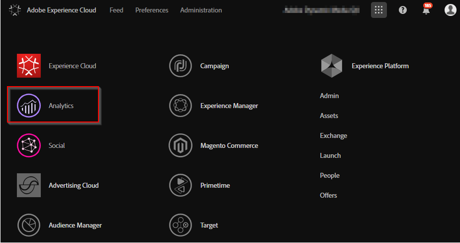
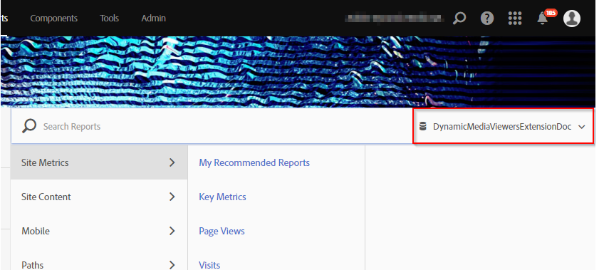
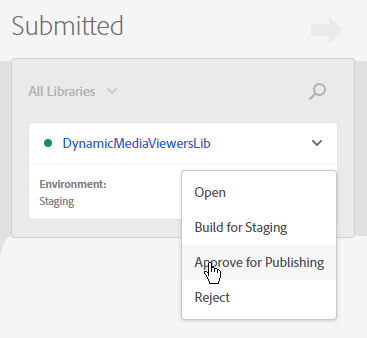
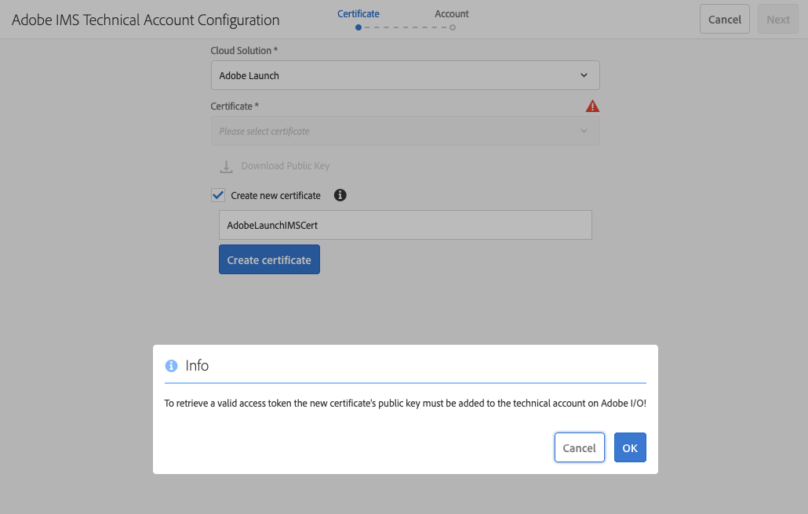
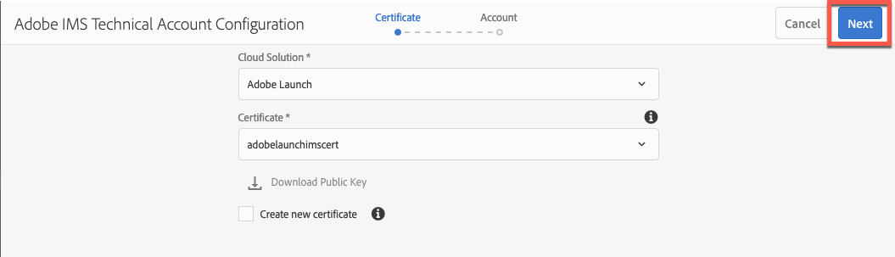

# 将Dynamic Media查看器与Adobe Analytics和Experience Platform标记集成 {#integrating-dynamic-media-viewers-with-adobe-analytics-and-adobe-launch}

## 什么是Dynamic Media Viewer与Adobe Analytics和Experience Platform标记的集成？ {#what-is-dynamic-media-viewers-integration-with-adobe-analytics-and-adobe-launch}

<!-- Leave this hidden path here; it points to the topic source from Sasha https://wiki.corp.adobe.com/pages/viewpage.action?spaceKey=~oufimtse&title=Dynamic+Media+Viewers+integration+with+Adobe+Launch 

name used to be Experience Platform Launch. Changed to Experience Platform Data Collection-->

适用于Experience Platform标记的&#x200B;*Dynamic Media查看器*&#x200B;扩展适用于Dynamic Media查看器5.13。它允许Adobe Analytics和Experience Platform Tags客户在其标记配置中使用Dynamic Media Viewers的事件和数据。

此集成意味着您可以使用Adobe Analytics跟踪网站上Dynamic Media Viewer的使用情况。 同时，您可以将查看器显示的事件和数据与来自Adobe或第三方的任何其他Experience Platform Tags扩展结合使用。

要了解有关Adobe扩展或第三方扩展的更多信息，请参阅Experience Platform Tags用户指南中的[Adobe扩展](https://experienceleague.adobe.com/en/docs/experience-platform/tags/extensions/overview)。

**本主题面向以下人员：**&#x200B;网站管理员、Adobe Experience Manager项目开发人员和运营人员。

### 集成的限制 {#limitations-of-the-integration}

* 适用于Dynamic Media查看器的Experience Platform Tags集成在Experience Manager创作节点中不起作用。 在发布WCM页面之前，您不会看到该页面中的任何跟踪。
* “弹出窗口”操作模式不支持适用于Dynamic Media查看器的Experience Platform Tags集成，在该模式下，可使用“资源详细信息”页面上的“URL”按钮获取查看器URL。
* Experience Platform Tags集成不能与旧版Viewers Analytics集成同时使用（通过`config2=`参数）。
* 视频跟踪支持仅限于核心播放跟踪，如[跟踪概述](https://experienceleague.adobe.com/en/docs/media-analytics/using/tracking/track-core-overview#player-events)中所述。 特别是，不支持QoS、广告、章节/区段或错误跟踪。
* 使用&#x200B;*Dynamic Media查看器*&#x200B;扩展的数据元素不支持数据元素的存储持续时间配置。 存储持续时间必须设置为&#x200B;**[!UICONTROL 无]**。

### 集成的用例 {#use-cases-for-the-integration}

与Experience Platform标记集成的主要用例是同时使用Experience Manager Assets和Experience Manager Sites的客户。 在此类场景中，您可以设置Experience Manager创作节点与Experience Platform标记之间的标准集成，然后将您的Sites实例与Experience Platform标记属性关联。 之后，添加到Sites页面的任何Dynamic Media WCM组件都将跟踪来自查看器的数据和事件。

查看[在Experience Manager Sites中跟踪Dynamic Media查看器](#tracking-dynamic-media-viewers-in-aem-sites)。

集成支持的辅助用例是那些仅使用Experience Manager Assets或Dynamic Media Classic的客户。 在这种情况下，您将获取查看者的嵌入代码并将其添加到网站页面。 然后，从Experience Platform Tags获取Experience Platform Tags库生产URL，并将其手动添加到网页代码中。

查看[使用嵌入的代码](#tracking-dynamic-media-viewers-using-embed-code)跟踪Dynamic Media查看器。

## 数据和事件跟踪在集成中的工作原理 {#how-data-and-event-tracking-works-in-the-integration}

该集成利用了两种独立的Dynamic Media查看器跟踪类型：*Adobe Analytics*&#x200B;和&#x200B;*Adobe Analytics for Audio and Video*。

### 关于使用Adobe Analytics进行跟踪 {#about-tracking-using-adobe-analytics}

通过Adobe Analytics，您可以跟踪用户在网站上与Dynamic Media查看器交互时执行的操作。 Adobe Analytics还允许您跟踪特定于查看器的数据。 例如，您可以跟踪和记录视图加载事件以及资产名称、发生的任何缩放操作和视频播放操作。

在Experience Platform Tags中，*数据元素*&#x200B;和&#x200B;*规则*&#x200B;的概念共同启用Adobe Analytics跟踪。

#### 关于Experience Platform Tags中的数据元素 {#about-data-elements-in-adobe-launch}

Experience Platform Tags中的数据元素是一个命名属性，其值是静态定义的，或根据网页或Dynamic Media查看器数据的状态进行动态计算。

数据元素定义中可用的选项取决于Experience Platform Tags属性中安装的扩展列表。 “核心”扩展已预安装，在任何配置中均可开箱即用。 此“核心”扩展允许定义数据元素，该值来自Cookie、JavaScript代码、查询字符串和许多其他来源。

对于Adobe Analytics跟踪，必须安装多个其他扩展，如[扩展的安装和设置](#installing-and-setup-of-extensions)中所述。 Dynamic Media查看器扩展添加了定义数据元素的功能，该数据元素的值是动态查看器事件的参数。 例如，可以引用查看器类型或加载时查看器报告的资产名称、最终用户缩放时报告的缩放级别等。

Dynamic Media Viewer扩展会自动使其数据元素的值保持最新。

定义数据元素后，可以使用数据元素选取器小组件，将数据元素用于Experience Platform Tags UI的其他位置。 规则中Adobe Analytics扩展的&#x200B;**Set Variables操作**&#x200B;引用了为Dynamic Media查看器跟踪定义的数据元素（请参阅下文）。

请参阅《Experience Platform Tags用户指南》中的[数据元素](https://experienceleague.adobe.com/en/docs/experience-platform/tags/ui/data-elements)。

#### 关于Experience Platform Tags中的规则 {#about-rules-in-adobe-launch}

Experience Platform Tags中的规则是一种不可知配置，它定义了构成规则的三个区域： *事件*、*条件*&#x200B;和&#x200B;*操作*：

* *Events* (if)告知Experience Platform Tags何时触发规则。
* *条件* (if)告知Experience Platform Tags在触发规则时允许或不允许的其他限制。
* *操作* （然后）告知Experience Platform Tags触发规则时要执行的操作。

“事件”、“条件”和“操作”部分中可用的选项取决于Experience Platform Tags属性中安装的扩展。 已预安装&#x200B;*Core*&#x200B;扩展，该扩展在任何配置中均可开箱即用。 扩展为事件提供了多个选项，例如基本的浏览器级操作，其中包括焦点更改、按键和表单提交。 它还包含适用于条件的选项，例如Cookie值、浏览器类型等。 对于“操作”，只有“自定义代码”选项可用。

对于Adobe Analytics跟踪，必须安装多个其他扩展，如[扩展安装和设置](#installing-and-setup-of-extensions)中所述。 具体来说：

* Dynamic Media查看器扩展可将支持的事件列表扩展到Dynamic Media查看器特定的事件，例如查看器加载、资产交换、放大和视频播放。
* Adobe Analytics扩展扩展扩展了支持的操作列表，添加了将数据发送到跟踪服务器所需的两个操作： *Set Variables*&#x200B;和&#x200B;*Send Beacon*。

要跟踪Dynamic Media查看器，可以使用以下任何类型：

* Dynamic Media查看器扩展、核心扩展或任何其他扩展中的事件。
* 规则定义中的条件。 或者，您可以将conditions区域留空。

在“操作”部分中，要求您具有&#x200B;*Set Variables*&#x200B;操作。 此操作可告知Adobe Analytics如何使用数据填充跟踪变量。 同时，*Set Variables*&#x200B;操作不会向跟踪服务器发送任何内容。

**发送信标**&#x200B;操作必须遵循&#x200B;**设置变量**&#x200B;操作。 *发送信标*&#x200B;操作实际上会将数据发送到Analytics跟踪服务器。 这两个操作&#x200B;*Set Variables*&#x200B;和&#x200B;*Send Beacon*&#x200B;都来自Adobe Analytics扩展。

请参阅《Experience Platform Tags用户指南》中的[规则](https://experienceleague.adobe.com/en/docs/experience-platform/tags/ui/rules)。

#### 示例配置 {#sample-configuration}

Experience Platform Tags中的以下示例配置演示了如何在加载查看器时跟踪资源名称。

1. 在&#x200B;**[!UICONTROL 数据元素]**&#x200B;选项卡中，定义引用Dynamic Media查看器扩展中`LOAD`事件的`asset`参数的数据元素`AssetName`。

   

1. 从&#x200B;**[!UICONTROL 规则]**&#x200B;选项卡，定义规则&#x200B;*TrackAssetOnLoad*。

   在此规则中，**[!UICONTROL Event]**&#x200B;字段使用来自Dynamic Media查看器扩展的&#x200B;**[!UICONTROL LOAD]**&#x200B;事件。

   

1. 操作配置具有Adobe Analytics扩展中的两种操作类型：

   *设置变量*，它将您选择的Analytics变量映射到`AssetName`数据元素的值。

   *发送信标*，用于向Adobe Analytics发送跟踪信息。

   

1. 生成的规则配置如下所示：

   

### 关于适用于音频和视频的Adobe Analytics {#about-adobe-analytics-for-audio-and-video}

如果订阅了Experience Cloud帐户以使用Adobe Analytics for Audio and Video，则足以在&#x200B;*Dynamic Media查看器*&#x200B;扩展设置中启用视频跟踪。 视频量度在Adobe Analytics中可用。 视频跟踪依赖于Adobe Media Analytics for Audio and Video扩展的存在。

请参阅[扩展的安装和设置](#installing-and-setup-of-extensions)。

目前，对视频跟踪的支持仅限于“核心播放”跟踪，如[跟踪概述](https://experienceleague.adobe.com/en/docs/media-analytics/using/tracking/track-core-overview#player-events)中所述。 特别是，不支持QoS、广告、章节/区段或错误跟踪。

## 使用Dynamic Media查看器扩展 {#using-the-dynamic-media-viewers-extension}

如集成[用例](#use-cases-for-the-integration)中所述，可通过在Experience Manager Sites中集成新的Experience Platform Tags以及使用嵌入代码来跟踪Dynamic Media查看器。

### 在Experience Manager Sites中跟踪Dynamic Media查看器 {#tracking-dynamic-media-viewers-in-aem-sites}

要在Experience Manager Sites中跟踪Dynamic Media查看器，必须执行[配置所有集成片段](#configuring-all-the-integration-pieces)部分下列出的所有步骤。 具体而言，您必须创建IMS配置和Experience Platform Tags云配置。

通过正确配置，使用Dynamic Media支持的WCM组件添加到站点页面的任何Dynamic Media查看器都会自动跟踪到Adobe Analytics或Adobe Analytics for Video的数据，或同时跟踪这两者。

请参阅[使用Adobe站点将Dynamic Media Assets添加到页面](/help/assets/dynamic-media/adding-dynamic-media-assets-to-pages.md)。

### 使用嵌入代码跟踪Dynamic Media查看器 {#tracking-dynamic-media-viewers-using-embed-code}

对于未使用Experience Manager Sites或将Dynamic Media查看器嵌入到Experience Manager Sites外部的网页中（或同时使用两者）的客户，仍可以使用Experience Platform标记集成。

完成[配置Adobe Analytics](#configuring-adobe-analytics-for-the-integration)和[配置Experience Platform标记](#configuring-adobe-launch-for-the-integration)部分中的配置步骤。 但是，不需要执行与Experience Manager相关的配置步骤。

通过正确配置，您可以使用Dynamic Media查看器将Experience Platform标记支持添加到网页。

请参阅[添加Experience Platform Tags嵌入代码](https://experienceleague.adobe.com/en/docs/platform-learn/implement-in-websites/configure-tags/add-embed-code)，详细了解如何使用Experience Platform Tags库嵌入代码。

要了解有关如何使用Experience Manager Dynamic Media的嵌入代码功能的更多信息，请参阅[在网页上嵌入视频或图像查看器](/help/assets/dynamic-media/embed-code.md)。

**使用嵌入代码跟踪Dynamic Media查看器：**

1. 设置一个网页以便嵌入Dynamic Media查看器。
1. 通过先登录Experience Platform Tags获取Experience Platform Tags库的嵌入代码(请参阅[配置Experience Platform Tags](#configuring-adobe-launch-for-the-integration))。
1. 选择&#x200B;**[!UICONTROL 属性]**，然后单击&#x200B;**[!UICONTROL 环境]**&#x200B;选项卡。
1. 选取与网页环境相关的环境级别。 然后，在&#x200B;**[!UICONTROL Install]**&#x200B;列中，单击该框图标。
1. **[!UICONTROL 在Web安装说明]**&#x200B;对话框中，复制完整的Experience Platform Tags库嵌入代码以及周围的`<script/>`标记。

## Dynamic Media查看器扩展参考指南 {#reference-guide-for-the-dynamic-media-viewers-extension}

### 关于Dynamic Media查看器配置 {#about-the-dynamic-media-viewers-configuration}

如果满足以下条件，则Dynamic Media Viewer扩展会自动与Experience Platform标记库集成：

* 页面上存在Experience Platform Tags库全局对象( `_satellite`)。
* Dynamic Media查看器扩展函数`_dmviewers_v001()`在`_satellite`上定义。

* 未指定`config2=`查看器参数，这意味着查看器不使用旧版Analytics集成。

此外，还有一个选项，可通过在查看器的配置中指定`launch=0`参数，在查看器中显式禁用Experience Platform Tags集成。 此参数的默认值为`1`。

### 配置Dynamic Media查看器扩展 {#configuring-the-dynamic-media-viewers-extension}

Dynamic Media Viewers扩展的唯一配置选项是&#x200B;**[!UICONTROL 启用Adobe Media Analytics for Audio and Video]**。

如果选中（启用）此选项，并且已安装和配置Adobe Media Analytics for Audio and Video扩展，则会将视频播放量度发送到Adobe Analytics for Audio and Video解决方案。 禁用此选项将关闭视频跟踪。

如果启用此选项&#x200B;*而没有*&#x200B;安装Adobe Media Analytics for Audio and Video扩展，则该选项无效。

### 关于Dynamic Media查看器扩展中的数据元素 {#about-data-elements-in-the-dynamic-media-viewers-extension}

Dynamic Media Viewers 扩展提供的唯一数据元素类型是&#x200B;**[!UICONTROL 数据元素类型]**&#x200B;下拉列表中的&#x200B;**[!UICONTROL 查看器事件]**。

选中后，数据元素编辑器将呈现一个包含两个字段的表单：

* **[!UICONTROL DM查看器事件数据类型]** — 一个下拉列表显示具有Dynamic Media查看器扩展支持的参数的所有查看器事件，以及一个特殊的&#x200B;**[!UICONTROL COMMON]**&#x200B;项。 **[!UICONTROL COMMON]** 项目表示事件参数列表，这些事件参数对查看器发送的所有类型事件都是通用的。
* **[!UICONTROL 跟踪参数]** — 所选Dynamic Media查看器事件的参数。

有关每种查看器类型支持的事件列表，请参阅[Dynamic Media查看器参考指南](https://experienceleague.adobe.com/en/docs/dynamic-media-developer-resources/library/viewers-aem-assets-dmc/c-html5-s7-aem-asset-viewers)；转到特定的查看器部分，然后选择“支持Adobe Analytics跟踪”子部分。 目前， Dynamic Media查看器参考指南不记录事件参数。

现在来考虑Dynamic Media查看器&#x200B;*数据元素*&#x200B;的生命周期。 当页面上发生相应的Dynamic Media查看器事件后，将填充此类数据元素的值。 例如，假设数据元素指向&#x200B;**[!UICONTROL LOAD]**&#x200B;事件及其“asset”参数。 此类数据元素的值会在查看器首次运行LOAD事件后接收有效数据。 如果数据元素指向&#x200B;**[!UICONTROL ZOOM]**&#x200B;事件及其“scale”参数，则在查看器首次发送&#x200B;**[!UICONTROL ZOOM]**&#x200B;事件之前，此类数据元素的值将保持为空。

同样，当查看器在页面上发送相应事件时，数据元素的值也会自动更新。即使在规则配置中未指定特定事件，也会发生值更新。例如，假设为ZOOM事件的“scale”参数定义了数据元素&#x200B;**[!UICONTROL ZoomScale]**。 但是，**[!UICONTROL LOAD]**&#x200B;事件是规则配置中的唯一触发器。 每次用户在查看器中运行缩放时，**[!UICONTROL ZoomScale]**&#x200B;的值仍会更新。

任何Dynamic media查看器在网页上都有唯一标识符。 数据元素会跟踪值本身，以及填充该值的查看器。 例如，假设同一页面上有多个查看器，以及指向&#x200B;**[!UICONTROL LOAD]**&#x200B;事件及其“asset”参数的&#x200B;**[!UICONTROL AssetName]**&#x200B;数据元素。 **[!UICONTROL AssetName]**&#x200B;数据元素维护与页面上加载的每个查看器关联的资产名称集合。

数据元素返回的确切值取决于上下文。 如果Dynamic Media查看器事件触发的规则请求数据元素，则会为启动该规则的查看器返回值。 如果另一个Experience Platform Tags扩展中的事件触发的规则请求数据元素，则它会遵循相应事件的上下文。 此时，数据元素的值来自上次更新此数据元素的查看器。

**考虑以下示例设置：**

* 具有两个Dynamic Media缩放查看器的网页： *查看器1*&#x200B;和&#x200B;*查看器2*。

* **[!UICONTROL ZoomScale]**&#x200B;数据元素指向&#x200B;**[!UICONTROL ZOOM]**&#x200B;事件及其“缩放”参数。
* **[!UICONTROL TrackPan]**&#x200B;规则具有以下属性：

   * 使用Dynamic Media查看器&#x200B;**[!UICONTROL PAN]**&#x200B;事件作为触发器。
   * 将&#x200B;**[!UICONTROL ZoomScale]**&#x200B;数据元素的值发送到Adobe Analytics。

* **[!UICONTROL TrackKey]**&#x200B;规则具有以下属性：

   * 使用核心Experience Platform Tags扩展中的按键事件作为触发器。
   * 将&#x200B;**[!UICONTROL ZoomScale]**&#x200B;数据元素的值发送到Adobe Analytics。

现在，假定用户加载网页时带有两个查看器。 在&#x200B;*查看器1*&#x200B;中，他们放大到50%的缩放比例；然后在&#x200B;*查看器2*&#x200B;中，他们放大到25%的缩放比例。 在&#x200B;*viewer1*&#x200B;中，用户将图像平移，最后按键盘上的键。

用户的活动会导致对Adobe Analytics进行以下两次跟踪调用：

* 第一次调用发生的原因是&#x200B;**[!UICONTROL TrackPan]**&#x200B;规则在用户在&#x200B;*viewer1*&#x200B;中平移时触发。 该调用发送&#x200B;**50%**&#x200B;作为&#x200B;**[!UICONTROL ZoomScale]**&#x200B;数据元素的值，因为它识别&#x200B;*viewer1*&#x200B;触发了规则并检索相应的缩放值；
* 第二次调用发生的原因是&#x200B;**[!UICONTROL TrackKey]**&#x200B;规则在用户按下键盘上的键时触发。 该调用发送25%作为&#x200B;**[!UICONTROL ZoomScale]**&#x200B;数据元素的值，因为查看器未触发规则。 因此，数据元素会返回最新的值。

以上设置的示例也会影响数据元素值的生命周期。 Dynamic Media查看器管理的数据元素的值存储在Experience Platform Tags库代码中，即使查看器本身被放置在网页上也是如此。 这项功能意味着如果由非Dynamic Media查看器扩展触发的规则引用数据元素，则会返回最后一个已知值。 即使查看者不再出现在网页上。

无论如何，Dynamic Media查看器驱动的数据元素值不会存储在本地存储或服务器上；而是仅存储在客户端Experience Platform Tags库中。 在网页重新加载时，此类数据元素的值消失。

通常，数据元素编辑器支持[存储持续时间选择](https://experienceleague.adobe.com/en/docs/experience-platform/tags/ui/data-elements#create-a-data-element)。 但是，使用Dynamic Media查看器扩展的数据元素仅支持&#x200B;**[!UICONTROL 无]**&#x200B;的存储持续时间选项。 可以在用户界面中设置任何其他值，但在此情况下未定义数据元素行为。 扩展可自行管理数据元素的值：在整个查看器生命周期中维护查看器事件参数值的数据元素。

### 关于Dynamic Media查看器扩展中的规则 {#about-rules-in-the-dynamic-media-viewers-extension}

在规则编辑器中，扩展会为事件编辑器添加新的配置选项。 此外，该编辑器提供了一个选项，让您可以在操作编辑器中手动引用事件参数作为简短选项，而不是使用预配置的数据元素。

#### 关于事件编辑器 {#about-the-events-editor}

在事件编辑器中，Dynamic Media查看器扩展会添加一个名为&#x200B;**[!UICONTROL 查看器事件]**&#x200B;的&#x200B;**[!UICONTROL 事件类型]**。

选中后，事件编辑器会显示&#x200B;**[!UICONTROL Dynamic Media查看器事件]**&#x200B;下拉列表，其中列出了Dynamic Media查看器支持的所有事件。

#### 关于操作编辑器 {#about-the-actions-editor}

通过Dynamic Media查看器扩展，您可以使用Dynamic Media查看器的事件参数映射到Adobe Analytics扩展的设置变量编辑器中的分析变量。

最简单的方法是完成以下两步流程：

* 首先，定义一个或多个数据元素，其中每个数据元素表示Dynamic Media查看器事件的参数。
* 最后，在Adobe Analytics扩展的“设置变量”编辑器中，单击 **数据元素**&#x200B;选取器以打开“选择数据元素”对话框，然后单击其中的数据元素。

但是，可以使用替代方法并绕过数据元素创建。您可以直接引用Dynamic Media查看器事件中的参数。 在Analytics变量分配的&#x200B;**[!UICONTROL 值]**&#x200B;输入字段中输入事件参数的完全限定名称。 确保将百分比(%)符号括起来。 例如，

`%event.detail.dm.LOAD.asset%`

使用数据元素与使用直接事件参数引用之间有一个重要的区别。 对于数据元素，哪个事件触发Set Variables操作并不重要。 触发规则的事件可能与动态查看器无关（例如从核心扩展中选择网页）。 但是，在使用直接参数引用时，请务必确保触发规则的事件与它引用的事件参数相对应。

例如，如果来自Dynamic Media Viewer扩展的&#x200B;**[!UICONTROL LOAD]**&#x200B;事件触发了规则，则引用`%event.detail.dm.LOAD.asset%`将返回正确的资源名称。

但是，对于任何其他事件，它都会返回一个空值。

下表列出了Dynamic Media查看器事件及其支持的参数：

<table>
 <tbody>
  <tr>
   <td>查看器事件名称</td>
   <td>参数引用</td>
  </tr>
  <tr>
   <td><code>COMMON</code></td>
   <td><code>%event.detail.dm.objID%</code></td>
  </tr>
  <tr>
   <td> </td>
   <td><code>%event.detail.dm.compClass%</code></td>
  </tr>
  <tr>
   <td> </td>
   <td><code>%event.detail.dm.instName%</code></td>
  </tr>
  <tr>
   <td> </td>
   <td><code>%event.detail.dm.timeStamp%</code></td>
  </tr>
  <tr>
   <td><code>BANNER</code>  </td>
   <td><code>%event.detail.dm.BANNER.asset%</code></td>
  </tr>
  <tr>
   <td> </td>
   <td><code>%event.detail.dm.BANNER.frame%</code></td>
  </tr>
  <tr>
   <td> </td>
   <td><code>%event.detail.dm.BANNER.label%</code></td>
  </tr>
  <tr>
   <td><code>HREF</code></td>
   <td><code>%event.detail.dm.HREF.rollover%</code></td>
  </tr>
  <tr>
   <td><code>ITEM</code></td>
   <td><code>%event.detail.dm.ITEM.rollover%</code></td>
  </tr>
  <tr>
   <td><code>LOAD</code></td>
   <td><code>%event.detail.dm.LOAD.applicationname%</code></td>
  </tr>
  <tr>
   <td><strong> </strong></td>
   <td><code>%event.detail.dm.LOAD.asset%</code></td>
  </tr>
  <tr>
   <td><strong> </strong></td>
   <td><code>%event.detail.dm.LOAD.company%</code></td>
  </tr>
  <tr>
   <td><strong> </strong></td>
   <td><code>%event.detail.dm.LOAD.sdkversion%</code></td>
  </tr>
  <tr>
   <td><strong> </strong></td>
   <td><code>%event.detail.dm.LOAD.viewertype%</code></td>
  </tr>
  <tr>
   <td><strong> </strong></td>
   <td><code>%event.detail.dm.LOAD.viewerversion%</code></td>
  </tr>
  <tr>
   <td><code>METADATA</code></td>
   <td><code>%event.detail.dm.METADATA.length%</code></td>
  </tr>
  <tr>
   <td> </td>
   <td><code>%event.detail.dm.METADATA.type%</code></td>
  </tr>
  <tr>
   <td><code>MILESTONE</code></td>
   <td><code>%event.detail.dm.MILESTONE.milestone%</code></td>
  </tr>
  <tr>
   <td><code>PAGE</code></td>
   <td><code>%event.detail.dm.PAGE.frame%</code></td>
  </tr>
  <tr>
   <td> </td>
   <td><code>%event.detail.dm.PAGE.label%</code></td>
  </tr>
  <tr>
   <td><code>PAUSE</code></td>
   <td><code>%event.detail.dm.PAUSE.timestamp%</code></td>
  </tr>
  <tr>
   <td><code>PLAY</code></td>
   <td><code>%event.detail.dm.PLAY.timestamp%</code></td>
  </tr>
  <tr>
   <td><code>SPIN</code></td>
   <td><code>%event.detail.dm.SPIN.framenumber%</code></td>
  </tr>
  <tr>
   <td><code>STOP</code></td>
   <td><code>%event.detail.dm.STOP.timestamp%</code></td>
  </tr>
  <tr>
   <td><code>SWAP</code></td>
   <td><code>%event.detail.dm.SWAP.asset%</code></td>
  </tr>
  <tr>
   <td><code>SWATCH</code></td>
   <td><code>%event.detail.dm.SWATCH.frame%</code></td>
  </tr>
  <tr>
   <td> </td>
   <td><code>%event.detail.dm.SWATCH.label%</code></td>
  </tr>
  <tr>
   <td><code>TARG</code></td>
   <td><code>%event.detail.dm.TARG.frame%</code></td>
  </tr>
  <tr>
   <td> </td>
   <td><code>%event.detail.dm.TARG.label%</code></td>
  </tr>
  <tr>
   <td><code>ZOOM</code></td>
   <td><code>%event.detail.dm.ZOOM.scale%</code></td>
  </tr>
 </tbody>
</table>

## 配置所有集成片段 {#configuring-all-the-integration-pieces}

**开始之前**

Adobe建议您仔细阅读本节之前的所有文档，以便了解整个集成。

本节介绍将Dynamic Media查看器与Adobe Analytics和Adobe Analytics for Audio and Video集成所需的配置步骤。 虽然可以将Dynamic Media查看器扩展用于Experience Platform Tags中的其他目的，但本文档不包含此类场景。

您即将使用以下Adobe产品来配置集成：

* Adobe Analytics — 用于配置跟踪变量和报表。
* Experience Platform Tags — 用于定义资产、一个或多个规则以及一个或多个数据元素，以启用查看器跟踪。

此外，如果此集成解决方案与Experience Manager Sites一起使用，则必须完成以下配置：

* [Adobe Developer Console](https://developer.adobe.com/console/home) — 已为Experience Platform标记创建集成。
* Experience Manager创作节点 — IMS配置和Experience Platform Tags云配置。

在配置过程中，确保您有权访问Adobe Experience Cloud中启用了Adobe Analytics和Experience Platform标记的公司。

## 配置Adobe Analytics以进行集成 {#configuring-adobe-analytics-for-the-integration}

配置Adobe Analytics后，将针对以下内容设置集成：

* 已放置并选择一个报表包。
* Analytics变量可用于接收跟踪数据。
* 报表可以查看从Adobe Analytics内部收集的数据。

另请参阅[Analytics实施指南](https://experienceleague.adobe.com/en/docs/analytics/implementation/home)。

**要为集成配置Adobe Analytics：**

1. 首先从Experience Cloud [主页](https://experience.adobe.com/#/home)访问Adobe Analytics。 在菜单栏上，单击页面右上角附近的 **解决方案**，然后选择&#x200B;**[!UICONTROL Analytics]**。

   

   现在，选择一个报表包。

### 选择报表包 {#selecting-a-report-suite}

1. 在 Adobe Analytics 页面的右上角附近，在&#x200B;**[!UICONTROL 搜索报告]**&#x200B;字段的右侧，从下拉列表中选择正确的报表包。如果有多个报表包可用，而您不确定要使用哪个报表包，请寻求帮助。 您的Adobe Analytics管理员可以指导您选择相应的报表包。

   在以下示例中，用户创建了一个名为&#x200B;*DynamicMediaViewersExtensionDoc*&#x200B;的报表包，并从下拉列表中选择了该报表包。 报表包名称只是一个示例。 您最终选择的报表包的名称由您决定。

   如果没有可用的报表包，您必须或您的Adobe Analytics管理员创建一个报表包，然后才能继续配置。

   请参阅[报表和报表包](https://experienceleague.adobe.com/en/docs/analytics/admin/admin-tools/manage-report-suites/report-suites-admin)和[创建报表包](https://experienceleague.adobe.com/en/docs/analytics/admin/admin-tools/manage-report-suites/c-new-report-suite/t-create-a-report-suite)。

   在Adobe Analytics中，报表包在&#x200B;**[!UICONTROL 管理员]** > **[!UICONTROL 报表包]**&#x200B;下管理。

   

   现在，设置Adobe Analytics变量。

### 设置Adobe Analytics变量 {#setting-up-adobe-analytics-variables}

1. 指定一个或多个要用于跟踪Dynamic Media查看器行为的Adobe Analytics变量。

   您可以使用Adobe Analytics支持的任何变量类型。 Analytics实施需要确定适当的变量类型，如自定义流量(`props`)或转化(`eVar`)。

   请参阅[prop和eVar概述](https://experienceleague.adobe.com/en/docs/analytics/implementation/vars/page-vars/evar#vars)。

   在本文档中，仅使用自定义流量(props)变量，因为它们会在网页上发生操作后的几分钟内在Analytics报表中变得可用。

   若要在Adobe Analytics的工具栏上启用新的自定义流量变量，请转到&#x200B;**[!UICONTROL 管理员]** > **[!UICONTROL 报表包]**。

1. 在&#x200B;**[!UICONTROL 报表包管理器]**&#x200B;页面上，选择正确的报表。
1. 在工具栏上，单击&#x200B;**[!UICONTROL 编辑设置]** > **[!UICONTROL 流量]** > **[!UICONTROL 流量变量]**。
1. 挑选未使用的变量，为其指定一个描述性名称(**[!UICONTROL 查看器资产(prop 30)]**)，然后在“已启用”列中将该组合框更改为“已启用”。

   以下屏幕截图是用于跟踪查看器使用的资产名称的自定义流量变量(**[!UICONTROL prop30]**)的示例：

   

1. 在变量列表的底部，单击&#x200B;**[!UICONTROL 保存]**。

### 设置报表 {#setting-up-a-report}

通常，特定项目需求会驱动您在Adobe Analytics中设置报表的方式。 因此，详细报表设置超出了此集成的范围。

但是，只要在&#x200B;**[设置Adobe Analytics变量](#setting-up-adobe-analytics-variables)**&#x200B;中设置自定义流量变量后，即可知道自定义流量报表在Adobe Analytics中自动可用。

例如，可从&#x200B;**[!UICONTROL 自定义流量]** > **[!UICONTROL 自定义流量21-30]** > **[!UICONTROL 查看器资产(prop 30)]**&#x200B;下的“报告”菜单中获取&#x200B;**[!UICONTROL 查看器资产(prop 30)]**&#x200B;变量的报告。

在查看器资产(prop 30)创 **[!UICONTROL 建后直接访问此报告]** ，不显示任何数据；在整合的这一阶段，人们就会期待它。

## 为集成配置Experience Platform标记 {#configuring-adobe-launch-for-the-integration}

配置Experience Platform标记后，将为该集成设置以下项目：

* 创建一个新资产，将所有配置放在一起。
* 扩展的安装和设置。 资产中安装的所有扩展的客户端代码将一起编译到一个库中。 此库稍后将被网页使用。
* 数据元素和规则的配置。 此配置定义要从Dynamic Media查看器获取哪些数据，何时触发跟踪逻辑，以及在Adobe Analytics中将查看器数据发送到何处。
* 发布库。

**要为集成配置Experience Platform标记：**

1. 首先，从Experience Cloud [主页](https://experience.adobe.com/#/home)访问Experience Platform Tags。 在菜单栏上，单击页面右上角附近的 **解决方案**，然后单击&#x200B;**[!UICONTROL 标记]**。

   

### 在Experience Platform Tags中创建资产 {#creating-a-property-in-adobe-launch}

Experience Platform Tags中的资产是一个命名配置，可将所有设置保留在一起。 将生成配置设置库并发布到不同的环境级别（开发、暂存和生产）。

另请参阅[配置选定属性](https://experienceleague.adobe.com/en/docs/platform-learn/implement-mobile-sdk/initial-configuration/configure-tags)。

**在Experience Platform Tags中创建属性：**

1. 在Experience Platform标记中，单击&#x200B;**[!UICONTROL 新建属性]**。
1. 在&#x200B;**[!UICONTROL 创建属性]**&#x200B;对话框的&#x200B;**[!UICONTROL 名称]**&#x200B;字段中，键入描述性名称，如网站的标题。例如，`DynamicMediaViewersProp.`
1. 在&#x200B;**[!UICONTROL 域]**&#x200B;字段中，输入您网站的域。
1. 在&#x200B;**[!UICONTROL 高级选项]**&#x200B;下拉列表中，启用&#x200B;**[!UICONTROL 配置以进行扩展开发（以后无法修改）]**，以防您要使用的扩展（本例中为&#x200B;*Dynamic Media查看器*）尚未发布。

   

1. 选择&#x200B;**[!UICONTROL 保存]**。

   选择创建的属性，然后继续进行&#x200B;*扩展安装和设置*。

### 安装和设置扩展 {#installing-and-setup-of-extensions}

Experience Platform Tags中所有可用的扩展都列在&#x200B;**[!UICONTROL 扩展]** > **[!UICONTROL 目录]**&#x200B;下。

若要安装扩展，请单击&#x200B;**[!UICONTROL 安装]**。 如果需要，请执行一次性扩展配置，然后单击&#x200B;**[!UICONTROL 保存]**。

在需要时，必须安装和配置以下扩展：

* （必需） *Experience Cloud ID服务*&#x200B;扩展

除任何建议值外，无需其他配置。 完成后，确保单击&#x200B;**[!UICONTROL 保存]**。

请参阅[Experience Cloud Identity Service扩展](https://experienceleague.adobe.com/en/docs/experience-platform/tags/extensions/client/id-service/overview)。

* （必需） *Adobe Analytics*&#x200B;扩展

要配置此扩展，您需要在Adobe Analytics中的&#x200B;**[!UICONTROL 管理员]** > **[!UICONTROL 报表包]**&#x200B;下、**[!UICONTROL 报表包ID]**&#x200B;列标题下的报表包ID。

(仅出于演示目的，以下屏幕截图中使用了&#x200B;**[!UICONTROL DynamicMediaViewersExtensionDoc]**&#x200B;报表包的报表包ID。 此 ID 在之前的[选择报表包](#selecting-a-report-suite)中创建并使用。)

在“安装扩展”页面的&#x200B;**[!UICONTROL 开发报表包]**&#x200B;字段、**[!UICONTROL 测试报表包]**&#x200B;字段和&#x200B;**[!UICONTROL 生产报表包]**&#x200B;字段中输入报表包 ID。

*仅当您打算使用视频跟踪时才配置以下项：*

在&#x200B;**[!UICONTROL 安装扩展]**&#x200B;页面上，展开&#x200B;**[!UICONTROL 常规]**，然后指定跟踪服务器。 跟踪服务器遵循模板`<trackingNamespace>.sc.omtrdc.net`，其中`<trackingNamespace>`是在设置电子邮件中获取的信息。

选择&#x200B;**[!UICONTROL 保存]**。

请参阅[Adobe Analytics扩展](https://experienceleague.adobe.com/en/docs/experience-platform/tags/extensions/client/analytics/overview)。

* (可选。 仅在需要视频跟踪时才需要)*Adobe Media Analytics for Audio and Video*&#x200B;扩展

填写跟踪服务器字段。 *Adobe Media Analytics for Audio and Video*&#x200B;扩展的跟踪服务器与用于Adobe Analytics的跟踪服务器不同。 它跟在模板`<trackingNamespace>.hb.omtrdc.net`后面，其中`<trackingNamespace>`是来自预配电子邮件的信息。

所有其他字段都是可选的。

请参阅[Adobe Media Analytics for Audio and Video扩展](https://experienceleague.adobe.com/en/docs/experience-platform/tags/extensions/client/media-analytics/overview)。

* （必需） *Dynamic Media查看器*&#x200B;扩展

选择&#x200B;**[!UICONTROL 启用 Adobe Analytics for Video]** 以启用（打开）视频检测信号跟踪。

截至编写此文件时，*Dynamic Media Viewers*&#x200B;扩展仅在创建Experience Platform Tags属性用于开发时可用。

请参阅[在Experience Platform标记中创建属性](#creating-a-property-in-adobe-launch)。

安装并设置扩展后，Extensions > Installed区域中至少会列出以下五个扩展（如果不跟踪视频，则四个）。

### 设置数据元素和规则 {#setting-up-data-elements-and-rules}

在Experience Platform Tags中，创建跟踪Dynamic Media查看器所需的数据元素和规则。

有关Experience Platform标记的跟踪概述，请参阅[数据和事件跟踪在集成](#how-data-and-event-tracking-works-in-the-integration)中的工作方式。

请参阅[示例配置](#sample-configuration)，获取Experience Platform标记中演示如何在查看器加载时跟踪资源名称的示例配置。

有关扩展功能的深入信息，请参阅[配置Dynamic Media查看器扩展](#configuring-the-dynamic-media-viewers-extension)。

### 发布库 {#publishing-a-library}

要更改Experience Platform Tags配置（包括属性、扩展、规则和数据元素设置），您必须&#x200B;*发布*&#x200B;此类更改。 Experience Platform Tags中的发布是从“资产”配置下的“发布”选项卡执行的。

Experience Platform标记可能具有多个开发环境、一个暂存环境和一个生产环境。 默认情况下，Experience Manager中的Experience Platform Tags云配置将Experience Manager创作节点指向Platform Tags的暂存环境。 Experience Manager发布节点指向Experience Platform Tags的生产环境。 这种安排意味着使用默认的Experience Manager设置时，需要将Experience Platform标记库发布到暂存环境。 这样，您就可以在Experience Manager的创作模式下使用它。 然后，您可以将其发布到生产环境，以便在Experience Manager发布中使用。

有关Experience Platform Tags环境的详细信息，请参阅[环境](https://experienceleague.adobe.com/en/docs/experience-platform/tags/publish/environments/environments)。

发布库的过程涉及以下两个步骤：

* 通过将所有必需的更改（新更改和更新）包含到库中来添加和构建新库。
* 在不同环境级别（从开发到暂存和生产）中向上移动库。

#### 添加和构建新库 {#adding-and-building-a-new-library}

1. 首次在Experience Platform Tags中打开Publishing选项卡时，库列表为空。

   在左列中，单击&#x200B;**[!UICONTROL 添加新库]**。

   

1. 在“创建新库”页面的&#x200B;**[!UICONTROL 名称]**&#x200B;字段中，输入新库的描述性名称。 例如，

   *DynamicMediaViewerLib*

   从“环境”下拉列表中，选择“环境”级别。 最初，仅开发级别可供选择。 在页面的左下角附近，单击&#x200B;**[!UICONTROL 添加所有已更改资源]**。

   

1. 在页面的右上角附近，单击&#x200B;**[!UICONTROL 保存并生成以进行开发]**。

   几分钟后，库将创建并准备就绪。

   

   >[!NOTE]
   >
   >下次更改Experience Platform Tags配置时，请转到&#x200B;**[!UICONTROL 属性]**&#x200B;配置下的&#x200B;**[!UICONTROL 发布]**&#x200B;选项卡，然后选择之前创建的库。
   >
   >
   >在库发布屏幕中，单击&#x200B;**[!UICONTROL 添加所有更改的资源]**，然后单击&#x200B;**[!UICONTROL 保存并生成以进行开发]**。

#### 在环境级别中向上移动库 {#moving-a-library-up-through-environment-levels}

1. 添加新库后，可在开发环境中找到它。 要将其移至暂存环境级别（与“已提交”列相对应），请从库的下拉菜单中单击&#x200B;**[!UICONTROL 提交以供审批]**。

   

1. 在确认对话框中，单击&#x200B;**[!UICONTROL 提交]**。

   在库移至Submitted列后，从库的下拉菜单中，单击&#x200B;**[!UICONTROL Build for Staging]**。

   

1. 要将库从暂存环境移动到生产环境（即“已发布”列），请执行类似的过程。

   首先，从下拉菜单中，单击&#x200B;**[!UICONTROL 批准发布]**。

   

1. 从下拉菜单中，单击&#x200B;**[!UICONTROL 生成并发布到生产环境]**。

   

   有关Experience Platform标记中发布过程的详细信息，请参阅[发布](https://experienceleague.adobe.com/en/docs/experience-platform/tags/publish/overview)。

## 配置Adobe Experience Manager以进行集成 {#configuring-adobe-experience-manager-for-the-integration}

<!-- Prerequisites list below should be verified by Sasha -->

先决条件：

* Experience Manager同时运行创作模式和发布模式实例。
* 在Dynamic Media中设置Experience Manager创作节点。<!-- Scene7 run mode (dynamicmedia_s7) -->
* Experience Manager Sites中已启用Dynamic Media WCM组件。

Experience Manager配置包含以下两个主要步骤：

* Experience Manager IMS的配置。
* Experience Platform Tags云的配置。

### 配置Experience Manager IMS {#configuring-aem-ims}

1. 在Experience Manager作者中，单击 **工具**，然后转到&#x200B;**[!UICONTROL 安全]** > **[!UICONTROL Adobe IMS配置]**。

   

1. 在“Adobe IMC配置”页面的左上角附近，单击&#x200B;**[!UICONTROL 创建]**。
1. 在&#x200B;**[!UICONTROL Adobe IMS技术帐户配置]**&#x200B;页面的&#x200B;**[!UICONTROL 云解决方案]**&#x200B;下拉列表中，单击&#x200B;**[!UICONTROL Experience Platform数据收集]**。
1. 启用&#x200B;**[!UICONTROL 创建新证书]**，然后在文本字段中，为您的证书输入任何有意义的值。 例如，*AdobeLaunchIMSCert*。 单击&#x200B;**[!UICONTROL 创建证书]**。

   将显示以下信息消息：

   *要检索有效的访问令牌，必须将新证书的公共密钥添加到Adobe Developer上的技术帐户中！*

   要关闭“信息”对话框，请单击“确定”**&#x200B;**。

   

1. 选择&#x200B;**[!UICONTROL 下载公钥]**&#x200B;以将公钥文件(`*.crt`)下载到本地系统。

   >[!NOTE]
   >
   >此时，***保持打开*** **[!UICONTROL Adobe IMS技术帐户配置]**&#x200B;页面；***不***&#x200B;关闭该页面，并且&#x200B;***不***&#x200B;单击&#x200B;**[!UICONTROL 下一步]**。 您稍后将在这些步骤中返回此页面。

   

1. 在新的浏览器选项卡中，导航到[Adobe Developer Console](https://developer.adobe.com/console/integrations)。

1. 在&#x200B;**[!UICONTROL Adobe Developer Console集成]**&#x200B;页面的右上角附近，单击&#x200B;**[!UICONTROL 新建集成]**。
1. 在&#x200B;**[!UICONTROL 创建新集成]**&#x200B;对话框中，确保选中&#x200B;**[!UICONTROL 访问 API]** 单选按钮，然后单击&#x200B;**[!UICONTROL 继续]**。

   

1. 在第二个&#x200B;**[!UICONTROL 创建新集成]**&#x200B;页面上，启用（打开）**[!UICONTROL Experience Platform Tags API]**&#x200B;单选按钮。 在页面的右下角，单击&#x200B;**[!UICONTROL 继续]**。

   

1. 在第三个&#x200B;**[!UICONTROL 创建新集成]**&#x200B;页面上，执行以下操作：

   * 在&#x200B;**[!UICONTROL 名称]**&#x200B;字段中，输入描述性名称。 例如，*DynamicMediaViewersIO*。

   * 在&#x200B;**[!UICONTROL Description]**&#x200B;字段中，输入集成的说明。

   * 在&#x200B;**[!UICONTROL 公钥证书]**&#x200B;区域中，上载您之前在这些步骤中下载的公钥文件(`*.crt`)。

   * 在&#x200B;**[!UICONTROL 选择Experience Platform Tags API的角色]**&#x200B;标题下，单击&#x200B;**[!UICONTROL 管理员]**。

   * 在&#x200B;**[!UICONTROL 为Experience Platform Tags API选择一个或多个产品配置文件]**&#x200B;标题下，选择名为&#x200B;**[!UICONTROL Tags - &lt;your_company_name>]**&#x200B;的产品配置文件。

   

1. 选择&#x200B;**[!UICONTROL 创建集成]**。
1. 在&#x200B;**[!UICONTROL 已创建的集成]**&#x200B;页面上，单击&#x200B;**[!UICONTROL 继续查看集成详细信息]**。

   

1. 此时将显示集成详细信息页面，如下所示：

   >[!NOTE]
   >
   >***保持打开此集成详细信息页面***。稍后您将需要&#x200B;**[!UICONTROL 概述]**&#x200B;和&#x200B;**[!UICONTROL JWT]**&#x200B;选项卡中的各种信息。

   
   *集成详细信息页面*

1. 返回之前打开的 **[!UICONTROL Adobe IMS 技术帐户配置]**&#x200B;页面。在页面的右上角，单击&#x200B;**[!UICONTROL 下一步]**&#x200B;以在 **[!UICONTROL Adobe IMS 技术帐户配置]**&#x200B;窗口中打开&#x200B;**[!UICONTROL 帐户]**&#x200B;页面。

   (如果您之前关闭了页面，请返回Experience Manager作者，然后转到&#x200B;**[!UICONTROL 工具]** > **[!UICONTROL 安全性]** > **[!UICONTROL Adobe IMS配置]**。 选择&#x200B;**[!UICONTROL 创建]**。在&#x200B;**[!UICONTROL 云解决方案]**&#x200B;下拉列表中，单击&#x200B;**[!UICONTROL Experience Platform标记]**。 在&#x200B;**[!UICONTROL 证书]**&#x200B;下拉列表中，单击之前创建的证书的名称。

   
   *Adobe IMS技术帐户配置 — 证书页面*

1. **[!UICONTROL 帐户]**&#x200B;页面包含五个字段，需要您使用上一步中集成详细信息页面中的信息填写。

   
   *Adobe IMS技术帐户配置 — 帐户页面*

1. 在&#x200B;**[!UICONTROL 帐户]**&#x200B;页面上，填写以下字段：

   * **[!UICONTROL 标题]** — 输入描述性帐户标题。
   * **[!UICONTROL 授权服务器]** — 返回您之前打开的“集成详细信息”页面。 选择&#x200B;**[!UICONTROL JWT]**&#x200B;选项卡。 复制服务器名称（不含路径），如下面突出显示的那样。

   返回到&#x200B;**[!UICONTROL 帐户]**&#x200B;页面，然后将名称粘贴到相应的字段中。
例如，`https://ims-na1.adobelogin.com/`
（示例服务器名称仅用于解释）

   
   *集成详细信息页面 — JWT选项卡*

1. **[!UICONTROL API 密钥]** - 返回到“集成详细信息”页面。选择&#x200B;**[!UICONTROL 概述]**&#x200B;选项卡，然后单击&#x200B;**[!UICONTROL API密钥（客户端ID）]**&#x200B;字段右侧的&#x200B;**[!UICONTROL 复制]**。

   返回到&#x200B;**[!UICONTROL 帐户]**&#x200B;页面，然后将密钥粘贴到相应的字段中。

   
   *集成详细信息页面*

1. **[!UICONTROL 客户端密钥]** - 返回到“集成详细信息”页面。在&#x200B;**[!UICONTROL 概述]**&#x200B;选项卡中，单击&#x200B;**[!UICONTROL 检索客户端密钥]**。在&#x200B;**[!UICONTROL 客户端密钥]**&#x200B;字段的右侧，单击&#x200B;**[!UICONTROL 复制]**。

   返回到&#x200B;**[!UICONTROL 帐户]**&#x200B;页面，然后将密钥粘贴到相应的字段中。

1. **[!UICONTROL 有效负载]** — 返回到“集成详细信息”页面。 从&#x200B;**[!UICONTROL JWT]**&#x200B;选项卡的JWT有效负载字段中，复制整个JSON对象代码。

   返回到&#x200B;**[!UICONTROL 帐户]**&#x200B;页面，然后将代码粘贴到相应的字段中。

   
   *集成详细信息页面 — JWT选项卡*

   填写了所有字段的“帐户”页显示如下：

   

1. 在&#x200B;**[!UICONTROL 帐户]**&#x200B;页面的右上角附近，单击&#x200B;**[!UICONTROL 创建]**。

   在配置Experience Manager IMS后，您现在有了一个新的IMSAccount列在&#x200B;**[!UICONTROL Adobe IMS配置]**&#x200B;下。

   

## 配置Experience Platform Tags Cloud以进行集成 {#configuring-adobe-launch-cloud-for-the-integration}

1. 在Experience Manager创作模式左上角附近，单击 **工具**，然后转到&#x200B;**[!UICONTROL Cloud Services]** > **[!UICONTROL Experience Platform Tags Configurations]**。

   

1. 在&#x200B;**[!UICONTROL Experience Platform标记配置]**&#x200B;页面的左侧面板中，选择要为其应用Experience Platform标记配置的Experience Manager站点。

   仅出于示例目的，在下面的屏幕快照中选择&#x200B;**`We.Retail`**&#x200B;站点。

   

1. 在页面的左上角附近，单击&#x200B;**[!UICONTROL 创建]**。
1. 在&#x200B;**[!UICONTROL 创建Experience Platform标记配置]**&#x200B;窗口的&#x200B;**[!UICONTROL 常规]**&#x200B;页面（1/3页）上，填写以下字段：

   * **[!UICONTROL 标题]** — 输入描述性配置标题。 例如 `We.Retail Tags cloud configuration`。

   * **[!UICONTROL 关联的Adobe IMS配置]** — 选择您之前在[配置Experience Manager IMS](#configuring-aem-ims)中创建的IMS配置。

   * **[!UICONTROL 公司]** — 从&#x200B;**[!UICONTROL 公司]**&#x200B;下拉列表中选择您的Experience Cloud公司。 该列表会自动填充。

   * **[!UICONTROL 属性]** — 从“属性”下拉列表中，选择您之前创建的Experience Platform Tags属性。 该列表会自动填充。

   完成所有字段后，**[!UICONTROL 常规]**&#x200B;页面将类似于以下内容：

   

1. 在左上角附近，单击&#x200B;**[!UICONTROL 下一步]**。
1. 在&#x200B;**[!UICONTROL 创建Experience Platform标记配置]**&#x200B;窗口的&#x200B;**[!UICONTROL 测试]**&#x200B;页面（2/3页）上，填写以下字段：

   在&#x200B;**[!UICONTROL 库URI]** （统一资源标识符）字段中，检查Experience Platform Tags库的暂存版本的位置。 Experience Manager会自动填充此字段。

   此步骤使用部署到Experience Platform CDN的Adobe Tags库，仅供解释。

   >[!NOTE]
   >
   >检查以确保自动填充的库URI（统一资源标识符）的格式正确。 如有必要，请修复该错误，以使URI表示协议相关的URI。 也就是说，它从双正斜线开始。
   >
   >
   >例如：`//assets.adobetm.com/launch-xxxx`。

   您的&#x200B;**[!UICONTROL 暂存]**&#x200B;页面可能类似于以下内容。 **[!UICONTROL 存档]**&#x200B;和&#x200B;**[!UICONTROL 异步加载库]**&#x200B;选项未设置&#x200B;***和***：

   

1. 在右上角附近，单击&#x200B;**[!UICONTROL 下一步]**。
1. 如果需要，请在&#x200B;**[!UICONTROL 创建Experience Platform标记配置]**&#x200B;窗口的&#x200B;**[!UICONTROL 生产]**&#x200B;页面（3/3页）上修复自动填充的生产URI，类似于在上一个&#x200B;**[!UICONTROL 测试]**&#x200B;页面上完成的情况。
1. 在右上角附近，单击&#x200B;**[!UICONTROL 创建]**。

   您的新Experience Platform Tags云配置现已创建并列在网站旁边。

1. 选择新的Experience Platform Tags云配置（选中后，配置标题左侧会显示一个复选标记）。 在工具栏上，单击&#x200B;**[!UICONTROL 发布]**。

   

目前，Experience Manager作者不支持将Dynamic Media查看器与Experience Platform标记集成。

但是，Experience Manager发布节点支持此功能。 使用Experience Platform Tags Cloud Configuration的默认设置，Experience Manager Publish会使用Experience Platform Tags的生产环境。 因此，每次在测试期间都必须将Experience Platform Tags库更新从开发推送到生产环境。

可以解决此限制。 在上面为Experience Platform发布配置的Experience Platform标记云中指定Experience Manager标记库的开发或暂存URL。 这样做会使Experience Manager发布节点使用Experience Platform Tags库的开发版本或暂存版本。

有关设置Experience Platform Tags云配置的更多信息，请参阅[集成Experience Platform Tags和Experience Manager](https://experienceleague.adobe.com/en/docs/experience-manager-learn/sites/integrations/experience-platform-data-collection-tags/overview#integrations)。
