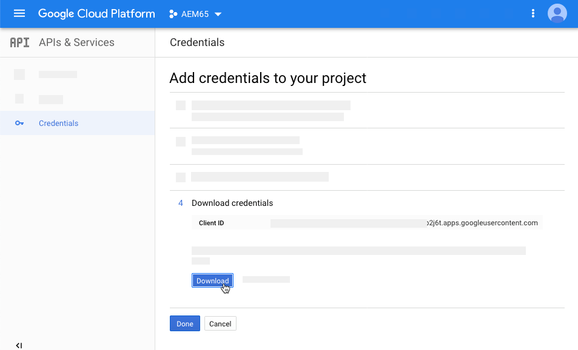

# 视频{#video}

本节介绍如何在 Dynamic Media 中处理视频。

## 快速入门：视频{#quick-start-videos}

下面的工作流分布说明旨在帮助您在 Dynamic Media 中快速设置并运行自适应视频集。每个步骤的后面是对主题标题的交叉引用，您可以在其中找到更多信息。

>[!NOTE]
>
>在Dynamic Media中处理视频之前，请确保Adobe Experience Manager管理员已启用并配置了Dynamic MediaCloud Services。
>
>* 请参阅配置Dynamic Media和[疑难解答Dynamic Media](/help/assets/dynamic-media/troubleshoot-dm.md)中的[配置Dynamic MediaCloud Services](/help/assets/dynamic-media/config-dm.md#configuring-dynamic-media-cloud-services)。

>


1. 通过执行以下操作，**上传 Dynamic Media 视频**：

   * 创建您自己的视频编码配置文件。或者，您也只需使用Dynamic Media附带的预定义&#x200B;_自适应视频编码_&#x200B;配置文件即可。

      * [创建视频编码配置文件](/help/assets/dynamic-media/video-profiles.md#creating-a-video-encoding-profile-for-adaptive-streaming)。
      * 了解有关[视频编码最佳实践](#best-practices-for-encoding-videos)的更多信息。
   * 将视频处理配置文件关联到一个或多个要在其中上传主要源视频的文件夹。

      * [将视频配置文件应用到文件夹](/help/assets/dynamic-media/video-profiles.md#applying-a-video-profile-to-folders)。
      * 了解有关[组织数字资产以使用处理配置文件的最佳实践](/help/assets/dynamic-media/best-practices-for-file-management.md)的更多信息。
      * 了解有关[组织数字资产](/help/assets/organize-assets.md)的更多信息。
   * 将主源视频上传到文件夹。 您可以上传每个最大15 GB的视频文件。 将视频添加到文件夹后，这些视频会根据您分配给文件夹的视频处理配置文件进行编码。

      * [上传视频](/help/assets/manage-video-assets.md#upload-and-preview-video-assets)。
      * 了解有关[支持的输入文件格式](/help/assets/file-format-support.md)的更多信息。
   * 监视[视频编码在资产或工作流视图中的进展情况](#monitoring-video-encoding-and-youtube-publishing-progress)。


1. 通过执行以下任意操作，**管理 Dynamic Media 视频**：

   * 组织、浏览和搜索视频资产

      * [组织数字资产](/help/assets/organize-assets.md)
了解有关[组织数字资产以使用处理配置文件的最佳实践](/help/assets/dynamic-media/best-practices-for-file-management.md)的更多信息

      * [搜索视频资](/help/assets/search-assets.md#custompredicates) 产或 [搜索资产](/help/assets/manage-digital-assets.md#search-assets)
   * 预览和发布视频资产

      * 查看源视频以及视频的编码演绎版及其关联的缩略图：
         [预览视](/help/assets/manage-video-assets.md#upload-and-preview-video-assets) 频或 [预览资产](/help/assets/dynamic-media/previewing-assets.md)
         [管理视频演绎版](/help/assets/manage-digital-assets.md#managing-renditions)


<!-- Commented video-renditions.md as the file is not published yet and will lead to broken link.
        * View the source video and encoded renditions of the video along with its associated thumbnails:
          [Previewing videos](/help/assets/manage-video-assets.md#upload-and-preview-video-assets) or [Previewing assets](/help/assets/dynamic-media/previewing-assets.md)
          [Viewing video renditions](/help/assets/video-renditions.md)
          [Managing video renditions](/help/assets/manage-digital-assets.md#managing-renditions) -->

    * [管理查看器预设](/help/assets/dynamic-media/managing-viewer-presets.md)
    * [发布资产](/help/assets/dynamic-media/publishing-dynamicmedia-assets.md)
    
    *使用视频元数据

<!--      * View the properties of an encoded video rendition such as frame rate, audio and video bitrate, and codec:
          [Viewing video rendition properties](/help/assets/video-renditions.md) -->

    *编辑视频的属性，如标题、描述和标记、自定义元数据字段：
    [编辑视频属性](/help/assets/manage-digital-assets.md#editing-properties)
    
    * [管理数字资产的元数据](/help/assets/manage-metadata.md)
    * [元数据架构](/help/assets/metadata-schemas.md)
    
    *审阅、批准和注释视频，并维护完整版本控制
    
    * [对视频添加注释](/help/assets/manage-video-assets.md#annotate-video-assets)或[对资产添加注释](/help/assets/manage-digital-assets.md#annotating)
    
    * [创建版本](/help/assets/manage-digital-assets.md#asset-versioning)
    * [启动资产工作流](/help/assets/manage-digital-assets.md#starting-a-workflow-on-an-asset)

<!-- Removing assets-workflow.md file link as it is not applicable anymore. Workflows are replaced by processing profiles.
        * [Creating a version](/help/assets/manage-digital-assets.md#asset-versioning)
        * [Applying workflows to assets](/help/assets/assets-workflow.md) or see [Starting a workflow on an asset](/help/assets/manage-digital-assets.md#starting-a-workflow-on-an-asset)
-->

    * [查看文件夹资产](/help/assets/bulk-approval.md)
    * [项目](/help/sites-cloud/authoring/projects/overview.md)

1. 通过执行以下任一操作，**发布 Dynamic Media 视频**：

   * 如果您使用Experience Manager作为WCM（Web内容管理）系统，则可以直接将视频添加到您的网页。

      * [将视频添加到网页](/help/assets/dynamic-media/adding-dynamic-media-assets-to-pages.md)。
   * 如果您使用的是第三方Web内容管理系统，则可以将视频链接或嵌入到您的网页。

      * 使用URL集成视频：
         [将 URL 关联到您的 Web 应用程序](/help/assets/dynamic-media/linking-urls-to-yourwebapplication.md).

      * 使用网页上的嵌入代码集成视频：
         [在网页上嵌入视频查看器](/help/assets/dynamic-media/embed-code.md)。
   * [将视频发布到 YouTube](#publishing-videos-to-youtube)。
   * [生成视频报表](#viewing-video-reports)。

   * [为视频添加字幕](#adding-captions-to-video)。


## 在Dynamic Media中处理视频{#working-with-video-in-dynamic-media}

Dynamic Media中的视频是一个端到端解决方案，可轻松发布高质量自适应视频，以便在多个屏幕(包括桌面设备、iOS、Android™、BlackBerry®和Windows®移动设备)上进行流播放。自适应视频集是同一视频的一组版本，这些版本以不同的比特率和格式进行编码，如400 kbps、800 kbps和1000 kbps。台式计算机或移动设备会检测可用带宽。

例如，在 iOS 移动设备上，设备检测到 3G、4G 或 Wi-Fi 等带宽。设备会随之自动从自适应视频集内的各种视频比特率中选择正确的编码视频。然后，视频会在桌面设备、移动设备或平板电脑上进行流播放。

此外，如果桌面或移动设备上的网络条件发生变化，设备会自动动态地切换视频质量。此外，如果客户在桌面上进入全屏模式，自适应视频集将使用更好的分辨率做出响应，从而改善客户的观看体验。 对于在多个屏幕和设备上播放Dynamic Media视频的客户，使用自适应视频集可为您提供最佳的播放方式。

视频播放器在播放期间用于确定要播放或要选择的编码视频的逻辑，基于以下算法：

1. 视频播放器根据与播放器本身中为“初始比特率”设置的值最接近的比特率来加载初始视频片段。
1. 视频播放器根据带宽速度的更改使用以下条件进行切换：

   1. 播放器会选取低于或等于估计带宽的最高带宽流。
   1. 播放器仅考虑可用带宽的80%。 但是，如果它正在切换，则更为保守，仅为70%，以避免过高估计并立即切换回来。

有关算法的详细技术信息，请参阅[https://android.googlesource.com/platform/frameworks/av/+/master/media/libstagefright/httplive/LiveSession.cpp](https://android.googlesource.com/platform/frameworks/av/+/master/media/libstagefright/httplive/LiveSession.cpp)

要管理单个视频和自适应视频集，支持以下操作：

* 用多种支持的视频格式和音频格式上传视频，并将视频编码为 MP4 H.264 格式，以供在多种屏幕上播放。您可以使用预定义的自适应视频预设或单个视频编码预设，或者自定义您自己的编码，来控制视频的质量和大小。

   * 在生成自适应视频集时，会包括 MP4 视频。
   * **注意**:主/源视频不会添加到自适应视频集。

* 所有HTML5视频查看器中的视频字幕。
* 组织、浏览和搜索具有全面元数据支持的视频，以实现高效的视频资产管理。
* 将自适应视频集交付到Web和桌面，以及移动设备，包括iPhone、iPad、Android™、BlackBerry®和Windows®手机。

各种iOS平台支持自适应视频流播放。 请参阅[Dynamic Media查看器参考指南](https://experienceleague.adobe.com/docs/dynamic-media-developer-resources/library/viewers-aem-assets-dmc/video/c-html5-video-reference.html)。

Dynamic Media支持为MP4 H.264视频播放移动设备视频。您可以在以下位置找到支持此视频格式的BlackBerry®设备：[BlackBerry®](https://support.blackberry.com/kb/articleDetail?ArticleNumber=000005482)上支持的视频格式。

您可以在以下位置找到支持此视频格式的Windows®设备：[Windows® Phone](https://msdn.microsoft.com/library/windows/apps/ff462087%28v=vs.105%29.aspx)上支持的视频格式

* 使用 Dynamic Media 视频查看器预设播放视频，包括以下查看器：

   * 单一视频查看器。
   * 将视频和图像内容组合在一起的混合媒体查看器。

* 配置视频播放器以满足您的品牌需求。
* 使用简单的 URL 或嵌入代码将视频集成到您的网站、移动站点或移动应用程序。

请参阅[动态视频播放](https://s7d9.scene7.com/s7/uvideo.jsp?asset=GeoRetail/Mop_AVS&amp;config=GeoRetail/Universal_Video1&amp;stageSize=640,480)示例。

另请参阅[《Dynamic Media查看器参考指南》](https://experienceleague.adobe.com/docs/dynamic-media-developer-resources.html)中的[Experience Manager资产查看器和Dynamic Media Classic](https://experienceleague.adobe.com/docs/dynamic-media-developer-resources/library/viewers-aem-assets-dmc/c-html5-s7-aem-asset-viewers.html#viewers-aem-assets-dmc)和[Experience Manager资产查看器](https://experienceleague.adobe.com/docs/dynamic-media-developer-resources/library/viewers-for-aem-assets-only/c-html5-aem-asset-viewers.html#viewers-for-aem-assets-only)。

## 最佳实践：使用HTML5视频查看器{#best-practice-using-the-html-video-viewer}

Dynamic Media HTML5视频查看器预设是强大的视频播放器。您可以使用它们来避免与HTML5视频播放相关的许多常见问题以及与移动设备相关的问题。 例如，缺少自适应流传输和桌面浏览器访问范围有限。

在播放器的设计方面，您可以使用标准Web开发工具来设计视频播放器的功能。 例如，您可以使用 HTML5 和 CSS 设计按钮、控件和自定义标识图像背景，从而帮助您向客户展示自定义的外观。

在查看器的播放方面，查看器可以自动检测浏览器的视频功能。然后，它使用HLS（HTTP实时流）（也称为自适应视频流）来提供视频。 或者，如果这些传送方法不可用，则会改用 HTML5 渐进式流播放。

您可以将使用HTML5和CSS设计播放组件的功能合并到单个播放器中。 它可以具有嵌入式播放，并根据浏览器的功能使用自适应和渐进式流播放。 所有这些功能都意味着您可以将富媒体内容的访问范围扩展到桌面用户和移动设备用户，并确保简化视频体验。

另请参阅《Dynamic Media查看器参考指南》[](https://experienceleague.adobe.com/docs/dynamic-media-developer-resources.html)中的[仅用于Experience Manager资产的查看器](https://experienceleague.adobe.com/docs/dynamic-media-developer-resources/library/viewers-for-aem-assets-only/c-html5-aem-asset-viewers.html#viewers-for-aem-assets-only)。

### 使用HTML5视频查看器{#playback-of-video-on-desktop-computers-and-mobile-devices-using-the-html-video-viewer}在台式计算机和移动设备上播放视频

对于桌面和移动设备自适应视频流播放，用于比特率切换的视频基于自适应视频集中的所有MP4视频。

使用HLS或渐进式视频下载时出现视频播放。 在以前版本的Experience Manager（如6.0、6.1和6.2）中，视频通过HTTP进行流处理。

但是，在Experience Manager6.3及更高版本中，视频现在通过HTTPS（即HLS）进行流处理，因为DM网关服务URL也始终使用HTTPS。 此默认行为不会对客户造成任何影响。 也就是说，除非浏览器不支持，否则视频流将始终通过HTTPS进行。 （请参阅下表）。 因此，

* 如果您的HTTPS网站使用HTTPS视频流，则可以进行流播放。
* 如果您的HTTP网站使用HTTPS视频流，则流处理可以正常进行，并且Web浏览器中不会出现混合内容问题。

HLS是Apple的自适应视频流播放标准，可根据网络带宽容量自动调整播放。 它还允许客户“搜寻”视频中的任意点，而无需等待视频的其余部分下载。

通过在用户的桌面系统或移动设备上本地下载和存储视频来传送渐进式视频。

下表介绍了使用[Dynamic Media HTML5视频查看器](https://experienceleague.adobe.com/docs/dynamic-media-developer-resources/library/viewers-for-aem-assets-only/interactive-video/c-html5-aem-int-video.html#interactive-video)在台式计算机和移动设备上播放视频的设备、浏览器和方法。

<table>
 <tbody>
  <tr>
   <td><strong>设备</strong></td>
   <td><strong>浏览器</strong></td>
   <td><strong>视频播放模式</strong></td>
  </tr>
  <tr>
   <td>桌面设备</td>
   <td>Internet Explorer 9和10</td>
   <td>渐进式下载。</td>
  </tr>
  <tr>
   <td>桌面设备</td>
   <td>Internet Explorer 11+</td>
   <td>在Windows® 8和Windows® 10上 — 每当请求HLS时，都强制使用HTTPS。 已知限制：HLS上的HTTP在此浏览器/操作系统组合中不起作用<br /> <br />在Windows® 7上 — 渐进式下载。 使用标准逻辑选择HTTP与HTTPS协议。</td>
  </tr>
  <tr>
   <td>桌面设备</td>
   <td>Firefox 23-44</td>
   <td>渐进式下载。</td>
  </tr>
  <tr>
   <td>桌面设备</td>
   <td>Firefox 45或更高版本</td>
   <td>HLS</td>
  </tr>
  <tr>
   <td>桌面设备</td>
   <td>铬黄</td>
   <td>HLS</td>
  </tr>
  <tr>
   <td>桌面设备</td>
   <td>Safari(Mac)</td>
   <td>HLS</td>
  </tr>
  <tr>
   <td>移动设备</td>
   <td>Chrome(Android™ 6或更早版本)</td>
   <td>渐进式下载。</td>
  </tr>
  <tr>
   <td>移动设备</td>
   <td>Chrome(Android™ 7或更高版本)</td>
   <td>HLS</td>
  </tr>
  <tr>
   <td>移动设备</td>
   <td>Android™（默认浏览器）</td>
   <td>渐进式下载。</td>
  </tr>
  <tr>
   <td>移动设备</td>
   <td>Safari(iOS)</td>
   <td>HLS</td>
  </tr>
  <tr>
   <td>移动设备</td>
   <td>Chrome(iOS)</td>
   <td>HLS</td>
  </tr>
  <tr>
   <td>移动设备</td>
   <td>BlackBerry®</td>
   <td>HLS</td>
  </tr>
 </tbody>
</table>

## Dynamic Media视频解决方案的架构{#architecture-of-dynamic-media-video-solution}

下图显示了视频的整体创作工作流程，这些视频通过DMGateway(在Dynamic Media混合模式下)上传和编码，并可供公众使用。


## 视频的混合发布架构{#hybrid-publishing-architecture-for-videos}


## 视频编码的最佳实践 {#best-practices-for-encoding-videos}

如果您已启用Dynamic Media并设置了视频Cloud Services，则&#x200B;**Dynamic Media编码视频**&#x200B;工作流会对视频进行编码。 此工作流会捕获工作流进程历史记录和失败信息。请参阅[监视视频编码和 YouTube 发布进度](#monitoring-video-encoding-and-youtube-publishing-progress)。如果您已启用Dynamic Media并设置视频Cloud Services，则在您上传视频时，**[!UICONTROL Dynamic Media编码视频]**&#x200B;工作流将自动生效。 (如果您没有使用Dynamic Media，则&#x200B;**[!UICONTROL DAM更新资产]**&#x200B;工作流将生效。)

以下是关于源视频文件编码的最佳实践提示。

<!-- For advice about video encoding, see the following:

* [Streaming 101: The Basics — Codecs, Bandwidth, Data Rate, and Resolution](https://www.adobe.com/go/learn_s7_streaming101_en).
* [Video Encoding Basics](https://www.adobe.com/go/learn_s7_encoding_en). -->

### 源视频文件 {#source-video-files}

在对视频文件进行编码时，请尽可能使用最高质量的源视频文件。避免使用先前已编码的视频文件，因为这样的文件已经压缩，进一步编码会导致创建的视频质量不佳。

下表描述了源视频文件在编码之前必须具有的推荐大小、宽高比和最小比特率：

| 大小 | 宽高比 | 最低比特率 |
|--- |--- |--- |
| 1024 X 768 | 4:3 | 4500 kbps，适用于大部分视频。 |
| 1280 X 720 | 16:9 | 3000 - 6000 kbps，具体取决于视频中的动作数量。 |
| 1920 X 1080 | 16时9分 | 6000 - 8000 kbps，具体取决于视频中的动作数量。 |

### 获取文件的元数据 {#obtaining-a-file-s-metadata}

获取文件元数据的方法如下：通过使用视频编辑工具查看文件的元数据，或者使用专门为获取元数据而设计的应用程序。下面说明了如何使用第三方应用程序 MediaInfo 获取视频文件的元数据：

1. 转到此网页：[https://mediainfo.sourceforge.net/en/Download](https://mediainfo.sourceforge.net/en/Download)。
1. 选择并下载 GUI 版本的安装程序，然后按照安装说明进行操作。
1. 安装后，右键单击视频文件(仅限Windows®)并选择“MediaInfo”，或打开“MediaInfo”并将视频文件拖到应用程序中。您会看到与视频文件关联的所有元数据，包括其宽度、高度和fps。

### 宽高比 {#aspect-ratio}

在为主源视频文件选择或创建视频编码预设时，请确保预设的宽高比与主源视频文件的宽高比相同。 宽高比是视频的宽度与高度的比率。

要确定视频文件的宽高比，请获取文件的元数据并记下文件的宽度和高度（请参阅上面的获取文件的元数据）。 然后，使用下式确定宽高比：

宽度/高度 = 宽高比

下表说明了公式结果如何转换成常见的宽高比选项：

| 公式结果 | 宽高比 |
|--- |--- |
| 1.33 | 4:3 |
| 0.75 | 3:4 |
| 1.78 | 16时9分 |
| 0.56 | 9:16 |

例如，宽度为1440 x 1080的视频的宽高比为1440/1080或1.33。在这种情况下，请选择宽高比为4:3的视频编码预设，以对视频文件进行编码。

### 比特率 {#bitrate}

比特率是经过编码，构成视频播放一秒的数据量。 比特率以千比特每秒(Kbps)为单位进行测量。

>[!NOTE]
>
>由于所有编解码器都使用有损压缩，因此比特率是视频质量中最重要的因素。 使用有损压缩时，对视频文件的压缩程度越大，质量就降低得越多。因此，所有其他特性（分辨率、帧速率和编解码器）均相等，比特率越低，压缩文件的质量就越低。

选择比特率编码时，可以选择以下两种类型：

* **[!UICONTROL 恒定比特率编码]** (CBR) — 在CBR编码期间，在整个编码过程中，比特率或每秒的比特数保持相同。CBR编码会在整个视频中将设置的数据速率保留为您的设置。 此外，CBR编码不会为质量优化媒体文件，但会节省存储空间。
如果您的视频在整个视频中包含相似的运动级别，则使用CBR。 CBR最常用于流式传输视频内容。 另请参阅[使用自定义添加的视频编码参数](/help/assets/dynamic-media/video-profiles.md#using-custom-added-video-encoding-parameters)。

* **[!UICONTROL 变量比特率编码]** (VBR)- VBR编码可根据压缩程序所需的数据，将数据率调低并调整到您设置的上限。此功能意味着在VBR编码过程中，媒体文件的比特率会根据媒体文件的比特率需求动态增加或减少。
VBR需要较长的编码时间，但会产生最有利的结果；媒体文件的质量优于其他文件。 VBR最常用于视频内容的http渐进式交付。

何时使用VBR与CRB?
选择VBR与CBR时，几乎总是建议将VBR用于媒体文件。 VBR以具有竞争力的比特率提供高质量文件。 使用VBR时，请务必对两遍编码进行使用，并将最大比特率设置为目标视频比特率的1.5倍。

选择视频编码预设时，请确保考虑目标最终用户的连接速度。 所选预设的数据率应该是目标最终用户连接速度的 80%。例如，如果目标最终用户的连接速度是 1000 Kbps，则最佳预设就是视频数据率为 800 Kbps 的预设。

下表说明了典型连接速度的数据率。

| 速度 (Kbps) | 连接类型 |
|--- |--- |
| 256 | 拨号连接。 |
| 800 | 典型移动连接。对于此类连接，3G 体验的目标数据率范围为 400 至最高 800。 |
| 2000 | 典型的宽带桌面连接。对于此连接，目标数据率范围为800-2000 Kbps，大多数目标数据率平均为1200-1500 Kbps。 |
| 5000 | 典型高宽带连接。不建议在此较高范围下进行编码，因为大多数用户并不具备此速度的视频传送条件。 |

### 分辨率 {#resolution}

**分辨率**&#x200B;以像素为单位描述视频文件的高度和宽度。大多数源视频以高分辨率存储（例如，1920 x 1080）。出于流播放目的，源视频会压缩至较低分辨率（640 x 480 或更低）。

分辨率和数据率是两个相互关联、密不可分的因素，它们决定着视频质量。为保持同等的视频质量，视频文件的像素数越高（分辨率越高），数据率就必须越高。例如，考虑分辨率分别为 320 x 240 和 640 x 480 的视频文件的每帧像素数：

| 分辨率 | 每帧像素数 |
|--- |--- |
| 320 x 240 | 76,800 |
| 640 x 480 | 307,200 |

对于分辨率为 640 x 480 的文件，其每帧像素数高出四倍。为使这两个示例分辨率的文件实现同等的数据率，您需要对分辨率为 640 x 480 的文件应用四倍的压缩，而这会降低视频的质量。因此，如果视频数据率为 250 Kbps，则在 320 x 240 分辨率下观看时质量会很高，但在 640 x 480 分辨率下观看时质量则不高。

通常，您使用的数据率越高，视频的显示效果越好，您使用的分辨率越高，您必须保持查看质量的数据率就越高（与分辨率较低的数据相比）。

由于分辨率与数据率相关联，在对视频进行编码时，有两种选择：

* 选择一个数据率，然后以在所选数据率中显示良好的最高分辨率进行编码。
* 选择一个分辨率，然后使用在选定分辨率下获得高质量视频所需的数据率进行编码。

当您为主源视频文件选择（或创建）视频编码预设时，请使用此表来确定正确的分辨率：

| 分辨率 | 高度（像素） | 屏幕大小 |
|--- |--- |--- |
| 240p | 240 | 微型屏幕 |
| 300p | 300 | 通常用于移动设备的小型屏幕 |
| 360p | 360 | 小型屏幕 |
| 480p | 480 | 中型屏幕 |
| 720p | 720 | 大型屏幕 |
| 1080p | 1080 | 高清晰度大型屏幕 |

### Fps（每秒帧数）{#fps-frames-per-second}

在美国和日本，大多数视频以 29.97 帧/秒 (fps) 的速率拍摄；在欧洲，大多数视频以 25 fps 的速率拍摄。电影是以 24 fps 的速率拍摄。

选择与主源视频文件的fps速率匹配的视频编码预设。 例如，如果主源视频的帧数为25 fps，请选择25 fps的编码预设。 默认情况下，所有自定义编码都使用主源视频文件的fps。 鉴于这一原因，您在创建视频编码预设时不需要明确指定 fps 设置。

### 视频编码尺寸 {#video-encoding-dimensions}

为实现最佳效果，请选择相应编码尺寸，使源视频成为所有编码视频的整数倍数。

要计算此比率，请用源宽度除以编码宽度，得出宽度比。然后，用源高度除以编码高度，得出高度比。

如果计算得出的比率是整数，就意味着视频已得到最佳缩放。如果计算得出的比率不是整数，则会影响视频质量，使显示屏上出现残留像素伪影。当视频含有文本时，这种影响最为明显。

例如，假定源视频的分辨率为 1920 x 1080。在下表中，这三个编码视频提供了可使用的最佳编码设置。

| 视频类型 | 宽度 x 高度 | 宽度比 | 高度比 |
|--- |--- |--- |--- |
| 源 | 1920 x 1080 | 1 | 1 |
| 编码 | 960 x 540 | 2 | 2 |
| 编码 | 640 x 360 | 3 | 1 |
| 编码 | 480 x 270 | 4 | 4 |

### 编码视频文件格式 {#encoded-video-file-format}

Dynamic Media 建议使用 MP4 H.264 视频编码预设。由于 MP4 文件使用 H.264 视频编解码器，因此 MP4 可以提供高质量的视频，但需要压缩文件大小。

## 将视频发布到 YouTube {#publishing-videos-to-youtube}

您可以将Experience Manager资产中管理的视频资产直接发布到您之前创建的YouTube渠道。

要将视频资产发布到YouTube，您需要在Experience Manager资产中为视频资产添加标记，并使用标记。 将这些标记与YouTube渠道相关联。 如果视频资产的标记与YouTube渠道的标记匹配，则该视频会发布到YouTube。 只要使用关联的标记，发布到YouTube时，也会与视频的正常发布一起发生。

YouTube自行编码。 因此，上传到Experience Manager的原始视频文件会发布到YouTube，而不是Dynamic Media编码创建的任何视频演绎版。 虽然使用Dynamic Media无需处理视频，但在播放需要查看器预设时，应该会这样做。

绕过视频处理配置文件并直接发布到YouTube时，这仅意味着Experience Manager资产中的视频资产没有可查看的缩略图。 这还意味着未编码的视频不适用于任何Dynamic Media资产类型。

将视频资产发布到YouTube服务器涉及完成以下任务，以确保通过YouTube进行安全的服务器到服务器验证：

1. [配置Google Cloud设置](#configuring-google-cloud-settings)
1. [创建YouTube渠道](#creating-a-youtube-channel)
1. [添加标记以进行发布](#adding-tags-for-publishing)
1. [在Experience Manager中设置YouTube](#setting-up-youtube-in-aem)
1. [（可选）自动设置已上传视频的默认YouTube属性](#optional-automating-the-setting-of-default-youtube-properties-for-your-uploaded-videos)
1. [将视频发布到您的 YouTube 频道](#publishing-videos-to-your-youtube-channel)
1. [（可选）验证已发布到 YouTube 上的视频](/help/assets/dynamic-media/video.md#optional-verifying-the-published-video-on-youtube)
1. [将 YouTube URL 关联到您的 Web 应用程序](#linking-youtube-urls-to-your-web-application)

您还可以[取消发布视频以将其从 YouTube 中删除](#unpublishing-videos-to-remove-them-from-youtube)。

### 配置Google Cloud设置{#configuring-google-cloud-settings}

要发布到YouTube，您需要Google帐户。 如果你有Gmail账户，那么你已经有Google账户；如果您没有Google帐户，则可以轻松创建一个。 您需要该帐户，因为您需要凭据才能将视频资产发布到YouTube。 如果已创建帐户，请跳过此任务，并直接转到[创建YouTube渠道](#creating-a-youtube-channel)。

与Google Cloud一起使用的帐户和用于YouTube的Google帐户不必相同。

Google会定期更改其用户界面。 因此，将视频发布到YouTube的步骤可能与下面介绍的步骤略有不同。 当您尝试检查视频是否上传到YouTube时，此注意事项也适用。

>[!NOTE]
>
>编写本文时，以下步骤是准确的。 但是，Google会定期更新其网站，恕不另行通知。 因此，这些步骤可能略有不同。

**要配置Google Cloud设置，请执行以下操作：**

1. 创建Google帐户。
   [https://accounts.google.com/SignUp?service=mail](https://accounts.google.com/SignUp?service=mail)

   如果您已经拥有Google帐户，请跳到下一步。

1. 转到[https://cloud.google.com/](https://cloud.google.com/)。
1. 在Google cloud页面的右上角附近，单击控制 **[!UICONTROL 台]**。

   如有必要，请使用您的Google帐户凭据&#x200B;**[!UICONTROL 登录]**&#x200B;以查看&#x200B;**[!UICONTROL Console]**&#x200B;选项。

1. 在功能板页面的&#x200B;**[!UICONTROL Google Cloud Platform]**&#x200B;右侧，单击项目下拉列表以打开选择项目对话框。
1. 在选择项目对话框中，点按&#x200B;**[!UICONTROL 新建项目]**。

   

1. 在新建项目对话框的项目名称字段中，键入新项目的名称。

   您的项目ID基于您的项目名称。 因此，请仔细选择项目名称；创建后无法更改。 此外，当您稍后在Experience Manager中设置YouTube时，必须再次输入相同的项目ID。 所以，把它写下来。

1. 单击&#x200B;**[!UICONTROL 创建]**。

1. 执行以下操作之一：

   * 在项目的功能板的快速入门卡中，点按&#x200B;**[!UICONTROL 浏览并启用API]**。
   * 在项目的功能板的API卡中，点按&#x200B;**[!UICONTROL 转到API概述]**。

   

1. 在“API和服务”页面顶部附近，点按&#x200B;**[!UICONTROL 启用API和服务]**。
1. 在“API库”页面左侧的&#x200B;**[!UICONTROL 类别]**&#x200B;下，点按&#x200B;**[!UICONTROL YouTube]**。 在页面的右侧，点按&#x200B;**[!UICONTROL YouTube数据API]**。
1. 在YouTube Data API v3页面上，点按&#x200B;**[!UICONTROL 启用]**。

   

1. 要使用API，您需要凭据。 如有必要，请单击&#x200B;**[!UICONTROL 创建凭据]**。

   

1. 在&#x200B;**[!UICONTROL 将凭据添加到项目]**&#x200B;页面的步骤1中，执行以下操作：

   * 从&#x200B;**[!UICONTROL 您使用的API中？]** 下拉列表中，选择 **[!UICONTROL YouTube数据API v3]**。

   * 从&#x200B;**[!UICONTROL 从何处调用API?]** 下拉列表中，选 **[!UICONTROL 择“Web服务器”（例如node.js、Tomcat）]**。

   * 从&#x200B;**[!UICONTROL 您访问哪些数据？]** 下拉列表中，点按用 **[!UICONTROL 户数据]**。

   

1. 点按&#x200B;**[!UICONTROL 我需要哪些凭据？]**
1. 在&#x200B;**[!UICONTROL 将凭据添加到项目]**&#x200B;页面中步骤 2 的&#x200B;**[!UICONTROL 创建 OAuth 2.0 客户端 ID]** 标题下，根据需要在“名称”字段中输入唯一名称。或者，您也可以使用 Google 指定的默认名称。
1. 在&#x200B;**[!UICONTROL 授权的JavaScript™源]**&#x200B;标题的文本字段中，输入以下路径，在路径中替换您自己的域和端口号，然后按&#x200B;**[!UICONTROL Enter]**&#x200B;以添加列表的路径：

   `https://<servername.domain>:<port_number>`

   例如，`https://1a2b3c.mycompany.com:4321`

   **注意**:上述路径示例仅供说明。

   

1. 在&#x200B;**[!UICONTROL 已授权的重定向URI]**&#x200B;标题下，在文本字段中，输入以下路径，在路径中替换您自己的域和端口号，然后按&#x200B;**[!UICONTROL Enter]**&#x200B;将路径添加到列表：

   `https://<servername.domain>:<port_number>/etc/cloudservices/youtube.youtubecredentialcallback.json`

   例如，`https://1a2b3c.mycompany.com:4321/etc/cloudservices/youtube.youtubecredentialcallback.json`

   **注意**:上述路径示例仅供说明。

1. 单击&#x200B;**[!UICONTROL 创建OAuth客户端ID]**。
1. 在&#x200B;**[!UICONTROL 向项目添加凭据]**&#x200B;页面的步骤 3 中，在&#x200B;**[!UICONTROL 设置 OAuth 2.0 许可屏幕]**&#x200B;标题下，选择您当前使用的 Gmail 电子邮件地址。

   

1. 在显示给用户的&#x200B;**[!UICONTROL 产品名称]**&#x200B;标题下，在文本字段中，输入要在同意屏幕上显示的内容。

   当Experience Manager管理员对YouTube进行身份验证时，会向用户显示同意屏幕。 Experience Manager联系YouTube以获取权限。

1. 单击&#x200B;**[!UICONTROL 继续]**。
1. 在将凭据添加到项目页面的步骤4中，在“下载凭据 **[!UICONTROL ”标题下]** ，点按 **[!UICONTROL 下载]**。

   

1. 保存`client_id.json`文件。

   稍后在Adobe Experience Manager中设置YouTube时，您需要此下载的json文件。

1. 单击&#x200B;**[!UICONTROL 完成]**。

   从Google帐户注销。 现在，创建YouTube渠道。

### 创建YouTube渠道{#creating-a-youtube-channel}

将视频发布到YouTube要求您拥有一个或多个渠道。 如果已创建YouTube渠道，则可以跳过此任务，转到[添加标记以进行发布](/help/assets/dynamic-media/video.md#adding-tags-for-publishing)。

>[!CAUTION]
>
>确保已在YouTube *中的*&#x200B;之前的“Experience Manager中的YouTube设置”下添加渠道(请参阅下面的[在Experience Manager](#setting-up-youtube-in-aem)中设置YouTube)，已在中设置一个或多个渠道。 如果您未能设置渠道，则系统不会警告您现有渠道。 但是，在添加渠道时，仍会发生Google验证，但是没有选项可选择发送视频的渠道。

**要创建YouTube渠道，请执行以下操作：**

1. 转到[https://www.youtube.com](https://www.youtube.com/)，然后使用您的Google帐户凭据登录。
1. 在YouTube页面的右上角，单击您的配置文件图片（也可以在纯色圆中显示为字母），然后点按&#x200B;**[!UICONTROL YouTube设置]**（圆齿轮图标）。
1. 在概述页面的其他功能标题下，点按&#x200B;**[!UICONTROL 查看我的所有渠道或创建新渠道]**。
1. 在渠道页面上，点按&#x200B;**[!UICONTROL 创建新渠道]**。
1. 在品牌帐户页面的品牌帐户名称字段中，输入公司名称或您选择的要在其中发布视频资产的任何其他渠道名称，然后单击&#x200B;**[!UICONTROL 创建]**。

   请记住您在此处输入的名称；必须在Experience Manager中设置YouTube时，必须再次输入该参数。

1. （可选）根据需要，添加更多渠道。

   现在，您可以添加标记以进行发布。

### 添加用于发布{#adding-tags-for-publishing}的标记

要将视频发布到YouTube,Experience Manager会将标记关联到一个或多个YouTube渠道。 要添加用于发布的标记，请参阅[管理标记](/help/sites-cloud/authoring/features/tags.md)。

或者，如果您打算在Experience Manager中使用默认标记，则可以跳过此任务，转到[在Experience Manager](#setting-up-youtube-in-aem)中设置YouTube。

>[!NOTE]
>
>配置Cloud Service后，此时无需其他配置即可启用YouTube发布复制代理。 原因是在保存Cloud Service配置时启用了该设置。

<!-- ### Enabling the YouTube Publish replication agent {#enabling-the-youtube-publish-replication-agent}

After you enable the YouTube Publish replication agent, if you want to test the connection to the Google Cloud account, tap **[!UICONTROL Test Connection]**. A browser tab displays the connection results. If you have added YouTube Channels, then a listing of those is displayed as part of the test.

1. In the upper-left corner of Experience Manager, click the Experience Manager logo, then in the left rail, click **[!UICONTROL Tools]** > **[!UICONTROL Deployment]** > **[!UICONTROL Replication]** > **[!UICONTROL Agents on Author]**.
1. On the Agents of Author page, click **[!UICONTROL YouTube Publish (youtube)]**.
1. On the toolbar, to the right of Settings, click **[!UICONTROL Edit]**.
1. Select the **[!UICONTROL Enabled]** checkbox to turn on the replication agent.
1. Click **[!UICONTROL OK]**. -->

### 在Experience Manager{#setting-up-youtube-in-aem}中设置YouTube

从Experience Manager6.4开始，引入了新的触屏用户界面方法，以在Experience Manager中设置YouTube发布。 根据您所使用的Experience Manager的已安装实例，执行以下操作之一：

* 要在6.4之前的Experience Manager中配置YouTube，请参阅[在6.4](/help/assets/dynamic-media/video.md#setting-up-youtube-in-aem-before)之前的Experience Manager中设置YouTube 。
* 要在Experience Manager6.4或更高版本中配置YouTube，请参阅[在Experience Manager6.4及更高版本中设置YouTube](#setting-up-youtube-in-aem-and-later)。

#### 在Experience Manager6.4及更高版本中设置YouTube {#setting-up-youtube-in-aem-and-later}

1. 请确保以管理员身份登录Dynamic Media实例。
1. 点按Experience Manager左上角的Experience Manager徽标，然后点按左边栏中的&#x200B;**[!UICONTROL 工具]**（锤子图标）> **[!UICONTROL Cloud Services]** > **[!UICONTROL YouTube发布配置]**。
1. 点按&#x200B;**[!UICONTROL 全局]**（请勿选择它）。

1. 在全局页面的右上角附近，点按&#x200B;**[!UICONTROL 创建]**。
1. 在“创建 YouTube 配置”页面的“Google Cloud Platform 设置”下的&#x200B;**[!UICONTROL 应用程序名称]**&#x200B;字段中，输入 Google 项目 ID。

   您在之前最初配置Google Cloud设置时指定了项目ID。
保持打开创建YouTube配置页面；你马上就会重新开始。

   

1. 使用纯文本编辑器，打开您之前在任务[配置Google Cloud设置](/help/assets/dynamic-media/video.md#configuring-google-cloud-settings)中下载并保存的JSON文件。
1. 选择并复制整个JSON文本。
1. 返回至“YouTube 帐户设置”对话框。在 **[!UICONTROL JSON 配置]**&#x200B;字段中，粘贴 JSON 文本。
1. 在页面的右上角附近，点按&#x200B;**[!UICONTROL 保存]**。

   您现在将在YouTube中设置Experience Manager。

1. 点按&#x200B;**[!UICONTROL 添加渠道]**。
1. 在渠道名称字段中，输入您在任务&#x200B;**[!UICONTROL 向YouTube]**&#x200B;前添加一个或多个渠道中创建的渠道名称。

   您可以根据需要选择添加描述。

1. 点按&#x200B;**[!UICONTROL 添加]**。
1. YouTube/Google验证显示。 如果您尚未登录Google Cloud帐户，请跳过此步骤。

   * 输入与Google项目ID和上述JSON文本关联的Google用户名和密码。
   * 根据您的帐户中有多少个渠道，您会看到两个或更多项目。 选择渠道。 不要选择电子邮件地址；它不是频道。
   * 在下一页，点按&#x200B;**[!UICONTROL 接受]**&#x200B;以允许访问此渠道。

1. 点按&#x200B;**[!UICONTROL 允许]**。

   您现在将设置标记以进行发布。

1. **[!UICONTROL 设置要发布的标记]**  — 在“Cloud Services”>“YouTube”页面上，点按铅笔图标，以编辑要使用的标记列表。
1. 要在Experience Manager中显示可用标记列表，请点按下拉列表图标（倒置尖角）。
1. 要添加标记，请点按一个或多个标记。

   要删除已添加的标记，请选择该标记，然后点按&#x200B;**[!UICONTROL X]**。

1. 添加完所需的标记后，点按&#x200B;**[!UICONTROL 保存]**。

   现在，您将视频发布到YouTube渠道。

#### 在6.4之前的Experience Manager中设置YouTube {#setting-up-youtube-in-aem-before}

1. 请确保以管理员身份登录Dynamic Media实例。

1. 点按Experience Manager左上角的Experience Manager徽标，然后点按左边栏中的&#x200B;**[!UICONTROL 工具]**（锤子图标）> **[!UICONTROL 部署]** > **[!UICONTROL Cloud Services]**。
1. 在第三方服务标题的YouTube下，点按&#x200B;**[!UICONTROL Configure now]**。
1. 在“创建配置”对话框的相应字段中输入标题（必填）和名称（可选）。
1. 点按&#x200B;**[!UICONTROL 创建]**。
1. 在“YouTube 帐户设置”对话框的&#x200B;**[!UICONTROL 应用程序名称]**&#x200B;字段中，输入 Google 项目 ID。

   您最初在[之前配置的Google Cloud设置](/help/assets/dynamic-media/video.md#configuring-google-cloud-settings)时指定了项目ID。
保持打开YouTube帐户设置对话框；你马上就会重新开始。

1. 使用纯文本编辑器，打开您之前在配置Google Cloud设置任务中下载并保存的JSON文件。
1. 选择并复制整个JSON文本。
1. 返回至“YouTube 帐户设置”对话框。在 **[!UICONTROL JSON 配置]**&#x200B;字段中，粘贴 JSON 文本。
1. 点按&#x200B;**[!UICONTROL 确定]**。

   您现在将在YouTube中设置Experience Manager。

1. 在&#x200B;**[!UICONTROL 可用渠道]**&#x200B;右侧，点按 **+**（加号图标）。
1. 在“YouTube频道设置”对话框的“标题”字段中，输入您在之前向YouTube添加一个或多个频道任务中创建的频道 **[!UICONTROL 名称]** 。

   您可以根据需要选择添加描述。

1. 点按&#x200B;**[!UICONTROL 确定]**。
1. YouTube/Google验证显示。 如果您尚未登录Google Cloud帐户，请跳过此步骤。

   * 输入与Google项目ID和上述JSON文本关联的Google用户名和密码。
   * 根据您的帐户中有多少个渠道，您会看到两个或更多项目。 选择渠道。 不要选择电子邮件地址；它不是频道。
   * 在下一页，点按&#x200B;**[!UICONTROL 接受]**&#x200B;以允许访问此渠道。

1. 点按&#x200B;**[!UICONTROL 允许]**。

   您现在将设置标记以进行发布。

1. **[!UICONTROL 设置要发布的标记]**  — 在“Cloud Services”>“YouTube”页面上，点按铅笔图标，以编辑要使用的标记列表。
1. 要在Experience Manager中显示可用标记列表，请点按下拉列表图标（倒置尖角）。
1. 要添加标记，请点按一个或多个标记。

   要删除已添加的标记，请选择该标记，然后点按&#x200B;**X**。

1. 添加完所需的标记后，点按&#x200B;**[!UICONTROL 确定]**。

   现在，您将视频发布到YouTube渠道。

### （可选）自动设置已上传视频的默认YouTube属性{#optional-automating-the-setting-of-default-youtube-properties-for-your-uploaded-videos}

您可以选择在上传视频时自动设置YouTube属性。 在Experience Manager中创建元数据处理配置文件。

要创建元数据处理配置文件，您首先需要从&#x200B;**[!UICONTROL 字段标签]**、**[!UICONTROL 映射到属性]**&#x200B;和&#x200B;**[!UICONTROL 选择]**&#x200B;字段中复制值，所有这些字段均位于视频的元数据架构中。然后，您可以通过将这些值添加到YouTube视频元数据处理配置文件来构建该配置文件。

**要自动设置已上传视频的默认YouTube属性，请执行以下操作：**

1. 在Experience Manager左上角，单击Experience Manager徽标，然后在左边栏中，单击&#x200B;**[!UICONTROL 工具]**（锤子图标）> **[!UICONTROL Assets]** > **[!UICONTROL 元数据架构]**。
1. 单击&#x200B;**[!UICONTROL default]**。 （请勿在“默认”左侧的选择框中添加复选标记。）
1. 在&#x200B;**[!UICONTROL default]**&#x200B;页面中，选中&#x200B;**[!UICONTROL video]**&#x200B;左侧的框，然后单击&#x200B;**[!UICONTROL 编辑]**。
1. 在元数据架构编辑器页面上，单击&#x200B;**[!UICONTROL Advanced]**&#x200B;选项卡。
1. 在“YouTube 发布”标题下，单击 **[!UICONTROL YouTube 类别]**。
1. 在页面右侧的&#x200B;**[!UICONTROL Settings]**&#x200B;选项卡下，执行以下操作：

   * 在&#x200B;**[!UICONTROL 映射到属性]**文本字段中，选择并复制值。
将复制的值粘贴到打开文本编辑器中。 您稍后在创建元数据处理配置文件时将需要此值。 保持文本编辑器处于打开状态。

   * 在&#x200B;**[!UICONTROL Choices]**下，选择并复制您要使用的默认值（如“人员和博客”或“科学与技术”）。
将复制的值粘贴到打开文本编辑器中。 您稍后在创建元数据处理配置文件时将需要此值。 保持文本编辑器处于打开状态。

1. 在YouTube发布标题下，单击&#x200B;**[!UICONTROL YouTube隐私]**。
1. 在页面右侧的&#x200B;**[!UICONTROL Settings]**&#x200B;选项卡下，执行以下操作：

   * 在&#x200B;**[!UICONTROL 映射到属性]**文本字段中，选择并复制值。
将复制的值粘贴到打开文本编辑器中。 您稍后在创建元数据处理配置文件时将需要此值。 保持文本编辑器处于打开状态。

   * 在&#x200B;**[!UICONTROL Choices]**下，选择并复制您要使用的默认值。 请注意，选项分为两对。 对中的底部字段是要复制的默认值，如公共、未列出或私有。
将复制的值粘贴到打开文本编辑器中。 您稍后在创建元数据处理配置文件时将需要此值。 保持文本编辑器处于打开状态。

1. 在“元数据架构编辑器”页面的右上角附近，单击&#x200B;**[!UICONTROL 取消]**。
1. 点按Experience Manager左上角的Experience Manager徽标，然后在左边栏中，单击&#x200B;**[!UICONTROL 工具]**（锤子图标）> **[!UICONTROL Assets]** > **[!UICONTROL 元数据配置文件]**。

1. 在“元数据配置文件”页面的右上角附近，单击&#x200B;**[!UICONTROL 创建]**。
1. 在“添加元数据配置文件”对话框的&#x200B;**[!UICONTROL 配置文件]**&#x200B;文本字段中，输入名称 `YouTube Video`，然后单击&#x200B;**[!UICONTROL 创建]**。
1. 在元数据配置文件编辑器页面上，单击&#x200B;**[!UICONTROL Advance]**&#x200B;选项卡。
1. 通过执行以下操作，将复制的YouTube Publishing值添加到配置文件：

   * 单击页面右侧的&#x200B;**[!UICONTROL 构建表单]**&#x200B;选项卡。
   * （可选）将标有&#x200B;**[!UICONTROL Section Header]**&#x200B;的组件拖到左侧，并将其拖放到表单区域。
   * （可选）单击&#x200B;**[!UICONTROL 字段标签]**&#x200B;以选择组件。
   * （可选）在页面右侧的设置选项卡的字段标签文本字段中，输入`YouTube Publishing`。
   * 单击&#x200B;**[!UICONTROL 构建表单]**&#x200B;选项卡，然后将标有&#x200B;**[!UICONTROL 多值文本]**&#x200B;的组件拖放到您创建的&#x200B;**[!UICONTROL YouTube发布]**&#x200B;标题下。

   * 要选择组件，请单击&#x200B;**[!UICONTROL 字段标签]**。
   * 在页面右侧的设置选项卡下，将您之前复制的YouTube发布值（字段标签值和映射到属性值）粘贴到表单中的相应字段中。 将选项值粘贴到默认值字段中。

1. 通过执行以下操作，将复制的YouTube隐私值添加到配置文件：

   * 单击页面右侧的&#x200B;**[!UICONTROL 构建表单]**&#x200B;选项卡。
   * （可选）将标有&#x200B;**[!UICONTROL Section Header]**&#x200B;的组件拖到左侧，并将其拖放到表单区域。
   * （可选）单击&#x200B;**[!UICONTROL 字段标签]**&#x200B;以选择组件。
   * （可选）在页面右侧的设置选项卡的字段标签文本字段中，输入`YouTube Privacy`。
   * 单击&#x200B;**[!UICONTROL 构建表单]**&#x200B;选项卡，然后将标有&#x200B;**[!UICONTROL 多值文本]**&#x200B;的组件拖放到您创建的&#x200B;**[!UICONTROL YouTube Privacy]**&#x200B;标题下。

   * 要选择组件，请单击&#x200B;**[!UICONTROL 字段标签]**。
   * 在页面右侧的设置选项卡下，将您之前复制的YouTube发布值（字段标签值和映射到属性值）粘贴到表单中的相应字段中。 将选项值粘贴到默认值字段中。

1. 在页面的右上角附近，单击&#x200B;**[!UICONTROL 保存]**。
1. 将YouTube发布元数据配置文件应用到您要上传视频的文件夹。 您必须同时设置元数据配置文件和视频配置文件。

   请参阅 [元数据配置文件](/help/assets/metadata-profiles.md) 和视 [频配置文件](/help/assets/dynamic-media/video-profiles.md)。

### 将视频发布到您的 YouTube 频道 {#publishing-videos-to-your-youtube-channel}

现在，您可以将之前添加的标记与视频资产相关联。 此过程可让Experience Manager知道要将哪些资产发布到您的YouTube渠道。

>[!NOTE]
>
>立即发布不会自动发布到YouTube。 设置 Dynamic Media 时，有两种发布选项可供选择：**[!UICONTROL 立即]**&#x200B;或&#x200B;**[!UICONTROL 激活时]**。
>
>**[!UICONTROL 立即]** 发布是指将上传的资产在与IPS同步后自动发布到交付系统。虽然Dynamic Media是如此，但YouTube并非如此。 要发布到YouTube，您必须通过Experience Manager作者方式发布。

>[!NOTE]
要从YouTube发布内容，Experience Manager使用&#x200B;**[!UICONTROL 发布到YouTube]**&#x200B;工作流，该工作流允许您监视进度并查看任何失败信息。
请参阅[监视视频编码和 YouTube 发布进度](#monitoring-video-encoding-and-youtube-publishing-progress)。
有关更详细的进度信息，您可以在复制下监视YouTube日志。 但是，请注意，此类监控需要管理员访问权限。

**要将视频发布到您的 YouTube 频道，请执行以下操作：**

1. 在Experience Manager中，导航到要发布到YouTube渠道的视频资产。
1. 选择视频资产（自适应视频集）。
1. 在工具栏中，单击&#x200B;**[!UICONTROL 属性]**。
1. 在“基本”选项卡的元数据标题下，单击“标记”字段右侧的&#x200B;**[!UICONTROL 打开选择对话框]**。
1. 在“选择标记”页面上，导航到要使用的标记，然后选择一个或多个标记。

   请记住，标记必须与YouTube渠道关联。

1. 单击页面右上角的&#x200B;**[!UICONTROL 选择]**。
1. 在视频属性页面的右上角，单击&#x200B;**[!UICONTROL 保存并关闭]**。
1. 在工具栏中，单击&#x200B;**[!UICONTROL 快速发布]**。

   另请参阅[将发布管理与Experience Manager站点结合使用](https://experienceleague.adobe.com/docs/experience-manager-learn/sites/page-authoring/publication-management-feature-video-use.html#page-authoring)。

   您可以选择验证已在YouTube渠道上发布的视频。

### （可选）验证已发布到 YouTube 上的视频{#optional-verifying-the-published-video-on-youtube}

您可以选择监控YouTube发布（或取消发布）的进度。

请参阅[监视视频编码和 YouTube 发布进度](#monitoring-video-encoding-and-youtube-publishing-progress)。

发布时间可能会因多种因素而有很大不同，这些因素包括主源视频的格式、文件大小和上传流量。 发布过程所需的时间少则几分钟，多则几小时，这些情况都有可能出现。此外，分辨率更高的格式呈现速度要慢得多。 例如，720p和1080p的显示时间比480p要长。

八小时后，如果您仍看到显示“**[!UICONTROL 已上传（正在处理，请稍候）]**”的状态消息，请尝试从您的网站中删除视频，然后重新上传。

### 将 YouTube URL 关联到您的 Web 应用程序 {#linking-youtube-urls-to-your-web-application}

您可以获取由Dynamic Media在发布视频后生成的YouTube URL字符串。 在复制该 YouTube URL 时，它会进入“剪贴板”，以便您能够视需要将其粘贴到网站或应用程序中的页面。

>[!NOTE]
只有在将视频资产发布到 YouTube 后，才可复制其 YouTube URL。

要将 YouTube URL 关联到您的 Web 应用程序，请执行以下操作：

1. 导航到要复制其URL的&#x200B;*YouTube已发布*&#x200B;视频资产，然后选择该资产。

   请记住，YouTube URL仅在&#x200B;*之后才可复制*&#x200B;视频资产，*已发布*。

1. 在工具栏中，单击&#x200B;**[!UICONTROL 属性]**。
1. 单击&#x200B;**[!UICONTROL Advanced]**&#x200B;选项卡。
1. 在YouTube发布标题的YouTube URL列表下，选择URL文本，并将其复制到Web浏览器，以预览资产或将其添加到您的Web内容页面。

### 取消发布视频以将其从 YouTube 中删除 {#unpublishing-videos-to-remove-them-from-youtube}

当您在 Experience Manager 中取消发布视频资产时，该视频会从 YouTube 中删除。

>[!CAUTION]
如果您直接从YouTube中删除视频，则Experience Manager不知道该视频，并会继续其行为，如同该视频仍然发布到YouTube一样。 始终通过Experience Manager方式从YouTube取消发布视频资产。

>[!NOTE]
要从YouTube中删除内容，Experience Manager使用&#x200B;**[!UICONTROL 从YouTube中取消发布]**&#x200B;工作流，该工作流允许您监视进度并查看任何失败信息。
请参阅[监视视频编码和 YouTube 发布进度](#monitoring-video-encoding-and-youtube-publishing-progress)。

要取消发布视频以将其从 YouTube 中删除，请执行以下操作：

1. 导航到要从YouTube渠道中取消发布的视频资产。
1. 在资产选择模式下，选择一个或多个已发布的视频资产。
1. 在工具栏中，单击&#x200B;**[!UICONTROL 管理发布]**。 如有必要，请点按工具栏上的三个圆点图标(`. . .`)，以查看&#x200B;**[!UICONTROL 管理发布]**。
1. 在管理发布页面上，点按&#x200B;**[!UICONTROL 取消发布]**。
1. 在页面的右上角，点按&#x200B;**[!UICONTROL Next]**。
1. 在页面的右上角，点按&#x200B;**[!UICONTROL 取消发布]**。

## 监控视频编码和YouTube发布进度{#monitoring-video-encoding-and-youtube-publishing-progress}

在将新视频上传到应用了视频编码的文件夹时，或者，将视频发布到YouTube，监控视频编码/Youtube发布的进展情况（或失败）。 实际的YouTube发布进度仅通过日志提供。 但是，无论失败还是成功，它都将以下过程中描述的其他方式列出。 此外，当YouTube发布工作流或视频编码完成或中断时，您还会收到电子邮件通知。

### 监控进度{#monitoring-progress}

**要监视进度，包括编码/YouTube发布失败：**

1. 在资产文件夹中查看视频编码进度：

   * 在卡片视图中，视频编码进度按百分比显示在资产上。 如果出现错误，此信息也会显示在资产上。

   

   * 在列表视图中，视频编码进度显示在&#x200B;**[!UICONTROL 处理状态]**&#x200B;列中。 如果出现错误，则同一列中将显示此消息。

   

   默认情况下，此列不显示。要启用该列，请从视图下拉菜单中选择&#x200B;**[!UICONTROL 查看设置]**，然后添加&#x200B;**[!UICONTROL 处理状态]**&#x200B;列，然后点按或单击&#x200B;**[!UICONTROL 更新]**。

   

1. 查看资产详细信息的进度。 点按或单击资产时，打开下拉菜单并选择&#x200B;**[!UICONTROL 时间轴]**。 要将其缩小到编码或YouTube发布等工作流活动，请选择&#x200B;**[!UICONTROL 工作流]**。

   

   任何工作流信息（如编码）都会显示在时间轴中。 对于YouTube发布，工作流时间轴还包含YouTube渠道的名称和YouTube视频URL。 此外，发布完成后，您会在工作流时间轴中看到任何失败通知。

   >[!NOTE]
   由于&#x200B;**[!UICONTROL retries]**、**[!UICONTROL retry delay]**&#x200B;和&#x200B;**[!UICONTROL timeout]**&#x200B;来自[https://localhost:4502/system/console/configMgr](https://localhost:4502/system/console/configMgr)的多个工作流配置，最终记录失败/错误消息会花费较长时间，例如：
   * Apache Sling作业队列配置
   * AdobeGranite工作流外部进程作业处理程序
   * Granite工作流超时队列

   在这些配置中，您可以调整&#x200B;**[!UICONTROL retries]**、**[!UICONTROL retry delay]**&#x200B;和&#x200B;**[!UICONTROL timeout]**&#x200B;属性。

1. 有关进行中的工作流，请参阅“工具”>“工作流” **[!UICONTROL >“实例”中提供的“工作流实例]** ” **[!UICONTROL (Workflow]** ) **[!UICONTROL >“]**&#x200B;实例”。

   >[!NOTE]
   您需要管理权限才能访问&#x200B;**[!UICONTROL 工具]**&#x200B;菜单。

   

   选择实例，然后点按或单击&#x200B;**[!UICONTROL 打开历史记录]**。

   

   在“工作流实例”区域中，您还可以暂停、终止或重命名工作流。 有关更多信息，请参阅[管理工作流](/help/sites-cloud/authoring/workflows/overview.md)。

1. 有关失败的作业，请参阅&#x200B;**[!UICONTROL 工具]** > **[!UICONTROL 工作流]** > **[!UICONTROL 失败]**&#x200B;中显示的“工作流失败”。**[!UICONTROL 工作流失败]**&#x200B;列出所有失败的工作流活动。

   >[!NOTE]
   您需要管理权限才能访问&#x200B;**[!UICONTROL 工具]**&#x200B;菜单。

   

   >[!NOTE]
   由于&#x200B;**[!UICONTROL retries]**、**[!UICONTROL retry delay]**&#x200B;和&#x200B;**[!UICONTROL timeout]**(来自[https://localhost:4502/system/console/configMgr](https://localhost:4502/system/console/configMgr))的多个工作流配置，最终记录错误消息会花费较长时间，例如：
   * Apache Sling作业队列配置
   * AdobeGranite工作流外部进程作业处理程序
   * Granite工作流超时队列

   在这些配置中，您可以调整&#x200B;**[!UICONTROL retries]**、**[!UICONTROL retry delay]**&#x200B;和&#x200B;**[!UICONTROL timeout]**&#x200B;属性。

1. 有关已完成的工作流，请参阅&#x200B;**[!UICONTROL 工具]** > **[!UICONTROL 工作流]** > **[!UICONTROL 存档]**&#x200B;中的可用工作流存档。**[!UICONTROL 工作流存档]**&#x200B;列出了所有已完成的工作流活动。

   >[!NOTE]
   您需要管理权限才能访问&#x200B;**[!UICONTROL 工具]**&#x200B;菜单。

   

1. 您会收到有关工作流作业中止或失败的电子邮件通知。 管理员可配置这些电子邮件通知。 请参阅[配置电子邮件通知](#configuring-e-mail-notifications)。

<!-- EMAIL NOT AVAILABLE IN SKYLINE

#### Configuring e-mail notifications {#configuring-e-mail-notifications}

>[!NOTE]
>
>You may need administrative rights to access the **[!UICONTROL Tools]** menu.

How you configure notification depends on whether you want notifications for YouTube publishing jobs.

* For encoding jobs, you can access the configuration page for all Experience Manager workflow email notifications at **[!UICONTROL Tools]** > **[!UICONTROL Operations]** > **[!UICONTROL Web Console]** and by searching for **[!UICONTROL Day CQ Workflow Email Notification Service]**. You can select or clear the check boxes for **[!UICONTROL Notify on Abort]** or **[!UICONTROL Notify on Complete]** accordingly.

For YouTube publishing jobs, do the following:

1. In Experience Manager, tap **[!UICONTROL Tools]** > **[!UICONTROL Workflow]** > **[!UICONTROL Models]**.
1. On the Workflow Models page, select **[!UICONTROL Publish to YouTube]**, then tap **[!UICONTROL Edit]** on the toolbar.
1. Near the upper-right corner of the Publish to YouTube workflow page, tap **[!UICONTROL Edit]**.
1. Hover the mouse pointer on the YouTube Upload component, then tap once to display the inline toolbar.

   

1. On the inline toolbar, tap the Configuration icon (wrench). Click the **[!UICONTROL Arguments]** tab.

   

1. In the YouTube Upload Process - Step Properties dialog box, tap the **[!UICONTROL Arguments]** tab.

   

1. You can select or clear the following check boxes:

    * Publish Start
    * Publish Failure
    * Publish Completion - includes information on channels and URLs

   Clearing a check box means that you will not receive the specified email notification from the YouTube Publish workflow.

   >[!NOTE]
   >
   >These emails are specific to YouTube and are in addition to the generic workflow email notifications. As a result, you may receive two sets of email notification - the generic notification available in the **[!UICONTROL Day CQ Workflow Email Notification Service]** and one specific to YouTube depending on your configuration settings.

1. When you are finished, near the upper-right corner of the dialog box, tap the **[!UICONTROL Done]** icon (check mark).
1. On the Publish to YouTube workflow page, near the upper-right corner, tap **[!UICONTROL Sync]**.

-->

## 查看视频报表 {#viewing-video-reports}

>[!NOTE]
视频报表仅在运行Dynamic Media — 混合模式时可用。

视频报表显示指定时间段内的多个聚合量度，以帮助您监控&#x200B;*已发布的*&#x200B;单个视频和聚合视频是否按预期执行。 以下顶级量度数据是您整个网站中所有已发布视频的汇总数据。

* 视频开始
* 完成率
* 视频花费的平均时间
* 视频花费的总时间
* 每次访问的视频数

报表中还会列出包含所有&#x200B;*已发布*&#x200B;视频的表格，以便您能够根据视频开始的总次数，跟踪您网站上最常观看的视频。

当您点按列表中的视频名称时，它将以折线图形式显示视频的受众保留（下拉）报表。该图表显示视频播放期间任何给定时刻的查看次数。播放视频时，垂直条会与播放器中的时间指示器同步跟踪。折线图数据中的数据显示受众因不感兴趣而停止观看的位置。

如果视频是在 Adobe Experience Manager Dynamic Media 外部编码的，就不会提供受众保留（流失）图表和表中的播放比例数据。

>[!NOTE]
只有在使用 Dynamic Media 自带的视频播放器及关联的视频播放器预设时，才可跟踪并报告数据。因此，对于通过其他视频播放器播放的视频，您无法进行跟踪和报告。

默认情况下，在您首次进入视频报表时，报表会显示从当月的第一个开始到当月日期结束的视频数据。但是，您可以通过指定您自己的日期范围来覆盖默认日期范围。下次输入视频报表时，将使用您指定的日期范围。

为了使视频报表正常工作，在配置Dynamic MediaCloud Services时会自动创建报表包ID。同时，报表包ID会被推送到发布服务器，以便在预览资产时，该ID可用于复制URL功能。 但是，此功能要求发布服务器已经设置。 如果未设置发布服务器，您仍可以通过发布查看视频报表。 但是，您必须返回到Dynamic Media云配置，然后点按&#x200B;**[!UICONTROL OK]**。

要查看视频报表，请执行以下操作：

1. 点按Experience Manager左上角的Experience Manager徽标，然后点按左边栏中的&#x200B;**[!UICONTROL 工具]**（锤子图标）> **[!UICONTROL 资产]** > **[!UICONTROL 视频报表]**。
1. 在“视频报表”页面中，执行以下任一操作：

   * 在右上角附近，点按&#x200B;**[!UICONTROL 刷新视频报表]**图标。
仅当报表的结束日期是当天时，才使用“刷新”。 此功能可确保您查看自上次运行报表以来发生的视频跟踪。

   * 在右上角附近，点按&#x200B;**[!UICONTROL 日期选取器]**图标。
指定您希望视频数据的开始和结束日期范围，然后点按**[!UICONTROL 运行报表]**。

   热门量度组框标识了您网站中所有*已发布*视频的各种汇总测量。

1. 在列出顶级已发布视频的表中，点按视频名称以播放视频，还可以查看该视频的受众保留（流失）报表。

<!-- OBSOLETE CONTENT OBSOLETE CONTENT - SDK ONLY AVAILABLE INTERNALLY NOW 
### Viewing video reports based on a video viewer that you created using the Dynamic Media HTML5 Viewer SDK {#viewing-video-reports-based-on-a-video-viewer-that-you-created-using-the-scene-hmtl-viewer-sdk}

If you are using an out-of-box video viewer provided by Dynamic Media, or if you created a custom viewer preset based off of an out-of-box video viewer, then no additional steps are required to view video reports. However, if you have created your own video viewer based off the Dynamic Media HTML5 Viewer SDK, then use the following steps to ensure the your video viewer is sending tracking events to Dynamic Media Video Reports.

Use the Dynamic Media Viewers Reference and the Dynamic Media HTML5 Viewers SDK to create your own video viewers.

See [Dynamic Media Viewers Reference Guide](https://experienceleague.adobe.com/docs/dynamic-media-developer-resources/library/home.html?lang=en).

Download the Scene7 HTML Viewer SDK from Adobe Developer Connection.

See [Adobe Developer Connection](https://help.adobe.com/en_US/scene7/using/WSef8d5860223939e2-43dedf7012b792fc1d5-8000.html).

**To view Video Reports based on a video viewer that you created using the Dynamic Media HTML5 Viewer SDK:**

1. Navigate to any published video asset.
1. Near the upper-left corner of the asset's page, from the drop-down list, select **[!UICONTROL Viewers]**.
1. Select any video viewer preset and copy the embed code.
1. In the embed code, find the line with the following:

   `videoViewer.setParam("config2", "<value>");`

   The `config2` parameter enables tracking in HTML5 Viewers. It is also a company-specific preset that contains the configuration information for Video Reporting, and for customer-specific Adobe Analytics configurations.

   The correct value for the config2 parameter is found in both the **[!UICONTROL Embed Code]** and in the copy **[!UICONTROL URL]** function. In the URL from the copy **[!UICONTROL URL]** command, the parameter to look for is `&config2=<value>` . The value is almost always `companypreset`, but in some instances it can also be `companypreset-1`, `companypreset-2`, and so forth.

1. In your custom video viewer code, add AppMeasurementBridge .jsp to the viewer page by doing the following:

    * First, determine if you need the `&preset` parameter.
      If the `config2` parameter is `companypreset`, you do *not *need `&preset=parameter`.
      If `config2` is anything else, set the preset parameter the same as the `config2` parameter. For example, if `config2=companypreset-2`, add `&param2=companypreset-2` to the AppMeasurmentBridge.jsp URL.

    * Then, add the AppMeasurementBridge.jsp script:
      `<script language="javascript" type="text/javascript" src="https://s7d1.scene7.com/s7viewers/AppMeasurementBridge.jsp?company=robindallas&preset=companypreset-2"></script>`

1. Create the TrackingManager component by doing the following:

    * After calling `s7sdk.Utils.init();` create a TrackingManager instance to track events by adding the following:
      `var trackingManager = new s7sdk.TrackingManager();`

    * Connect components to TrackingManager by doing the following:
      In the `s7sdk.Event.SDK_READY` event handler, attach the component you want to track to the TrackingManager.
      For example, if the component is `videoPlayer`, add
      `trackingManager.attach(videoPlayer);`
      to attach the component to the trackingManager. To track multiple viewers on a page, use multiple tracking mangaer components.

    * Create the AppMeasurementBridge object by adding the following:

      ```
      var appMeasurementBridge = new AppMeasurementBridge(); appMeasurementBridge.setVideoPlayer(videoPlayer);
      ```

    * Add the tracking function by adding the following:

      ```
      trackingManager.setCallback(appMeasurementBridge.track,
       appMeasurementBridge);
      ```

   The appMeasurementBridge object has a built-in track function. OBSOLETE However, you can provide your own to support multiple tracking systems or other functionality.

   For more information, see *Using the TrackingManager Component* in the *Scene7 HTML5 Viewer SDK User Guide* available for download from [Adobe Developer Connection](https://help.adobe.com/en_US/scene7/using/WSef8d5860223939e2-43dedf7012b792fc1d5-8000.html).
 -->

## 向视频添加字幕{#adding-captions-to-video}

您可以通过向单个视频或自适应视频集中添加字幕来将视频的覆盖范围扩展到全球市场。 通过添加字幕，您无需对音频进行调音，也无需使用母语人士为每个不同语言重新录制音频。 视频以录制的语言播放。 出现外语字幕，使不同语言的人仍然能够理解音频部分。

字幕还允许对耳聋或听力欠佳的用户使用隐藏式字幕，以提高辅助功能。

>[!NOTE]
您使用的视频播放器必须支持字幕的显示。

Dynamic Media可以将题注文件转换为JSON(JavaScript™对象表示法)格式。 这种转换意味着您可以将JSON文本作为视频的隐藏但完整的记录嵌入到网页中。 然后，搜索引擎可以爬网/索引内容，以使视频更容易被发现，并为客户提供有关视频内容的更多详细信息。

请参阅[提供静态（非图像）内容](https://experienceleague.adobe.com/docs/dynamic-media-developer-resources/image-serving-api/image-serving-api/c-serving-static-nonimage-contents.html#image-serving-api) ，以了解有关在URL中使用JSON函数的更多信息。

**要在视频中添加字幕或字幕，请执行以下操作：**

1. 使用第三方应用程序或服务创建视频字幕/子标题文件。

   确保您创建的文件遵循WebVTT（Web视频文本跟踪）标准。 字幕文件扩展名为.VTT。 您可以了解有关WebVTT字幕标准的更多信息。

   请参阅[WebVTT:Web视频文本跟踪格式](https://w3c.github.io/webvtt/)。

   在Dynamic Media之外，您可以使用免费和优质的工具和服务来创作字幕/子标题文件。 例如，要创建不带样式的简单视频字幕文件，您可以使用以下免费的在线字幕创作和编辑工具：

   [WebVTT字幕制作器](https://testdrive-archive.azurewebsites.net/Graphics/CaptionMaker/Default.html)

   为获得最佳结果，请使用Internet Explorer 9或更高版本、Google Chrome或Safari中的工具。

   在该工具的&#x200B;**[!UICONTROL 输入视频文件的URL]**&#x200B;字段中，粘贴复制的视频文件的URL，然后单击&#x200B;**[!UICONTROL 加载]**。 请参阅[获取资产的 URL](/help/assets/dynamic-media/linking-urls-to-yourwebapplication.md#obtaining-a-url-for-an-asset)，以获取视频文件的 URL，然后您可以将该 URL 粘贴到&#x200B;**[!UICONTROL 输入视频文件的 URL 字段]**。随后，Internet Explorer、Chrome 或 Safari 可以本机播放视频。

   现在，按照网站上的屏幕说明来创作和保存您的WebVTT文件。 完成后，复制题注文件内容并将其粘贴到纯文本编辑器中，并以VTT文件扩展名进行保存。

   >[!NOTE]
   为全球支持多种语言的视频字幕，WebVTT标准要求您为要支持的每种语言分别创建单独的.vtt文件和调用。

   通常，您要将字幕VTT文件命名为与视频文件同名，并附加语言区域设置，如 — EN、-FR或 — DE。 这样，您就可以使用现有的Web内容管理系统自动生成视频URL。

1. 在Experience Manager中，将WebVTT字幕文件上传到DAM。
1. 导航到要与上传的题注文件关联的&#x200B;*published*&#x200B;视频资产。

   请注意，只有在首次&#x200B;*发布*&#x200B;资产&#x200B;*后*，才可复制 URL。

   请参阅[发布资产](/help/assets/dynamic-media/publishing-dynamicmedia-assets.md)。

1. 执行下列操作之一：

   * 要获得弹出式视频查看器体验，请点按&#x200B;**[!UICONTROL URL]**。 在“URL”对话框中，选择URL并将其复制到剪贴板，然后将该URL传递到简单的文本编辑器中。 使用以下语法附加复制的视频URL:

      `&caption=<server_path>/is/content/<path_to_caption.vtt_file,1>`

      记下描述路径末尾的`,1`。 紧随路径中VTT文件扩展名后，您可以选择启用（打开）或禁用（关闭）视频播放器栏上的隐藏式字幕按钮，方法是分别将设置为`,1`或`,0`。

   * 对于嵌入式视频查看器体验，请点按&#x200B;**[!UICONTROL 嵌入代码]**。 在“嵌入代码”对话框中，选择嵌入代码，并将其复制到剪贴板，然后将该代码粘贴到简单的文本编辑器中。 将复制的嵌入代码附加以下语法：

      `videoViewer.setParam("caption","<path_to_caption.vtt_file,1>");`

      记下描述路径末尾的`,1`。 紧随路径中VTT文件扩展名后，您可以选择启用（打开）或禁用（关闭）视频播放器栏上的隐藏式字幕按钮，方法是分别将设置为`,1`或`,0`。

## 向视频{#adding-chapter-markers-to-video}添加章节标记

您可以通过向单个视频或自适应视频集添加章节标记，来更轻松地观看和导航长形视频。 用户播放视频时，可以单击视频时间轴上的章节标记（也称为视频清理器）。 他们可以轻松导航到自己的目标点，或立即跳转到新内容、培训和演示。

>[!NOTE]
使用的视频播放器必须支持使用章节标记。 Dynamic Media视频播放器确实支持章节标记，但使用第三方视频播放器可能不支持。

<!-- OBSOLETE CONTENT OBSOLETE CONTENT If desired, you can create and brand your own custom video viewer with chapters instead of using a video viewer preset. For instructions on creating your own HTML5 viewer with chapter navigation, in the Adobe Scene7 Viewer SDK for HTML5 guide, reference the heading “Customizing Behavior Using Modifiers” under the classes `s7sdk.video.VideoPlayer` and `s7sdk.video.VideoScrubber`. The Adobe Scene7 Viewer SDK is available as a download from [Adobe Developer Connection](https://help.adobe.com/en_US/scene7/using/WSef8d5860223939e2-43dedf7012b792fc1d5-8000.html). -->

为视频创建章节列表的方式与创建字幕的方式大致相同。 即，创建一个WebVTT文件。 但是，请注意，此文件必须与任何WebVTT标题文件分开。 不能将字幕和章节合并到一个WebVTT文件中。

您可以使用以下示例作为创建包含章节导航的WebVTT文件所使用的格式示例：

### 带有视频章节导航{#webvtt-file-with-video-chapter-navigation}的WebVTT文件

```xml
WEBVTT
Chapter 1
00:00.000 --> 01:04.364
The bicycle store behind it all.
Chapter 2
01:04.364 --> 02:00.944
Creative Cloud.
Chapter 3
02:00.944 --> 03:02.937
Ease of management for a working solution.
Chapter 4
03:02.937 --> 03:35.000
Cost-efficient access to rapidly evolving technology.
```

在以上示例中，`Chapter 1`是提示标识符，是可选的。 `00:00:000 --> 01:04:364`的提示时间以`00:00:000`格式指定章节的开始时间和结束时间。 最后三位数为毫秒，如果需要，可保留为`000`。 `The bicycle store behind it all`的章节标题是章节内容的实际描述。 当用户将鼠标指针悬停在时间轴中的可视提示点上时，提示标识符、开始提示时间和章节标题都会显示在视频播放器的弹出窗口中。

由于您使用的是HTML5视频查看器，请确保您创建的章节文件遵循WebVTT（Web视频文本跟踪）标准。 章节文件扩展名为.VTT。 您可以了解有关WebVTT字幕标准的更多信息。

请参阅[WebVTT:Web视频文本跟踪格式](https://w3c.github.io/webvtt/)。

**要向视频添加章节标记，请执行以下操作：**

1. 以UTF8编码格式保存VTT文件，以避免章节标题文本中的字符呈现出现问题。

   通常，您需要使用与视频文件相同的名称命名章节VTT文件，并在其后附加章节。 这样，您就可以使用现有的Web内容管理系统自动生成视频URL。
1. 在Experience Manager中，上传您的WebVTT章节文件。

   请参阅[上传资产](/help/assets/manage-digital-assets.md#uploading-assets)。

1. 执行下列操作之一：

   <table>
     <tbody>
      <tr>
       <td>用于弹出式视频查看器体验</td>
       <td>
       <ol>
       <li>导航到要与您上传的章节文件关联的已发布</i>视频资产。 <i>请注意，只有在首次<i>发布</i>资产<i>后</i>，才可复制 URL。请参阅<a href="/help/assets/dynamic-media/publishing-dynamicmedia-assets.md">发布资产</a>。</i></li>
       <li>从下拉菜单中，单击或点按<strong>查看器</strong>。</li>
       <li>在左边栏中，点按或单击视频查看器预设名称。 视频的预览将在单独的页面中打开。</li>
       <li>在左边栏的底部，单击<strong>URL</strong>。</li>
       <li>在“URL”对话框中，选择URL并将其复制到剪贴板，然后将该URL传递到简单的文本编辑器中。</li>
       <li>将复制的视频URL附加以下语法，以便将其与复制的URL关联到您的章节文件：<br /> <br /> <code>&navigation=<<i>full_copied_URL_path_to_chapter_file</i>.vtt></code><br /> </li>
       </ol> </td>
      </tr>
      <tr>
       <td>对于嵌入式视频查看器体验<br /> </td>
       <td>
       <ol>
       <li>导航到要与您上传的章节文件关联的已发布</i>视频资产。 <i>请注意，只有在首次<i>发布</i>资产<i>后</i>，才可复制 URL。请参阅<a href="/help/assets/dynamic-media/publishing-dynamicmedia-assets.md">发布资产</a>。</i></li>
       <li>从下拉菜单中，单击或点按<strong>查看器</strong>。</li>
       <li>在左边栏中，点按或单击视频查看器预设名称。 视频的预览将在单独的页面中打开。</li>
       <li>在左边栏的底部，单击<strong>Embed</strong>。</li>
       <li>在“嵌入代码”对话框中，选择整个代码，并将其复制到剪贴板，然后将其粘贴到简单的文本编辑器中。</li>
       <li>将视频的嵌入代码附加以下语法，以便将其与复制的URL关联到您的章节文件：<br /> <br /> <code>videoViewer.setParam("navigation","&lt;<i>full_copied_URL_path_to_chapter_file</i>.vtt>"</code></li>
       </ol> </td>
      </tr>
     </tbody>
   </table>

<!--

## About video thumbnails {#about-video-thumbnails}

A video thumbnail is a reduced-size version of a video frame or an image asset representing the video to the customer. The thumbnail should serve to encourage a customer to click on the video.

All videos in Experience Manager must have an associated thumbnail; you cannot delete a thumbnail without replacing it. By default, when you upload a video to Experience Manager, the first frame is used as the thumbnail. However, you can customize the thumbnail for branding purposes or visual search, for example. When you customize a video thumbnail, you can either play the video and pause on the frame you want to use, or you can select an image asset that you have already uploaded and *published* in your digital asset manager.

Note that a custom video thumbnail image that you select from a video is not extracted and saved in the DAM as a separate and distinct asset. However, a custom video thumbnail that you select from an existing image asset is saved to the JCR. The path of the selected asset gets stored under the video asset's node as in the following example path:

`/content/dam/*<folder_name*>/<*video_name*>/jcr:content/manualThumbnail`

The ability to customize a video thumbnail is only available after you have applied a video profile to the folder where the video is located.

### Adding a custom video thumbnail {#adding-a-custom-video-thumbnail}

1. Be sure you have already done the following:

    * Created a folder for your video assets.
    * [Applied a video profile to the folder](/help/assets/dynamic-media/video-profiles.md#applying-a-video-profile-to-folders).

    * [Uploaded your videos to the folder](/help/assets/manage-video-assets.md#upload-and-preview-video-assets).

1. Navigate to an uploaded video asset whose thumbnail image you want to change.
1. In asset selection mode either from **[!UICONTROL List View]** or **[!UICONTROL Card View]**, tap the video asset.
1. On the toolbar, tap the **[!UICONTROL Properties** icon (a circle with an "i" in it).
1. On the video's Properties page, tap **[!UICONTROL Change Thumbnail]**.
1. On the Change Thumbnail page, do one of the following:

    * To use a frame from the video as the new thumbnail:

        * On the toolbar, tap **[!UICONTROL Select Frame from video]**.
        * Tap the Play button, then tap the Pause button on the frame you want to capture as the video's new thumbnail.

    * To use an image asset as the new thumbnail:

        * On the toolbar, tap **[!UICONTROL Select Thumbnail from Assets]**.
        * Tap **[!UICONTROL Select Thumbnail]**.
        * Navigate to a previously uploaded and published image asset you want to use. Note that the asset will automatically be resized to serve as a thumbnail image for the video.
        * Select the image asset, then tap **[!UICONTROL Select]**.

1. On the Change Thumbnail page, tap **[!UICONTROL Save Change]**.
1. On the video's Properties page, in the upper-right corner, tap **[!UICONTROL Save & Close]**.

-->

<!--

## About video thumbnails in Dynamic Media Hybrid mode{#about-video-thumbnails-in-dynamic-media-hybrid-mode}

You can choose from one of ten thumbnail images automatically generated by Dynamic Media to add to your video. The video player displays your selected thumbnail when a video asset is used with the Dynamic Media component in the authoring environment of Experience Manager Sites, Experience Manager Mobile, or Experience Manager Screens. The thumbnail serves as a static picture that best represents the contents of your entire video and further encourages users to click the Play button.

Based on the total time of the video, Dynamic Media captures ten (default) thumbnail images at 1%, 11%, 21%, 31%, 41%, 51%, 61%, 71%, 81%, and 91% into the video. The ten thumbnails persist meaning that if you decide to choose a different thumbnail later on, you do not need to regenerate the series. You preview the ten thumbnail images and then select the one you want to use with your video. If you want to change to default you can use CRXDE Lite to configure the time interval that thumbnail images are generated. For example, if you only wanted to generate a series of four evenly spaced thumbnail images from your video, you can configure the interval time at 24%, 49%, 74%, and 99%.

Ideally, you can add a video thumbnail anytime after you upload your video but before you publish the video on your website.

If you prefer, you can choose to upload a custom thumbnail to represent your video instead of using a thumbnail generated by Dynamic Media. For example, you could create a custom thumbnail image that has the title of your video, an eye-catching opening image, or a very specific image captured from your video. The custom video thumbnail image that you upload should have a maximum resolution of 1280 x 720 pixels (minimum width of 640 pixels) and be no larger than 2MB.

See also [About video thumbnails](/help/assets/dynamic-media/video.md#about-video-thumbnails-in-dynamic-media-scene-mode).

-->

<!--

### Adding a video thumbnail {#adding-a-video-thumbnail}

1. Navigate to an uploaded video asset that you want to add a video thumbnail.
1. In asset selection mode either from the List View or the Card View, tap the video asset.
1. On the toolbar, tap the **[!UICONTROL View Properties]** icon (a circle with an "i" in it).
1. On the video's Properties page, tap **[!UICONTROL Change Thumbnail]**.
1. On the Change Thumbnail page, on the toolbar, tap **[!UICONTROL Select Frame]**.

   Dynamic Media generates a series thumbnail images from your video, based on the default time interval or time interval you customized.

1. Preview the generated thumbnail images, then select the one you want to add to your video.
1. Tap **[!UICONTROL Save Change]**.

   The video's thumbnail image is updated to use the thumbnail you selected. If you later decide to change the thumbnail image, you can return to the **[!UICONTROL Change Thumbnail]** page and select a new one.

   If you configured new default time intervals, or you uploaded a new video to replace the existing video, you will need to have Dynamic Media regenerate the thumbnails.

   See [Configuring the default time interval that video thumbnails are generated](#configuring-the-default-time-interval-that-video-thumbnails-are-generated).

-->

<!--

#### Configuring the default time interval that video thumbnails are generated {#configuring-the-default-time-interval-that-video-thumbnails-are-generated}

When you configure and save the new default time interval, your change automatically applies only to videos that you upload in the future. It does not automatically apply the new default to videos that you previously uploaded. For existing videos, you must regenerate the thumbnails.

See [Adding a video thumbnail](#adding-a-video-thumbnail).

**To configure the default time interval that video thumbnails are generated,**

1. In Experience Manager, tap **[!UICONTROL Tools]** > **[!UICONTROL General]** > **[!UICONTROL CRXDE Lite]**.

1. In the CRXDE Lite page, in the directory panel on the left, navigate t `o etc/dam/imageserver/configuration/jcr:content/settings.`

   if the directory panel is not visible, you may need to tap the >> icon to the left of the Home tab.

1. On the lower-right panel, in the Properties tab, double-tap `thumbnailtime`.
1. In the Edit thumbnailtime dialog box, use the text fields to enter interval values as percentages.

    * Tap the plus sign (+) icon to add one or more interval value fields. You may need to scroll to the bottom of the dialog box to see the icon.
    * Tap the minus sign (-) icon to the right of an interval value field to delete it from the list.
    * Tap the up arrow icon and the down arrow icon to reorder the interval values.

1. Tap **[!UICONTROL OK]** to return to the Properties tab.
1. Near the upper-left corner of the CRXDE Lite page, tap **[!UICONTROL Save All]**, then tap the Back Home icon in the upper-left corner to return to Experience Manager.

   See [Adding a video thumbnail](#adding-a-video-thumbnail).

-->

<!--

### Adding a custom video thumbnail {#adding-a-custom-video-thumbnail-1}

These steps apply only to Dynamic Media running in Hybrid mode.

T**o add a custom video thumbnail**,

1. Navigate to an uploaded video asset that you want to add a custom video thumbnail.
1. In asset selection mode either from the List View or the Card View, tap the video asset.
1. On the toolbar, tap the **[!UICONTROL View Properties]** icon (a circle with an "i" in it).
1. On the video's Properties page, tap **[!UICONTROL Change Thumbnail]**.
1. On the Change Thumbnail page, on the toolbar, tap **[!UICONTROL Upload New Thumbnail]**.
1. Navigate to a thumbnail image you want to use, select it, then tap **[!UICONTROL Open]** to begin uploading the image into Experience Manager. Following the upload, be sure you publish the image.
1. After you have successfully uploaded and published the image, in the Change Thumbnail page, tap **[!UICONTROL Save Changes]**.

   The custom thumbnail is added to your video.

-->
