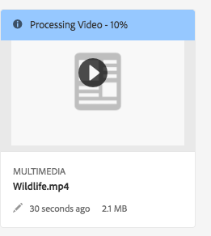
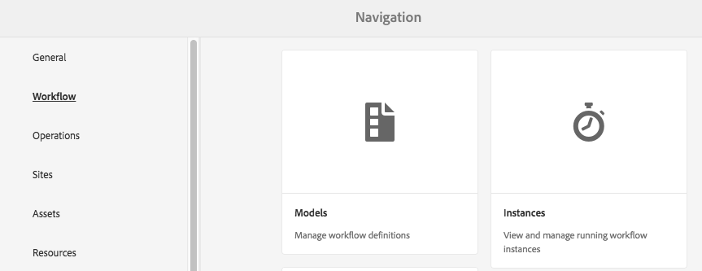

# 视频 {#video}

本节介绍如何在 Dynamic Media 中处理视频。

## Quick Start: Videos {#quick-start-videos}

下面的工作流分布说明旨在帮助您在 Dynamic Media 中快速设置并运行自适应视频集。After each step is cross-references to topic headings where you can find more information.

>[!NOTE]
>
>Before you work with video in Dynamic Media, make sure that your Adobe Experience Manager administrator has already enabled and configured Dynamic Media Cloud Services.
>
>* [](/help/assets/dynamic-media/config-dm.md#configuring-dynamic-media-cloud-services)[](/help/assets/dynamic-media/troubleshoot-dm.md)
>


1. 通过执行以下操作，**上传 Dynamic Media 视频**：

   * __

      * [](/help/assets/dynamic-media/video-profiles.md#creating-a-video-encoding-profile-for-adaptive-streaming)
      * [](#best-practices-for-encoding-videos)
   * Associate the video processing profile to one or more folders where you are going to upload your primary source videos.

      * [](/help/assets/dynamic-media/video-profiles.md#applying-a-video-profile-to-folders)
      * [](/help/assets/organize-assets.md)
   * Upload your primary source videos to the folders. When you add videos to the folder, they are encoded according to the video processing profile that you assigned to the folder.

      * Dynamic Media supports primarily short-form videos with a maximum length of 30 minutes and a minimum resolution that is greater than 25 x 25.
      * You can upload video files that are up to 15 GB each.
      * [上传视频](/help/assets/manage-video-assets.md#upload-and-preview-video-assets)。
      * 了解有关[支持的输入文件格式](/help/assets/file-format-support.md)的更多信息。
   * [](#monitoring-video-encoding-and-youtube-publishing-progress)


1. 通过执行以下任意操作，**管理 Dynamic Media 视频**：

   * 组织、浏览和搜索视频资产

      * [Organize digital assets](/help/assets/organize-assets.md)
      * [](/help/assets/search-assets.md#custompredicates)[](/help/assets/manage-digital-assets.md#search-assets)
   * Preview and publish video assets

      * View the source video and encoded renditions of the video along with its associated thumbnails:
         [](/help/assets/manage-video-assets.md#upload-and-preview-video-assets)[](/help/assets/dynamic-media/previewing-assets.md)
         [](/help/assets/manage-digital-assets.md#managing-renditions)

      * [Manage viewer presets](/help/assets/dynamic-media/managing-viewer-presets.md)
      * [发布资产](/help/assets/dynamic-media/publishing-dynamicmedia-assets.md)
   * 处理视频元数据

      * Edit the properties of video such as the title, description, and tags, custom metadata fields:
         [](/help/assets/manage-digital-assets.md#editing-properties)

      * [管理数字资产的元数据](/help/assets/manage-metadata.md)
      * [元数据架构](/help/assets/metadata-schemas.md)
   * 审核和批准视频，在视频中添加注释，以及保持全面的版本控制

      * [](/help/assets/manage-video-assets.md#annotate-video-assets)[](/help/assets/manage-digital-assets.md#annotating)

      * [创建版本](/help/assets/manage-digital-assets.md#asset-versioning)
      * [Starting a workflow on an asset](/help/assets/manage-digital-assets.md#starting-a-workflow-on-an-asset)

      * [审核文件夹资产](/help/assets/bulk-approval.md)
      * [项目](/help/sites-cloud/authoring/projects/overview.md)


1. 通过执行以下任一操作，**发布 Dynamic Media 视频**：

   * If you use Experience Manager as your WCM (Web Content Management) system, you can add videos directly to your web pages.

      * [](/help/assets/dynamic-media/adding-dynamic-media-assets-to-pages.md)
   * If you are using a third-party web content management system, you can link or embed videos to your web pages.

      * Integrate video using URL:
         [将 URL 关联到您的 Web 应用程序](/help/assets/dynamic-media/linking-urls-to-yourwebapplication.md).

      * Integrate video using embed code on web page:
         [](/help/assets/dynamic-media/embed-code.md)
   * [](#publishing-videos-to-youtube)
   * [](#viewing-video-reports)

   * [](#adding-captions-to-video)


## Work with video in Dynamic Media {#working-with-video-in-dynamic-media}

Video in Dynamic Media is an end-to-end solution that makes it easy to publish high-quality Adaptive Video for streaming across multiple screens, including desktops, tablets, and mobile devices. 自适应视频集是同一个视频的一组版本，这些版本以不同的比特率和格式进行编码，例如 400 kbps、800 kbps 和 1000 kbps。台式计算机或移动设备会检测可用带宽。

例如，在 iOS 移动设备上，设备检测到 3G、4G 或 Wi-Fi 等带宽。设备会随之自动从自适应视频集内的各种视频比特率中选择正确的编码视频。然后，视频会在桌面设备、移动设备或平板电脑上进行流播放。

此外，如果桌面或移动设备上的网络条件发生变化，设备会自动动态地切换视频质量。Also, if a customer enters full-screen mode on a desktop, the Adaptive Video Set responds by using a better resolution, improving the customer’s viewing experience. Using Adaptive Video Sets provides you with the best possible playback for customers playing Dynamic Media video on multiple screens and devices.

The logic that a video player uses to determine which encoded video to play or to select during playback is based on the following algorithm:

1. Video player loads the initial video fragment based on the bit rate that is closest to the value that is set for &quot;initial bitrate&quot; in the player itself.
1. Video player switches based on changes to the bandwidth speed using the following criteria:

   1. Player picks the highest bandwidth stream below or equal to the estimated bandwidth.
   1. Player considers only 80% of the available bandwidth. However, if it is switching up, it is more conservative at only 70% to avoid overestimating and immediately switching back.

[](https://android.googlesource.com/platform/frameworks/av/+/master/media/libstagefright/httplive/LiveSession.cpp)

For managing single video and Adaptive Video Sets, the following is supported:

* 用多种支持的视频格式和音频格式上传视频，并将视频编码为 MP4 H.264 格式，以供在多种屏幕上播放。您可以使用预定义的自适应视频预设或单个视频编码预设，或者自定义您自己的编码，来控制视频的质量和大小。

   * 在生成自适应视频集时，会包括 MP4 视频。
   * ****

* Video captioning in all HTML5 video viewers.
* 组织、浏览和搜索具有全面元数据支持的视频，以实现高效的视频资产管理。
* Deliver Adaptive Video Sets to the web and desktops, tablets, and mobile devices.

Adaptive video streaming is supported on various iOS platforms. [](https://experienceleague.adobe.com/docs/dynamic-media-developer-resources/library/viewers-aem-assets-dmc/video/c-html5-video-reference.html)

<!-- OUTDATED 2/28/22 BASED ON CQDOC-18692 Dynamic Media supports mobile video playback for MP4 H.264 video. You can find BlackBerry® devices that support this video format at the following: [Supported video formats on BlackBerry®](https://support.blackberry.com/kb/articleDetail?ArticleNumber=000005482).

OUTDATED 2/28/22 BASED ON CQDOC-18692 You can find Windows® devices that support this video format at the following [Supported video formats on Windows® Phone](https://docs.microsoft.com/en-us/windows/uwp/audio-video-camera/supported-codecs). -->

* 使用 Dynamic Media 视频查看器预设播放视频，包括以下查看器：

   * 单一视频查看器。
   * 将视频和图像内容组合在一起的混合媒体查看器。

* 配置视频播放器以满足您的品牌需求。
* 使用简单的 URL 或嵌入代码将视频集成到您的网站、移动站点或移动应用程序。

[](https://s7d9.scene7.com/s7/uvideo.jsp?asset=GeoRetail/Mop_AVS&amp;config=GeoRetail/Universal_Video1&amp;stageSize=640,480)

[](https://experienceleague.adobe.com/docs/dynamic-media-developer-resources/library/viewers-aem-assets-dmc/c-html5-s7-aem-asset-viewers.html#viewers-aem-assets-dmc)[](https://experienceleague.adobe.com/docs/dynamic-media-developer-resources/library/viewers-for-aem-assets-only/c-html5-aem-asset-viewers.html#viewers-for-aem-assets-only)[](https://experienceleague.adobe.com/docs/dynamic-media-developer-resources.html)

## Best practice: Using the HTML5 video viewer {#best-practice-using-the-html-video-viewer}

The Dynamic Media HTML5 Video viewer presets are robust video players. You can use them to avoid many common issues that are associated with HTML5 video playback and issues associated with mobile devices. For example, a lack of adaptive streaming delivery and limited desktop browser reach.

On the design side of the player, you can design the video player’s functionality using standard web development tools. 例如，您可以使用 HTML5 和 CSS 设计按钮、控件和自定义标识图像背景，从而帮助您向客户展示自定义的外观。

在查看器的播放方面，查看器可以自动检测浏览器的视频功能。It then serves the video using HLS (HTTP Live Streaming), also known as adaptive video streaming. 或者，如果这些传送方法不可用，则会改用 HTML5 渐进式流播放。

You can combine into a single player the ability to design the playback components using HTML5 and CSS. It can have embedded playback, and use adaptive and progressive streaming depending on the browser’s capability. All this functionality, means you can extend the reach of your rich media content to both desktop and mobile users and ensure a streamlined video experience.

[](https://experienceleague.adobe.com/docs/dynamic-media-developer-resources/library/viewers-for-aem-assets-only/c-html5-aem-asset-viewers.html#viewers-for-aem-assets-only)[](https://experienceleague.adobe.com/docs/dynamic-media-developer-resources.html)

### Playback of video on desktop computers and mobile devices using the HTML5 video viewer {#playback-of-video-on-desktop-computers-and-mobile-devices-using-the-html-video-viewer}

For desktop and mobile adaptive video streaming, the videos used for bit rate switching are based on all MP4 videos in the Adaptive Video Set.

Video playback occurs using either HLS or progressive video download. In prior versions of Experience Manager, such as 6.0, 6.1, and 6.2, videos were streamed over HTTP.

However, in Experience Manager 6.3 and on, videos are now streamed over HTTPS (that is, HLS) because the DM gateway service URL always uses HTTPS as well. There is no customer impact in this default behavior. That is, video streaming will always occur over HTTPS unless it is not supported by the browser. (see the following table). Therefore,

* If you have an HTTPS website with HTTPS video streaming, streaming is fine.
* If you have an HTTP website with HTTPS video streaming, streaming is fine and there are no mixed content issues from the web browser.

HLS is an Apple standard for adaptive video streaming that automatically adjusts playback based on network bandwidth capacity. It also lets the customer “seek” to any point in the video without the need to wait for the rest of the video to download.

Progressive video is delivered by downloading and storing the video locally on a user’s desktop system or mobile device.

[](https://experienceleague.adobe.com/docs/dynamic-media-developer-resources/library/viewers-for-aem-assets-only/interactive-video/c-html5-aem-int-video.html#interactive-video)

<table>
 <tbody>
  <tr>
   <td><strong>设备</strong></td>
   <td><strong>浏览器</strong></td>
   <td><strong>Video playback mode</strong></td>
  </tr>
  <tr>
   <td>桌面设备</td>
   <td>Internet Explorer 9 and 10</td>
   <td>Progressive download.</td>
  </tr>
  <tr>
   <td>桌面设备</td>
   <td>Internet Explorer 11+</td>
   <td>On Windows® 8 and Windows® 10 - Force use of HTTPS whenever HLS is requested. <br /><br />Uses standard logic for selecting HTTP versus HTTPS protocol.</td>
  </tr>
  <tr>
   <td>桌面设备</td>
   <td>Firefox 23-44</td>
   <td>Progressive download.</td>
  </tr>
  <tr>
   <td>桌面设备</td>
   <td>Firefox 45 or later</td>
   <td>HLS</td>
  </tr>
  <tr>
   <td>桌面设备</td>
   <td>Chrome</td>
   <td>HLS</td>
  </tr>
  <tr>
   <td>桌面设备</td>
   <td>Safari (Mac)</td>
   <td>HLS</td>
  </tr>
  <tr>
   <td>移动设备</td>
   <td>Chrome (Android™ 6 or earlier)</td>
   <td>Progressive download.</td>
  </tr>
  <tr>
   <td>移动设备</td>
   <td>Chrome (Android™ 7 or later)</td>
   <td>HLS</td>
  </tr>
  <tr>
   <td>移动设备</td>
   <td>Android™ (default browser)</td>
   <td>Progressive download.</td>
  </tr>
  <tr>
   <td>移动设备</td>
   <td>Safari (iOS)</td>
   <td>HLS</td>
  </tr>
  <tr>
   <td>移动设备</td>
   <td>Chrome (iOS)</td>
   <td>HLS</td>
  </tr>
 </tbody>
</table>

<!--  THIS LINE WAS REMOVED FROM THE TABLE ABOVE ON FEB 28, 2022 BASED ON CQDOC 18692 -RSB <tr>
   <td>Mobile</td>
   <td>BlackBerry®</td>
   <td>HLS</td>
  </tr>
 -->

## Architecture of Dynamic Media video solution {#architecture-of-dynamic-media-video-solution}

The following graphic shows the overall authoring workflow of videos that are uploaded and encoded by way of DMGateway (in Dynamic Media Hybrid mode) and made available for public consumption.


## Hybrid publishing architecture for videos {#hybrid-publishing-architecture-for-videos}


## 视频编码的最佳实践 {#best-practices-for-encoding-videos}

****&#x200B;此工作流会捕获工作流进程历史记录和失败信息。[](#monitoring-video-encoding-and-youtube-publishing-progress)********

以下是关于源视频文件编码的最佳实践提示。

<!-- For advice about video encoding, see the following:

* [Streaming 101: The Basics — Codecs, Bandwidth, Data Rate, and Resolution](https://www.adobe.com/go/learn_s7_streaming101_en).
* [Video Encoding Basics](https://www.adobe.com/go/learn_s7_encoding_en). -->

### 源视频文件 {#source-video-files}

在对视频文件进行编码时，请尽可能使用最高质量的源视频文件。避免使用先前已编码的视频文件，因为这样的文件已经压缩，进一步编码会导致创建的视频质量不佳。

* Dynamic Media supports primarily short-form videos with a maximum length of 30 minutes and a minimum resolution that is greater than 25 x 25.
* You can upload primary source video files that are up to 15 GB each.

The following table describes the recommended size, aspect ratio, and minimum bit rate that your source video files must have before you encode them:

| 大小 | 宽高比 | 最低比特率 |
|--- |--- |--- |
| 1024 X 768 | 4:3 | 4500 kbps，适用于大部分视频。 |
| 1280 X 720 | 16:9 | 3000 - 6000 kbps，具体取决于视频中的动作数量。 |
| 1920 X 1080 | 16:9 | 6000 - 8000 kbps，具体取决于视频中的动作数量。 |

### Obtain a file&#39;s metadata {#obtaining-a-file-s-metadata}

获取文件元数据的方法如下：通过使用视频编辑工具查看文件的元数据，或者使用专门为获取元数据而设计的应用程序。下面说明了如何使用第三方应用程序 MediaInfo 获取视频文件的元数据：

1. [](https://mediaarea.net/en/MediaInfo/Download)
1. 选择并下载 GUI 版本的安装程序，然后按照安装说明进行操作。
1. After installation, either right-click the video file (Windows® only) and select MediaInfo, or open MediaInfo and drag your video file into the application. You see all metadata associated with your video file, including its width, height, and fps.

### 宽高比 {#aspect-ratio}

When you choose or create a video encoding preset for your primary source video file, make sure that the preset has the same aspect ratio as the primary source video file. 宽高比是视频的宽度与高度的比率。

To determine the aspect ratio of a video file, obtain the file’s metadata and note the file’s width and height (see Obtaining a file&#39;s metadata above). Then use this formula to determine the aspect ratio:

宽度/高度 = 宽高比

下表说明了公式结果如何转换成常见的宽高比选项：

| 公式结果 | 宽高比 |
|--- |--- |
| 1.33 | 4:3 |
| 0.75 | 3:4 |
| 1.78 | 16:9 |
| 0.56 | 9:16 |

For example, a video that is 1440 width x 1080 height has an aspect ratio of 1440/1080, or 1.33. In this case, you choose a video encoding preset with a 4:3 aspect ratio to encode the video file.

### 比特率 {#bitrate}

Bitrate is the amount of data that is encoded to make up a single second of video playback. The bitrate is measured in kilobits per second (Kbps).

>[!NOTE]
>
>Because all codecs use lossy compression, bitrate is the most important factor in video quality. 使用有损压缩时，对视频文件的压缩程度越大，质量就降低得越多。For this reason, all other characteristics being equal (the resolution, frame rate, and codec), the lower the bitrate, the lower the quality of the compressed file.

When selecting a bitrate encoding, there are two types you can choose:

* ****CBR encoding persists the set data rate to your setting over the entire video. Also, CBR encoding does not optimize media files for quality but does save on storage space.
Use CBR if your video contains a similar motion level throughout the entire video. CBR is most commonly used for streaming video content. [](/help/assets/dynamic-media/video-profiles.md#using-custom-added-video-encoding-parameters)

* ****This functionality means that during a VBR encoding process the bitrate of the media file dynamically increases or decreases depending on the media files bitrate needs.
VBR takes longer to encode but produces the most favorable results; the quality of the media file is superior. VBR is most commonly used for http progressive delivery of video content.

When do you use VBR versus CRB?
When selecting VBR versus CBR, it is almost always recommended that you use VBR for your media files. VBR provides higher-quality files at competitive bitrates. When you use VBR, be sure you use with two-pass encoding, and set the maximum bitrate to be 1.5x the target video bitrate.

When you choose a video encoding preset, be sure you account for the target end user’s connection speed. 所选预设的数据率应该是目标最终用户连接速度的 80%。例如，如果目标最终用户的连接速度是 1000 Kbps，则最佳预设就是视频数据率为 800 Kbps 的预设。

下表说明了典型连接速度的数据率。

| 速度 (Kbps) | 连接类型 |
|--- |--- |
| 256 | 拨号连接。 |
| 800 | 典型移动连接。对于此类连接，3G 体验的目标数据率范围为 400 至最高 800。 |
| 2000 | Typical broadband desktop connection. For this connection, target a data rate in the 800-2000 Kbps range, with most targets averaging 1200-1500 Kbps. |
| 5000 | 典型高宽带连接。不建议在此较高范围下进行编码，因为大多数用户并不具备此速度的视频传送条件。 |

### 解决方法 {#resolution}

**分辨率**&#x200B;以像素为单位描述视频文件的高度和宽度。大多数源视频以高分辨率存储（例如，1920 x 1080）。出于流播放目的，源视频会压缩至较低分辨率（640 x 480 或更低）。

分辨率和数据率是两个相互关联、密不可分的因素，它们决定着视频质量。为保持同等的视频质量，视频文件的像素数越高（分辨率越高），数据率就必须越高。例如，考虑分辨率分别为 320 x 240 和 640 x 480 的视频文件的每帧像素数：

| 解决方法 | 每帧像素数 |
|--- |--- |
| 320 x 240 | 76,800 |
| 640 x 480 | 307,200 |

对于分辨率为 640 x 480 的文件，其每帧像素数高出四倍。为使这两个示例分辨率的文件实现同等的数据率，您需要对分辨率为 640 x 480 的文件应用四倍的压缩，而这会降低视频的质量。因此，如果视频数据率为 250 Kbps，则在 320 x 240 分辨率下观看时质量会很高，但在 640 x 480 分辨率下观看时质量则不高。

In general, the higher data rate you use, the better your video appears, and the higher resolution you use, the higher data rate you must maintain viewing quality (compared to lower resolutions).

由于分辨率与数据率相关联，在对视频进行编码时，有两种选择：

* Choose a data rate and then encode at the highest resolution that appears good at the data rate you chose.
* 选择一个分辨率，然后使用在选定分辨率下获得高质量视频所需的数据率进行编码。

When you choose (or create) a video encoding preset for your primary source video file, use this table to target the correct resolution:

| 解决方法 | 高度（像素） | 屏幕大小 |
|--- |--- |--- |
| 240p | 240 | 微型屏幕 |
| 300p | 300 | 通常用于移动设备的小型屏幕 |
| 360p | 360 | 小型屏幕 |
| 480p | 480 | 中型屏幕 |
| 720p | 720 | 大型屏幕 |
| 1080p | 1080 | 高清晰度大型屏幕 |

### Fps（每秒帧数） {#fps-frames-per-second}

在美国和日本，大多数视频以 29.97 帧/秒 (fps) 的速率拍摄；在欧洲，大多数视频以 25 fps 的速率拍摄。电影是以 24 fps 的速率拍摄。

Choose a video encoding preset that matches the fps rate of your primary source video file. For example, if your primary source video is 25 fps, choose an encoding preset with 25 fps. By default, all custom encoding uses the primary source video file’s fps. 鉴于这一原因，您在创建视频编码预设时不需要明确指定 fps 设置。

### 视频编码尺寸 {#video-encoding-dimensions}

为实现最佳效果，请选择相应编码尺寸，使源视频成为所有编码视频的整数倍数。

要计算此比率，请用源宽度除以编码宽度，得出宽度比。然后，用源高度除以编码高度，得出高度比。

如果计算得出的比率是整数，就意味着视频已得到最佳缩放。如果计算得出的比率不是整数，则会影响视频质量，使显示屏上出现残留像素伪影。当视频含有文本时，这种影响最为明显。

例如，假定源视频的分辨率为 1920 x 1080。在下表中，这三个编码视频提供了可使用的最佳编码设置。

| 视频类型 | 宽度 x 高度 | 宽度比 | 高度比 |
|--- |--- |--- |--- |
| 来源 | 1920 x 1080 | 1 | 1 |
| 编码 | 960 x 540 | 2 | 2 |
| 编码 | 640 x 360 | 3 | 3 |
| 编码 | 480 x 270 | 4 | 4 |

### 编码视频文件格式 {#encoded-video-file-format}

Dynamic Media 建议使用 MP4 H.264 视频编码预设。由于 MP4 文件使用 H.264 视频编解码器，因此 MP4 可以提供高质量的视频，但需要压缩文件大小。

## Publish videos to YouTube {#publishing-videos-to-youtube}

You can publish video assets managed in Experience Manager Assets directly to a YouTube channel that you have previously created.

To publish video assets to YouTube, you tag video assets in Experience Manager Assets with tags. You associate these tags with a YouTube channel. If a video asset&#39;s tag matches the tag of a YouTube channel, then the video is published to YouTube. Publish to YouTube occurs along with a normal publish of the video as long as an associated tag is used.

YouTube does its own encoding. As such, the original video file that was uploaded into Experience Manager is published to YouTube instead of any video rendition that Dynamic Media’s encoding has created. While it is not required to process videos using Dynamic Media, it is expected that they do so in case a viewer preset is needed for playback.

When you bypass the video processing profile and publish directly to YouTube, it simply means that your video asset in Experience Manager Asset does not get a viewable thumbnail. It also means that videos that are not encoded do not work with any of the Dynamic Media asset types.

Publishing video assets to YouTube servers involves completing the following tasks to ensure safe and secure server-to-server verification with YouTube:

1. [Configure Google Cloud settings](#configuring-google-cloud-settings)
1. [Create a YouTube channel](#creating-a-youtube-channel)
1. [Add tags for publishing](#adding-tags-for-publishing)
1. [Set up YouTube in Experience Manager](#setting-up-youtube-in-aem)
1. [(Optional) Automate the setting of default YouTube properties for your uploaded videos](#optional-automating-the-setting-of-default-youtube-properties-for-your-uploaded-videos)
1. [Publish videos to your YouTube channel](#publishing-videos-to-your-youtube-channel)
1. [(Optional) Verify the published video on YouTube](/help/assets/dynamic-media/video.md#optional-verifying-the-published-video-on-youtube)
1. [Link YouTube URLs to your Web Application](#linking-youtube-urls-to-your-web-application)

您还可以[取消发布视频以将其从 YouTube 中删除](#unpublishing-videos-to-remove-them-from-youtube)。

### Configure Google Cloud settings {#configuring-google-cloud-settings}

To publish to YouTube, you need a Google account. If you have a GMAIL account, then you already have a Google account; if you do not have a Google account, you can easily create one. You need the account because you need credentials to publish video assets to YouTube. [](#creating-a-youtube-channel)

The account used with Google Cloud and the Google account used for YouTube do not need to be the same.

Google periodically changes their user interface. As such, the steps to publish videos to YouTube can vary slightly from what is documented below. This caveat also applies to YouTube when you try to check if videos are uploaded to it.

>[!NOTE]
>
>The following steps were accurate at the time of this writing. However, Google periodically updates their websites without notice. As such, these steps can be slightly different.

****

1. Create a Google account.
   [](https://accounts.google.com/signup/v2?service=mail&amp;flowName=GlifWebSignIn&amp;flowEntry=SignUp)

   If you already have a Google account, you can skip to the next step.

1. [](https://cloud.google.com/)
1. ****

   ********

1. ********
1. ********
1. ********

   Your Project ID is based on your project name. As such, choose the project name carefully; it cannot be changed after it is created. Also, you must enter the same Project ID again when you set up YouTube in Experience Manager later on. Therefore, write it down.

1. 选择&#x200B;**[!UICONTROL 创建]**。

1. 执行以下操作之一：

   * ********
   * ********

1. ********<!-- NEXT STEP BELOW IS STEP 10 -->
1. ****************
1. ********
1. ********

   

1. To use the API, you need credentials. ****

1. ********

1. ************

   

1. 执行下列操作之一：

   * ****
   * ****

1. ********

   

1. ********

   `https://<servername.domain>:<port_number>`

   例如，`https://1a2b3c.mycompany.com:4321`

   >[!IMPORTANT]
   >
   >The example path above is hypothetical and for explanation purposes only.

1. ****

1. ********

   `https://<servername.domain>:<port_number>/etc/cloudservices/youtube.youtubecredentialcallback.json`

   例如，`https://1a2b3c.mycompany.com:4321/etc/cloudservices/youtube.youtubecredentialcallback.json`

   >[!IMPORTANT]
   >
   >The example path above is hypothetical and for explanation purposes only.

1. ********

1. ****

   * (Optional) Copy Your Client ID and Your Client Secret and save.
   * ****

   You need this downloaded JSON file when you set up YouTube in Adobe Experience Manager later on.

   

1. ********

1. Log out of your Google account. Now create a YouTube channel.

### Create a YouTube channel {#creating-a-youtube-channel}

Publishing videos to YouTube requires that you have one or more channels. [](/help/assets/dynamic-media/video.md#adding-tags-for-publishing)

>[!CAUTION]
>
>**[](#setting-up-youtube-in-aem)If you fail to do the channel setup, you are not warned of no existing channels. However, Google verification still occurs when you add a channel, but there is not an option to choose which channel the video is sent.

****

1. [](https://www.youtube.com/)
1. ****
1. ****
1. ****
1. ****

   Remember the name that you enter here; you must enter it again when you have to set up YouTube in Experience Manager.

1. (Optional) If necessary, add more channels.

   Now you add tags for publishing.

### Add tags for publishing {#adding-tags-for-publishing}

To publish to your videos to YouTube, Experience Manager associates tags to one or more YouTube channels. [](/help/sites-cloud/authoring/features/tags.md)

[](#setting-up-youtube-in-aem)

>[!NOTE]
>
>After the Cloud Service is configured, other configuration is not required to enable the YouTube Publish replication agent at this point. The reason is because it was enabled when the Cloud Service configuration was saved.

<!-- ### Enabling the YouTube Publish replication agent {#enabling-the-youtube-publish-replication-agent}

After you enable the YouTube Publish replication agent, if you want to test the connection to the Google Cloud account, select **[!UICONTROL Test Connection]**. A browser tab displays the connection results. If you have added YouTube Channels, then a listing of those is displayed as part of the test.

1. In the upper-left corner of Experience Manager, select the Experience Manager logo, then in the left rail, navigate to **[!UICONTROL Tools]** > **[!UICONTROL Deployment]** > **[!UICONTROL Replication]** > **[!UICONTROL Agents on Author]**.
1. On the Agents of Author page, select **[!UICONTROL YouTube Publish (youtube)]**.
1. On the toolbar, to the right of Settings, select **[!UICONTROL Edit]**.
1. Select the **[!UICONTROL Enabled]** checkbox to turn on the replication agent.
1. Select **[!UICONTROL OK]**. -->

### Set up YouTube in Experience Manager {#setting-up-youtube-in-aem}

Starting with Experience Manager 6.4, a new touch user interface method was introduced to set up YouTube publishing in Experience Manager. Based on the installed instance of Experience Manager that you are using, do one of the following:

* [](/help/assets/dynamic-media/video.md#setting-up-youtube-in-aem-before)
* [](#setting-up-youtube-in-aem-and-later)

#### Set up YouTube in Experience Manager 6.4 and later {#setting-up-youtube-in-aem-and-later}

1. Be sure you log in to your instance of Dynamic Media as an Administrator.
1. ************
1. ****

1. ****
1. 在“创建 YouTube 配置”页面的“Google Cloud Platform 设置”下的&#x200B;**[!UICONTROL 应用程序名称]**&#x200B;字段中，输入 Google 项目 ID。

   You specified the project ID when you initially configured Google Cloud settings earlier.
Leave the Create YouTube Configuration page open; you are returning to it in a moment.

   

1. [](/help/assets/dynamic-media/video.md#configuring-google-cloud-settings)
1. Select and copy the entire JSON text.
1. 返回至“YouTube 帐户设置”对话框。在 **[!UICONTROL JSON 配置]**&#x200B;字段中，粘贴 JSON 文本。
1. ****

   Now set up YouTube channels in Experience Manager.

1. ****
1. ****

   You can optionally add a description, if desired.

1. ****
1. YouTube/Google verification is displayed. If you are not already logged into the Google Cloud account, then skip this step.

   * Enter the Google username and password associated with the Google Project ID and the JSON text above.
   * Depending on how many channels your account has you see two or more items. Select a channel. Do not select the e-mail address; it is not a channel.
   * ****

1. ****

   Now set up tags for publishing.

1. ****
1. To display the list of available tags in Experience Manager, select the drop-down list icon (upside-down caret).
1. To add them, select one or more tags.

   ****

1. ****

   Now you publish videos to your YouTube channel.

#### Set up YouTube in Experience Manager before 6.4 {#setting-up-youtube-in-aem-before}

1. Be sure you log in to your instance of Dynamic Media as an Administrator.

1. ************
1. ****
1. In the Create Configuration dialog box, enter a title (mandatory) and name (optional) in the respective fields.
1. 选择&#x200B;**[!UICONTROL 创建]**。
1. 在“YouTube 帐户设置”对话框的&#x200B;**[!UICONTROL 应用程序名称]**&#x200B;字段中，输入 Google 项目 ID。

   [](/help/assets/dynamic-media/video.md#configuring-google-cloud-settings)Leave the YouTube Account Setting dialog box open; you are returning to it in a moment.

1. Using a plain text editor, open the JSON file that you downloaded and saved earlier in the task Configuring Google Cloud settings.
1. Select and copy the entire JSON text.
1. 返回至“YouTube 帐户设置”对话框。在 **[!UICONTROL JSON 配置]**&#x200B;字段中，粘贴 JSON 文本。
1. ****

   Now set up YouTube channels in Experience Manager.

1. ********
1. 在“YouTube频道设置”对话框的“标题”字段中，输入您在之前向YouTube添加一个或多个频道任务中创建的频道 **[!UICONTROL 名称]** 。

   You can optionally add a description, if desired.

1. ****
1. YouTube/Google verification is displayed. If you are not already logged into the Google Cloud account, then skip this step.

   * Enter the Google username and password associated with the Google Project ID and the JSON text above.
   * Depending on how many channels your account has you see two or more items. Select a channel. Do not select the e-mail address; it is not a channel.
   * ****

1. ****

   Now set up tags for publishing.

1. ****
1. To display the list of available tags in Experience Manager, select the drop-down list icon (upside-down caret).
1. To add them, select one or more tags.

   ****

1. ****

   Now you publish videos to your YouTube channel.

### (Optional) Automate the setting of default YouTube properties for your uploaded videos {#optional-automating-the-setting-of-default-youtube-properties-for-your-uploaded-videos}

You can optionally automate the setting of YouTube properties on upload of your videos. Create a metadata processing profile in Experience Manager.

要创建元数据处理配置文件，您首先需要从&#x200B;**[!UICONTROL 字段标签]**、**[!UICONTROL 映射到属性]**&#x200B;和&#x200B;**[!UICONTROL 选择]**&#x200B;字段中复制值，所有这些字段均位于视频的元数据架构中。Then, you build your YouTube video metadata processing profile by adding those values to it.

****

1. ************
1. ****(Do not add a checkmark to the selection box to the left of &quot;default&quot;.)
1. ************
1. ****
1. ****
1. ****

   * **** Paste the copied value into the open text editor. You are going to need this value later when you create your metadata processing profile. Leave the text editor open.

   * **** Paste the copied value into the open text editor. You are going to need this value later when you create your metadata processing profile. Leave the text editor open.

1. ****
1. ****

   * **** Paste the copied value into the open text editor. You are going to need this value later when you create your metadata processing profile. Leave the text editor open.

   * ****Notice that the Choices are grouped in pairs of two. The bottom field in the pair is the default value that you want to copy, such as public, unlisted, or private.
Paste the copied value into the open text editor. You are going to need this value later when you create your metadata processing profile. Leave the text editor open.

1. ****
1. ************

1. ****
1. ****`YouTube Video`****
1. ****
1. Add the copied YouTube Publishing values to the profile by doing the following:

   * ****
   * ****
   * ****
   * `YouTube Publishing`
   * ************

   * ****
   * On the right side of the page, under the Settings tab, paste the YouTube Publishing values (Field Label value and Map to property value) that you copied earlier, into their respective fields on the form. Paste the Choices value into the Default Value field.

1. Add the copied YouTube Privacy values to the profile by doing the following:

   * ****
   * ****
   * ****
   * `YouTube Privacy`
   * ************

   * ****
   * On the right side of the page, under the Settings tab, paste the YouTube Publishing values (Field Label value and Map to property value) that you copied earlier, into their respective fields on the form. Paste the Choices value into the Default Value field.

1. ****
1. Apply the YouTube Publishing metadata profile to the folders where you are going to upload videos. You must have both the Metadata Profile and the Video Profile set.

   请参阅 [元数据配置文件](/help/assets/metadata-profiles.md) 和视 [频配置文件](/help/assets/dynamic-media/video-profiles.md)。

### Publish videos to your YouTube channel {#publishing-videos-to-your-youtube-channel}

Now you associate the tags that you added earlier to video assets. This process lets Experience Manager know which assets to publish to your YouTube channel.

>[!NOTE]
>
>Publish immediately does not automatically publish to YouTube. 设置 Dynamic Media 时，有两种发布选项可供选择：**[!UICONTROL 立即]**&#x200B;或&#x200B;**[!UICONTROL 激活时]**。
>
>**** While that is true for Dynamic Media, it is not true for YouTube. To publish to YouTube, you must publish by way of Experience Manager Author.

>[!NOTE]
****
[](#monitoring-video-encoding-and-youtube-publishing-progress)
For more detailed progress information, you can monitor the YouTube log under replication. Be aware, however, that such monitoring requires Administrator access.

**要将视频发布到您的 YouTube 频道，请执行以下操作：**

1. In Experience Manager, navigate to a video asset that you want to publish to your YouTube channel.
1. Select the video asset (the adaptive video set).
1. ****
1. ****
1. On the Select Tags page, navigate to the tags you want to use, and then select one or more tags.

   Remember that the tags must be associated with the YouTube channel.

1. ****
1. ****
1. ****

   [](https://experienceleague.adobe.com/docs/experience-manager-learn/sites/page-authoring/publication-management-feature-video-use.html#page-authoring)

   You can optionally verify the published video on your YouTube channel.

### (Optional) Verify the published video on YouTube {#optional-verifying-the-published-video-on-youtube}

You can optionally monitor progress of your YouTube publishing (or unpublishing).

[](#monitoring-video-encoding-and-youtube-publishing-progress)

Publishing times can vary greatly depending on numerous factors that include the format of your primary source video, file size, and upload traffic. 发布过程所需的时间少则几分钟，多则几小时，这些情况都有可能出现。Also, higher resolution formats are rendered much more slowly. For example, 720p and 1080p take longer to appear than 480p.

****

### Link YouTube URLs to your Web Application {#linking-youtube-urls-to-your-web-application}

You can obtain a YouTube URL string that is generated by Dynamic Media after you publish the video. 在复制该 YouTube URL 时，它会进入“剪贴板”，以便您能够视需要将其粘贴到网站或应用程序中的页面。

>[!NOTE]
只有在将视频资产发布到 YouTube 后，才可复制其 YouTube URL。

要将 YouTube URL 关联到您的 Web 应用程序，请执行以下操作：

1. **

   ****

1. ****
1. ****
1. Under the YouTube Publishing heading, in the YouTube URL List, select, and copy the URL text to your web browser to preview the asset or to add to your web content page.

### Unpublish videos so you can remove them from YouTube {#unpublishing-videos-to-remove-them-from-youtube}

当您在 Experience Manager 中取消发布视频资产时，该视频会从 YouTube 中删除。

>[!CAUTION]
If you remove a video directly from within YouTube, Experience Manager is unaware and continues to behave as if the video is still published to YouTube. Always unpublish a video asset from YouTube by way of Experience Manager.

>[!NOTE]
****
[](#monitoring-video-encoding-and-youtube-publishing-progress)

**要取消发布视频以将其从 YouTube 中删除，请执行以下操作：**

1. Navigate to the video assets that you want to unpublish from your YouTube channel.
1. 在资产选择模式下，选择一个或多个已发布的视频资产。
1. ****`. . .`****
1. ****
1. ****
1. ****

## Monitor video encoding and YouTube publishing progress {#monitoring-video-encoding-and-youtube-publishing-progress}

When you upload a new video to a folder that has video encoding applied or, you publish your video to YouTube, monitor how your video encoding/Youtube publishing is progressing (or failing). Actual YouTube publishing progress is only available by way of the logs. But whether it fails or succeeds, it is listed in other ways described in the following procedure. In addition, you receive email notifications when a YouTube publish workflow or video encoding completes or is interrupted.

### Monitor progress {#monitoring-progress}

You can monitor progress, including failed encoding/YouTube publish.

1. View video encoding progress in your assets folder:

   * In card view, video encoding progress displays on the asset by percent. If there is an error, this information also displays on the asset.

   

   * ****&#x200B;如果出现错误，则同一列中将显示此消息。

   

   默认情况下，此列不显示。************

   

1. View progress in the asset details. ********

   

   Any workflow information--such as encoding--displays in the timeline. For YouTube publish, the Workflow timeline also includes the name of the YouTube channel and the YouTube video URL. In addition, you see any failure notifications in the Workflow timeline after the publish is complete.

   >[!NOTE]
   ************[](https://localhost:4502/system/console/configMgr)
   * Apache Sling Job Queue Configuration
   * Adobe Granite Workflow External Process Job Handler
   * Granite Workflow Timeout Queue

   ************

1. 有关进行中的工作流，请参阅“工具”>“工作流” **[!UICONTROL >“实例”中提供的“工作流实例]** ” **[!UICONTROL (Workflow]** ) **[!UICONTROL >“]**&#x200B;实例”。

   >[!NOTE]
   ****

   

   ****

   

   From the Workflow Instances area, you can also suspend, terminate, or rename workflows. [](/help/sites-cloud/authoring/workflows/overview.md)

1. 有关失败的作业，请参阅&#x200B;**[!UICONTROL 工具]** > **[!UICONTROL 工作流]** > **[!UICONTROL 失败]**&#x200B;中显示的“工作流失败”。**[!UICONTROL 工作流失败]**&#x200B;列出所有失败的工作流活动。

   >[!NOTE]
   ****

   

   >[!NOTE]
   ************[](https://localhost:4502/system/console/configMgr)
   * Apache Sling Job Queue Configuration
   * Adobe Granite Workflow External Process Job Handler
   * Granite Workflow Timeout Queue

   ************

1. 有关已完成的工作流，请参阅&#x200B;**[!UICONTROL 工具]** > **[!UICONTROL 工作流]** > **[!UICONTROL 存档]**&#x200B;中的可用工作流存档。**[!UICONTROL 工作流存档]**&#x200B;列出了所有已完成的工作流活动。

   >[!NOTE]
   ****

   

1. You receive email notifications about aborted or failed workflow jobs. These email notifications are configurable by an administrator. [](#configuring-e-mail-notifications)

<!-- EMAIL NOT AVAILABLE IN SKYLINE

#### Configuring e-mail notifications {#configuring-e-mail-notifications}

>[!NOTE]
>
>You may need administrative rights to access the **[!UICONTROL Tools]** menu.

How you configure notification depends on whether you want notifications for YouTube publishing jobs.

* For encoding jobs, you can access the configuration page for all Experience Manager workflow email notifications at **[!UICONTROL Tools]** > **[!UICONTROL Operations]** > **[!UICONTROL Web Console]** and by searching for **[!UICONTROL Day CQ Workflow Email Notification Service]**. You can select or clear the check boxes for **[!UICONTROL Notify on Abort]** or **[!UICONTROL Notify on Complete]** accordingly.

For YouTube publishing jobs, do the following:

1. In Experience Manager, navigate to **[!UICONTROL Tools]** > **[!UICONTROL Workflow]** > **[!UICONTROL Models]**.
1. On the Workflow Models page, select **[!UICONTROL Publish to YouTube]**, then select **[!UICONTROL Edit]** on the toolbar.
1. Near the upper-right corner of the Publish to YouTube workflow page, select **[!UICONTROL Edit]**.
1. Hover the mouse pointer on the YouTube Upload component, then select once to display the inline toolbar.

   

1. On the inline toolbar, select the Configuration icon (wrench). Select the **[!UICONTROL Arguments]** tab.

   

1. In the YouTube Upload Process - Step Properties dialog box, select the **[!UICONTROL Arguments]** tab.

   

1. You can select or clear the following check boxes:

    * Publish Start
    * Publish Failure
    * Publish Completion - includes information on channels and URLs

   Clearing a check box means that you will not receive the specified email notification from the YouTube Publish workflow.

   >[!NOTE]
   >
   >These emails are specific to YouTube and are in addition to the generic workflow email notifications. As a result, you may receive two sets of email notification - the generic notification available in the **[!UICONTROL Day CQ Workflow Email Notification Service]** and one specific to YouTube depending on your configuration settings.

1. When you are finished, near the upper-right corner of the dialog box, select the **[!UICONTROL Done]** icon (check mark).
1. On the Publish to YouTube workflow page, near the upper-right corner, select **[!UICONTROL Sync]**.

-->

## View video reports {#viewing-video-reports}

>[!NOTE]
Video reports are only available when you run Dynamic Media - Hybrid mode.

**&#x200B;以下顶级量度数据是您整个网站中所有已发布视频的汇总数据。

* 视频开始
* 完成率
* 视频花费的平均时间
* 视频花费的总时间
* 每次访问的视频数

报表中还会列出包含所有&#x200B;*已发布*&#x200B;视频的表格，以便您能够根据视频开始的总次数，跟踪您网站上最常观看的视频。

When you select a video name in the list, it shows you the video’s audience retention (drop-off) report in the form of a line chart. 该图表显示了视频播放期间任意给定时刻的查看次数。当您播放视频时，垂直条与播放器中的时间指示器同步进行跟踪。折线图数据中的下降趋势表示受众因不感兴趣而停止观看。

如果视频是在 Adobe Experience Manager Dynamic Media 外部编码的，就不会提供受众保留（流失）图表和表中的播放比例数据。

>[!NOTE]
只有在使用 Dynamic Media 自带的视频播放器及关联的视频播放器预设时，才可跟踪并报告数据。因此，对于通过其他视频播放器播放的视频，您无法进行跟踪和报告。

By default, the first time you enter Video Reports, the report displays video data starting at the first of the current month and ends with the current month&#39;s date. However, you can override the default date range by specifying your own date range. The next time you enter Video Reports, the date range you specified is used.

For video reports to work correctly, a Report Suite ID is automatically created when Dynamic Media Cloud Services is configured. At the same time, the Report Suite ID is pushed to the Publish server so that it is available for the Copy URL feature when you preview assets. However, this functionality requires the Publish server be already set up. If the Publish server is not set up, you can still publish to see the video report. ****

**要查看视频报表，请执行以下操作：**

1. ************
1. 在“视频报表”页面中，执行以下任一操作：

   * **** You use Refresh only if the end date of the report is the current day. This feature ensures that you see the video tracking that has occurred since the last time you ran the report.

   * ********

   “顶级量度”组框标识您网站中所有&#x200B;*已发布*&#x200B;视频的各种汇总测量数据。

1. In the table that lists the top published videos, select a video name to play the video and also see the video’s audience retention (drop-off) report.

<!-- OBSOLETE CONTENT OBSOLETE CONTENT - SDK ONLY AVAILABLE INTERNALLY NOW 
### Viewing video reports based on a video viewer that you created using the Dynamic Media HTML5 Viewer SDK {#viewing-video-reports-based-on-a-video-viewer-that-you-created-using-the-scene-hmtl-viewer-sdk}

If you are using an out-of-box video viewer provided by Dynamic Media, or if you created a custom viewer preset based off of an out-of-box video viewer, then no additional steps are required to view video reports. However, if you have created your own video viewer based off the Dynamic Media HTML5 Viewer SDK, then use the following steps to ensure the your video viewer is sending tracking events to Dynamic Media Video Reports.

Use the Dynamic Media Viewers Reference and the Dynamic Media HTML5 Viewers SDK to create your own video viewers.

See [Dynamic Media Viewers Reference Guide](https://experienceleague.adobe.com/docs/dynamic-media-developer-resources/library/home.html).

Download the Scene7 HTML Viewer SDK from Adobe Developer Connection.

See [Adobe Developer Connection](https://help.adobe.com/en_US/scene7/using/WSef8d5860223939e2-43dedf7012b792fc1d5-8000.html).

**To view Video Reports based on a video viewer that you created using the Dynamic Media HTML5 Viewer SDK:**

1. Navigate to any published video asset.
1. Near the upper-left corner of the asset's page, from the drop-down list, select **[!UICONTROL Viewers]**.
1. Select any video viewer preset and copy the embed code.
1. In the embed code, find the line with the following:

   `videoViewer.setParam("config2", "<value>");`

   The `config2` parameter enables tracking in HTML5 Viewers. It is also a company-specific preset that contains the configuration information for Video Reporting, and for customer-specific Adobe Analytics configurations.

   The correct value for the config2 parameter is found in both the **[!UICONTROL Embed Code]** and in the copy **[!UICONTROL URL]** function. In the URL from the copy **[!UICONTROL URL]** command, the parameter to look for is `&config2=<value>` . The value is almost always `companypreset`, but in some instances it can also be `companypreset-1`, `companypreset-2`, and so forth.

1. In your custom video viewer code, add AppMeasurementBridge .jsp to the viewer page by doing the following:

    * First, determine if you need the `&preset` parameter.
      If the `config2` parameter is `companypreset`, you do *not *need `&preset=parameter`.
      If `config2` is anything else, set the preset parameter the same as the `config2` parameter. For example, if `config2=companypreset-2`, add `&param2=companypreset-2` to the AppMeasurmentBridge.jsp URL.

    * Then, add the AppMeasurementBridge.jsp script:
      `<script language="javascript" type="text/javascript" src="https://s7d1.scene7.com/s7viewers/AppMeasurementBridge.jsp?company=robindallas&preset=companypreset-2"></script>`

1. Create the TrackingManager component by doing the following:

    * After calling `s7sdk.Utils.init();` create a TrackingManager instance to track events by adding the following:
      `var trackingManager = new s7sdk.TrackingManager();`

    * Connect components to TrackingManager by doing the following:
      In the `s7sdk.Event.SDK_READY` event handler, attach the component you want to track to the TrackingManager.
      For example, if the component is `videoPlayer`, add
      `trackingManager.attach(videoPlayer);`
      to attach the component to the trackingManager. To track multiple viewers on a page, use multiple tracking mangaer components.

    * Create the AppMeasurementBridge object by adding the following:

      ```
      var appMeasurementBridge = new AppMeasurementBridge(); appMeasurementBridge.setVideoPlayer(videoPlayer);
      ```

    * Add the tracking function by adding the following:

      ```
      trackingManager.setCallback(appMeasurementBridge.track,
       appMeasurementBridge);
      ```

   The appMeasurementBridge object has a built-in track function. OBSOLETE However, you can provide your own to support multiple tracking systems or other functionality.

   For more information, see *Using the TrackingManager Component* in the *Scene7 HTML5 Viewer SDK User Guide* available for download from [Adobe Developer Connection](https://help.adobe.com/en_US/scene7/using/WSef8d5860223939e2-43dedf7012b792fc1d5-8000.html).
 -->

## Add closed captions or subtitles to video {#adding-captions-to-video}

You can extend the reach of your videos to global markets by adding closed captioning to single videos or to Adaptive Video Sets. By adding closed captioning you avoid the need to dub the audio, or the need to use native speakers to rerecord the audio for each different language. The video is played in the language that it was recorded. Foreign language subtitles appear so that people of different languages can still understand the audio portion.

Closed captioning also allows for greater accessibility for people who are deaf or hard of hearing.

>[!NOTE]
The video player that you use must support the display of closed captions.

[](/help/assets/dynamic-media/accessibility-dm.md)

Dynamic Media can convert caption files to JSON (JavaScript Object Notation) format. This conversion means you can embed the JSON text into a web page as a hidden but complete transcript of the video. Search engines can then crawl/index the content to make the videos more easily discoverable and give customers more details about the video content.

[](https://experienceleague.adobe.com/docs/dynamic-media-developer-resources/image-serving-api/image-serving-api/c-serving-static-nonimage-contents.html#image-serving-api)

****

1. Use a third-party application or service to create your video caption/subtitle file.

   Ensure that the file you create follows the WebVTT (Web Video Text Tracks) standard. The captioning filename extension is .VTT. You can learn more information about the WebVTT captioning standard.

   [](https://w3c.github.io/webvtt/)

   There are both free and premium tools and services that you can use to author caption/subtitle files outside Dynamic Media. For example, to create a simple video caption file with no styling, you can use the following free online caption authoring and editing tool:

   [](https://testdrive-archive.azurewebsites.net/Graphics/CaptionMaker/Default.html)

   For best results, use the tool in Internet Explorer 9 or above, Google Chrome, or Safari.

   ********[](/help/assets/dynamic-media/linking-urls-to-yourwebapplication.md#obtaining-a-url-for-an-asset)****&#x200B;随后，Internet Explorer、Chrome 或 Safari 可以本机播放视频。

   Now follow the onscreen instructions from the site to author and save your WebVTT file. When you have finished, copy the caption file contents and paste it into a plain text editor and save it with a VTT filename extension.

   >[!NOTE]
   For global support of video subtitles in multiple languages, the WebVTT standard requires that you create separate .vtt files and calls for each language you want to support.

   Generally, you want to name the caption VTT file the same name as the video file, and append it with the language locale, such as -EN, or -FR, or -DE. By doing so, it can help you with automating the generation of the video URLs using your existing web content management system.

1. In Experience Manager, upload your WebVTT caption file into DAM.
1. **

   请注意，只有在首次&#x200B;*发布*&#x200B;资产&#x200B;*后*，才可复制 URL。

   [](/help/assets/dynamic-media/publishing-dynamicmedia-assets.md)

1. 执行下列操作之一：

   * **** In the URL dialog box, select and copy the URL to the Clipboard and then past the URL into a simple text editor. Append the copied URL of the video with the following syntax:

      `&caption=<server_path>/is/content/<path_to_caption.vtt_file,1>`

      `,1``,1``,0`

   * **** In the Embed Code dialog box, select, and copy the embed code to the Clipboard and then paste the code into a simple text editor. Append the copied embed code with the following syntax:

      `videoViewer.setParam("caption","<path_to_caption.vtt_file,1>");`

      `,1``,1``,0`

## Add chapter markers to video {#adding-chapter-markers-to-video}

You can make your long form videos easier to watch and navigate by adding chapter markers to single videos or to Adaptive Video Sets. When a user plays the video, they can select the chapter markers on the video timeline (also known as the video scrubber). They can easily navigate to their point of interest, or immediately jump to new content, training, and demonstrations.

>[!NOTE]
The video player that is used must support the use of chapter markers. Dynamic Media video players do support chapter markers but using third-party video players may not.

<!-- OBSOLETE CONTENT OBSOLETE CONTENT If desired, you can create and brand your own custom video viewer with chapters instead of using a video viewer preset. For instructions on creating your own HTML5 viewer with chapter navigation, in the Adobe Scene7 Viewer SDK for HTML5 guide, reference the heading “Customizing Behavior Using Modifiers” under the classes `s7sdk.video.VideoPlayer` and `s7sdk.video.VideoScrubber`. The Adobe Scene7 Viewer SDK is available as a download from [Adobe Developer Connection](https://help.adobe.com/en_US/scene7/using/WSef8d5860223939e2-43dedf7012b792fc1d5-8000.html). -->

You create a chapter list for your video in much the same way that you create captions. That is, you create a WebVTT file. Note, however, that this file must be separate from any WebVTT caption file. You cannot combine captions and chapters into one WebVTT file.

You can use the following sample as an example of the format you use to create a WebVTT file with chapter navigation:

### WebVTT file with video chapter navigation {#webvtt-file-with-video-chapter-navigation}

```xml
WEBVTT
Chapter 1
00:00.000 --> 01:04.364
The bicycle store behind it all.
Chapter 2
01:04.364 --> 02:00.944
Creative Cloud.
Chapter 3
02:00.944 --> 03:02.937
Ease of management for a working solution.
Chapter 4
03:02.937 --> 03:35.000
Cost-efficient access to rapidly evolving technology.
```

`Chapter 1``00:00:000 --> 01:04:364``00:00:000``000``The bicycle store behind it all`The cue identifier, the starting cue time, and the chapter title all appear in a pop-up in the video player when a user hovers their mouse pointer over a visual cue point in the timeline.

Because you are using an HTML5 video viewer, ensure that the chapter file you create follows the WebVTT (Web Video Text Tracks) standard. The chapter filename extension is .VTT. You can learn more information about the WebVTT captioning standard.

[](https://w3c.github.io/webvtt/)

****

1. Save the VTT file in UTF8 encoding so you avoid problems with character rendition in the chapter title text.

   Generally, you want to name the chapter VTT file the same name as the video file, and append it with chapters. By doing so, it can help you with automating the generation of the video URLs using your existing web content management system.
1. In Experience Manager, upload your WebVTT chapter file.

   [](/help/assets/manage-digital-assets.md#uploading-assets)

1. 执行下列操作之一：

   <table>
     <tbody>
      <tr>
       <td>For a pop-up video viewer experience</td>
       <td>
       <ol>
       <li><i></i>请注意，只有在首次<i>发布</i>资产<i>后</i>，才可复制 URL。请参阅<a href="/help/assets/dynamic-media/publishing-dynamicmedia-assets.md">发布资产</a>。</li>
       <li><strong></strong></li>
       <li>In the left rail, select the video viewer preset name. A preview of the video is opened in a separate page.</li>
       <li><strong></strong></li>
       <li>In the URL dialog box, select and copy the URL to the Clipboard, then past the URL into a simple text editor.</li>
       <li><br /><br /><code>&navigation=<<i>full_copied_URL_path_to_chapter_file</i>.vtt></code><br /> </li>
       </ol> </td>
      </tr>
      <tr>
       <td><br /> </td>
       <td>
       <ol>
       <li><i></i>请注意，只有在首次<i>发布</i>资产<i>后</i>，才可复制 URL。请参阅<a href="/help/assets/dynamic-media/publishing-dynamicmedia-assets.md">发布资产</a>。</li>
       <li><strong></strong></li>
       <li>In the left rail, select the video viewer preset name. A preview of the video is opened in a separate page.</li>
       <li><strong></strong></li>
       <li>In the Embed Code dialog box, select, and copy the entire code to the Clipboard, then paste it into a simple text editor.</li>
       <li>Append the embed code of the video with the following syntax so you can associate it with the copied URL to your chapter file:<br /> <br /> <code>videoViewer.setParam("navigation","&lt;<i>full_copied_URL_path_to_chapter_file</i>.vtt>"</code></li>
       </ol> </td>
      </tr>
     </tbody>
   </table>

<!--

## About video thumbnails {#about-video-thumbnails}

A video thumbnail is a reduced-size version of a video frame or an image asset representing the video to the customer. The thumbnail should serve to encourage a customer to select the video.

All videos in Experience Manager must have an associated thumbnail; you cannot delete a thumbnail without replacing it. By default, when you upload a video to Experience Manager, the first frame is used as the thumbnail. However, you can customize the thumbnail for branding purposes or visual search, for example. When you customize a video thumbnail, you can either play the video and pause on the frame you want to use, or you can select an image asset that you have already uploaded and *published* in your digital asset manager.

Note that a custom video thumbnail image that you select from a video is not extracted and saved in the DAM as a separate and distinct asset. However, a custom video thumbnail that you select from an existing image asset is saved to the JCR. The path of the selected asset gets stored under the video asset's node as in the following example path:

`/content/dam/*<folder_name*>/<*video_name*>/jcr:content/manualThumbnail`

The ability to customize a video thumbnail is only available after you have applied a video profile to the folder where the video is located.

### Adding a custom video thumbnail {#adding-a-custom-video-thumbnail}

1. Be sure you have already done the following:

    * Created a folder for your video assets.
    * [Applied a video profile to the folder](/help/assets/dynamic-media/video-profiles.md#applying-a-video-profile-to-folders).

    * [Uploaded your videos to the folder](/help/assets/manage-video-assets.md#upload-and-preview-video-assets).

1. Navigate to an uploaded video asset whose thumbnail image you want to change.
1. In asset selection mode either from **[!UICONTROL List View]** or **[!UICONTROL Card View]**, select the video asset.
1. On the toolbar, select the **[!UICONTROL Properties** icon (a circle with an "i" in it).
1. On the video's Properties page, select **[!UICONTROL Change Thumbnail]**.
1. On the Change Thumbnail page, do one of the following:

    * To use a frame from the video as the new thumbnail:

        * On the toolbar, select **[!UICONTROL Select Frame from video]**.
        * Select the Play button, then select the Pause button on the frame you want to capture as the video's new thumbnail.

    * To use an image asset as the new thumbnail:

        * On the toolbar, select **[!UICONTROL Select Thumbnail from Assets]**.
        * Select **[!UICONTROL Select Thumbnail]**.
        * Navigate to a previously uploaded and published image asset you want to use. Note that the asset will automatically be resized to serve as a thumbnail image for the video.
        * Select the image asset, then select **[!UICONTROL Select]**.

1. On the Change Thumbnail page, select **[!UICONTROL Save Change]**.
1. On the video's Properties page, in the upper-right corner, select **[!UICONTROL Save & Close]**.

-->

<!--

## About video thumbnails in Dynamic Media Hybrid mode{#about-video-thumbnails-in-dynamic-media-hybrid-mode}

You can choose from one of ten thumbnail images automatically generated by Dynamic Media to add to your video. The video player displays your selected thumbnail when a video asset is used with the Dynamic Media component in the authoring environment of Experience Manager Sites, Experience Manager Mobile, or Experience Manager Screens. The thumbnail serves as a static picture that best represents the contents of your entire video and further encourages users to select the Play button.

Based on the total time of the video, Dynamic Media captures ten (default) thumbnail images at 1%, 11%, 21%, 31%, 41%, 51%, 61%, 71%, 81%, and 91% into the video. The ten thumbnails persist meaning that if you decide to choose a different thumbnail later on, you do not need to regenerate the series. You preview the ten thumbnail images and then select the one you want to use with your video. If you want to change to default you can use CRXDE Lite to configure the time interval that thumbnail images are generated. For example, if you only wanted to generate a series of four evenly spaced thumbnail images from your video, you can configure the interval time at 24%, 49%, 74%, and 99%.

Ideally, you can add a video thumbnail anytime after you upload your video but before you publish the video on your website.

If you prefer, you can choose to upload a custom thumbnail to represent your video instead of using a thumbnail generated by Dynamic Media. For example, you could create a custom thumbnail image that has the title of your video, an eye-catching opening image, or a very specific image captured from your video. The custom video thumbnail image that you upload should have a maximum resolution of 1280 x 720 pixels (minimum width of 640 pixels) and be no larger than 2MB.

See also [About video thumbnails](/help/assets/dynamic-media/video.md#about-video-thumbnails-in-dynamic-media-scene-mode).

-->

<!--

### Adding a video thumbnail {#adding-a-video-thumbnail}

1. Navigate to an uploaded video asset that you want to add a video thumbnail.
1. In asset selection mode either from the List View or the Card View, select the video asset.
1. On the toolbar, select the **[!UICONTROL View Properties]** icon (a circle with an "i" in it).
1. On the video's Properties page, select **[!UICONTROL Change Thumbnail]**.
1. On the Change Thumbnail page, on the toolbar, select **[!UICONTROL Select Frame]**.

   Dynamic Media generates a series thumbnail images from your video, based on the default time interval or time interval you customized.

1. Preview the generated thumbnail images, then select the one you want to add to your video.
1. Select **[!UICONTROL Save Change]**.

   The video's thumbnail image is updated to use the thumbnail you selected. If you later decide to change the thumbnail image, you can return to the **[!UICONTROL Change Thumbnail]** page and select a new one.

   If you configured new default time intervals, or you uploaded a new video to replace the existing video, you will need to have Dynamic Media regenerate the thumbnails.

   See [Configuring the default time interval that video thumbnails are generated](#configuring-the-default-time-interval-that-video-thumbnails-are-generated).

-->

<!--

#### Configuring the default time interval that video thumbnails are generated {#configuring-the-default-time-interval-that-video-thumbnails-are-generated}

When you configure and save the new default time interval, your change automatically applies only to videos that you upload in the future. It does not automatically apply the new default to videos that you previously uploaded. For existing videos, you must regenerate the thumbnails.

See [Adding a video thumbnail](#adding-a-video-thumbnail).

**To configure the default time interval that video thumbnails are generated,**

1. In Experience Manager, navigate to **[!UICONTROL Tools]** > **[!UICONTROL General]** > **[!UICONTROL CRXDE Lite]**.

1. In the CRXDE Lite page, in the directory panel on the left, navigate t `o etc/dam/imageserver/configuration/jcr:content/settings.`

   if the directory panel is not visible, you may need to select the >> icon to the left of the Home tab.

1. On the lower-right panel, in the Properties tab, double-tap `thumbnailtime`.
1. In the Edit thumbnailtime dialog box, use the text fields to enter interval values as percentages.

    * Select the plus sign (+) icon to add one or more interval value fields. You may need to scroll to the bottom of the dialog box to see the icon.
    * Select the minus sign (-) icon to the right of an interval value field to delete it from the list.
    * Select the up arrow icon and the down arrow icon to reorder the interval values.

1. Select **[!UICONTROL OK]** to return to the Properties tab.
1. Near the upper-left corner of the CRXDE Lite page, select **[!UICONTROL Save All]**, then select the Back Home icon in the upper-left corner to return to Experience Manager.

   See [Adding a video thumbnail](#adding-a-video-thumbnail).

-->

<!--

### Adding a custom video thumbnail {#adding-a-custom-video-thumbnail-1}

These steps apply only to Dynamic Media running in Hybrid mode.

T**o add a custom video thumbnail**,

1. Navigate to an uploaded video asset that you want to add a custom video thumbnail.
1. In asset selection mode either from the List View or the Card View, select the video asset.
1. On the toolbar, select the **[!UICONTROL View Properties]** icon (a circle with an "i" in it).
1. On the video's Properties page, select **[!UICONTROL Change Thumbnail]**.
1. On the Change Thumbnail page, on the toolbar, select **[!UICONTROL Upload New Thumbnail]**.
1. Navigate to a thumbnail image you want to use, select it, then select **[!UICONTROL Open]** to begin uploading the image into Experience Manager. Following the upload, be sure you publish the image.
1. After you have successfully uploaded and published the image, in the Change Thumbnail page, select **[!UICONTROL Save Changes]**.

   The custom thumbnail is added to your video.

-->
