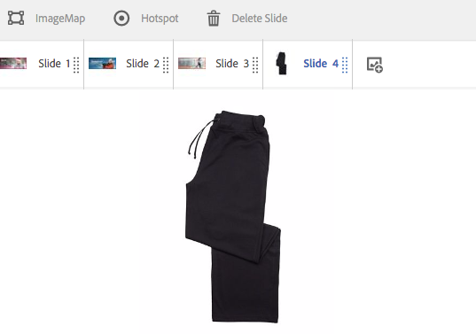

# 在Dynamic Media中使用选择器 {#working-with-selectors}

使用交互式图像、交互式视频或轮播横幅时，您可以选择资产，并选择要链接到的热点和图像映射的站点和产品。 使用图像集、旋转集和多媒体集时，您还可以使用资产选择器选择资产。

本主题介绍如何使用产品、站点和资产选择器，包括在选择器中浏览、过滤和排序的功能。

在创建轮播集、添加热点和图像映射、创建交互式视频和图像时，您可以访问选择器。

例如，在此轮播横幅中，如果要将热点或图像映射链接到概览页面，则使用产品选择器。 如果要将热点或图像映射链接到超链接，请使用站点选择器；在创建幻灯片时使用资产选择器。

当您选择热点或图像映射的目标位置时（而不是手动输入），您使用的是选择器。 站点选择器仅在您是 [!DNL Adobe Experience Manager Sites] 客户。 产品选择器还需要 [!DNL Experience Manager Commerce].

## 在Dynamic Media中选择产品 {#selecting-products}

当您希望热点或图像映射为您的产品目录中的特定产品提供概览时，请使用产品选择器来选择产品。

1. 导航到传送集、交互式图像或交互式视频，然后选择 **[!UICONTROL 操作]** 选项卡（仅当您定义了热点或图像映射时可用）。

   产品选择器位于 **[!UICONTROL 操作类型]** 区域。

   

1. 选择 **[!UICONTROL 产品选择器]** 图标（放大镜）并导航到目录中的产品。

   

   您可以通过点按按按关键字或标记进行过滤 **[!UICONTROL 筛选]** 和输入关键字，或选择标记，或同时选择两者。

   

   您可以更改位置 [!DNL Experience Manager] 通过点按浏览产品数据 **[!UICONTROL 浏览]** 并导航到其他文件夹。

   

   选择 **[!UICONTROL 排序方式]** 更改是否 [!DNL Experience Manager] 按“最新到最旧”或“最旧到最新”排序。

   

   选择 **[!UICONTROL 查看方式]** 更改查看产品的方式 —  **[!UICONTROL 列表视图]** 或 **[!UICONTROL 卡片视图]**.

   

1. 选择产品后，该字段将填充产品缩略图和名称。

   

1. 时间 **[!UICONTROL 预览]** 模式，您可以选择热点或图像映射，并查看概览的显示方式。

   

## 在Dynamic Media中选择站点 {#selecting-sites}

当您希望热点或图像映射链接到在中管理的网页时，可使用站点选择器来选择网页 [!DNL Experience Manager] 站点。

1. 导航到传送集、交互式图像或交互式视频，然后选择 **[!UICONTROL 操作]** 选项卡（仅当您定义了热点或图像映射时可用）。

   站点选择器位于&#x200B;**[!UICONTROL 操作类型]**&#x200B;区域。

   

1. 选择 **[!UICONTROL 站点选择器]** 图标（带放大镜的文件夹）并导航到 [!DNL Experience Manager] 要将热点或图像映射链接到的网站。

   

1. 选择站点后，该字段将填充路径。

   

1. 时间 **[!UICONTROL 预览]** 模式如果选择热点或图像映射，请导航到 [!DNL Experience Manager] 指定的网站页面。

## 在Dynamic Media中选择资源 {#selecting-assets}

使用此选择器可选择要在轮播横幅、交互式视频、图像集、混合媒体集和旋转集中使用的图像。 在交互式视频中，当您选择资产选择器时，该资产选择器可用 **[!UICONTROL 选择资源]** 在 **[!UICONTROL 内容]** 选项卡。 在轮播集中，创建幻灯片时可以使用资源选择器。 在图像集、混合媒体集和旋转集中，当您分别创建图像集、混合媒体集或旋转集时，资产选择器可用。

另请参阅 [资产选取器](/help/assets/search-assets.md#asset-selector) 以了解更多信息。

1. 导航到传送集并创建幻灯片。 或者，导航到交互式视频，转到 **[!UICONTROL 内容]** 选项卡，然后选择资源。 或者，创建混合媒体集、图像集或旋转集。
1. 选择 **[!UICONTROL 资源选择器]** 图标（带放大镜的文件夹）并导航到资产。

   

   通过点按按按关键字或标记过滤 **[!UICONTROL 筛选]** 和输入关键字，或添加条件，或同时输入两者。

   

   您可以更改位置 [!DNL Experience Manager] 通过导航到 **[!UICONTROL 路径]** 字段。

   选择 **[!UICONTROL 收藏集]** 以仅搜索收藏集中的资产。

   

   选择 **[!UICONTROL 查看方式]** 更改查看产品的方式 —  **[!UICONTROL 列表视图]**， **[!UICONTROL 列视图]**，或 **[!UICONTROL 卡片视图]**.

   

1. 要选择资产，请选中复选标记。 此时会显示资产。

   
—>
