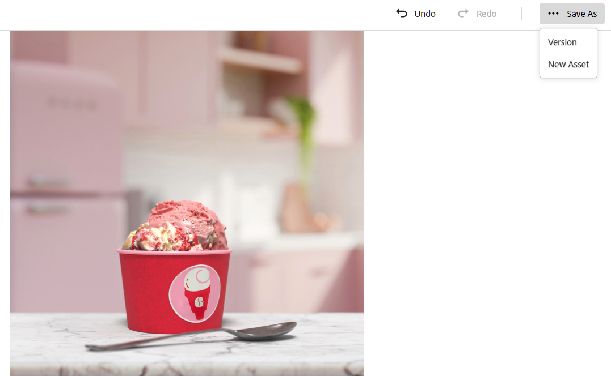
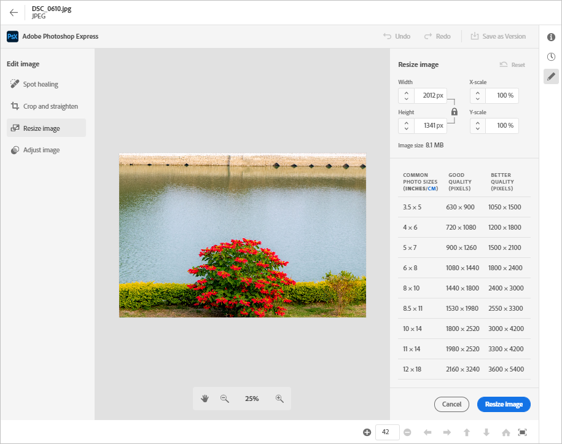

# 在 [!DNL Assets view] 中编辑图像 {#edit-images}

[!DNL Assets view] 提供了简单易用的编辑选项，并由 [!DNL Adobe Express] 和 [!DNL Adobe Photoshop Express] 提供支持。可用的编辑操作，使用 [!DNL Adobe Express] 是“调整图像大小”、“删除背景”、“裁切图像”和“将JPEG转换为PNG”，反之亦然。

在编辑图像之后，您可以将新图像另存为新版本。版本控制可帮助您以后在需要时还原为原始资源。此外，版本控制仅适用于PNG文件类型，这意味着当您尝试从JPG文件类型中删除背景时，JPG会自动转换为PNG。 若要编辑图像，请[打开其预览](navigate-assets-view.md)，然后单击&#x200B;**[!UICONTROL “编辑图像”。]**

>[!NOTE]
>
>您可以使用 [!DNL Adobe Express] 编辑 PNG 和 JPEG 文件类型的图像。

<!--The editing actions that are available are Spot healing, Crop and straighten, Resize image, and Adjust image.-->

## 使用 Adob&#x200B;&#x200B;e Express 编辑图像 {#edit-using-express}

>[!CONTEXTUALHELP]
>id="assets_express_integration"
>title="Adobe Express 集成"
>abstract="可直接在 AEM Assets 中使用简单而直观的受 Adobe Express 支持的图像编辑工具，以提高内容重用率并加快内容速度。"

### 调整图像大小 {#resize-image-using-express}

将图像大小调整为热门用例中的特定大小。[!DNL Assets view] 提供针对特定照片大小预先计算的新分辨率，让您可以快速地调整图像大小以适合常见的照片尺寸。要使用 [!DNL Assets view] 调整图像大小，请按照以下步骤操作：

1. 从中选择图像 [!DNL Experience Manager] 资产存储库，然后单击 **编辑**.
2. 从可在左侧窗格中找到的快速操作中单击&#x200B;**[!UICONTROL 调整图像大小]**。
3. 从&#x200B;**[!UICONTROL “调整大小对象”]**&#x200B;下拉列表中选择适当的社交媒体平台，并从显示的选项中选择图像大小。
4. 如果需要，使用&#x200B;**[!UICONTROL “图像比例”]**&#x200B;字段缩放图像。
5. 单击&#x200B;**[!UICONTROL 应用]**以应用您的更改。
   

   您编辑的图像可供下载。您可以将编辑后的资源另存为同一资源的新版本，也可以将其另存为新资源。
   

### 删除背景 {#remove-background-using-express}

您可以通过几个简单的步骤从图像中删除背景，如下所述：

1. 从中选择图像 [!DNL Experience Manager] 资产存储库，然后单击 **编辑**.
2. 从可在左侧窗格中找到的快速操作中单击&#x200B;**[!UICONTROL 去除背景]**。Experience Manager Assets 不含背景地显示该图像。
3. 单击&#x200B;**[!UICONTROL 应用]**以应用您的更改。
   

### 裁切图像 {#crop-image-using-express}

使用嵌入的 [!DNL Adobe Express] 快速操作可以轻松地将图像转换为完美尺寸。

1. 从中选择图像 [!DNL Experience Manager] 资产存储库，然后单击 **编辑**.
2. 从可在左侧窗格中找到的快速操作中单击&#x200B;**[!UICONTROL 裁切图像]**。
3. 拖动该图像四角的手柄以创建您想要的裁切效果。
4. 单击&#x200B;**[!UICONTROL 应用]**。
   
裁剪后的图像可供下载。您可以将编辑后的资源另存为同一资源的新版本，也可以将其另存为新资源。

### 将 JPEG 转化为 PNG {#convert-jpeg-to-png-using-express}

您可以使用 Adob&#x200B;&#x200B;e Express 将 JPEG 图像快速转换为 PNG 格式。执行以下步骤：

1. 从中选择图像 [!DNL Experience Manager] 资产存储库，然后单击 **编辑**.
2. 单击 **[!UICONTROL 转换为PNG]** 从左侧窗格中可用的快速操作删除。
   <!---->
3. 单击&#x200B;**[!UICONTROL 应用]**。
4. 导航到 **[!UICONTROL 在右上角另存为]** 并单击 **[!UICONTROL 另存为新资源]**.

### 将PNG转换为JPEG {#convert-png-to-jpeg-using-express}

您可以使用Adobe Express快速将PNG图像转换为JPEG格式。 执行以下步骤：

1. 从中选择图像 [!DNL Experience Manager] 资产存储库，然后单击 **编辑**.
2. 单击 **[!UICONTROL 转换为JPEG]** 从左侧窗格中可用的快速操作删除。
3. 单击&#x200B;**[!UICONTROL 应用]**。
4. 导航到 **[!UICONTROL 在右上角另存为]** 并单击 **[!UICONTROL 另存为新资源]**.

### 限制 {#limitations-adobe-express}

* 支持的图像分辨率：最小 - 50 像素，最大 - 每维 6000 像素

* 支持的最大文件大小：17 MB

## 使用 Adobe Express 嵌入式编辑器编辑图像 {#edit-using-embedded-editor}

有权访问Assets的组织可以使用集成的图像编辑和创建工具(直接在Assets视图中提供的Adobe Express和Adobe Firefly)，以提高Adobe Express重用并加快内容速度。 您还可以使用预定义的元素使您的资源看起来令人惊叹，或者只需单击几下即可执行快速操作来编辑图像。

若要使用 [!DNL Adobe Express] 嵌入式编辑器编辑图像，请按照以下步骤操作：

1. 从您的 [!DNL Experience Manager] Assets 存储库中选择一张图像。
1. 单击&#x200B;**[!UICONTROL 在 Adobe Express 中打开]**。

   

   您可以利用 [!DNL Adobe Express] 功能来执行所有与图像编辑相关的操作，例如[调整图像大小](https://helpx.adobe.com/cn/express/using/resize-image.html)、[删除或更改背景颜色](https://helpx.adobe.com/cn/express/using/remove-background.html)、[裁剪图像](https://helpx.adobe.com/cn/express/using/crop-image.html)以及更多。

1. 完成图像编辑后，您可以将资源下载为新资源或将资源另存为新版本。

## 使用 Adobe Express 创建新资源 {#create-new-embedded-editor}

[!DNL Assets view] 使您能够使用 [!DNL Adobe Express] 嵌入式编辑器从头开始创建新模板。若要使用 [!DNL Adobe Express] 创建新资源，请执行以下步骤：

1. 导航到 **[!UICONTROL 我的工作区]** 并单击 **[!UICONTROL 创建]** 顶部显示的Adobe Express横幅中。 [!DNL Adobe Express] 空白画布显示在 [!DNL Assets view] 用户界面中。
1. 使用[模板](https://helpx.adobe.com/cn/express/using/work-with-templates.html)创建您的内容。否则，导航至&#x200B;**[!UICONTROL 您的内容]**&#x200B;来修改现有内容。
1. 完成编辑后，单击&#x200B;**[!UICONTROL 另存为新资源]**。
1. 指定创建资源的目标路径，然后单击&#x200B;**[!UICONTROL 保存]**。

>[!NOTE]
>
>* 您只能修改 `JPEG` 和 `PNG` 格式类型的图像。
>* 资源大小必须小于 17 MB。
>* 您可以将图像保存在 `PDF`， `JPEG`，或 `PNG` 格式；但是，当存在多个页面时，可以将它们另存为 `PDF`.

## 使用 [!DNL Adobe Photoshop Express] 编辑图像 {#edit-using-photoshop-express}

<!--
After editing an image, you can save the new image as a new version. Versioning helps you to revert to the original asset later, if needed. To edit an image, [open its preview](navigate-assets-view.md#preview-assets) and click **[!UICONTROL Edit Image]**  from the rail on the right.

*Figure: The options to edit images are powered by [!DNL Adobe Photoshop Express].*
-->

### 修饰图像 {#spot-heal-images-using-photoshop-express}

如果某个图像上有小污点或者小物体，您可以使用 Adobe Photoshop 提供的污点修复功能编辑和移除污点。

画笔在修饰后的区域中取样，并使修复的像素无缝地混入图像的其余部分。使用仅略大于所要修复污点的画笔大小。

<!-- 
TBD: See if we should give backlinks to PS docs for these concepts.
For more information about how Spot Healing works in Photoshop, see [retouching and repairing photos](https://helpx.adobe.com/photoshop/using/retouching-repairing-images.html). 
-->

### 裁切和拉直图像 {#crop-straighten-images-using-photoshop-express}

使用裁切和拉直选项，您可以执行基本的裁切、旋转图像、在水平或垂直方向上翻转图像，以及将其裁切为适合流行社交媒体网站的尺寸。

要保存您的编辑，请单击&#x200B;**[!UICONTROL 裁切图像]**。在编辑之后，您可以将新图像另存为版本。

许多默认选项可以让您将图像裁切为最佳比例，以适合各种社交媒体配置文件和帖子。

### 调整图像大小 {#resize-image-using-photoshop-express}

您可以按厘米或英寸查看常见照片大小来了解具体的尺寸。默认情况下，调整大小方法保留纵横比。要手动覆盖纵横比，请单击 。

输入尺寸，单击&#x200B;**[!UICONTROL 调整图像大小]**&#x200B;来调整图像大小。在将更改另存为版本之前，您可以在保存之前通过单击[!UICONTROL 还原]以撤销进行的所有更改，或者单击[!UICONTROL 恢复]来更改编辑过程中的特定步骤。

### 调整图像 {#adjust-image-using-photoshop-express}

使用 [!DNL Assets view] 只需几次单击即可调整颜色、色调、对比度等等。在编辑窗口中单击&#x200B;**[!UICONTROL 调整图像]**。右侧边栏中提供了以下选项：

* **流行**：[!UICONTROL 高对比度和细节]、[!UICONTROL 去饱和对比度]、[!UICONTROL 老照片]、[!UICONTROL 黑白柔和]和[!UICONTROL 黑白棕褐色调]。 
* **颜色**：[!UICONTROL 自然]、[!UICONTROL 明亮]、[!UICONTROL 高对比度]、[!UICONTROL 高对比度和细节]、[!UICONTROL 鲜艳]和[!UICONTROL 哑光]。
* **创意**：[!UICONTROL 去饱和对比度]、[!UICONTROL 冷光]、[!UICONTROL 绿松石色和红色]、[!UICONTROL 柔和薄雾]、[!UICONTROL 复古瞬间]、[!UICONTROL 暖调对比度]、[!UICONTROL 平坦和绿色]、[!UICONTROL 红色提升哑光]、[!UICONTROL 暖调阴影]和[!UICONTROL 老照片]。
* **黑白**：[!UICONTROL 黑白风景]、[!UICONTROL 黑白高对比度]、[!UICONTROL 黑白打孔]、[!UICONTROL 黑白低对比度]、[!UICONTROL 黑白平坦]、[!UICONTROL 黑白柔和]、[!UICONTROL 黑白红外线]、[!UICONTROL 黑白硒色调]、[!UICONTROL 黑白棕褐色]和[!UICONTROL 黑白分离色调]。
* **渐晕**：[!UICONTROL 无]、[!UICONTROL 轻]、[!UICONTROL 中]和[!UICONTROL 重]。

<!--
TBD: Insert a video of the available social media options.
-->

### 后续步骤 {#next-steps}

* 利用资源视图用户界面上的[!UICONTROL 反馈]选项提供产品反馈

* 通过右侧边栏中的[!UICONTROL 编辑此页面]或[!UICONTROL 记录问题]来提供文档反馈

* 联系[客户关怀团队](https://experienceleague.adobe.com/?support-solution=General#support)

>[!MORELIKETHIS]
>
>* [Adobe Express中的快速操作](https://helpx.adobe.com/cn/express/using/resize-image.html)
>* [查看资源的版本历史记录](navigate-assets-view.md)
