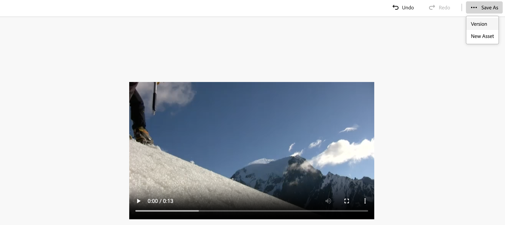

# 在[!DNL Assets view]中编辑视频 {#edit-videos}

| [搜索最佳实践](/help/assets/search-best-practices.md) | [元数据最佳实践](/help/assets/metadata-best-practices.md) | [Content Hub](/help/assets/product-overview.md) | 具有OpenAPI功能的[Dynamic Media](/help/assets/dynamic-media-open-apis-overview.md) | [AEM Assets开发人员文档](https://developer.adobe.com/experience-cloud/experience-manager-apis/) |
| ------------- | --------------------------- |---------|----|-----|

为视频嵌入了[!DNL Adobe Express]快速操作的Assets用户轻松创建视频内容的变体。 [!DNL Assets view]中由[!DNL Adobe Express]提供支持的快速操作提供了用户友好的视频编辑选项，包括裁切视频、调整视频大小、修剪视频以及将视频转换为GIF。

要编辑视频，请转到视频详细信息，然后单击[!UICONTROL 编辑视频]。 或者，选择资产并单击详细信息，然后单击右窗格中可用的图标。 编辑视频后，您可以将新视频另存为新版本或新资源。

## 先决条件 {#prerequisites}

有权访问AEM Assets中的[!DNL Adobe Express]和至少一个环境。 环境可以是 [!DNL Assets as a Cloud Service] 或 [!DNL Assets view] 内的任何存储库。

## 使用 Adobe Express 编辑视频 {#edit-video-using-express}

使用嵌入的[!DNL Adobe Express]快速操作，将视频转换为完美大小和方向非常容易。

### 裁切视频 {#crop-video-using-express}

您可以使用嵌入的[!DNL Adobe Express]快速操作从视频中删除不需要的部分。 为此，请执行以下步骤：

1. 选择视频，然后单击&#x200B;**[!UICONTROL 编辑]**。
2. 从左侧窗格中可用的快速操作中单击&#x200B;**[!UICONTROL 裁切视频]**。
3. 拖动视频角上的手柄以创建所需的裁切；或根据需要从现有屏幕大小中进行选择。
4. 您可以选择将视频静音或取消静音。
5. 单击&#x200B;**[!UICONTROL 应用]**。
   

   裁剪的视频可供下载。 您可以将编辑后的资源另存为同一资源的新版本或另存为新资源。 

### 调整视频大小 {#resize-video-using-express}

DAM中的最终视频内容通常需要调整大小才能分发到特定渠道。 通过[!DNL Assets view]，可轻松调整视频大小以适合常用社交渠道所需的维度，还可以根据自定义分辨率调整大小。 要使用[!DNL Assets view]调整视频大小，请执行以下步骤：

1. 选择视频，然后单击&#x200B;**[!UICONTROL 编辑]**。
2. 从左侧窗格中可用的快速操作中单击&#x200B;**[!UICONTROL 调整视频大小]**。
3. 从&#x200B;]**下拉列表的**[!UICONTROL &#x200B;调整大小下的社交媒体平台中选择适当的维度。 或者，拖动视频角上的手柄以创建所需的裁切。
4. 如果需要，可使用&#x200B;**[!UICONTROL 视频比例]**&#x200B;字段缩放视频。
5. 您可以选择将视频静音或取消静音。
6. 单击&#x200B;**[!UICONTROL 应用]**以应用您的更改。
   

您调整大小的视频可供下载。 您可以将编辑后的资源另存为同一资源的新版本，也可以将其另存为新资源。

### 修剪视频 {#trim-video-using-express}

如果需要使用较大视频的剪辑，可以使用&#x200B;**[!UICONTROL 修剪视频]**&#x200B;功能选择和修剪视频的某个部分。 执行以下步骤：

1. 选择视频，然后单击&#x200B;**[!UICONTROL 编辑]**。
2. 从左侧窗格中可用的快速操作中单击&#x200B;**[!UICONTROL 修剪视频]**。
3. 指定视频的开始和结束时间以裁切视频的特定部分。 或者，拖动视频角上的手柄以创建所需的修剪。
4. 从&#x200B;**[!UICONTROL 大小]**&#x200B;下拉列表中选择适当的维度。
5. 您可以选择将视频静音或取消静音。
6. 单击&#x200B;**[!UICONTROL 应用]**以应用您的更改。
   

已修剪的视频可供下载。 您可以将编辑后的资源另存为同一资源的新版本，也可以将其另存为新资源。

### 将视频转换为GIF {#convert-mp4-to-gif-using-express}

您可以使用Adobe Express快速将MP4视频转换为GIF格式。 执行以下步骤：

1. 选择视频，然后单击&#x200B;**[!UICONTROL 编辑]**。
2. 从左窗格中提供的快速操作中单击&#x200B;**[!UICONTROL 转换为GIF]**。
3. 根据所需的质量选择适当的文件大小。 此外，选择横向、纵向或正方形方向。
4. 拖动视频角上的手柄以创建所需的裁切。
5. 单击&#x200B;**[!UICONTROL 应用]**。

   的GIF

您的视频可以采用GIF格式下载。 您可以将编辑后的资源另存为同一资源的新版本，也可以将其另存为新资源。

## 限制 {#limitations-video-adobe-express}

* 仅支持MP4格式的视频进行编辑。

* 支持的最大源文件大小为1GB。

* 支持的视频在任何一侧都大于46像素且小于3840像素。

* 支持的Web浏览器包括Google Chrome、Firefox、Safari和Edge。

* 无法在Web浏览器的无痕模式下打开该功能。

### 后续步骤 {#next-steps}

* 使用Assets视图用户界面上提供的[!UICONTROL 反馈]选项提供产品反馈。

* 通过右侧边栏中的[!UICONTROL 编辑此页面]或[!UICONTROL 记录问题]来提供文档反馈。

* 联系[客户关怀](https://experienceleague.adobe.com/?support-solution=General#support)。

>[!MORELIKETHIS]
>
>* [在Assets视图中编辑图像](edit-images-assets-view.md)
>* [预览资源](navigate-assets-view.md)
