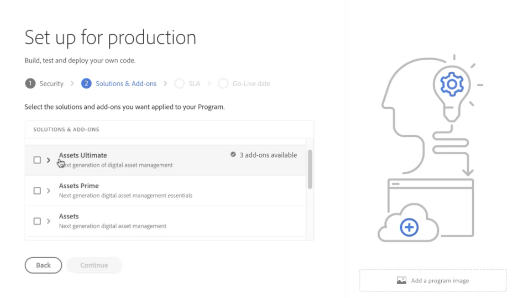

# 启用[!DNL Assets]as a Cloud Service旗舰版 {#enable-assets-cloud-service-ultimate}

| [搜索最佳实践](/help/assets/search-best-practices.md) | [元数据最佳实践](/help/assets/metadata-best-practices.md) | [Content Hub](/help/assets/product-overview.md) | [具有 OpenAPI 功能的 Dynamic Media](/help/assets/dynamic-media-open-apis-overview.md) | [AEM Assets 开发人员文档](https://developer.adobe.com/experience-cloud/experience-manager-apis/) |
| ------------- | --------------------------- |---------|----|-----|

Assetsas a Cloud Service旗舰版使您能够执行各种关键的DAM功能，例如，资源管理和库服务、安全和权限管理、创意和Experience Cloud连接、UI可扩展性、API驱动的自动化、与Adobe和非Adobe应用程序的集成、自定义代码部署等等。 有关完整列表，请参阅[Assetsas a Cloud Service旗舰版概述](/help/assets/assets-ultimate-overview.md)。

## 启用Assets Ultimate {#enable-assets-ultimate}

新的Assetsas a Cloud Service客户必须首先通过使用Cloud Manager创建新程序来启用Assets Ultimate。

执行以下步骤：

1. As a system administrator, log on to Cloud Manager. 确保在登录时选择正确的组织。

   >[!NOTE]
   >
   >确保已将您添加到相应的Cloud Manager产品配置文件以添加新项目。 有关详细信息，请参阅Cloud Manager中基于[角色的权限](/help/onboarding/cloud-manager-introduction.md#role-based-permissions)。

1. [创建新程序](/help/journey-onboarding/create-program.md)并[添加环境](/help/journey-onboarding//create-environments.md)。

   创建新程序时，在&#x200B;**[!UICONTROL 解决方案和加载项]**&#x200B;选项卡中，选择&#x200B;**[!UICONTROL Assets Ultimate]**。 您还可以展开&#x200B;**[!UICONTROL Assets Ultimate]**&#x200B;并选择&#x200B;**[!UICONTROL Content Hub]**&#x200B;以启用[Content Hub](/help/assets/product-overview.md)的资源分发。

   

1. 单击&#x200B;**[!UICONTROL 创建]**&#x200B;以创建程序。 Assets Ultimate现已为Experience Manager Assetsas a Cloud Service启用。

系统管理员自动获得Assets Ultimate的AEM管理员身份，并会收到一封电子邮件，导航到Admin Console以管理可用的产品配置文件。

Admin Console上的AEM as a Cloud Service实例包含以下产品配置文件：

* AEM Administrators

* AEM 用户

* [AEM Assets协作者用户](#onboard-collaborator-users)

* [AEM Assets Power Users](#onboard-power-users)

  

如果已为Assets启用了Content Hubas a Cloud Service，则在Admin Console的AEM Assetsas a Cloud Service中会创建一个新实例，并使用`delivery`作为后缀：

>[!NOTE]
>
>如果您在2024年8月14日之前配置了Content Hub，则会创建新实例，并将`contenthub`作为后缀。

`author``publish`

`AEM Assets Limited Users`

您可以开始将用户或用户组添加到此产品配置文件，以便他们能够访问Content Hub。

>[!NOTE]
>
>如果您在2024年8月14日之前配置了Content Hub，则Content Hub产品配置文件在`Limited Users`之后提及`contenthub`，而不是`delivery`。

## Enable Assets Ultimate for existing customers {#enable-assets-ultimate-existing-customers}

Existing Assets as a Cloud Service customers can upgrade to Assets Ultimate by executing two simple steps. You can navigate to the Assets as a Cloud Service program in Cloud Manager and see upgrade status on the Program card based on the availability of Assets Ultimate credits. `Assets license upgrade required`

`Assets license upgrade available`

### Prerequisites for upgrade {#prerequisites-assets-upgrade}

所有环境都必须升级到最新的AEM as a Cloud Service发行版本或至少`2024.10.18175`发行版本。 如果您不符合最低要求，请联系您的Adobe代表以切换到所需的AEM发行版本。

### 升级至 Assets Ultimate {#upgrade-assets-ultimate}

执行以下步骤：

1. 在切换到AEM发行版本的最低要求后，单击程序名称。 升级信息卡显示在&#x200B;**[!UICONTROL 环境]**&#x200B;部分正上方，如下图所示：

   

1. **** Cloud Manager displays options to add new product profiles to all environments available in the program or individual environments.

   

1. ********

   单击&#x200B;**[!UICONTROL 单个环境]**&#x200B;将显示项目中所有可用环境的列表。

1. ****

   

   ********

   `Adding Product Profiles``Running`

   You must add product profiles to all environments available in the program, individually or all environments together, before executing the next step.

1. ****&#x200B;仅当您向所有可用环境添加产品配置文件时，才会显示&#x200B;**[!UICONTROL 升级]**&#x200B;选项。

   

   升级过程已完成，并且您已成功将Assetsas a Cloud Service升级到Assets Ultimate。 项目的状态显示为`Assets Ultimate`。

   升级后

Admin Console上的AEM as a Cloud Service实例现在包括以下产品配置文件：

* AEM管理员

* AEM 用户

* [AEM Assets协作者用户](#onboard-collaborator-users)

* [AEM Assets Power Users](#onboard-power-users)

如果您需要启用Content Hub，请在Cloud Manager中单击项目名称上的“更多选项(...)”图标，然后选择&#x200B;**[!UICONTROL 编辑项目]**。 展开&#x200B;**[!UICONTROL Assets Ultimate]**，然后单击&#x200B;**[!UICONTROL Content Hub]**。 此步骤将启用适用于Assets Ultimate的Content Hub。 在Admin Console的AEM Assetsas a Cloud Service中新建了一个后缀为`delivery`的实例：

>[!NOTE]
>
>如果您在2024年8月14日之前配置了Content Hub，则会创建新实例，并将`contenthub`作为后缀。

请注意，Content Hub的实例名称中没有`author`或`publish`。

`AEM Assets Limited Users`

您可以开始将用户或用户组添加到此产品配置文件，以便他们能够访问Content Hub。

>[!NOTE]
>
>如果您在2024年8月14日之前配置了Content Hub，则Content Hub产品配置文件在`Limited Users`之后提及`contenthub`，而不是`delivery`。

## 载入AEM Assets协作者用户 {#onboard-collaborator-users}

AEM Assets Collaborator用户可以通过其他Adobe产品和非Adobe应用程序中提供的Assets集成来使用Experience Manager中的资源，使用内置的Adobe Express和Firefly创建和编辑资源，利用专业设计的模板、品牌工具包、Adobe Stock资源等，以及使用AEM Assets Content Hub门户访问和利用您组织中批准的资源。

要载入Collaborator用户：

1. 通过单击Admin Console上产品列表中的Experience Manager Assets产品名称来访问AEM as a Cloud Service产品配置文件。

1. 单击AEM as a Cloud Service的生产创作实例：
   AEM as a Cloud Service的

1. ****
   

1. 单击&#x200B;**[!UICONTROL 保存]**&#x200B;以保存更改。

您还可以访问和查看分配给Collaborator用户的服务，如下图所示：

为Collaborator用户提供

默认情况下已启用`Adobe Express`和`AEM Assets Collaborator Users`服务。

>[!NOTE]
>
>您可以根据需要关闭和打开切换开关以启用或禁用可用服务，但Adobe建议使用为产品配置文件启用的默认服务。

## Onboard AEM Assets Power users {#onboard-power-users}

AEM Assets Power users can access all AEM Assets capabilities including managing assets, permissions, metadata and the overall governance and automation around digital assets, work with assets from Experience manager via integrations of Assets available to your organization in other Adobe and non-Adobe applications, create and edit assets using built-in Adobe Express and Firefly leveraging professionally designed templates, brand kits, Adobe Stock assets, and so on, and access and leverage approved assets from your organization using AEM Assets Content Hub portal.

要载入超级用户，请执行以下操作：

1. 通过单击Admin Console上产品列表中的Experience Manager Assets产品名称来访问AEM as a Cloud Service产品配置文件。

1. 单击AEM as a Cloud Service的生产创作实例：
   AEM as a Cloud Service的

1. ****
   

1. 单击&#x200B;**[!UICONTROL 保存]**&#x200B;以保存更改。

您还可以访问和查看分配给超级用户的服务，如下图所示：

超级用户

默认情况下已启用`Adobe Express`和`AEM Assets Power Users`服务。

>[!NOTE]
>
>您可以根据需要关闭和打开切换开关以启用或禁用可用服务，但Adobe建议使用为产品配置文件启用的默认服务。
